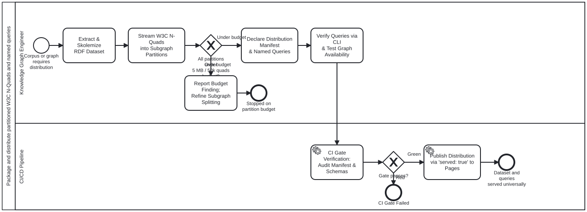

{: .note }
> Generated from `cat-harness/processes/kg/nquads-distribution.bpmn` by `gen-processes-viz.ts` — do not edit here. [All processes](index.html)


# Package and distribute partitioned W3C N-Quads and named queries

`Process_NQuadsDistribution` · strict · 7 step(s)

Extract, partition, package, and distribute knowledge graph datasets as W3C RDF 1.1 N-Quads with pre-compiled named SPARQL queries. Governed by skills `nquads-distribution` and `named-query-execution`, grounded in `schemas/nquads-distribution.ts`.

CRITICAL INVARIANTS:
1. 2-TIER SUBGRAPH ARCHITECTURE: A lightweight Spine backbone partition is loaded on startup, while bulky subgraphs (communities, workflow domains) are lazily fetched on demand.
2. UPSTREAM SKOLEMIZATION: Zero blank nodes across all partitions. Every node must carry a deterministic minted IRI.
3. PARTITION BUDGET CEILING: Partitions must strictly stay under 5 MB gzipped / 50k quads to protect browser heap and memory allocations.
4. GRAPH AVAILABILITY GUARD: Queries declare requiredSubgraphs; execution fails fast with MissingPartitionError rather than silently returning partial query results.
5. NO COMMITTED BINARY PAYLOADS: `.nq.gz` distribution payloads are gitignored, generated on demand or in CI, and served to Pages via 'served: true'.

## How it connects

- **Called by:** no call activity names this process
- **Calls:** none
- **Presented on:** no docs page section shows this diagram
- **Skill:** [`nquads-distribution`](../reference/skill-instructions/nquads-distribution.html)

## Lanes — who acts

| lane | role | what it does here |
|---|---|---|
| Knowledge Graph Engineer | `platform-authoring-agent` | The agent or engineer authoring or packaging the knowledge graph dataset: extracts RDF triples, skolemizes blank nodes, splits by subgraph topology, checks partition budgets, and tests named queries. |
| CI/CD Pipeline | `build-pipeline` | Automated CI validation and deployment pipeline: validates schema conformance, enforces graph availability guards, and publishes to GitHub Pages. |

## Steps

Every one of the 7 step(s) is documented.

| step | lane | skill / sub-process | what it does |
|---|---|---|---|
| **Extract & Skolemize RDF Dataset** `A_ExtractSkolemize` | Knowledge Graph Engineer | [`nquads-distribution`](../reference/skill-instructions/nquads-distribution.html) | Extract the target RDF triples and ensure strict upstream skolemization: transform every blank node into a deterministic IRI under the dataset namespace. Zero blank nodes allowed in serialized N-Quads. |
| **Stream W3C N-Quads into Subgraph Partitions** `A_PartitionQuads` | Knowledge Graph Engineer | [`nquads-distribution`](../reference/skill-instructions/nquads-distribution.html) | Serialize lines conforming to W3C RDF 1.1 N-Quads (subject predicate object graphIri .). Split into Tier 1 Spine (routing backbone) and Tier 2 Subgraphs (communities, domains). Compress each into .nq.gz. |
| **Report Budget Finding; Refine Subgraph Splitting** `A_ReportBudgetExcess` | Knowledge Graph Engineer | [`nquads-distribution`](../reference/skill-instructions/nquads-distribution.html) | Record the oversized partition on the coordinating bean. Refine subgraph partitioning boundary or split into finer subgraphs. Do not ship oversized partition. |
| **Declare Distribution Manifest & Named Queries** `A_DeclareManifest` | Knowledge Graph Engineer | [`nquads-distribution`](../reference/skill-instructions/nquads-distribution.html) [`named-query-execution`](../reference/skill-instructions/named-query-execution.html) | Write subgraph-manifest.json conforming to folio-nquads-distribution/v1. Declare datasetIri, servedRoute, spine, subgraphs, and audited named SPARQL queries with explicit requiredSubgraphs and typed parameter definitions. |
| **Verify Queries via CLI & Test Graph Availability** `A_VerifyQueries` | Knowledge Graph Engineer | [`named-query-execution`](../reference/skill-instructions/named-query-execution.html) | Execute named queries using scripts/nquads-query.ts and cat-harness-tools/src/tools/nquads-query.ts. Assert that missing partition triggers MissingPartitionError and typed parameters prevent injection. |
| **CI Gate Verification: Audit Manifest & Schemas** `A_GateCheck` | CI/CD Pipeline | [`named-query-execution`](../reference/skill-instructions/named-query-execution.html) | Validate that subgraph-manifest.json conforms to NQuadsDistributionManifestSchema, all referenced partitions exist, and external schema w3c-n-quads is satisfied. |
| **Publish Distribution via 'served: true' to Pages** `A_DeployPages` | CI/CD Pipeline | [`nquads-distribution`](../reference/skill-instructions/nquads-distribution.html) | Publish distribution directory to _site/ via mount-instance-docs.ts respecting 'served: true' declaration. Quads files become accessible identically to web clients and CLI/agent runners. |

## Decisions

**1** of 2 decision(s) carry no documentation — `gateway-documented` lists them.

| decision | what decides it | branches |
|---|---|---|
| **All partitions under 5 MB / 50k quads budget?** `GW_PartitionBudget` | Enforce partition size ceiling: verify that no partition exceeds MAX_RECOMMENDED_PARTITION_BYTES (5 MB gzipped) or 50,000 quads. Protects browser V8 heap and mobile allocations. | **Under budget** → Declare Distribution Manifest & Named Queries **Over budget** → Report Budget Finding; Refine Subgraph Splitting |
| **Gate passes?** `GW_CiGreen` | — | **Green** → Publish Distribution via 'served: true' to Pages **Red** → CI Gate Failed |


