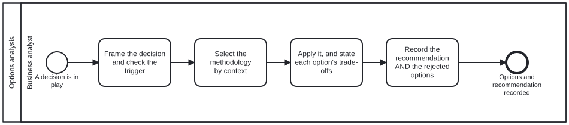

{: .note }
> Generated from `cat-harness/processes/options-analysis.bpmn` by `gen-processes-viz.ts` — do not edit here. [All processes](index.html)


# Options analysis

`Process_OptionsAnalysis` · strict (defaulted) · 5 step(s)

A decision reached by a NAMED methodology, with its rejected options recorded. Called as a subprocess, never run on its own. WHEN IT APPLIES: the trigger is `opening-brief`'s — IRREVERSIBILITY AND SURPRISE, not size. A reversible choice needs no subprocess; an irreversible one cannot skip it. A subprocess fired on every decision becomes ceremony, and ceremony is how a gate stops being read. WHY IT IS ONE SUBPROCESS AND NOT A BRANCH PER METHODOLOGY: the methodologies are parallel tracks selected by context, and the selection is a judgement made inside A_Select rather than a gateway. A gateway per methodology would assert the choice is computable from data, which is the claim `dmn` says to make only when the criteria recur. WHAT IT DOES NOT DO: it does not decide. It produces the options, their trade-offs and a recommendation; the decision and its authorisation belong to whoever owns the calling step.

## How it connects

- **Called by:** [Content Change and Review](content-change-review.html), [CRDM Phase 6 — implement, MVP, acceptance](crdm-deliver.html), [Editing and HCI validation](editing-hci-validation.html), [Adopting an upstream version bump](upstream-version-adoption.html), [Wireframe design review](wireframe-design-review.html)
- **Calls:** none
- **Presented on:** no docs page section shows this diagram

## Lanes — who acts

| lane | role | what it does here |
|---|---|---|
| Business analyst | `business-analyst` | This lane's deliverable is the recommendation together with the rejected options — a rejected option with no record is a dead end the next agent walks back into — but it never authorises anything; A_Record hands both to whoever called the subprocess, and the decision stays theirs. Answering GW_Trigger `no` is not a skipped step either: End_TriggerNotMet is recorded as a distinct outcome from a completed comparison, because a caller unable to tell "not needed" from "we chose X" cannot audit either one. |

## Steps

Every one of the 5 step(s) is documented.

| step | lane | skill / sub-process | what it does |
|---|---|---|---|
| **Frame the decision and check the trigger** `A_Frame` | Business analyst | [`opening-brief`](../reference/skill-instructions/opening-brief.html) | One sentence naming the KIND of thing being chosen, not the options — "which cache strategy", never "A or B". Then the trigger: is this irreversible, or would the answer surprise someone? If neither, say so and stop; the calling step decides without this subprocess. Stopping here is a correct outcome, not a skipped step. |
| **Select the methodology by context** `A_Select` | Business analyst | [`methodology-adoption`](../reference/skill-instructions/methodology-adoption.html) | Ask the selection question in order, first yes decides: do the criteria RECUR with the same inputs having to produce the same answer; is this the CERTAINTY of a body of evidence behind a recommendation; is the context a BEAN recording a decision; otherwise a one-off choice among candidates. If none fits, that is a finding — say which question the decision is and that no adopted methodology covers it. Do not improvise one and do not stretch the nearest fit. The declared set is the contents of the `methodology` graph. Ask for it; do not remember it. |
| **Check the selected methodology's evidence base** `A_CheckEvidence` | Business analyst | [`literature-search`](../reference/skill-instructions/literature-search.html) | Before applying a methodology, establish that the thing being applied is what it claims to be. A methodology is adopted because it is somebody else's named, external work; this step checks that the `origin` it cites resolves to a source in a declared library, and reads the `methodology-evidence` QA sidecar for it. WHY THE CHECK IS HERE AND NOT AT ADOPTION. Adoption happens once; selection happens every time a decision is made. A source that was reachable when the methodology was adopted can stop being so, and a methodology adopted before this axis existed was never checked at all. Measured 2026-09-22: six methodologies cited an origin and NONE had that source in any library, so every selection made until then rested on an unverifiable citation. WHAT A GAP DOES AND DOES NOT DO. A missing source does NOT block the decision, and this step has no branch that stops the process — that would make a documentation gap into an outage, and the owner decides whether an unbacked methodology may still be used. It does two things: it runs `literature-search` to try to close the gap, and it puts the evidence state into the record `A_Record` writes, so a reader can tell a decision made on a verified method from one made on a citation nobody could follow. The third state is the one that matters. "Source ingested", "source located but unreachable from here" and "no source found" are three different facts, and `literature-search` exists largely to stop the middle one being reported as the last. |
| **Apply it, and state each option's trade-offs** `A_Apply` | Business analyst | [`methodology-adoption`](../reference/skill-instructions/methodology-adoption.html) | Follow the selected methodology as written — adopted whole, not blended with another. At least two real options: one option is not a choice, and a straw option is worse than a short list because it makes the analysis look thorough while narrowing it. Never quantify the comparison to make it look measured. Where a method scores and sums, this platform takes the structure and refuses the arithmetic: the weights are invented and a total reads as a measurement. |
| **Record the recommendation AND the rejected options** `A_Record` | Business analyst | [`decision-audit`](../reference/skill-instructions/decision-audit.html) | The rejected options and why they lost are part of the output, not an appendix. A rejected option with no record is a dead end nobody marked, and the next agent walks into it — the same argument `bean-coordination` makes for `scrapped` over deleted. In a bean context the form is MADR's. Which methodology was followed is named here, so a reader can check the method rather than take the conclusion. |

## Decisions

Every one of the 1 decision(s) is documented.

| decision | what decides it | branches |
|---|---|---|
| **Irreversible or surprising?** `GW_Trigger` | `A_Frame` has always ENDED with this question — "is this irreversible, or would the answer surprise someone? If neither, say so and stop; the calling step decides without this subprocess. Stopping here is a correct outcome, not a skipped step." Until this gateway existed, the diagram gave it NO WAY TO STOP: `A_Frame`'s only outgoing edge went to `A_Select`, so the prose promised a branch the model did not have. Found by adding the second caller, not by reading. With one caller the straight line looked fine; wiring `editing-hci-validation` made every write in that process run all four activities, and its corpus-gate tests failed with "Task_RecordDecision is not enabled. Enabled now: A_Frame." That is the ceremony this process's own documentation refuses — "a subprocess fired on every decision becomes ceremony, and ceremony is how a gate stops being read" — and it was unreachable as a criticism while the subprocess had a single caller. DELIBERATELY NOT DMN-BACKED, unlike the gateways that are. Irreversibility and surprise are judged, not computed: `dmn` says to claim computability only when the criteria recur with the same inputs having to produce the same answer, and "would this surprise someone" does not. So the outcome is supplied by whoever is at the step, exactly as `Gateway_EditorDecision` takes one. | **yes** → Select the methodology by context **no** → Trigger not met — the caller decides without an analysis |


