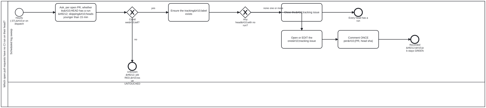

{: .note }
> Generated from `cat-harness/processes/pr-checks-present.bpmn` by `gen-processes-viz.ts` — do not edit here. [All processes](index.html)


# Which open pull requests have no CI run on their head?

`Process_PrChecksPresent` · strict · 5 step(s)

A PULL REQUEST WITH ZERO CHECKS IS INVISIBLE PRECISELY BECAUSE NOBODY IS LOOKING. Bean `3pqn`. `check:head-has-run` answers this for one commit when somebody remembers to ask; this is the half that asks when nobody does, which is the only placement that addresses the defect rather than the symptom.&#10;&#10;MEASURED 2026-09-20 over the six open pull requests here: TWO had no run of any kind on their head, both updated minutes earlier. A third of the open set, with nothing to merge on.&#10;&#10;THE 15-MINUTE AGE GATE IS THE DIFFERENCE BETWEEN USEFUL AND IGNORED. A head pushed thirty seconds ago legitimately has no run yet, and a sweep that reports those is one nobody reads &#8212; this bean's own failure, reproduced by its fix. A younger head is NOT JUDGED rather than called clean, which is the third state again.&#10;&#10;ONLY `unknown` FAILS THE JOB. A finding records itself and the workflow stays GREEN, the same inversion as `ci-health`: the repository speaks through the tracking issue, while a sweep that could not look turns red. And a sweep blind on one pull request has not cleared the others, so ONE unreadable answer makes the whole run unknown &#8212; never a partial clean.&#10;&#10;TWO CHANNELS, ON THE OWNER'S INSTRUCTION, AND THEY BEHAVE DIFFERENTLY. The tracking issue is EDITED IN PLACE, never appended to. The per-PR comment is posted ONCE PER (PULL REQUEST, HEAD SHA), keyed by a marker in the body: hourly comments without that key would put twenty-four notifications a day on one unchanged pull request, which is how a warning gets muted.

## How it connects

- **Called by:** no call activity names this process
- **Calls:** none

## Lanes — who acts

| lane | role | what it does here |
|---|---|---|
| Scheduled log sweep | — | Three exit states, and the job's own colour tracks none of them the way a reader would expect: a finding is fully recorded — issue tracked, PR commented — and the job still ends GREEN, because the finding is the repository's problem to see in the tracking issue, not this lane's to fail on. Only UNKNOWN turns the job itself RED, and one unreadable PR is enough to fail the whole sweep — this lane never reports a partial clean. |

## Steps

**5** of 5 step(s) carry no documentation — `activity-documented` lists them.

| step | lane | skill / sub-process | what it does |
|---|---|---|---|
| **Ask, per open PR, whether its&#10;HEAD has a run &#8212; skipping&#10;heads younger than 15 min** `Task_Sweep` | Scheduled log sweep | [`ci-health`](../reference/skill-instructions/ci-health.html) | — |
| **Ensure the tracking&#10;label exists** `Task_Label` | Scheduled log sweep | [`ci-health`](../reference/skill-instructions/ci-health.html) | — |
| **Close the&#10;tracking issue** `Task_Close` | Scheduled log sweep | [`ci-health`](../reference/skill-instructions/ci-health.html) | — |
| **Open or EDIT the one&#10;tracking issue** `Task_Track` | Scheduled log sweep | [`ci-health`](../reference/skill-instructions/ci-health.html) | — |
| **Comment ONCE per&#10;(PR, head sha)** `Task_Comment` | Scheduled log sweep | [`issue-working`](../reference/skill-instructions/issue-working.html) | — |


