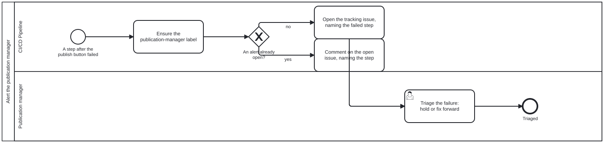

{: .note }
> Generated from `cat-harness/processes/publish-alert.bpmn` by `gen-processes-viz.ts` — do not edit here. [All processes](index.html)


# Alert the publication manager

`Process_PublishAlert` · strict · 4 step(s)

Owner, 2026-09-23: "there is another alert needed for deployment failure. every step post 'push the publish button' should be same". So this is ONE alert, called from every failure edge after the publish button — an incomplete export, a verification failure, a failed deploy, a lost preview — and it reaches the role that already owns the release: the publication manager.

## How it connects

- **Called by:** [Publishing the docs site, and keeping the previews alive](docs-site-publish.html)
- **Calls:** none

## Lanes — who acts

| lane | role | what it does here |
|---|---|---|
| CI/CD Pipeline | — | The build pipeline, running unattended between the export and the deploy. Raises the one alert, the same way whichever step failed. |
| Publication manager | — | The existing publication-manager role: accountable for what is live, and so the one alerted when anything after the publish button fails. A person, because the triage is a judgement about a release. |

## Steps

Every one of the 4 step(s) is documented.

| step | lane | skill / sub-process | what it does |
|---|---|---|---|
| **Ensure the publication-manager label** `A_Label` | CI/CD Pipeline | — | The alert is a tracking issue labelled `publication-manager` — the role, not a person, because no actor declares a GitHub account for it. Whoever watches that label is alerted. |
| **Open the tracking issue, naming the failed step** `A_Open` | CI/CD Pipeline | — | Open the issue with the step that failed, the run link and — for a verification failure — the verifier report. |
| **Comment on the open issue, naming the step** `A_Comment` | CI/CD Pipeline | — | Add this failure to the open issue as a comment (which notifies), and refresh the body to the latest state. |
| **Triage the failure: hold or fix forward** `U_Triage` | Publication manager | [`publish-verification`](../reference/skill-instructions/publish-verification.html) | The publication manager reads what failed and decides: hold the release, or fix forward and publish again. Nothing was deployed on a failure before the deploy; a failure after it (the deploy itself, or the previews lost) is live, and says so. The next successful publish closes the issue. |

## Decisions

Every one of the 1 decision(s) is documented.

| decision | what decides it | branches |
|---|---|---|
| **An alert already open?** `GW_Open` | Is a publication-manager tracking issue already open? `no` opens one; `yes` comments on it, because each failed publish is a new event the publication manager should be notified of — an edit alone would not notify. | **no** → Open the tracking issue, naming the failed step **yes** → Comment on the open issue, naming the step |


