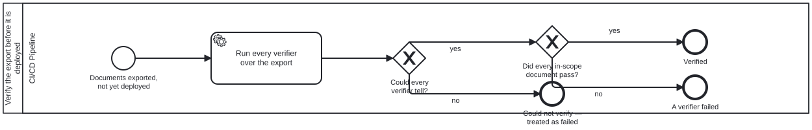

{: .note }
> Generated from `cat-harness/processes/publish-verification.bpmn` by `gen-processes-viz.ts` — do not edit here. [All processes](index.html)


# Verify the export before it is deployed

`Process_PublishVerification` · strict · 1 step(s)

Bean vigi, owner 2026-09-23: a set of post-processing tools that verify what the build produced, run BEFORE deployment and blocking — "a failure triggers an alert to the publisher manager". This process only verifies and says how it went; the caller (docs-site-publish) blocks the deploy on anything but a pass and routes the failure through Process_PublishAlert, the one alert every step after the publish button shares.

## How it connects

- **Called by:** [Publishing the docs site, and keeping the previews alive](docs-site-publish.html)
- **Calls:** none
- **Names the `publish-verification` skill without calling this process:** [Alert the publication manager](publish-alert.html) — `activity-calls-skill-process` asks whether each should be a call activity.
- **Skill:** [`publish-verification`](../reference/skill-instructions/publish-verification.html)

## Lanes — who acts

| lane | role | what it does here |
|---|---|---|
| CI/CD Pipeline | — | Runs every verifier over the exported documents before anything is deployed, and reports pass, fail or could-not-tell. It decides nothing about the release: the caller blocks on anything but a pass. |

## Steps

Every one of the 1 step(s) is documented.

| step | lane | skill / sub-process | what it does |
|---|---|---|---|
| **Run every verifier over the export** `A_Verify` | CI/CD Pipeline | [`publish-verification`](../reference/skill-instructions/publish-verification.html) | Run the verifier set (scripts/publish-verify.ts, `bun run publish:verify -- --dir <site>`) over the built tree. A SET: each verifier is one entry, and adding one changes nothing else. The first is JSON-LD expansion under a real processor, network refused — a property the context does not declare, a relative IRI or a context that will not load is a finding. Only documents of OURS are verified; third-party data in the tree is counted and cannot block. |

## Decisions

Every one of the 2 decision(s) is documented.

| decision | what decides it | branches |
|---|---|---|
| **Could every verifier tell?** `GW_Determined` | Answered by the verifier set's exit code. `no` (exit 2 — nothing to verify, or a verifier could not run) ends as could-not-verify, which the caller treats as a failure: an unverified release is not a verified one. `yes` asks whether everything passed. | **no** → Could not verify — treated as failed **yes** → Did every in-scope document pass? |
| **Did every in-scope document pass?** `GW_Pass` | Answered by the findings. `yes` (exit 0) ends verified and the caller deploys; `no` (exit 1) ends failed, and the caller blocks the deploy and alerts the publication manager with the report. | **yes** → Verified **no** → A verifier failed |


