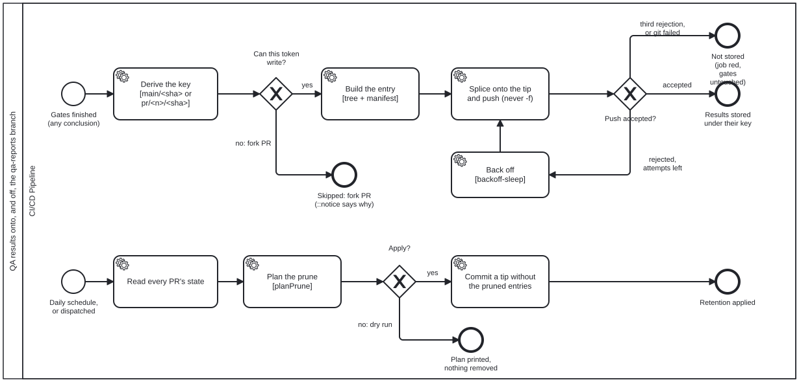

{: .note }
> Generated from `cat-harness/processes/sdlc/qa-publish.bpmn` by `gen-processes-viz.ts` — do not edit here. [All processes](index.html)


# Publish and keep QA results on qa-reports

`Process_QaPublish` · strict · 7 step(s)

How a run's derived QA results become a durable, commit-keyed record without being committed to main, and how that record is retired.

You are in this process when CI has finished the gates for a push to main or a same-repository pull request (the publish path), or when the daily retention run fires (the prune path). Both are mechanical: nothing here judges a result, and nothing here decides mergeability.

The record it writes is what a later `--against <ref>` reads as a baseline. A publish that did not happen makes that baseline UNKNOWN for every later change, which is why a red publish is still a red to fix even though it blocks nothing. Judgements are never written here: they stay on main in `test/attestations/` (owner ruling D2 (a)).

## How it connects

- **Called by:** [The gates a change must pass before it can merge](code-quality-gates.html)
- **Calls:** none
- **Presented on:** no docs page section shows this diagram

## Lanes — who acts

| lane | role | what it does here |
|---|---|---|
| CI/CD Pipeline | `build-pipeline` | Runs both paths as fixed programs. It decides nothing that needs judgement: whether a token can write is read from the event, whether a push was accepted is the push's exit code (never its stderr — spike `3ds9` measured a harmless "push negotiation failed; proceeding anyway"), and what retention removes is `planPrune`'s rule. A PR whose state cannot be read is KEPT: could-not-determine never deletes. |

## Steps

Every one of the 7 step(s) is documented.

| step | lane | skill / sub-process | what it does |
|---|---|---|---|
| **Derive the key [main/<sha> or pr/<n>/<sha>]** `Task_DeriveKey` | CI/CD Pipeline | [`qa-reports`](../reference/skill-instructions/qa-reports.html) | `qa:publish --github` reads the event: a push to main publishes under `main/<sha>/`, a pull request under `pr/<n>/<head-sha>/` — the head that was tested, not the merge ref. It also reads whether the token can write, which the gateway after it routes on. |
| **Build the entry [tree + manifest]** `Task_BuildEntry` | CI/CD Pipeline | [`qa-reports`](../reference/skill-instructions/qa-reports.html) | First the working copy is produced (`qa:refresh`, bean `3hk4`): while the checkout still tracks `test/results/`, the commit's own copy is the record and nothing runs; once it does not, every declared QA writer runs into the empty tree, because the gates are in judge mode and wrote nothing a publish could carry. A refresh that leaves a writer failed, a family empty or a file unclaimed is INCOMPLETE: the job goes red and `qa:publish --completeness` refuses, so a partial tree is never stored as the commit's record — the "Not stored" outcome, reached before any push. Then it hashes the working copy of every declared `qa` directory (`<instance>/test/results/**`, byte-identical to the checkout's layout) into a tree through a private index, and writes `manifest.json` (`qa-reports-manifest/v1`): inputs, producers, verdict counts and the gates' result. Identical JSON is the same blob, so an unchanged family costs nothing to store again. Its git objects live in a private bare repository, never in the checkout's own store. |
| **Splice onto the tip and push (never -f)** `Task_SpliceAndPush` | CI/CD Pipeline | [`qa-reports`](../reference/skill-instructions/qa-reports.html) | Fetch the branch tip, splice this entry into its tree, `commit-tree -p <tip>`, and push without `-f`, with `pack.useSparse=false` so blobs already on the remote under another key are not resent. Writers own disjoint keys, so splicing onto whatever tip is current loses nobody's entry. |
| **Back off** `Task_Backoff` | CI/CD Pipeline | [`qa-reports`](../reference/skill-instructions/qa-reports.html) | Wait the same intervals `backoff-sleep.ts` uses, then go round again: fetch the new tip and splice onto it. Three attempts in all. |
| **Read every PR's state** `Task_ReadPrStates` | CI/CD Pipeline | [`qa-reports`](../reference/skill-instructions/qa-reports.html) | `gh pr list --state all`: number, state and when it closed, so each `pr/<n>/` entry can be judged against its close date. A PR missing from the list is `unknown`, and an unknown is kept. |
| **Plan the prune** `Task_PlanPrune` | CI/CD Pipeline | [`qa-reports`](../reference/skill-instructions/qa-reports.html) | Keep every `main/<sha>` for 90 days and one per day after that; drop `pr/<n>` 7 days after the PR closed. The rule is `planPrune` in `scripts/qa-store.ts`, pinned by its tests, and the plan is printed whether or not it is applied. |
| **Commit a tip without the pruned entries** `Task_ApplyPrune` | CI/CD Pipeline | [`qa-reports`](../reference/skill-instructions/qa-reports.html) | One new commit whose tree lacks the pruned entries, parented on the current tip, through the same fetch → rebuild → push loop as a publish: no `-f`, three attempts. History is not rewritten — truncating it is a deletion of a different order and the owner's call (`deletion-requires-confirmation`), not a scheduled job's. |

## Decisions

Every one of the 3 decision(s) is documented.

| decision | what decides it | branches |
|---|---|---|
| **Can this token write?** `Gateway_CanWrite` | A fork PR's token is read-only (spike `3ds9`). That is decided from the event, not by attempting a push and reading the failure, so the skip is a stated outcome rather than a red run that means nothing. | **yes** → Build the entry [tree + manifest] **no: fork PR** → Skipped: fork PR (::notice says why) |
| **Push accepted?** `Gateway_Accepted` | Read off the push's exit code, never its stderr. A rejection means a sibling moved the tip first; with attempts left the loop rebuilds on the new tip, and after the third it stops red rather than forcing. | **accepted** → Results stored under their key **rejected, attempts left** → Back off **third rejection, or git failed** → Not stored (job red, gates untouched) |
| **Apply?** `Gateway_Apply` | Yes on the schedule, or on a dispatch with `apply` ticked. Otherwise the run ends having printed the plan — a person looking first is the reason dispatch exists. | **no: dry run** → Plan printed, nothing removed **yes** → Commit a tip without the pruned entries |


