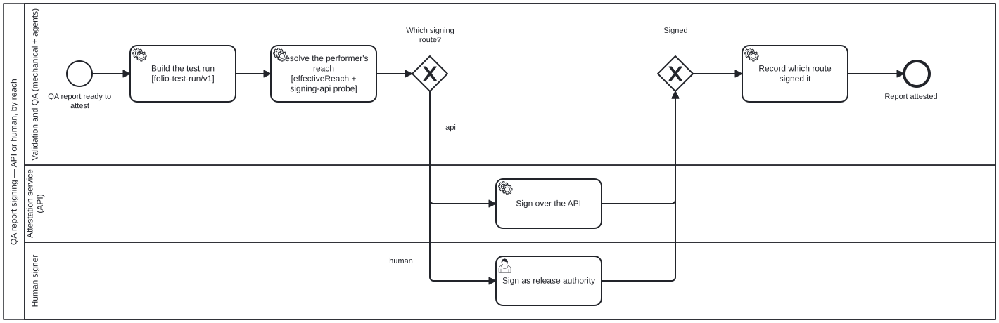

{: .note }
> Generated from `cat-harness/processes/qa-report-signing.bpmn` by `gen-processes-viz.ts` — do not edit here. [All processes](index.html)


# QA report signing

`Process_QaReportSigning` · strict · 5 step(s)

Attesting a QA report: build the test run, work out what the performer can actually reach, and sign — over the API where that is available, or as release authority where it is not. You are in this process when a report needs to become evidence somebody else can rely on. The reach resolution before the gateway is the point: the route is CHOSEN from what the signer can do, not assumed, and the process records which route signed it so a reader of the attestation can tell. A signature whose route is unrecorded is a signature whose weight cannot be judged later, which is why that step is drawn rather than left implicit.

## How it connects

- **Called by:** no call activity names this process
- **Calls:** none
- **Skill:** [`qa-report-signing`](../reference/skill-instructions/qa-report-signing.html)

## Lanes — who acts

| lane | role | what it does here |
|---|---|---|
| Validation and QA (mechanical + agents) | `validation-pipeline` | Owns everything except the act of signing: it builds the hashable run, computes the two facts — effectiveReach and whether the API is configured — that Gateway_SigningRoute's table reads rather than a hand-asserted choice, and after either route returns, records which one fired. The record is what lets a later reader know which trust assumption they are relying on without having to ask. |
| Attestation service (API) | `attestation-service` | Reached only from the DMN table's one row where both egress and a configured endpoint are true — everything else in Gateway_SigningRoute's table routes around this lane entirely, so its presence in a trace is itself already the answer to whether egress existed. It carries exactly one task and no branch of its own, because the routing decision was already made before this lane was entered. |
| Human signer | `publication-manager` | Deleting this lane's role binding is not a documentation nicety: `check:fallback-roles` DERIVES the fallback role from whichever lane holds a task only a person can fill, so removing it turns that check red rather than merely undocumented. The gate that sends work here fires BEFORE any API attempt, never after one fails — an air-gapped host has no degraded mode to retry into, so this lane is a routing destination, not a retry path. |

## Steps

Every one of the 5 step(s) is documented.

| step | lane | skill / sub-process | what it does |
|---|---|---|---|
| **Build the test run [folio-test-run/v1]** `Task_BuildRun` | Validation and QA (mechanical + agents) | [`qa-report-signing`](../reference/skill-instructions/qa-report-signing.html) [`content-test`](../reference/skill-instructions/content-test.html) | Assemble the run record the signature will cover: the data hash and the process hash, each all-or-nothing. An UNKNOWN_HASH never reproduces another unknown, so a run that could not be hashed is signable only as what it is — unverifiable. |
| **Resolve the performer's reach [effectiveReach + signing-api probe]** `Task_ResolveReach` | Validation and QA (mechanical + agents) | [`qa-report-signing`](../reference/skill-instructions/qa-report-signing.html) | Compute the two facts the gateway reads: effectiveReach(deployment, actor) from schemas/actor-reach.ts, and whether the signing-api capability is configured. Undeclared reach resolves to "unknown" rather than to the deployment's value — an aggregate does not determine a member. |
| **Sign over the API** `Task_ApiSign` | Attestation service (API) | [`qa-report-signing`](../reference/skill-instructions/qa-report-signing.html) | The attestation service signs the run hashes. Reached only from the one table row that has both egress and a configured endpoint. |
| **Sign as release authority** `Task_HumanSign` | Human signer | [`qa-report-signing`](../reference/skill-instructions/qa-report-signing.html) | A person attests the run hashes out of band. This is a userTask, not a serviceTask, and the distinction is enforced: `fulfilmentKindsForBpmnType` will not let a system actor fill it, which is what stops the air-gapped route quietly becoming another machine route. |
| **Record which route signed it** `Task_RecordAttestation` | Validation and QA (mechanical + agents) | [`qa-report-signing`](../reference/skill-instructions/qa-report-signing.html) | The attestation records the route, not only the signature. A reader who cannot tell an API signature from a human one cannot tell which trust assumption they are relying on. |

## Decisions

**1** of 1 decision(s) carry no documentation — `gateway-documented` lists them.

| decision | what decides it | branches |
|---|---|---|
| **Which signing route?** `Gateway_SigningRoute` | — | **api** → Sign over the API **human** → Sign as release authority |


