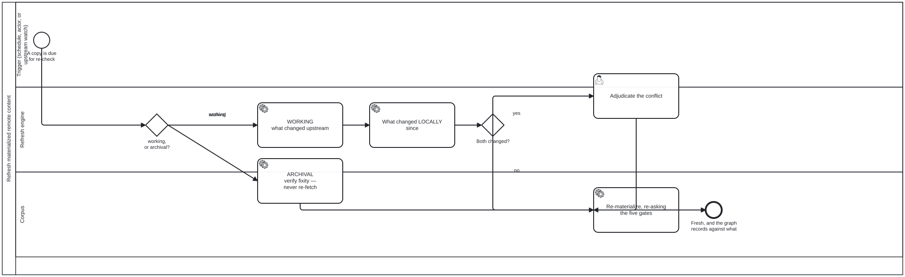

{: .note }
> Generated from `cat-harness/processes/refresh-materialized.bpmn` by `gen-processes-viz.ts` — do not edit here. [All processes](index.html)


# Refresh materialized remote content

`Process_RefreshMaterialized` · strict · 8 step(s)

Owner, 2026-09-20: "also need to know about refreshing amterialed remote content. general process used everywhere." REFRESH IS NOT RE-IMPORT, and the difference is the whole diagram. It needs three answers, not one: what changed upstream, what changed locally since, and what to do when BOTH did. upstream-pins.json answers the first for one caller and nothing answers the other two anywhere. An ARCHIVAL copy is not refreshed. Re-fetching it would defeat it: the copy exists to survive the source, so replacing it with whatever the source says today discards exactly the state it was keeping. What an archive gets instead is a FIXITY CHECK — has our copy rotted — which is a different question with a different remedy.

## How it connects

- **Called by:** [Sample import into a structured data store](sample-import.html)
- **Calls:** [Adjudication](adjudication.html)

## Lanes — who acts

| lane | role | what it does here |
|---|---|---|
| Contributor (human or agent) | — | Reached only when both upstream and local changed, which is the one case this process refuses to resolve by rule: which side wins depends on why the local edit was made, a fact only this lane has. |
| Ingestion Engine (agent, runs unattended) | — | Runs whichever of the two paths Gateway_Purpose selects. On the working path it answers the two comparisons — upstream and local — whose combination Gateway_Both reads to decide whether a human must adjudicate; on the archival path it never compares to the source at all, since fixity asks only whether the copy itself rotted. |
| Corpus — L1 source knowledge graph | — | Where the refreshed content actually lands, and the one place the five import gates are re-asked rather than inherited — a licence can change since the original import, and a collection can grow past a size somebody already agreed to, so passing the gates once is never treated as passing them for good. |

## Steps

Every one of the 8 step(s) is documented.

| step | lane | skill / sub-process | what it does |
|---|---|---|---|
| **ARCHIVAL verify fixity — never re-fetch** `Task_Fixity` | Ingestion Engine (agent, runs unattended) | [`materialize-remote`](../reference/skill-instructions/materialize-remote.html) | Re-compute the digest and compare. An archive is NEVER re-fetched — the source is what it exists to survive, so replacing it with today's version discards the state it was keeping. A mismatch means OUR copy rotted, and the remedy is restoration from a backup, not re-download. |
| **WORKING what changed upstream** `Task_Upstream` | Ingestion Engine (agent, runs unattended) | [`materialize-remote`](../reference/skill-instructions/materialize-remote.html) | Compare the recorded upstreamVersion against the source. `could not reach the source` is a THIRD answer and is never reported as `unchanged` — an unreachable source is the sourceLoss gate firing late. |
| **What changed LOCALLY since** `Task_Local` | Ingestion Engine (agent, runs unattended) | [`materialize-remote`](../reference/skill-instructions/materialize-remote.html) | The half nothing answers today. A materialized copy that was edited in place is not a copy any more, and overwriting it silently destroys work whose existence the process never established. |
| **Adjudicate the conflict** `Task_Adjudicate` | Contributor (human or agent) | calls [Adjudication](adjudication.html) [`materialize-remote`](../reference/skill-instructions/materialize-remote.html) [`adjudication`](../reference/skill-instructions/adjudication.html) | A human or agentic decision, never a merge rule. Which side wins depends on why the local edit was made, and a process that picked automatically would be choosing without the one fact that decides it. |
| **Reconcile the two by hand** `Task_Reconcile` | Contributor (human or agent) | [`materialize-remote`](../reference/skill-instructions/materialize-remote.html) | Neither side wins whole: the contributor produces content that is neither the local copy nor the remote one, and THEN it is applied. Drawn as a separate step before Task_Apply rather than folded into it, because Task_Apply re-asks the five import gates against what is being materialized — and what is being materialized here is a hand-made artefact, which is exactly the case those gates should see rather than be told about. |
| **Re-materialize, re-asking the five gates — and record the new fixity** `Task_Apply` | Corpus — L1 source knowledge graph | [`materialize-remote`](../reference/skill-instructions/materialize-remote.html) | The gates are re-asked, not inherited: a licence can change, and a collection can grow past the size a caller agreed to. AND THE NEW FIXITY IS RECORDED IN THE SAME CHANGE. This step rewrites bytes that a materialization record describes, so leaving the old digest behind would make a CORRECT run of this process fail check:materialized-fixity as a mismatch — the gate reading "somebody edited held content without saying so" about the one process whose job is to replace it. Measured 2026-09-22 (bean 10s1): this task named no fixity write at all. This is the owner's publication exception, stated as a rule rather than as a carve-out. The exception is NOT "these actors may skip the rule"; it is "say what you did". A writer that updates the digest alongside the bytes passes, and the record then describes what is actually there. A writer that does not fails, correctly, because it has forked upstream silently. A list of permitted writers would go stale the first time somebody added a sixth one; this does not. |
| **Keep the local edit, and re-pin so it stops being asked** `Task_KeepLocal` | Corpus — L1 source knowledge graph | [`materialize-remote`](../reference/skill-instructions/materialize-remote.html) | The local edit wins, so nothing is re-materialized — and the pin moves to the upstream revision that was compared against. Re-pinning is the half that is easy to forget and is the reason this is a step rather than an absence: without it the same upstream change is detected as new on every cycle, and a contributor is asked the same settled question for ever. The record says the copy is deliberately divergent FROM a named revision, which is a different claim from being stale against an unknown one. |
| **Record the conflict, decide nothing, and do NOT re-pin** `Task_RecordConflict` | Corpus — L1 source knowledge graph | [`materialize-remote`](../reference/skill-instructions/materialize-remote.html) | Both copies stay and the conflict is written down with what each side says. Deliberately does not re-pin, which is the one thing separating it from Task_KeepLocal: the question is unresolved, so it must be asked again next cycle. Recording is not optional here for the reason A_RecordEntry is not optional in an adjudication — a judgement nobody wrote down is indistinguishable from a check that never ran, and a DEFERRAL nobody wrote down is indistinguishable from a refresh that silently did nothing. |

## Decisions

Every one of the 3 decision(s) is documented.

| decision | what decides it | branches |
|---|---|---|
| **working, or archival?** `Gateway_Purpose` | Is this copy kept as a working copy or as an archive? `archival` only verifies fixity and never re-fetches; `working` asks what changed upstream. | **archival** → ARCHIVAL verify fixity — never re-fetch **working** → WORKING what changed upstream |
| **Both changed?** `Gateway_Both` | Did the copy change both upstream and locally since it was fetched? `yes` goes to adjudicating the conflict; `no` re-materializes, re-asking the five gates, and records the new fixity. | **yes** → Adjudicate the conflict **no** → Re-materialize, re-asking the five gates — and record the new fixity |
| **Which side, and on what terms?** `GW_Outcome` | Four answers, and they do four different things — which is the whole reason this gateway now exists. Until 2026-09-23 the adjudication flowed straight to Task_Apply, so the process ASKED which side wins and then always applied the remote. The judgement was made and discarded. Bean `bvuk`. `defer` is not `local` wearing a different hat: `local` decides and re-pins, so the same conflict stops being raised; `defer` deliberately does not decide and does not re-pin, so it is raised again next cycle. A process that could only decide would force a contributor with no answer today to invent one. | **the remote wins** → Re-materialize, re-asking the five gates — and record the new fixity **the local edit wins** → Keep the local edit, and re-pin so it stops being asked **neither whole — reconcile** → Reconcile the two by hand **not decidable today** → Record the conflict, decide nothing, and do NOT re-pin |


