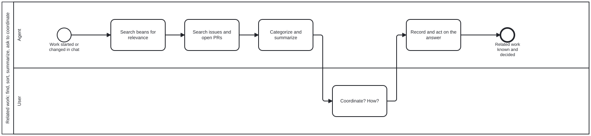

{: .note }
> Generated from `cat-harness/processes/related-work.bpmn` by `gen-processes-viz.ts` — do not edit here. [All processes](index.html)


# Related work: find, sort, summarize, ask to coordinate

`Process_RelatedWork` · strict (defaulted) · 5 step(s)

Before new work takes shape, find the work it touches. When a requirement is initiated or updated through a human-agent chat (CRDM), or a method is adopted from a source, search the beans and the repository's issues and open PRs for relevance. Categorize and summarize every hit, then ask the user whether and how to coordinate. Judgement decides the categories and the recommendation; the user decides the coordination. Owner, 2026-09-23 (issue #1023): 'existing beans need to be searched for relevance and categorized (and summarized), same for issues (e.g. github). ask user if they want to coordinate. judgement is used to determine how'. Operating skill: related-work-coordination.

## How it connects

- **Called by:** [CRDM — link the work to an issue](crdm-issue-linking.html), [Adopt a methodology from a source document](methodology-from-source.html)
- **Calls:** none
- **Presented on:** no docs page section shows this diagram

## Lanes — who acts

| lane | role | what it does here |
|---|---|---|
| Agent | `authoring-agent` | Searches, sorts and summarizes, and recommends. It never links, blocks, merges or comments on another piece of work before the user has answered, because coordinating is a commitment on behalf of the work's owners. |
| User | `user` | Answers one question: coordinate or not, and how. The question arrives with its context, options and a recommendation, so it can be answered without opening anything (interaction-modality §4.1). |

## Steps

**1** of 5 step(s) carry no documentation — `activity-documented` lists them.

| step | lane | skill / sub-process | what it does |
|---|---|---|---|
| **Search beans for relevance** `A_SearchBeans` | Agent | [`related-work-coordination`](../reference/skill-instructions/related-work-coordination.html) | beans list --json / beans query over titles AND bodies, open and recently completed. A completed bean is evidence of a decision already made. |
| **Search issues and open PRs** `A_SearchIssues` | Agent | [`related-work-coordination`](../reference/skill-instructions/related-work-coordination.html) | The repository's issues (open and closed) and its open pull requests. An open PR touching the same files is the collision most worth finding early. |
| **Categorize and summarize** `A_Categorize` | Agent | [`related-work-coordination`](../reference/skill-instructions/related-work-coordination.html) | Each hit gets a category (overlaps: coordinate; affected by; out of scope; unrelated) and a one-line summary with its state. Judgement, not a keyword score: say why each is in its category. |
| **Coordinate? How?** `U_Coordinate` | User | — | — |
| **Record and act on the answer** `A_Record` | Agent | [`related-work-coordination`](../reference/skill-instructions/related-work-coordination.html) | Write the chosen coordination where it will be found: bean links (--blocked-by, --parent), a line in the issue or PR body, or 'note only'. A declined coordination is recorded too. |


