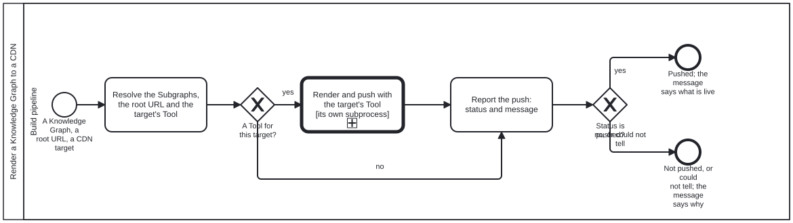

{: .note }
> Generated from `cat-harness/processes/process/render-kg-to-cdn.bpmn` by `gen-processes-viz.ts` — do not edit here. [All processes](index.html)


# Render a Knowledge Graph to a CDN

`Process_RenderKgToCdn` · strict · 3 step(s)

Render a Knowledge Graph — the whole of it, or a list of its Subgraphs — for publication to a CDN at a publication root URL, and report a STATUS and a MESSAGE. Owner, 2026-09-30: "render content of a KG (or list of subgraphs within) for publication to a CDN at a given publication root URL … independent of staging vs publication … just rendering … output is status of push to CDN + message".

STAGING AND RELEASE ARE THE SAME PROCESS. A preview is this with a root under the release root; a release is this with the release root. What differs — who may start it, what is verified first, what else on the host must survive the push — belongs to the CALLER: `feature-staging` and `docs-site-publish` call this and keep their own steps around the call.

TOOL-AGNOSTIC ON PURPOSE. Owner, 2026-09-30: "tools can describe their own specific subprocesses if needed to not bog down general skills". The one call activity names the skill; the Tool for the chosen target satisfies it and lists its own `subprocesses`, which is what the call descends into. For GitHub Pages that is the `gh-pages` Tool and bootstrap-tools' render-kg-to-github-pages. No step here is GitHub's.

## How it connects

- **Called by:** [Publishing the docs site, and keeping the previews alive](docs-site-publish.html), [Staging a feature branch preview, and taking it down](feature-staging.html)
- **Calls:** none
- **Names the `render-kg-to-cdn` skill without calling this process:** [Draft, review and publish](draft-to-publication.html) — `activity-calls-skill-process` asks whether each should be a call activity.
- **Presented on:** no docs page section shows this diagram
- **Skill:** [`render-kg-to-cdn`](../reference/skill-instructions/render-kg-to-cdn.html)

## Lanes — who acts

| lane | role | what it does here |
|---|---|---|
| Build pipeline | `build-pipeline` | Whoever renders: a workflow running the Tool's commands, or an agent running the same ones. A fixed program either way — the judgement about whether to publish was made by the caller before it got here. |

## Steps

Every one of the 3 step(s) is documented.

| step | lane | skill / sub-process | what it does |
|---|---|---|---|
| **Resolve the Subgraphs, the root URL and the target's Tool** `Task_Resolve` | Build pipeline | [`render-kg-to-cdn`](../reference/skill-instructions/render-kg-to-cdn.html) | Every Subgraph id asked for must be one the declaration lists; none means the whole graph. The root URL is the one given. The target's Tool is the one that `satisfies: ["render-kg-to-cdn"]` for that CDN — `gh-pages` for GitHub Pages. A caller that already rendered and verified its tree hands the tree over instead of the graph, and the Tool pushes it without rendering again. |
| **Render and push with the target's Tool [its own subprocess]** `Call_ToolSubprocess` | Build pipeline | [`render-kg-to-cdn`](../reference/skill-instructions/render-kg-to-cdn.html) | BOUND BY THE TOOL, so no `calledElement` is written here: the activity names the skill, the Tool satisfies it, and the Tool's `subprocesses` are what this descends into — for `gh-pages`, bootstrap-tools' render-kg-to-github-pages (make sure gh-pages exists and Pages serves it, stage, check the staging, commit onto gh-pages, check what is served). A diagram that named it would make every other CDN a second copy of this process. Whatever the Tool, it returns the two outputs below. |
| **Report the push: status and message** `Task_Report` | Build pipeline | [`render-kg-to-cdn`](../reference/skill-instructions/render-kg-to-cdn.html) | The output, on every path: `pushed`, `not-pushed` or `could-not-determine`, and one message — what is live (a commit), at which root URL, and the QA result. From the no-Tool branch the status is `not-pushed` and the message names the target nobody implements. A check that could not look is never reported as pushed. |

## Decisions

Every one of the 2 decision(s) is documented.

| decision | what decides it | branches |
|---|---|---|
| **A Tool for this target?** `GW_Tool` | Answered by the Tool registry: does any Tool satisfy `render-kg-to-cdn` for the named CDN? `no` reports not-pushed and names the missing Tool, rather than guessing a mechanism. | **yes** → Render and push with the target's Tool [its own subprocess] **no** → Report the push: status and message |
| **Status is pushed?** `GW_Pushed` | Read off the status just reported. Anything but `pushed` ends at End_NotPushed, and the caller decides what that means for it — an alert, a retry, a person. | **yes** → Pushed; the message says what is live **no, or could not tell** → Not pushed, or could not tell; the message says why |


