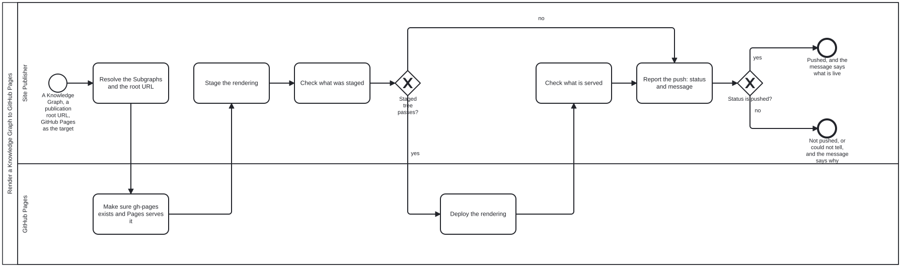

{: .note }
> Generated from `bootstrap-tools/processes/render-kg-to-github-pages.bpmn` by `gen-processes-viz.ts` — do not edit here. [All processes](index.html)


# Render a Knowledge Graph to GitHub Pages

`Process_RenderKgToGitHubPages` · strict (defaulted) · 7 step(s)

Render a Knowledge Graph — the whole of it, or a list of its Subgraphs — to GitHub Pages at a publication root URL, and report the push: a STATUS (pushed, not pushed, could not determine) and one MESSAGE carrying the deployed commit and the QA result. Owner, 2026-09-30: "render content of a KG (or list of subgraphs within) for publication to a CDN at a given publication root URL … independent of staging vs publication … just rendering … output is status of push to CDN + message", and "the rendering bpmn is ok in bootstrap-tools … so 'render KG to githubpages' works and self described".

STAGING AND RELEASE ARE THE SAME PROCESS. A preview is this with a root under the release root; a release is this with the release root. What differs between them — who may start it, what must be reviewed first, what else lives on the same host — belongs to whatever calls this, never in here.

EVERY STEP IS ONE OF THESE TOOLS: site.ts stages, site.ts --check and readme-book.ts --check check the staging, the instance's Pages workflow deploys, pages-status.ts checks what is served and writes the message. The skill render-kg-to-github-pages has each command.

THREE STATES, NOT TWO. A check that could not look (a 403 from a proxy, no network) is could-not-determine, and never reported as pushed.

NO work-plan element on any activity, and isExecutable is false: this is bootstrap-tools' own diagram, in bootstrap's diagram vocabulary, and bootstrap's diagrams carry no work plan.

## How it connects

- **Called by:** no call activity names this process
- **Calls:** none
- **Presented on:** no docs page section shows this diagram

## Lanes — who acts

| lane | role | what it does here |
|---|---|---|
| Site Publisher | `site-publisher` | An agent running these tools, or a Pages workflow running the same commands. It never reports a push it did not check. |
| GitHub Pages | `github-pages` | Not an actor that decides: the host. It receives the deployment and serves it at the publication root URL. |

## Steps

Every one of the 7 step(s) is documented.

| step | lane | skill / sub-process | what it does |
|---|---|---|---|
| **Resolve the Subgraphs and the root URL** `A_ResolveInputs` | Site Publisher | `render-kg-to-github-pages` | Read the instance's declaration. Every Subgraph id asked for must be one it declares; none asked for means the whole graph. The root URL is the one given, else the declaration's iriBase, else https://<owner>.github.io/<repo>/. An unknown id is refused, never rendered as a smaller site. |
| **Make sure gh-pages exists and Pages serves it** `A_Provision` | GitHub Pages | `render-kg-to-github-pages` | Provisioning the target, owned by this Tool's subprocess rather than by the general step (owner, 2026-10-01: "need to create gh-pages branch before can turn on"). In order: (1) an orphan gh-pages branch exists — git ls-remote --heads origin gh-pages; if absent, push a placeholder (index.html + .nojekyll); (2) Pages is on, Source = the gh-pages branch at / — gh api -X POST repos/<o>/<r>/pages -f source[branch]=gh-pages -f source[path]=/ when gh is signed in, otherwise the exact manual step (Settings → Pages → Deploy from a branch → gh-pages, / (root)). Each half is done, not done, or could not be determined; never assumed. |
| **Stage the rendering** `A_Stage` | Site Publisher | `render-kg-to-github-pages` | site.ts --root <instance> --out <dir> [--subgraph <id>]…: every JSON Schema and JSON-LD document at the IRI it names, the files as they sit, the README page as README.md (served as README.html), and index.html as a redirect to it — the default landing page, which an index.html or index.md at the instance root replaces. Generated pages carry the generated-by notice at their top, and a footer that links their generator and source, never an edit page. |
| **Check what was staged** `A_CheckStaged` | Site Publisher | `render-kg-to-github-pages` | site.ts --check and readme-book.ts --check: every document at its address, no address taken by another file, every link on the page landing. This is the QA of what would be pushed. |
| **Deploy the rendering** `A_Deploy` | GitHub Pages | `render-kg-to-github-pages` | Commit the staged tree onto gh-pages as a full replace (the instance's Pages workflow on a push to main, or by hand); GitHub Pages then builds it from the branch. Rebuild and retry on a rejected push; never rebase the branch. The gh-pages commit SHA is the message the report names. |
| **Check what is served** `A_CheckServed` | Site Publisher | `render-kg-to-github-pages` | Ask the root URL and every document address. 2xx or 3xx answers; 404 is not there; 403, 407, 5xx or no answer is about the way here and could not be determined. |
| **Report the push: status and message** `A_Report` | Site Publisher | `render-kg-to-github-pages` | pages-status.ts: pushed, not-pushed or could-not-determine, and one line — the commit, the root URL, and the QA of both the staging and what is served. On the path from a failed staging it says not-pushed and names the problem. Required on every path: a caller that gets no status cannot tell a push from nothing. |

## Decisions

**2** of 2 decision(s) carry no documentation — `gateway-documented` lists them.

| decision | what decides it | branches |
|---|---|---|
| **Staged tree passes?** `GW_Staged` | — | **yes** → Deploy the rendering **no** → Report the push: status and message |
| **Status is pushed?** `GW_Pushed` | — | **yes** → Pushed, and the message says what is live **no** → Not pushed, or could not tell, and the message says why |


