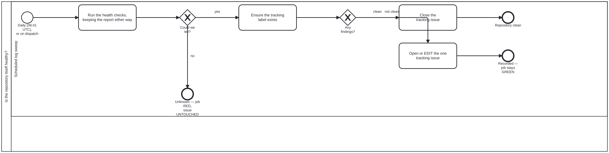

{: .note }
> Generated from `cat-harness/processes/repository-health-watch.bpmn` by `gen-processes-viz.ts` — do not edit here. [All processes](index.html)


# Is the repository itself healthy?

`Process_RepoHealth` · strict · 4 step(s)

THE SAME SHAPE AS `ci-health`, ONE LEVEL OUT. That one asks whether the WORKFLOWS pass; this asks about the REPOSITORY &#8212; how much of `gh-pages` the review previews occupy, how big a clone costs, whether the work plan has duplicates or unhonoured claims.&#10;&#10;IT REPORTS AND NEVER ACTS. Four of the five checks are about artefacts accumulating, and every finding's action names something a PERSON does. That is `deletion-requires-confirmation` applied to the tool that most wants to break it: the skill's own worked example is bean `plj1`, a workflow whose shape deleted every open PR's preview without anybody deciding it. There is no removal task on this diagram, and its absence is the rule being followed rather than an omission.&#10;&#10;THE REPORT IS KEPT WHETHER OR NOT THE CHECKS SUCCEED (`if: always()`), which is why `Run the health checks` says "keeping the report either way". A sweep whose output survives only on success cannot be used to investigate the run that failed.&#10;&#10;The daily cron is at 06:41, OFF THE HOUR deliberately: GitHub's scheduler queues heavily at :00, and a delayed run is a run whose report is stamped later than the state it describes.&#10;&#10;THE THIRD STATE IS THE WHOLE POINT, AND IT IS THE ONLY ONE THAT FAILS THE JOB. Verified 2026-09-20 by reading the `if:` guards: `unknown` runs `exit 1`; a finding does NOT. A repository in trouble leaves this workflow GREEN and speaks through the tracking issue, while a sweep that could not look turns the job red. That inversion is deliberate and is invisible from the run list, which is the argument for drawing it.&#10;&#10;ONE TRACKING ISSUE, EDITED IN PLACE, never a comment and never a second issue &#8212; a feed nobody reads is the failure mode a watchdog invites. On `unknown` the issue is left UNTOUCHED: not closed, not opened, not edited. Closing it would assert the thing the sweep just failed to establish.&#10;&#10;`Ensure the tracking label exists` sits AFTER `Could we tell?` and before the split, because both issue paths need the label &#8212; the clean path filters on it too, and on a repository where nothing has ever gone wrong it would not otherwise exist. It is skipped on `unknown`, where neither path runs and a label hiccup must not be what fails the job.

## How it connects

- **Called by:** no call activity names this process
- **Calls:** none

## Lanes — who acts

| lane | role | what it does here |
|---|---|---|
| Scheduled log sweep | — | The only lane in this diagram, and everything it does is either checking or recording — never removing, which is deletion-requires-confirmation applied to the shape most tempted to break it. It is also where the inversion lives: a real finding leaves the job GREEN and speaks through one tracking issue edited in place, while "could not tell" is the only outcome that turns the job RED and leaves that issue deliberately untouched. |

## Steps

**4** of 4 step(s) carry no documentation — `activity-documented` lists them.

| step | lane | skill / sub-process | what it does |
|---|---|---|---|
| **Run the health checks,&#10;keeping the report either way** `Task_Check` | Scheduled log sweep | [`deletion-requires-confirmation`](../reference/skill-instructions/deletion-requires-confirmation.html) | — |
| **Ensure the tracking&#10;label exists** `Task_Label` | Scheduled log sweep | [`ci-health`](../reference/skill-instructions/ci-health.html) | — |
| **Close the&#10;tracking issue** `Task_Close` | Scheduled log sweep | [`ci-health`](../reference/skill-instructions/ci-health.html) | — |
| **Open or EDIT the one&#10;tracking issue** `Task_Track` | Scheduled log sweep | [`ci-health`](../reference/skill-instructions/ci-health.html) | — |


