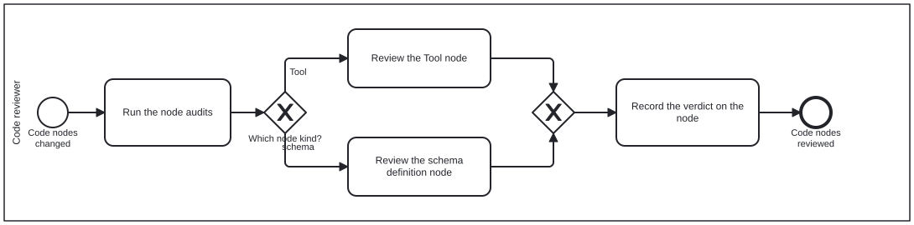

{: .note }
> Generated from `cat-harness/processes/review-code.bpmn` by `gen-processes-viz.ts` — do not edit here. [All processes](index.html)


# Code node review

`Process_CodeReview` · strict (defaulted) · 4 step(s)

Judging changed CODE NODES — Tool definitions and schema definition nodes — on whether they are correct NODES, not merely correct code. You are in this process when what changed is a node that happens to be TypeScript. The distinction is the whole reason it is separate from ordinary code review: a file can compile, pass its tests, and still declare the wrong thing, name a skill that does not exist, or advertise a mechanism the pipeline does not actually invoke. The gateway picks by node KIND because the questions differ. A Tool is judged on whether its mechanism is the one that runs; a schema definition node on whether it says what it is and its references resolve.

## How it connects

- **Called by:** [Review task](review-task.html)
- **Calls:** none

## Lanes — who acts

| lane | role | what it does here |
|---|---|---|
| Code reviewer | — | Forks on node kind but never on verdict: Task_ReviewTool catches a skill that is satisfied but whose mechanism is reachable from nowhere, Task_ReviewSchema catches a visual fact with two homes instead of one, and both branches converge on the same Task_RecordVerdict — so whichever kind of node changed, the reader of the finding sees one recording discipline, not two. |

## Steps

Every one of the 4 step(s) is documented.

| step | lane | skill / sub-process | what it does |
|---|---|---|---|
| **Run the node audits** `Task_RunNodeAudits` | Code reviewer | [`code-node-review`](../reference/skill-instructions/code-node-review.html) | `check:tools`, `kg:audit` and `typecheck`. Read the kg-qa sidecar rather than the summary: it is written per node so an inherited defect and a new one are distinguishable. |
| **Review the Tool node** `Task_ReviewTool` | Code reviewer | [`skills-and-tools`](../reference/skill-instructions/skills-and-tools.html) [`covered-is-not-reachable`](../reference/skill-instructions/covered-is-not-reachable.html) | Does it name skills, and do they resolve? Is the mechanism it advertises the one that actually runs? Are its IRIs minted rather than written out? And the question a covered skill hides: is the COMMAND reachable, or only the skill satisfied? A skill can be served by the neighbours of its mechanism while the mechanism itself is reachable from no node, and check:tools reports it as covered and is right to. |
| **Review the schema definition node** `Task_ReviewSchema` | Code reviewer | [`code-node-review`](../reference/skill-instructions/code-node-review.html) [`site-presentation-assets`](../reference/skill-instructions/site-presentation-assets.html) | Does the node declare what KIND of node it is? Does a widened type carry its mirrors? Does a removed field leave a reason behind, so the next author does not re-add it in good faith? And where the node RENDERS to something the site serves — a colour, a glyph, a theme's tokens — does a Tool maintain that artefact, and does the visual fact have only one home? The node decides; the stylesheet reports. |
| **Record the verdict on the node** `Task_RecordVerdict` | Code reviewer | [`code-node-review`](../reference/skill-instructions/code-node-review.html) | Findings are advice, not commits — the same separation the generic reviewer lane keeps. Record them where the next reader meets the node. |


