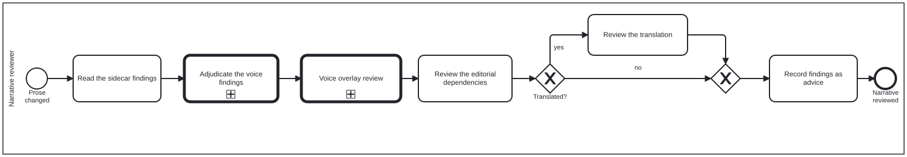

{: .note }
> Generated from `cat-harness/processes/review-narrative.bpmn` by `gen-processes-viz.ts` — do not edit here. [All processes](index.html)


# Narrative review

`Process_NarrativeReview` · strict (defaulted) · 6 step(s)

Judging changed PROSE: read what the mechanical checkers flagged, decide which findings are real, then look at the two things no checker can judge — whether the editorial dependencies still hold and whether a translation still says what the source does. You are in this process when prose changed. `review-code` is its sibling for code nodes and `review-task` is what dispatches to either, so arriving here means somebody has already decided the change is narrative. Everything this lane produces is ADVICE. The reviewer records findings; accepting or refusing the change belongs to the editor's lane in `review-task`. The separation is why a review can be thorough without being a veto.

## How it connects

- **Called by:** [Review task](review-task.html)
- **Calls:** [Criterion adjudication](criterion-adjudication.html), [Voice overlay review](voice-review.html)
- **Presented on:** no docs page section shows this diagram

## Lanes — who acts

| lane | role | what it does here |
|---|---|---|
| Narrative reviewer | `narrative-reviewer` | Turns mechanical matches into verdicts, not the other way round: `qa-checkers-voice.ts`, `qa-checkers-uses.ts` and `translation-block-qa.ts` produce candidates, and this lane is the only place a phrase-list hit becomes a wrong-register finding, an out-of-genre criterion, a stated exception, or nothing at all. House voice is adjudicated before any activated overlay is even reached, because an overlay adds to the house judgement rather than replacing it. |

## Steps

Every one of the 6 step(s) is documented.

| step | lane | skill / sub-process | what it does |
|---|---|---|---|
| **Read the sidecar findings** `Task_ReadFindings` | Narrative reviewer | [`content-review`](../reference/skill-instructions/content-review.html) | Open the block's `.qa.json`, not just the evidence line: register is a property of the passage, and the sidecar quotes one line of it. |
| **Adjudicate the voice findings** `Task_AdjudicateVoice` | Narrative reviewer | calls [Criterion adjudication](criterion-adjudication.html) [`voice-editorial-review`](../reference/skill-instructions/voice-editorial-review.html) [`adjudication`](../reference/skill-instructions/adjudication.html) | Three outcomes, all legitimate: the register is wrong for this genre; the criterion does not belong in this genre and should carry `profiles`; or the block is a stated exception and a reviewer entry records why. |
| **Voice overlay review** `Call_VoiceOverlay` | Narrative reviewer | calls [Voice overlay review](voice-review.html) [`voice-overlay-review`](../reference/skill-instructions/voice-overlay-review.html) | Descend into Process_VoiceReview for whichever named voices the folio has ACTIVATED — the WHO editorial style, the guideline-development register, the publication design conventions, the Milnor exposition standard. No new role is taken on: register is what this lane already judges, and a voice is a register. Placed after the base voice adjudication because a voice OVERLAYS the house voice rather than replacing it, so the house finding has to be settled first. Its own first gateway leaves immediately when no voice is active, which is this instance's case and the default everywhere. |
| **Review the editorial dependencies** `Task_ReviewUses` | Narrative reviewer | [`uses-editorial-review`](../reference/skill-instructions/uses-editorial-review.html) | `uses[]` is what a READER must have read to follow the block — never populated from the formal dependency graph. |
| **Review the translation** `Task_ReviewTranslation` | Narrative reviewer | [`translation-manager`](../reference/skill-instructions/translation-manager.html) | Coverage, preserved terms and echoes are mechanical. A semantic round trip needs a back-translator that has not seen the original; where none has run, the criterion carries no verdict and that is the honest state. |
| **Record findings as advice** `Task_RecordFindings` | Narrative reviewer | [`content-feedback`](../reference/skill-instructions/content-feedback.html) | A reviewer cannot accept a change — that is the editor's lane — so the output is findings on the sidecar, not a commit. |

## Decisions

Every one of the 1 decision(s) is documented.

| decision | what decides it | branches |
|---|---|---|
| **Translated?** `GW_Translated` | Does this block have translations? `yes` reviews the translation too; `no` skips straight to the join. | **yes** → Review the translation **no** → GW_Join |


