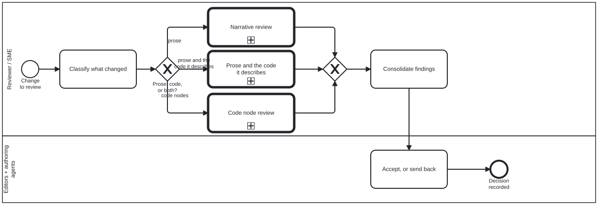

{: .note }
> Generated from `cat-harness/processes/review-task.bpmn` by `gen-processes-viz.ts` — do not edit here. [All processes](index.html)


# Review task

`Process_Review` · strict (defaulted) · 5 step(s)

The generic review position: classify what changed, descend into the review that fits it, consolidate what comes back, and accept or send back. You are in this process for any change under review. It is a DISPATCHER — the actor takes on the inner lane's role for the call path only — which is why prose and code can both be reviewed without either reviewer having to know the other's criteria. A change that is both goes through both. The accept-or-send-back decision lives here and nowhere beneath it. The subprocesses produce findings; this is the only lane entitled to turn findings into an outcome, and keeping that single makes "who decided" answerable.

## How it connects

- **Called by:** [CRDM Phase 6 — implement, MVP, acceptance](crdm-deliver.html)
- **Calls:** [Code node review](review-code.html), [Narrative review](review-narrative.html)

## Lanes — who acts

| lane | role | what it does here |
|---|---|---|
| Reviewer / SME | — | Makes exactly one decision on its own — what changed, at Task_ClassifyChange — and for everything after that descends into a subprocess, taking on the narrative- or code-reviewer role for that call path only rather than carrying both statically. A change that is both visits both subprocesses in turn, and neither role widens the other. |
| Editors + authoring agents | — | Kept a separate lane on purpose, holding the one activity this diagram gives it: the reviewer who classified and judged the change is never the party that accepts it, so consolidated findings cross a lane boundary before anything is decided on them. |

## Steps

Every one of the 5 step(s) is documented.

| step | lane | skill / sub-process | what it does |
|---|---|---|---|
| **Classify what changed** `Task_ClassifyChange` | Reviewer / SME | [`semantic-review-scoping`](../reference/skill-instructions/semantic-review-scoping.html) | Prose, code nodes, or both. This is the only decision the generic lane makes on its own: everything after it is made inside a subprocess by the role that lane binds. |
| **Narrative review** `Call_NarrativeReview` | Reviewer / SME | calls [Narrative review](review-narrative.html) | Descend into Process_NarrativeReview. The actor takes on the `narrative-reviewer` lane for this call path only. |
| **Code node review** `Call_CodeReview` | Reviewer / SME | calls [Code node review](review-code.html) | Descend into Process_CodeReview. The actor takes on the `code-reviewer` lane for this call path only. |
| **Consolidate findings** `Task_Consolidate` | Reviewer / SME | [`content-review`](../reference/skill-instructions/content-review.html) | One report from however many subprocesses ran. Findings are advice: a reviewer cannot accept the change. |
| **Accept, or send back** `Task_EditorDecides` | Editors + authoring agents | [`content-validate`](../reference/skill-instructions/content-validate.html) | The editor's lane, kept separate on purpose: the reviewer who judged the change is not the position that accepts it. |


