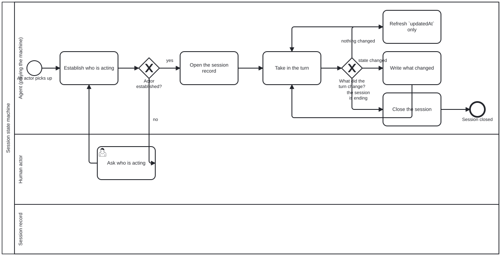

{: .note }
> Generated from `cat-harness/processes/session-state-machine.bpmn` by `gen-processes-viz.ts` — do not edit here. [All processes](index.html)


# Session state machine

`Process_SessionStateMachine` · advisory · 7 step(s)

The shape of a session from the outside: establish who is acting, open a record for them, take each turn in, and write down only what actually changed. You are in this process for the whole of a session, underneath whatever else you are doing — it is the frame the other processes run inside. The first gateway is the one that matters: an agent that cannot say who is acting ASKS, because every later decision about permissions, preferences and language depends on an answer nobody guessed. The distinction between refreshing a timestamp and writing what changed is the diagram's whole content. A session record that logs every turn as a change cannot be read for what happened, and one that logs none cannot be read at all.

## How it connects

- **Called by:** no call activity names this process
- **Calls:** none
- **Presented on:** no docs page section shows this diagram
- **Skill:** [`session-state-machine`](../reference/skill-instructions/session-state-machine.html)

## Lanes — who acts

| lane | role | what it does here |
|---|---|---|
| Agent (playing the machine) | `authoring-agent` | Classifies every turn into exactly one of three effects at Gateway_TurnEffect — nothing changed, state changed, ending — a fresh judgement each time because a table cannot key on intent and a wrong read is corrected by the next turn. It records that a bean was claimed or an instance closed, at A_UpdateSession, but performs none of those actions itself: the record and the thing it describes are kept deliberately separate. |
| Human actor | `user` | Entered only when Gateway_ActorKnown cannot confirm an actor — the one fact in this whole record that the machine cannot recover by reading the repository — and answered once: the response is recorded so this lane is never re-entered for the same session, which is what keeps asking who is acting from becoming a repeated interruption. |
| Session record | `session-record` | — |

## Steps

Every one of the 7 step(s) is documented.

| step | lane | skill / sub-process | what it does |
|---|---|---|---|
| **Establish who is acting** `A_IdentifyActor` | Agent (playing the machine) | [`session-context`](../reference/skill-instructions/session-context.html) | The first step and not a formality: `actor` is the one field of the record that nothing else can supply. Every other field is recoverable by reading the repository; who is acting is not. |
| **Ask who is acting** `A_AskWhoIsActing` | Human actor | [`interaction-modality`](../reference/skill-instructions/interaction-modality.html) | The one step that needs a person. Asked ONCE and recorded, never re-asked: `interaction/interaction.json` and the record exist so that a preference stated once is not requested again, which is WCAG 2.2 SC 3.3.7. |
| **Open the session record** `A_OpenSession` | Agent (playing the machine) | [`session-context`](../reference/skill-instructions/session-context.html) | Writes `id`, `actor` and `startedAt`, with `open` and `claimed` empty. An empty `open` is the NORMAL state, not an unfinished one: an agent reading, answering or deciding is in no process at all. |
| **Take in the turn** `A_ReadTurn` | Agent (playing the machine) | — | A turn is anything that arrives — a person's message, a tool result, a notification. The machine advances on turns rather than on a clock, because a session that has been told nothing has not changed. |
| **Refresh `updatedAt` only** `A_Touch` | Agent (playing the machine) | [`session-context`](../reference/skill-instructions/session-context.html) | Nothing changed, and saying so is the point. A record that stops being written looks exactly like an abandoned session; a refreshed timestamp with no other change says the session is alive and idle, which is a different fact and the commonest one. |
| **Write what changed** `A_UpdateSession` | Agent (playing the machine) | [`session-context`](../reference/skill-instructions/session-context.html) | An instance opened or closed, a bean claimed, a wait started or ended. All by REFERENCE: the bean and the instance are each the authority on themselves, and a status copied here would be free to contradict them. NO `cat-harness.processes:bean` on this step. It records that a claim happened; it does not claim. |
| **Close the session** `A_CloseSession` | Agent (playing the machine) | [`session-context`](../reference/skill-instructions/session-context.html) | Records that the actor stopped. It does NOT resolve beans or complete instances: those outlive the session by design, and a machine that closed them on the way out would be asserting work finished because somebody went away. |

## Decisions

Every one of the 2 decision(s) is documented.

| decision | what decides it | branches |
|---|---|---|
| **Actor established?** `Gateway_ActorKnown` | Is it established who is acting? `no` asks; `yes` opens the session record. A session is never opened for an actor it has not identified. | **no** → Ask who is acting **yes** → Open the session record |
| **What did the turn change?** `Gateway_TurnEffect` | THE non-deterministic point, and the reason this process exists. Three branches, and the agent chooses. | **nothing changed** → Refresh `updatedAt` only **state changed** → Write what changed **the session is ending** → Close the session |


