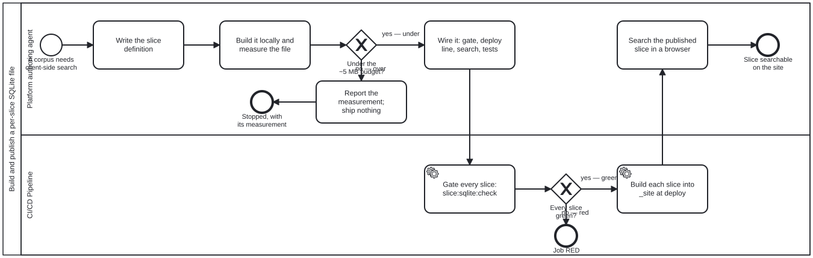

{: .note }
> Generated from `cat-harness/processes/kg/slice-sqlite-publish.bpmn` by `gen-processes-viz.ts` — do not edit here. [All processes](index.html)


# Build and publish a per-slice SQLite file

`Process_SliceSqlitePublish` · strict · 7 step(s)

Build one named slice of a knowledge graph as a SQLite file a browser mounts without parsing, and publish it beside its manifest and its payloads. The contract is `kg-export` §"Per-slice SQLite"; the builder is the `slice-sqlite` Tool (`cat-harness/scripts/gen-slice-sqlite.ts`), one table-driven builder with one definition per slice; the search is one page, `slices/search.html?slice=<name>`. Bean `q8ar`.

THE SIZE IS MEASURED BEFORE THE SLICE IS WIRED, AND THAT IS WHY THIS IS A DIAGRAM. A slice that is wired first and measured afterwards ships whatever it weighs, because by then a manifest, a gate, two deploy steps and a page depend on it. The budget gateway sits between measuring and wiring so that an oversized slice stops with its measurement reported, rather than arriving on a reader's connection.

NO BINARY IS COMMITTED. The file is built at deploy from the tree being published, so the gate cannot compare against a committed copy; it proves determinism (two builds, one sha256) and a row-content digest read back from the file against one computed from the source.

## How it connects

- **Called by:** no call activity names this process
- **Calls:** none
- **Presented on:** no docs page section shows this diagram

## Lanes — who acts

| lane | role | what it does here |
|---|---|---|
| Platform authoring agent | `platform-authoring-agent` | Whoever adds or changes a slice: writes its definition in the builder's slice table, measures the built file against the budget, wires it when it fits, and looks at the published search once it has deployed. The judgement in this process is theirs, at the budget gateway. |
| CI/CD Pipeline | `build-pipeline` | The gate and the deploy. `code-quality-gates.yml` runs `slice:sqlite:check` on every pull request; `docs-site.yml` and `feature-staging.yml` build each slice into `_site/` from the tree they publish, one line per slice. |

## Steps

Every one of the 7 step(s) is documented.

| step | lane | skill / sub-process | what it does |
|---|---|---|---|
| **Write the slice definition** `A_Define` | Platform authoring agent | [`kg-export`](../reference/skill-instructions/kg-export.html) | Add one `SliceDef` to the builder's slice table: the DDL (one table per node type, edge tables, one CONTENTLESS full-detail FTS5), the order each table's rows go in, the `load` that turns the source into rows, where the payloads live (written at deploy, or already published), and the `search` block the generic page reads. Choose the heavy fields by `kg-export` §"What is heavy": a heavy field is a `payload_sha256` pointer, never a stored column. Never copy the builder. |
| **Build it locally and measure the file** `A_Measure` | Platform authoring agent | [`kg-export`](../reference/skill-instructions/kg-export.html) | Run `bun run slice:sqlite -- --slice <name> --out <scratch>` and read the manifest: `bytes`, the row counts, the payload count and bytes, `overBudget`, `duplicateIds` and `findings`. Record the measurement on the bean with its provenance (the command and the date), beside the size of the source it replaces. |
| **Report the measurement; ship nothing** `A_Report` | Platform authoring agent | [`kg-export`](../reference/skill-instructions/kg-export.html) | Write the measurement and what was tried onto the bean, and ask the owner whether the slice should ship at that size, be cut further, or not exist. Nothing is wired: no manifest is published, no gate added, no deploy line written. |
| **Wire it: gate, deploy line, search, tests** `A_Wire` | Platform authoring agent | [`kg-export`](../reference/skill-instructions/kg-export.html) | Give the slice everything a slice owes: its manifest (written by the builder from the definition), its `--check` (covered by `slice:sqlite:check`), one deploy line in `docs-site.yml` and in `feature-staging.yml`, its search (the generic page needs no code, only the definition's `search` block), a unit test over a fixture and over the real source, and a search in `slice-sqlite.e2e.ts`. |
| **Gate every slice: slice:sqlite:check** `A_Check` | CI/CD Pipeline | [`kg-export`](../reference/skill-instructions/kg-export.html) | For every slice: build twice and require one sha256; read the row digest back from the file and require it to equal the digest computed from the source without SQLite; run an FTS5 phrase query for a known row; and audit the payloads with `auditPayloadTree` (deploy payloads as written, the kg slice's pointers against the committed payload tree). A slice whose rows do not match its source fails; it never passes as whole. |
| **Build each slice into _site at deploy** `A_Deploy` | CI/CD Pipeline | [`kg-export`](../reference/skill-instructions/kg-export.html) | `gen-slice-sqlite.ts --out ./_site/assets/slices --payload-out ./_site/payload/sha256 --slice <name>`, once per slice, from the tree being published: the file, its manifest, the slice index, and the deploy payloads beside the committed KG payloads. Never into the committed `docs/payload/`, whose orphan audit admits KG nodes only. |
| **Search the published slice in a browser** `A_Verify` | Platform authoring agent | [`rendered-verification`](../reference/skill-instructions/rendered-verification.html) | Open `slices/search.html?slice=<name>` on the deployed site, run a phrase search for a known row, open it so its payload is fetched, and look at the result; send the screenshot rather than a description of it. Report the mode the page says it used (OPFS or in memory), never an assumed one. |

## Decisions

Every one of the 2 decision(s) is documented.

| decision | what decides it | branches |
|---|---|---|
| **Under the ~5 MB budget?** `GW_Budget` | Answered by the manifest `A_Measure` read: `bytes` against `SIZE_BUDGET_BYTES`. Under it, the slice is wired. Over it, the slice stops here and the measurement is reported, because shipping it would be a decision about every reader's download that nobody made. The no-body variant (nodes, edges and an FTS over names, titles and summaries, bodies as payload pointers) is the first thing to try before reporting. | **yes — under** → Wire it: gate, deploy line, search, tests **no — over** → Report the measurement; ship nothing |
| **Every slice green?** `GW_Green` | Answered by the exit code of `slice:sqlite:check`, one line per slice. Any red line fails the pull request; a source the builder could not read is could-not-determine, which is red rather than an empty green slice. | **yes — green** → Build each slice into _site at deploy **no — red** → Job RED |


