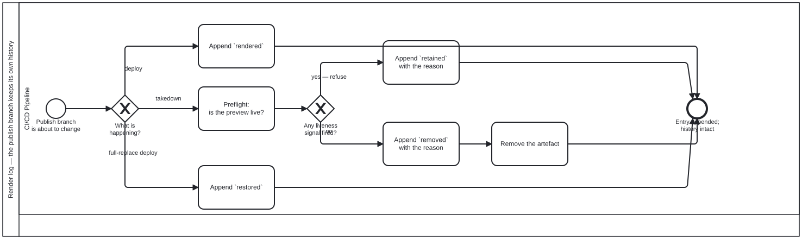

{: .note }
> Generated from `cat-harness/processes/staging-render-log.bpmn` by `gen-processes-viz.ts` — do not edit here. [All processes](index.html)


# Render log — the publish branch keeps its own history

`Process_RenderLog` · strict (defaulted) · 6 step(s)

Every change to the publish branch appends an entry to `_render-log/<day>.jsonl`. A removal is a NEW entry, never the erasure of the `rendered` one before it — the pair is the history. The lane is the build pipeline because every writer is a workflow job; no agent decides what goes in this log. A system lane runs a fixed program and exercises no judgement, which is exactly what an append-only log wants. The question it exists to answer: what happened to STAGING/<slug>, and why. Bean `plj1` is why it is needed — a full-replace deploy silently deleted every open PR's preview, for months, and the publish branch kept no record of its own changes.

## How it connects

- **Called by:** no call activity names this process
- **Calls:** none

## Lanes — who acts

| lane | role | what it does here |
|---|---|---|
| CI/CD Pipeline | `build-pipeline` | Every branch of GW_What — deploy, takedown, full-replace — is logged by this same lane regardless of which is firing, and the ORDER matters as much as the fact: A_LogRemoved happens before A_Remove specifically so a job that dies mid-step leaves a record of intent rather than an artefact that vanished with nothing said about it. |

## Steps

Every one of the 6 step(s) is documented.

| step | lane | skill / sub-process | what it does |
|---|---|---|---|
| **Append `rendered`** `A_LogRendered` | CI/CD Pipeline | [`render-logging`](../reference/skill-instructions/render-logging.html) | A re-deploy is a rendering, so it gets its own entry rather than overwriting the last. "When was this last built" is then answerable without diffing commits. |
| **Preflight: is the preview live?** `A_Preflight` | CI/CD Pipeline | [`render-logging`](../reference/skill-instructions/render-logging.html) | `previewLiveness` — a disjunction over open-pr, unmerged-branch and recent-commit, shared with the health sweep so the two cannot disagree. Bean `w2g5`: a preview whose pull request is closed is NOT an abandoned one. |
| **Append `retained` with the reason** `A_LogRetained` | CI/CD Pipeline | [`render-logging`](../reference/skill-instructions/render-logging.html) | THE ENTRY THAT MAKES THE LOG WORTH READING. A preview still standing because a signal fired leaves no trace otherwise, and the next person asking "why is this still up" has nothing to consult. A reason is REQUIRED — the tool refuses without one. |
| **Append `removed` with the reason** `A_LogRemoved` | CI/CD Pipeline | [`render-logging`](../reference/skill-instructions/render-logging.html) | BEFORE the removal, not after: a job that dies mid-step must leave a record of the intent rather than an artefact that vanished with no entry. A reason is REQUIRED — an entry saying an artefact went and not why is the ambiguity this log exists to prevent. |
| **Remove the artefact** `A_Remove` | CI/CD Pipeline | [`render-logging`](../reference/skill-instructions/render-logging.html) | `rm -rf STAGING/<slug>`. Cannot reach the log, which lives outside STAGING/ — structural rather than guarded, because a branch named to collide with a directory under STAGING/ slugifies to exactly that name and git permits the ref. |
| **Append `restored`** `A_LogRestored` | CI/CD Pipeline | [`render-logging`](../reference/skill-instructions/render-logging.html) | A full-replace deploy (`docs-site.yml`, the only publisher without keep_files) wipes the branch; `restore-staging` carries the previews AND this log back in. Its own event rather than a second `rendered`, because "somebody pushed this branch" and "an unrelated merge nearly deleted it" are different facts — and bean `plj1` is what happens when the second is invisible. |

## Decisions

Every one of the 2 decision(s) is documented.

| decision | what decides it | branches |
|---|---|---|
| **What is happening?** `GW_What` | What is about to happen to the publish branch? A `deploy` appends `rendered`; a `takedown` first preflights whether the preview is live; a `full-replace deploy` appends `restored` for the previews it put back. | **deploy** → Append `rendered` **takedown** → Preflight: is the preview live? **full-replace deploy** → Append `restored` |
| **Any liveness signal fired?** `GW_Live` | Answered by the preflight: did any liveness signal fire for this preview? `yes — refuse` keeps it and appends `retained` with the reason; `no` removes it and appends `removed` with the reason. | **yes — refuse** → Append `retained` with the reason **no** → Append `removed` with the reason |


