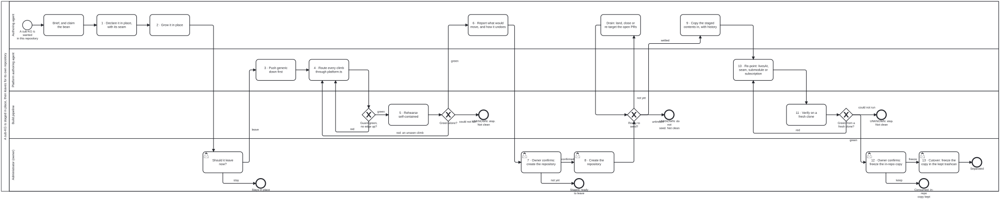

{: .note }
> Generated from `cat-harness/processes/kg/sub-kg-lifecycle.bpmn` by `gen-processes-viz.ts` — do not edit here. [All processes](index.html)


# A sub-KG is staged in place, then leaves for its own repository

`Process_SubKgLifecycle` · strict · 16 step(s)

Create a knowledge graph inside a harnessed repository as an instance of its own, grow it there, and when it should leave, stage it for separation and move it whole into a new repository. Declared in place with a planned `repository` and a `livesAt` saying where it sits today; staged by one import seam (`<name>/platform.ts`), the separation guard and a self-contained rehearsal; then, each behind an explicit owner confirmation, the repository is created, the staged contents are copied in with their history, the declaration is re-pointed, a fresh clone is verified, and the in-repo copy is deleted.

Extracted in retrospect from the staged IG separations of 2026-09-21 to 2026-10-06 (beans n3ni, kg83, rbz3, hcpz). The light sibling of kg-separation, which splits a graph into a content and a tools repository; this moves a data instance whole, and shares kg-separation's seeding gateway and decision table.

## How it connects

- **Called by:** no call activity names this process
- **Calls:** none
- **Presented on:** no docs page section shows this diagram
- **Skill:** [`sub-kg-lifecycle`](../reference/skill-instructions/sub-kg-lifecycle.html)

## Lanes — who acts

| lane | role | what it does here |
|---|---|---|
| Authoring agent | `authoring-agent` | Declares the sub-KG in place and grows it, reports what would move before each irreversible step, drains the open pull requests that keep the source from settling, and copies the staged contents into the new repository with their history. |
| Platform authoring agent | `platform-authoring-agent` | The platform-side stages: pushing generic code and declarations down into the harness below, routing every climb out of the sub-KG through its one import seam, and re-pointing the declaration, the seam and the host's consumption once the new repository exists. |
| Build pipeline | `build-pipeline` | Runs the checks that decide the gateways: the separation guard and the three direction checks, the self-contained rehearsal, the seed-readiness table at seed time, and the gates of the new repository from a fresh clone. A check that could not run stops the process; it is never read as a pass. |
| Administrator (owner) | `administrator` | The person's decisions: whether the sub-KG leaves at all, whether the new repository may be created, and whether the in-repo copy may be deleted. An agent reports and waits at each, asks with numbered options and a default that changes nothing, and none of the three may be relaxed by a package. |

## Steps

Every one of the 16 step(s) is documented.

| step | lane | skill / sub-process | what it does |
|---|---|---|---|
| **Brief, and claim the bean** `Task_Brief` | Authoring agent | [`opening-brief`](../reference/skill-instructions/opening-brief.html) | What the sub-KG is and why it is staged here rather than in a repository of its own, what is already measured, and what would falsify the plan. Claim the bean so a sibling session sees the work. |
| **1 · Declare it in place, with its seam** `Task_Declare` | Authoring agent | [`sub-kg-lifecycle`](../reference/skill-instructions/sub-kg-lifecycle.html) | `<name>/<name>.json` with name, version, `repository` (the planned home), `livesAt` (where it sits today), `needs`, and only the directories that exist, each declared with its files in one commit (bean dh4f). `<name>/platform.ts` from the first commit, so no climb out of the directory ever needs rerouting. Scaffolded by `init-folio --staged <path>`, which writes those two files and nothing at the host root; never `--instance`, which writes a whole repository. |
| **2 · Grow it in place** `Task_Grow` | Authoring agent | [`sub-kg-lifecycle`](../reference/skill-instructions/sub-kg-lifecycle.html) | The content type's own authoring process runs here, against the staged instance. Many sub-KGs never leave; this task can last as long as the graph does. |
| **Should it leave now?** `Task_DecideLeave` | Administrator (owner) | [`sub-kg-lifecycle`](../reference/skill-instructions/sub-kg-lifecycle.html) | The owner decides, from what is measured, whether the sub-KG starts staging for separation now. Asked as numbered options with the recommended one first and a stated default: keeping it in place is the default, and is a real outcome. |
| **3 · Push generic down first** `Task_PushDown` | Platform authoring agent | [`graph-detanglement`](../reference/skill-instructions/graph-detanglement.html) | Move what is generic into the harness below before the seam is closed, and consolidate what the sub-KG needs into the harness it instantiates. Wrong-direction edges hide in declarations and data as well as imports: run check:import-direction, check:reference-direction and check:process-bindings. Learned from stages A-D of bean n3ni (#1768, #1782, #1783, #1795). |
| **4 · Route every climb through platform.ts** `Task_Seam` | Platform authoring agent | [`sub-kg-lifecycle`](../reference/skill-instructions/sub-kg-lifecycle.html) | Every platform symbol the sub-KG uses is re-exported from `<name>/platform.ts`, so re-pointing the platform is a one-file edit. A merge from main is where new climbs arrive; reroute them here. Learned from #1767 and #1860. |
| **5 · Rehearse self-contained** `Task_Rehearse` | Build pipeline | [`sub-kg-lifecycle`](../reference/skill-instructions/sub-kg-lifecycle.html) | `bun run seed:ready --layer <name> --rehearse` copies the layer and what it needs into a scratch workspace of sibling directories and runs the tests there. Run the gates rather than scanning imports: the fork rehearsal (bean rbz3) found a static scan saw 20 of the 23 platform files the gates loaded, and that renaming the directory changed every generated page. |
| **6 · Report what would move, and how it undoes** `Task_Report` | Authoring agent | [`deletion-requires-confirmation`](../reference/skill-instructions/deletion-requires-confirmation.html) | Before the first outward-facing step the agent reports: the files and bytes that would move, the history that comes with them, what in the host changes, and how each step is undone. It never creates a repository on its own initiative. |
| **7 · Owner confirms: create the repository** `Task_ConfirmCreate` | Administrator (owner) | [`deletion-requires-confirmation`](../reference/skill-instructions/deletion-requires-confirmation.html) | Creating a repository is visible outside this one and is not undone by a revert. Numbered options, recommended first: (1) the owner creates it and says when it exists, (2) the agent creates it, only with that permission, (3) not yet. Default if there is no answer: (3), nothing is created. Non-relaxable. |
| **8 · Create the repository** `Task_CreateRepo` | Administrator (owner) | [`sub-kg-lifecycle`](../reference/skill-instructions/sub-kg-lifecycle.html) | The owner creates the repository, or authorises the agent that has the permission to; when that agent is in another environment, the hand-over is one bean and one sentence (agent-handoff). The new repository is read before anything is written to it: empty is a fact to check, not to assume. |
| **Drain: land, close or re-target the open PRs** `Task_Drain` | Authoring agent | [`kg-separation`](../reference/skill-instructions/kg-separation.html) | Work the pull requests seed:ready named until the source settles, then ask again. |
| **9 · Copy the staged contents in, with history** `Task_Seed` | Authoring agent | [`sub-kg-lifecycle`](../reference/skill-instructions/sub-kg-lifecycle.html) | `git subtree split --prefix=<name>` in the host, then the split branch added to the new repository on a branch, as a draft pull request, never straight to main. The new repository's own root files are a second commit, so the copy stays byte-identical and reviewable. The first fork seed carried 378 commits this way (bean n3ni, stage E). |
| **10 · Re-point: livesAt, seam, submodule or subscription** `Task_Repoint` | Platform authoring agent | [`sub-kg-lifecycle`](../reference/skill-instructions/sub-kg-lifecycle.html) [`upstream-version-adoption`](../reference/skill-instructions/upstream-version-adoption.html) | In the new repository `livesAt` goes (absent means it sits at the root of `repository`) and `platform.ts` points at where the platform now is. The host consumes it as a submodule if it imports its code, or a subscription if it only reads its content, pinned to a commit while staging. Additive: the host keeps its copy. |
| **11 · Verify on a fresh clone** `Task_FreshClone` | Build pipeline | [`sub-kg-lifecycle`](../reference/skill-instructions/sub-kg-lifecycle.html) | `bun run sub-kg:verify-clone --repo <owner>/<name> --ref <branch>` (Tool sub-kg-verify-clone): clone into an empty scratch directory with submodules and any sibling it needs, install, and run its own gates. Green, red or unknown, and unknown is never green. The measured falsifier (#2082): the first seeded fork failed with "Cannot find module" because nothing in a seed runs standalone until the seam is re-pointed. |
| **12 · Owner confirms: freeze the in-repo copy** `Task_ConfirmCutover` | Administrator (owner) | [`deletion-requires-confirmation`](../reference/skill-instructions/deletion-requires-confirmation.html) | The agent reports the files that would move, their size, the new repository and the commit the copy matches, then asks: (1) freeze it in the kept trashcan now, (2) keep in place until the first release, (3) show the file list first. Default if there is no answer: (2), nothing moves. A green fresh clone is the precondition for asking, not the answer. Non-relaxable. Owner ruling, 2026-10-06 (bean 3tza, "1"): the host keeps a FROZEN copy in the kept trashcan, not a refreshed mirror and not a deletion; the live copy is the submodule or subscription set up at stage 10. |
| **13 · Cutover: freeze the copy in the kept trashcan** `Task_Cutover` | Administrator (owner) | [`deletion-requires-confirmation`](../reference/skill-instructions/deletion-requires-confirmation.html) | Only on the owner's answer (1) at step 12. The in-repo directory moves, as one relocation, under separated/<name>/ in the kept trashcan, on its own branch (a plain mv, git rm --cached, state:push; the trashcan skill says how), with ONE note carrying movedFrom, movedOn, the new repository and the commit the copy matches. Frozen: never refreshed, never rendered; a reader wanting the live content follows the note to the new repository. On main this is one revertable commit removing the directory. |

## Decisions

Every one of the 4 decision(s) is documented.

| decision | what decides it | branches |
|---|---|---|
| **Guard green, no edge up?** `GW_Guard` | Decided by commands: instance-separation-imports.test.ts (every instance whose repository differs from its livesAt is covered), and the three direction checks adding nothing. Red goes back to the seam. | **red** → 4 · Route every climb through platform.ts **green** → 5 · Rehearse self-contained |
| **Green alone?** `GW_Alone` | Green with only the layer and what it needs present goes on. Red means a climb or a run-time load the guard did not see: back to the seam. If the rehearsal could not run, that is not a pass: stop. | **red: an unseen climb** → 4 · Route every climb through platform.ts **could not run** → UNKNOWN: stop. Not clean **green** → 6 · Report what would move, and how it undoes |
| **Ready to seed?** `GW_SeedReady` | Asked at seed time, because the tree has moved since the rehearsal: every open pull request over the layer when the copy is taken is orphaned. Computed by decisions/seed-readiness-gate.dmn from the facts `bun run seed:ready --layer <name> --rehearse` gathers; the same table kg-separation uses. | **not yet** → Drain: land, close or re-target the open PRs **unknown** → UNKNOWN: do not seed. Not clean **settled** → 9 · Copy the staged contents in, with history |
| **Green from a fresh clone?** `GW_Fresh` | Green goes to the owner. Red is fixed in the new repository, not in the staged copy, and goes back to the re-point. A clone that could not run is not a pass: stop. | **red** → 10 · Re-point: livesAt, seam, submodule or subscription **could not run** → UNKNOWN: stop. Not clean **green** → 12 · Owner confirms: freeze the in-repo copy |


