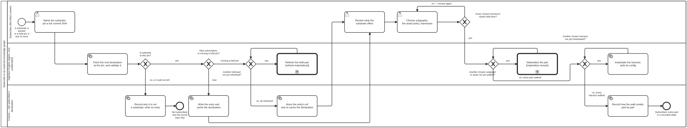

{: .note }
> Generated from `cat-harness/processes/library/subscribe-kg.bpmn` by `gen-processes-viz.ts` — do not edit here. [All processes](index.html)


# Subscribe to an external knowledge graph

`Process_SubscribeKg` · strict · 11 step(s)

Owner, 2026-09-30 (issue #1719): "a way for a folio instance (or cat-harness in general) to "subscribe" to external KGs … they can choose to materialize some or all subgraphs … an asset reference … they can choose to materialize locally … instantiate one or more harnesses … so then harness appears in their navbar." Design: cat-harness/docs/proposals/kg-subscriptions.md, epic bean fnx4, slice 8.

A SUBSCRIPTION IS NOT A NEW MECHANISM, and this diagram is where that claim is kept honest. Every byte that arrives does so through Process_MaterializeRemote, called once per chosen subgraph or asset; every held copy is refreshed through Process_RefreshMaterialized. Neither is re-described here. What this process adds is only the walk: pin, validate, choose, and then carry each chosen part from referenced to materialised one at a time.

A SUBSTRATE is a repository whose root declaration meets bootstrap's schema requirements and declares at least one harness (the owner's definition). Both are answerable from the declaration file alone, so validating one never needs the whole repository.

WHERE IT LIVES: cat-harness/processes/, beside Process_MaterializeRemote and Process_RefreshMaterialized, which it calls, and naming the kg-subscription and materialize-remote skills in cat-harness/skills/library/large-datasets/. It was written in large-datasets (proposal decision #3), because those subprocesses and skills lived there and a diagram in cat-harness would have run every edge against the dependency arrow (bean cjvs). The owner's 2026-10-01 ruling dissolved large-datasets into cat-harness's concern groups (bean j7ql), so the callees came with it: the calls are siblings again and every ref stays inside the harness.

STRICT. The pin and the five gates are the reason: an unpinned subscription is how two subscribers see two graphs under one name, and a copy that skipped the gates is the xom7 shape — a check nobody fails because it only ever warned.

## How it connects

- **Called by:** no call activity names this process
- **Calls:** [Materialize remote content — the shared subprocess](materialize-remote.html), [Refresh materialized remote content](refresh-materialized.html)
- **Presented on:** no docs page section shows this diagram

## Lanes — who acts

| lane | role | what it does here |
|---|---|---|
| Subscriber (the folio's owner) | `user` | Every CHOICE in the walk is made here and nowhere else: which substrate and at which commit, which of its subgraphs, asset classes and harnesses to hold. The engine never chooses a part on the subscriber's behalf — a subgraph not chosen stays referenced, which is a state, not an omission — and the pre-check on harness needs sends the choice back here rather than resolving it silently. |
| Ingestion Engine (agent, runs unattended) | `ingestion-agent` | Validates the substrate at the pin, then walks the chosen parts one at a time: each subgraph or asset through the shared materialisation subprocess, each held copy through the shared refresh, each harness by writing its config. Every loop here re-enters its decision after each part, so a refusal on one part is recorded and the walk continues to the next rather than aborting the subscription. |
| Corpus — the subscriber's declaration | `corpus` | Where the subscription is written down: the entry in the subscriber's instance declaration (choice and pin only, never state), the cached copy of the substrate's declaration the visualizer reads offline, and the record of how the walk ended. A refusal lands here with the same weight as a success, so the next caller does not re-litigate it. |

## Steps

Every one of the 11 step(s) is documented.

| step | lane | skill / sub-process | what it does |
|---|---|---|---|
| **Name the substrate, pin a full commit SHA** `Task_Pin` | Subscriber (the folio's owner) | [`kg-subscription`](../reference/skill-instructions/kg-subscription.html) | `owner/repo` and a 40-character commit SHA — never a branch, never an abbreviated SHA. The schema refuses anything else (SubscriptionSchema.ref), and this step exists so the refusal is met while choosing rather than at commit time. A tag replaces the SHA only once the substrate publishes releases. |
| **Fetch the root declaration at the pin, and validate it** `Task_Validate` | Ingestion Engine (agent, runs unattended) | [`kg-subscription`](../reference/skill-instructions/kg-subscription.html) | A sparse, shallow fetch of the substrate's root declaration only. Two questions: does it parse as bootstrap's KnowledgeGraphDeclarationSchema, and does it declare at least one harness? `could not fetch` is a third answer and is never read as `conforms`. |
| **Record why it is not a substrate; write no entry** `Task_Refuse` | Corpus — the subscriber's declaration | [`kg-subscription`](../reference/skill-instructions/kg-subscription.html) | No subscription entry is written for a repository that is not a substrate. What is recorded is the reason (non-conforming, no harness, or unreachable) and the pin it was asked at, so a later attempt at a different commit starts from what failed. |
| **Write the entry and cache the declaration** `Task_Record` | Corpus — the subscriber's declaration | [`kg-subscription`](../reference/skill-instructions/kg-subscription.html) | The `subscriptions` entry in the subscriber's instance declaration — id, repository, ref, and nothing chosen yet — plus a cached copy of the substrate's declaration at the pin. The entry holds the choice and the pin, never state: whether a part is held is answered by its materialisation record, and a second answer here would be free to disagree with it. |
| **Refresh the held part** `Call_Refresh` | Ingestion Engine (agent, runs unattended) | calls [Refresh materialized remote content](refresh-materialized.html) [`materialize-remote`](../reference/skill-instructions/materialize-remote.html) | The shared refresh, called, not re-described: what changed upstream, what changed locally, and what to do when both did. An archival copy is fixity-checked and never re-fetched. Whatever that process decides — refreshed, kept divergent, or deferred — is the part's new state; this loop only moves to the next part. |
| **Move the entry's ref and re-cache the declaration** `Task_RePin` | Corpus — the subscriber's declaration | [`kg-subscription`](../reference/skill-instructions/kg-subscription.html) | Only after every held part has been through the refresh. Moving the ref first would make the records of parts not yet refreshed describe a commit the entry no longer names. The cached declaration is replaced so the review that follows shows what the NEW pin offers, including subgraphs that did not exist at the old one. |
| **Review what the substrate offers** `Task_Review` | Subscriber (the folio's owner) | [`kg-subscription`](../reference/skill-instructions/kg-subscription.html) | Every subgraph, asset class and harness the cached declaration names, each with its current state — referenced, materialised, unknown, stale, or refused by a gate. Shown whole, because a reader who sees only what was chosen cannot tell "not offered" from "not taken". |
| **Choose subgraphs, the asset policy, harnesses** `Task_Choose` | Subscriber (the folio's owner) | [`kg-subscription`](../reference/skill-instructions/kg-subscription.html) | Written to the entry as `subgraphs`, `assets.policy` (none, on-demand or all) and `harnesses`. Choosing is not holding: a chosen subgraph is still referenced until the gates below let it through. Choosing nothing is legitimate — a subscription with no parts chosen is a pinned reference, the case associatedHarnesses covers today. |
| **Materialise the part** `Call_Materialize` | Ingestion Engine (agent, runs unattended) | calls [Materialize remote content — the shared subprocess](materialize-remote.html) [`materialize-remote`](../reference/skill-instructions/materialize-remote.html) | The ONLY way bytes arrive. Purpose first, then the five gates — size, restrictions, copyright, retention, source loss — then fetch with fixity, or stay referenced with the refusing gate's basis recorded. Both ends of that subprocess return here and the walk continues: one part refused is not the subscription refused. |
| **Instantiate the harness: write its config** `Task_Instantiate` | Ingestion Engine (agent, runs unattended) | [`kg-subscription`](../reference/skill-instructions/kg-subscription.html) | Write `<harness>.config.json` at the repository root, plus the state directories the harness declares. That file is what harness-tiles reads as INSTANTIATED, and it is what puts the harness in the navbar's bottom region. check:instance-render must be green on the result; a config that renders nothing is an entry pointing nowhere. |
| **Record how the walk ended, part by part** `Task_Summarise` | Corpus — the subscriber's declaration | [`kg-subscription`](../reference/skill-instructions/kg-subscription.html) | One line per offered part: materialised, referenced by choice, or referenced because a gate refused (and which). Nothing new is decided here; it is the account the visualizer and the next refresh read, written once rather than reconstructed from the loop. |

## Decisions

Every one of the 6 decision(s) is documented.

| decision | what decides it | branches |
|---|---|---|
| **A substrate at this pin?** `Gateway_Substrate` | Decided from Task_Validate's result, not by a person. `yes` needs both answers positive; a declaration that does not conform, declares no harness, or could not be fetched all take `no`, and the reason is recorded rather than the subscription half-written. | **no, or could not tell** → Record why it is not a substrate; write no entry **yes** → New subscription, or moving a held pin? |
| **New subscription, or moving a held pin?** `Gateway_Kind` | Answered by the subscriber's declaration: an entry with this id already exists or it does not. A new one is recorded and reviewed; an existing one first refreshes every part it already holds against the new pin, because a pin that moved under held bytes would leave their records describing a commit nobody is subscribed to. | **new** → Write the entry and cache the declaration **moving a held pin** → Another held part not yet refreshed? |
| **Another held part not yet refreshed?** `Gateway_NextHeld` | Walks the parts this subscription already holds — every subgraph and asset with a materialisation record — one at a time. `yes` refreshes the next; `no` re-pins. Held parts are found from their records, never from the entry's `subgraphs` list, which says what was chosen, not what arrived. | **yes** → Refresh the held part **no, all refreshed** → Move the entry's ref and re-cache the declaration |
| **Every chosen harness's needs held here?** `Gateway_NeedsHeld` | For each chosen harness, is every instance it `needs` either local to this checkout or itself subscribed? Decided from the two declarations, before any byte moves. `no` goes back to the choice — subscribe the missing dependency first, or leave that harness referenced — because instantiating a harness whose needs cannot load writes a navbar entry that fails check:instance-render. | **no — choose again** → Choose subgraphs, the asset policy, harnesses **yes** → Another chosen subgraph or asset not yet walked? |
| **Another chosen subgraph or asset not yet walked?** `Gateway_NextPart` | One part at a time, in the order chosen. `yes` hands the next subgraph — or, under an `all` asset policy, the next referenced asset — to the shared subprocess. Under `on-demand`, assets are not walked here at all: each is materialised through the same subprocess when first asked for. `no` moves on to harnesses. | **yes** → Materialise the part **no, every part walked** → Another chosen harness not yet instantiated? |
| **Another chosen harness not yet instantiated?** `Gateway_NextHarness` | Walks the chosen harnesses, whose needs the pre-check already found held. `yes` instantiates the next; `no` closes the walk. A harness already instantiated at this pin is skipped rather than rewritten. | **yes** → Instantiate the harness: write its config **no, every harness walked** → Record how the walk ended, part by part |


