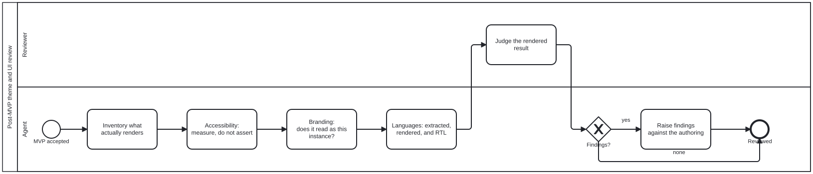

{: .note }
> Generated from `cat-harness/processes/theme-ui-review.bpmn` by `gen-processes-viz.ts` — do not edit here. [All processes](index.html)


# Post-MVP theme and UI review

`Process_ThemeUIReview` · strict (defaulted) · 6 step(s)

Reviewing what the MVP actually RENDERS — accessibility, branding, languages — once stakeholders have accepted it. Post-MVP by design: choosing a theme is an authoring judgement made per note, and there is no role-to-theme mapping to check at build time. What can be reviewed is the result, and only after there is one.

## How it connects

- **Called by:** [CRDM Phase 6 — implement, MVP, acceptance](crdm-deliver.html)
- **Calls:** none
- **Names the `theme-ui-review` skill without calling this process:** [Ingestion subprocess — ingest a theme](ingest-theme.html) — `activity-calls-skill-process` asks whether each should be a call activity.
- **Skill:** [`theme-ui-review`](../reference/skill-instructions/theme-ui-review.html)

## Lanes — who acts

| lane | role | what it does here |
|---|---|---|
| Reviewer | `reviewer` | The single point in this process where a person looks rather than a tool measures, reached only after all four agent passes are done — so what this lane judges is the rendered whole, not any one axis in isolation. Its finding is the only thing that can send the process to A_RaiseFindings; a clean build, a passing accessibility check and a correct branding pass can each be true and still miss what only rendering and looking catches. |
| Agent | `authoring-agent` | Four measured passes into R_Judge — inventory, accessibility, branding, locales — each one required to MEASURE rather than assert, because an automated pass alone missed three defects a rendered look caught outright. If GW_Findings comes back yes, this lane still does not fix anything: A_RaiseFindings sends the finding back to whoever authored the theme choice, since picking it was a judgement call this lane does not get to override. |

## Steps

Every one of the 6 step(s) is documented.

| step | lane | skill / sub-process | what it does |
|---|---|---|---|
| **Inventory what actually renders** `A_Inventory` | Agent | [`theme-ui-review`](../reference/skill-instructions/theme-ui-review.html) | Which themes are in use, on which surfaces, in which locales, and at which VIEWPORTS: every surface at a web width and at a mobile width (owner, 2026-09-23, issue #1023). All of it is read off the artefacts rather than the intent. A theme declared and never chosen is not in the review; a surface nobody listed is the one that ships wrong. |
| **Accessibility: measure, do not assert** `A_Accessibility` | Agent | [`theme-ui-review`](../reference/skill-instructions/theme-ui-review.html) | Contrast COMPUTED against the real ground, including the worst case a backdrop can present; a non-colour channel wherever colour carries meaning (SC 1.4.1); an accessible name on every region; keyboard and focus order. An automated pass is necessary and not sufficient — axe accepts a non-empty placeholder as an accessible name, and a CSS selector that matches nothing raises no error at all. |
| **Branding: does it read as this instance?** `A_Branding` | Agent | [`theme-ui-review`](../reference/skill-instructions/theme-ui-review.html) | Marks, palettes and art against the instance's own declaration rather than a remembered style. The question a downstream folio makes sharp: would this instance inherit something it did not choose? |
| **Languages: extracted, rendered, and RTL** `A_Locales` | Agent | [`theme-ui-review`](../reference/skill-instructions/theme-ui-review.html) | Every user-facing string reaches the .pot; every declared locale renders without clipping or overflow; right-to-left is laid out rather than mirrored by accident. New UI is where untranslated strings enter, because nothing was stale — there was nothing there before. |
| **Judge the rendered result** `R_Judge` | Reviewer | — | A person looks at it, at BOTH a web and a mobile width. A judgement made at one viewport is incomplete, not passed, and the wireframe of the surface (wireframe-design-review) says what each layout was meant to be. Three defects in the landing board — a selector matching nothing, a crop cutting the subject, a fade wrong in both directions — were invisible to a clean build, a passing suite and every gate, and were found only by rendering the page and looking. |
| **Raise findings against the authoring** `A_RaiseFindings` | Agent | [`theme-ui-review`](../reference/skill-instructions/theme-ui-review.html) | Findings go back to whoever authored the choice, because the choice was theirs: a theme is picked per note by a human or an agent, and there is no mapping to correct instead. Raised, never silently fixed — a reviewer who re-themes a note has substituted their judgement for the author's without saying so. |


