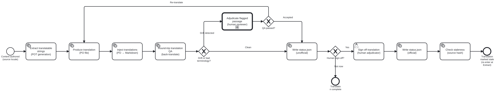

{: .note }
> Generated from `cat-harness/processes/translation-workflow.bpmn` by `gen-processes-viz.ts` — do not edit here. [All processes](index.html)


# Translation Workflow

`Process_Translation` · strict (defaulted) · 10 step(s)

The machine half of translation, end to end: extract the translatable strings, inject a catalogue back, check the result by back-translating it, and track whether the source has moved since. You are in this process whenever translation happens without a person having to be present. Two of its steps are the exception and are drawn in their own lane: a flagged passage is ADJUDICATED by a human, and a translation becomes official only when a human signs it off. `human-translation-workflow` is what happens when a person is doing the translating rather than checking it. Staleness is an END state that re-enters at the beginning, not a failure. A source change does not invalidate a translation's accuracy; it invalidates its currency, which is a different fact and is why it is recorded rather than thrown away.

## How it connects

- **Called by:** no call activity names this process
- **Calls:** [Adjudication](adjudication.html)
- **Presented on:** no docs page section shows this diagram

## Lanes — who acts

| lane | role | what it does here |
|---|---|---|
| Author (source content) | `author` | — |
| Agent / platform (automated) | `authoring-agent` | Everything in this process that runs without asking: extraction to a template, injection of a catalogue, the staleness comparison, and writing the official rendering once sign-off exists. It decides nothing a person would disagree about — every branch it takes is computed from a hash or a file's presence. It is one lane rather than two because agentic and mechanical is a judgement rather than a line (see the role model), and nothing in THIS process turns on which of the two ran a step. Where that distinction does matter, the process says so by putting the step in the reviewer's lane instead. |
| Human reviewer / adjudicator | `translation-adjudicator` | The only lane here that JUDGES. Mechanical translation QA produces candidates — a flagged passage, a terminology miss, a staleness verdict — and a candidate is not a finding until somebody decides it is. This lane is where that decision is made, and it is the lane that signs the translation off, because the actor who resolves a disputed passage is the one who can say the whole is fit to publish. Adjudicator rather than reviewer alone, and the distinction is the accountability: a reviewer reports, an adjudicator settles. The word is used here because the passage reaching this lane is one where a checker and a translator disagree, and somebody has to choose between them WITH a reason. That reason is the record, not the choice. |

## Steps

Every one of the 10 step(s) is documented.

| step | lane | skill / sub-process | what it does |
|---|---|---|---|
| **Extract translatable strings (POT generation)** `Task_PotExtract` | Agent / platform (automated) | [`translation-manager`](../reference/skill-instructions/translation-manager.html) | Scans content nodes and extracts translatable strings to .pot files. Excludes math, labels, code, and Lean companions. Tool: translation_extract MCP tool or bun run content/pipeline/pot-extract.ts |
| **Produce translation (PO file)** `Task_Translate` | Agent / platform (automated) | [`translation-manager`](../reference/skill-instructions/translation-manager.html) | Translation of .pot → .po by one of: 1. Existing PO from smart-base (Weblate/Crowdin/Launchpad) 2. FHIR/translation-utils po-translate CLI (DeepL/Google, tagged #fuzzy) 3. Agent (LLM) translation 4. Human translator Result: <locale>/block.po with msgid/msgstr pairs. |
| **Inject translations (PO → Markdown)** `Task_PoInject` | Agent / platform (automated) | [`translation-manager`](../reference/skill-instructions/translation-manager.html) | Reads .po file and source .md, substitutes msgstr for msgid, preserves non-translatable elements, writes translated .md to translations/<locale>/block.md. Tool: translation_inject MCP tool or bun run content/pipeline/po-inject.ts |
| **Round-trip translation QA (back-translate)** `Task_RoundTripQA` | Agent / platform (automated) | [`translation-manager`](../reference/skill-instructions/translation-manager.html) | Bean: folio-assistant-ktt2 Back-translates the target-language .md into the source language and compares meaning with the original. Detects semantic drift and terminology misses that a forward-only fluency check cannot see. Tool: translation_validate MCP tool |
| **Adjudicate flagged passage (human reviewer)** `Task_Adjudicate` | Human reviewer / adjudicator | calls [Adjudication](adjudication.html) [`translation-manager`](../reference/skill-instructions/translation-manager.html) [`adjudication`](../reference/skill-instructions/adjudication.html) | A human SME or editor reviews the flagged passage. They may: - Accept the translation as-is (false positive) - Edit the translation and re-run QA - Reject and request re-translation The round trip establishes that two readings differ. Which one is right is a human call. |
| **Edit the flagged passage and re-inject** `Task_EditTranslation` | Human reviewer / adjudicator | [`translation-manager`](../reference/skill-instructions/translation-manager.html) | The reviewer corrects the passage in the PO rather than sending the whole translation back. Flows to Task_PoInject, so the round-trip QA runs again over the corrected text — "edit the translation and re-run QA", which is what the adjudication step has always offered and what this process could not do. A userTask, not a service task: this is the one step here where a person edits content, and the lane's actor is the reviewer who just adjudicated. |
| **Write status.json (unofficial)** `Task_WriteUnofficial` | Agent / platform (automated) | [`translation-manager`](../reference/skill-instructions/translation-manager.html) | Records the translation as unofficial in translations/<locale>/status.json: { official: false, generatedBy: "...", generatedAt: "..." } The translation is usable but carries a visible warning badge. |
| **Sign off translation (human adjudicator)** `Task_Signoff` | Human reviewer / adjudicator | [`translation-manager`](../reference/skill-instructions/translation-manager.html) | A human reviewer signs off the translation at the chosen hierarchy level (block, section, chapter, or folio). Updates status.json: { official: true, signedOffBy: "...", signedOffAt: "...", sourceHash: "..." } Tool: translation_signoff MCP tool |
| **Write status.json (official)** `Task_WriteOfficial` | Agent / platform (automated) | [`translation-manager`](../reference/skill-instructions/translation-manager.html) | Records the sign-off with the SHA-256 of the source .md, enabling staleness detection on future source changes. |
| **Check staleness (source hash)** `Task_StalenessCheck` | Agent / platform (automated) | [`translation-manager`](../reference/skill-instructions/translation-manager.html) | On source content change: computes sha256(source.md) and compares to each translation's status.json sourceHash. If they differ, sets stale: true. The translation remains visible with a "stale — needs re-adjudication" indicator. |

## Decisions

Every one of the 3 decision(s) is documented.

| decision | what decides it | branches |
|---|---|---|
| **Drift or bad terminology?** `Gateway_Drift` | Answered by the round-trip (back-translation) QA: did it flag drift or a terminology miss? `Drift detected` sends the passage to a human reviewer; `Clean` writes an unofficial status.json. | **Drift detected** → Adjudicate flagged passage (human reviewer) **Clean** → Write status.json (unofficial) |
| **Which of the three?** `Gateway_PostQA` | The three this diagram's own adjudication step has always promised — *"Accept the translation as-is (false positive) / Edit the translation and re-run QA / Reject and request re-translation"* — and until 2026-09-23 it offered TWO. `edit` had no branch, so a reviewer who wanted to correct a passage had to choose between accepting a wrong one and discarding a good translation wholesale. Bean `bvuk`, found while wiring the codes. `edit` and `retranslate` re-enter at different points, which is the difference: an edit keeps the translation and re-injects, so QA re-runs over the corrected PO; a re-translation goes back to Task_Translate and produces a new one. Renamed from "QA passed?", which was the wrong question: its only incoming flow is the adjudication's, so it never read a QA result. | **Reject — re-translate** → Produce translation (PO file) **Accept as-is (false positive)** → Write status.json (unofficial) **Edit and re-run QA** → Edit the flagged passage and re-inject |
| **Human sign-off?** `Gateway_Signoff` | Is a human sign-off happening now? `Yes` goes to the adjudicator's sign-off, which makes the translation official; `Not now` ends with the translation complete but unofficial. | **Yes** → Sign off translation (human adjudicator) **Not now** → Translation complete |


