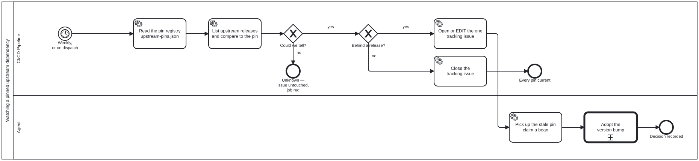

{: .note }
> Generated from `cat-harness/processes/upstream-pin-watch.bpmn` by `gen-processes-viz.ts` — do not edit here. [All processes](index.html)


# Watching a pinned upstream dependency

`Process_UpstreamPinWatch` · strict (defaulted) · 6 step(s)

THE WATCHER'S DISPATCH POINT, drawn rather than described. Bean `29ij` records the rule this follows: a watcher fires on specific events, and those events are process events — they belong in a diagram, not in prose that no tool reads. Everything up to the tracking issue is MECHANICAL and sits in a system lane: read the registry, list upstream's releases, compare, and maintain ONE issue. No step here exercises judgement, which is what makes `build-pipeline` the correct lane rather than a convenient one. Three outcomes and the middle one is the point. Current closes the issue; behind opens or edits it; COULD NOT TELL leaves the issue exactly as it is and fails the job, because a watchdog that has gone blind must not read as good news — `check-ci-health.ts`'s rule, and the reason this repository has a watchdog at all. The adoption itself is a call activity, so the judgement half lives in its own reusable process and this one stays free of it.

## How it connects

- **Called by:** no call activity names this process
- **Calls:** [Adopting an upstream version bump](upstream-version-adoption.html)

## Lanes — who acts

| lane | role | what it does here |
|---|---|---|
| CI/CD Pipeline | — | Owns exactly three outcomes and must keep them visibly different: current closes the tracking issue, behind opens or edits it, and UNKNOWN leaves the issue untouched while failing the job anyway — a watchdog that goes blind must never read as clean, so this lane is the one place that distinction cannot be collapsed into a single pass or fail. It hands off at the first sign of judgement: the moment a bump needs adopting, that is Lane_Agent's, never this one's. |
| Agent | — | Entered only once Lane_Ci has confirmed a pin is behind and filed the issue, never to make that determination itself: A_PickUp's claim is what stops two sessions adopting the same bump. The judgement of adoption is not drawn here either — Call_Adopt hands it to its own reusable process, so this lane is only the hand-off from mechanical detection to judgement, not the judgement itself. |

## Steps

Every one of the 6 step(s) is documented.

| step | lane | skill / sub-process | what it does |
|---|---|---|---|
| **Read the pin registry upstream-pins.json** `Task_ReadPins` | CI/CD Pipeline | [`upstream-version-adoption`](../reference/skill-instructions/upstream-version-adoption.html) | The registry lists the tenants and says, per row, WHICH FILE holds the pin literal and how to read it. It deliberately does not store the version: one answer to "what are we running", read from the file the build reads. |
| **List upstream releases and compare to the pin** `Task_QueryUpstream` | CI/CD Pipeline | [`upstream-version-adoption`](../reference/skill-instructions/upstream-version-adoption.html) | `git ls-remote --tags`, filtered by the row's `tagPattern` and ordered by version. Nothing is cloned and no API token is needed, so the check runs the same way on a laptop and in CI. |
| **Close the tracking issue** `Task_CloseIssue` | CI/CD Pipeline | [`upstream-version-adoption`](../reference/skill-instructions/upstream-version-adoption.html) | Closed automatically when every pin is current, so the issue's existence is the state rather than a log of past states. |
| **Open or EDIT the one tracking issue** `Task_TrackIssue` | CI/CD Pipeline | [`upstream-version-adoption`](../reference/skill-instructions/upstream-version-adoption.html) | One issue, edited in place. GitHub's own failure mail is the channel that was already ignored thirty times, so this adds none: an edit does not notify, and a pin that stays behind for two months stays one unread item rather than nine. |
| **Pick up the stale pin claim a bean** `A_PickUp` | Agent | [`upstream-version-adoption`](../reference/skill-instructions/upstream-version-adoption.html) | The hand-off from the mechanical lane to the one that can exercise judgement. Claiming the bean here is what stops two sessions adopting the same bump. |
| **Adopt the version bump** `Call_Adopt` | Agent | calls [Adopting an upstream version bump](upstream-version-adoption.html) [`upstream-version-adoption`](../reference/skill-instructions/upstream-version-adoption.html) | The reusable subprocess. Every pinned dependency enters it the same way, so a new tenant is a registry row and a call — never a second diagram saying the same thing in different words. |

## Decisions

Every one of the 2 decision(s) is documented.

| decision | what decides it | branches |
|---|---|---|
| **Could we tell?** `GW_Determined` | Asked of the `verdict` output of 'Check the pins' in .github/workflows/upstream-pins.yml, which runs `check:upstream-pins --out`. Exit 0 is every pin current, 1 at least one behind, 2 could not tell; an exit 1 with no report file is a crash and is reclassified as could-not-tell, as is any other code. `no` is verdict == 'unknown': 'Refuse to report success on an undetermined pin' runs `exit 1` and the tracking issue is left untouched. `yes` is verdict != 'unknown', the guard on ensuring the `upstream-pin` label. | **no** → Unknown — issue untouched, job red **yes** → Behind a release? |
| **Behind a release?** `GW_Stale` | Asked of the same `verdict`. `no` is verdict == 'current': the tracking issue is closed because every pin is current. `yes` is verdict == 'behind': the one tracking issue is opened or edited in place. | **no** → Close the tracking issue **yes** → Open or EDIT the one tracking issue |


