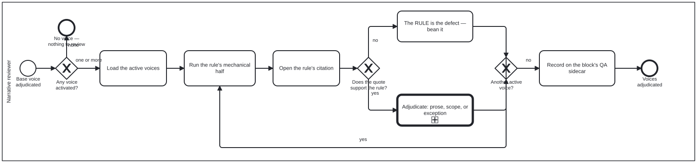

{: .note }
> Generated from `cat-harness/processes/voice-review.bpmn` by `gen-processes-viz.ts` — do not edit here. [All processes](index.html)


# Voice overlay review

`Process_VoiceReview` · strict (defaulted) · 6 step(s)

The voice axis: load whichever editorial voices are active, run each rule's mechanical half, and decide — for each finding — whether the prose is wrong, the rule does not apply to this content, or this block is a stated exception. You are in this process after the base voice has been adjudicated, and only if a voice is active at all: the first gateway ends the process honestly when none is, rather than reporting a clean review of nothing. Three outcomes, all legitimate, and the third is the one that needs recording: an exception without a reviewer entry is indistinguishable from a rule nobody ran. There is also a fourth path the diagram draws deliberately — if the rule's own citation does not support it, the RULE is the defect, and that becomes a bean rather than a finding against the prose.

## How it connects

- **Called by:** [Narrative review](review-narrative.html)
- **Calls:** [Adjudication](adjudication.html)

## Lanes — who acts

| lane | role | what it does here |
|---|---|---|
| Narrative reviewer | — | Runs every active voice to completion rather than stopping at the first, because rules from separate voices are UNIONED rather than merged — two voices can both flag capitalisation and both findings must stand, so folding voice N+1's pass into voice N's would lose which voice raised what. At each citation, this lane also has to route the defect to the right place: a rule its own citation does not support goes to Task_RuleIsWrong as a finding against the VOICE, never into Task_Adjudicate, which only ever judges the block. |

## Steps

Every one of the 6 step(s) is documented.

| step | lane | skill / sub-process | what it does |
|---|---|---|---|
| **Load the active voices** `Task_LoadActive` | Narrative reviewer | [`voice-overlay-review`](../reference/skill-instructions/voice-overlay-review.html) | The activated set only, never everything shipped. An id naming no shipped voice is an error rather than a skip — a folio that believes it is applying a voice and is applying nothing has the cleanest-looking output of the three. |
| **Run the rule's mechanical half** `Task_MechanicalHalf` | Narrative reviewer | [`voice-overlay-review`](../reference/skill-instructions/voice-overlay-review.html) | Whatever `patterns` and `terminology` the rule carries. A `judgementOnly` rule has no mechanical half by declaration, which is different from nobody having written one yet. |
| **Open the rule's citation** `Task_OpenCitation` | Narrative reviewer | [`voice-overlay-review`](../reference/skill-instructions/voice-overlay-review.html) | Every rule resolves to a real `library/` section or a KG node, and carries the quote it was read from. Opening it is what lets a reviewer say WHY the rule applies — and it is the only way to catch a rule that misread its own source. |
| **The RULE is the defect — bean it** `Task_RuleIsWrong` | Narrative reviewer | [`voice-overlay-review`](../reference/skill-instructions/voice-overlay-review.html) | A rule its own quote does not support is a finding against the voice, not against the block. Measured precedent: `voice-editorializing` flags "clearly", and the exemplar the Milnor gate is named after uses it fourteen times as proof economy (bean `2t41`). |
| **Adjudicate: prose, scope, or exception** `Task_Adjudicate` | Narrative reviewer | calls [Adjudication](adjudication.html) [`voice-overlay-review`](../reference/skill-instructions/voice-overlay-review.html) [`adjudication`](../reference/skill-instructions/adjudication.html) | The same three outcomes as the base voice axis. The register is wrong for this block (fix the prose); the rule does not apply to this content (scope it on the voice, one edit rather than ten overrules); or the rule applies and this block is an exception (a reviewer entry saying why). |
| **Record on the block's QA sidecar** `Task_RecordOnSidecar` | Narrative reviewer | [`voice-overlay-review`](../reference/skill-instructions/voice-overlay-review.html) | Through `qa-merge-findings`, so the icon and the published witness agree with the decision. The adjudication LEADS the criterion and the script entry is kept beneath it: a disagreement between a checker and a reviewer is information. |

## Decisions

**3** of 3 decision(s) carry no documentation — `gateway-documented` lists them.

| decision | what decides it | branches |
|---|---|---|
| **Any voice activated?** `GW_AnyActive` | — | **none** → No voice — nothing to review **one or more** → Load the active voices |
| **Does the quote support the rule?** `GW_QuoteSupports` | — | **no** → The RULE is the defect — bean it **yes** → Adjudicate: prose, scope, or exception |
| **Another active voice?** `GW_MoreVoices` | — | **yes** → Run the rule's mechanical half **no** → Record on the block's QA sidecar |


