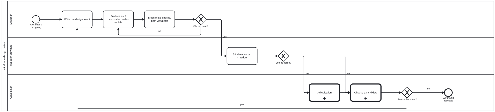

{: .note }
> Generated from `cat-harness/processes/wireframe-design-review.bpmn` by `gen-processes-viz.ts` — do not edit here. [All processes](index.html)


# Wireframe design review

`Process_WireframeDesignReview` · strict (defaulted) · 6 step(s)

WireGen (methodologies/wiregen) made executable: a written design intent, at least two mid-fidelity candidates each with a web AND a mobile layout, mechanical checks, a blind per-criterion review, adjudication where reviewers disagree, and a recorded choice. A wireframe is part of the design process for adjudication (owner, 2026-09-23). Operating skill: wireframe-design-review. Issue #1023.

## How it connects

- **Called by:** no call activity names this process
- **Calls:** [Criterion adjudication](criterion-adjudication.html), [Options analysis](options-analysis.html)
- **Skill:** [`wireframe-design-review`](../reference/skill-instructions/wireframe-design-review.html)

## Lanes — who acts

| lane | role | what it does here |
|---|---|---|
| Designer | `authoring-agent` | Writes the intent, produces candidates with real content, and runs the mechanical checks. Does not review its own candidates. |
| Feedback providers | `feedback-provider` | One or more reviewers (agent and human) who see candidates shuffled, without their author, and record pass, warn or fail per criterion with a reason. There are no scores and no averages. |
| Adjudicator | `adjudicator` | Reached only when entries for one criterion disagree. Settles the disagreement with a reason, and decides between surviving candidates through options analysis. |

## Steps

Every one of the 6 step(s) is documented.

| step | lane | skill / sub-process | what it does |
|---|---|---|---|
| **Write the design intent** `D_Intent` | Designer | [`wireframe-design-review`](../reference/skill-instructions/wireframe-design-review.html) | A short statement of who the screen is for, what they need to do, and what it must show. It is the criterion every candidate is judged against. |
| **Produce >= 2 candidates, web + mobile** `D_Candidates` | Designer | [`wireframe-design-review`](../reference/skill-instructions/wireframe-design-review.html) | Mid-fidelity HTML: monochrome, real folio content, semantic icons, no placeholder text. Each candidate has both a web layout and a mobile layout. |
| **Mechanical checks, both viewports** `D_Check` | Designer | [`wireframe-design-review`](../reference/skill-instructions/wireframe-design-review.html) | Tool wireframe-check renders every candidate at a web and a mobile viewport. It fails on horizontal overflow at mobile width, on placeholder text, and on a missing viewport, and writes screenshots and a script entry per criterion. |
| **Blind review per criterion** `R_Review` | Feedback providers | [`wireframe-design-review`](../reference/skill-instructions/wireframe-design-review.html) | Criteria: intent-fit, web usability, mobile usability, accessibility, and alternatives considered. A review at one viewport only is incomplete. |
| **Adjudication** `Call_Adjudicate` | Adjudicator | calls [Criterion adjudication](criterion-adjudication.html) | folio-assistant's adjudication: the adjudication leads, the checker's entry is kept, and the dispensation carries its reason. Reviewers disagreeing on ONE criterion is a criterion disagreement, so this calls the QA-criterion specialisation (bean `bvuk`, owner 2026-09-23): the failing entry stands, the criterion does not apply to this screen, or a dispensation is granted with its reason. |
| **Choose a candidate** `Call_Choose` | Adjudicator | calls [Options analysis](options-analysis.html) | A one-off choice between surviving candidates. Rejected candidates are kept, with the reason each lost. |

## Decisions

Every one of the 3 decision(s) is documented.

| decision | what decides it | branches |
|---|---|---|
| **Checks pass?** `GW_Checks` | Answered by the mechanical checks at both viewports. `yes` goes to blind review; `no` returns to producing candidates. | **yes** → Blind review per criterion **no** → Produce >= 2 candidates, web + mobile |
| **Entries agree?** `GW_Agree` | Do the blind reviewers' entries agree? `no` goes to adjudication; `yes` goes to choosing a candidate. | **no** → Adjudication **yes** → Choose a candidate |
| **Revise the intent?** `GW_Iterate` | Asked after a candidate is chosen: should the design intent be revised? `yes` rewrites the intent and starts again; `no` accepts the wireframe. | **yes** → Write the design intent **no** → Wireframe accepted |


