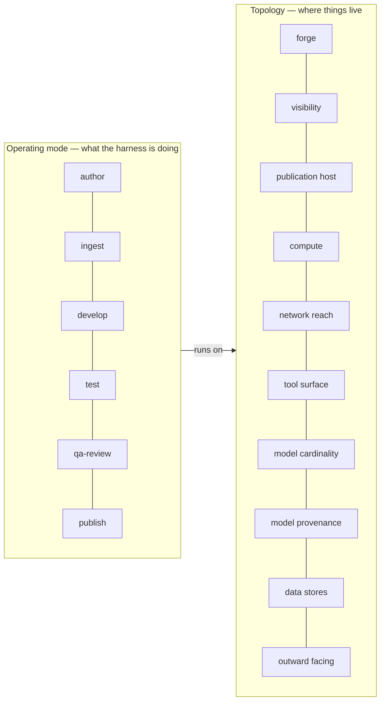

# Deployment topologies and operating modes

> **Editorial correction, 2026-09-23.** This proposal was written while the
> instance declaration was a fixed `harness.json`; it is `<name>.json` since
> the 2026-09-21 split (`<name>.config.json` is the config beside it). The
> references below were updated so a reader is not sent to a file that does not
> exist — the proposal's argument is untouched, and only the filename moved.
> The occurrences were invisible while this lived under `fsh-guts/`, which the
> filename gate counts as retired material; publishing it is what surfaced them.

{: .no_toc }

Asked on [#363](https://github.com/litlfred/folio-assistant/issues/363),
"self-sovereign compute + test harness deployments", which lists roughly ten
deployment and utilization scenarios and asks for a strawperson of each.

> ## ✅ Decided 2026-09-19 — the axes are the model
>
> The owner accepted the two-axis model: a **topology** (where things live) and
> an **operating mode** (what the harness is doing), with the named scenarios
> as points in their product rather than an enum of modes.
>
> **The thirteen work items under epic `folio-assistant-5a3l` are unblocked by
> that decision** and may now be implemented against this vocabulary. Nothing
> here is implemented yet; the axes are agreed, the code is not written.
>
> Also settled in the same breath: `private repo` × `github-pages` is **a
> possible deployment scenario**, not an incompatibility — see §3.
>
> What remains genuinely open is narrower, and it is §4's last paragraph:
> whether **sovereign cloud and self-sovereign are two topologies or one**.
> They differ on a single axis. Threads:
> [#369](https://github.com/litlfred/folio-assistant/issues/369),
> [#370](https://github.com/litlfred/folio-assistant/issues/370),
> [#371](https://github.com/litlfred/folio-assistant/issues/371).

The document is kept in the form it was argued in, rather than rewritten as a
settled specification. §6 still lists what would change its mind, because an
accepted model that cannot say what would falsify it is worth less than one
that can — and two of those four tests have already fired once.

1. TOC
{:toc}

---

## 0. The claim, and the sentence that forces it

#363 names the scenarios — local git only, private GitHub, sovereign cloud,
self-sovereign, developer, test/swarm, benchmarking, QA review — and then adds
this:

> may also oprate in mixed modalities, self sovergn cloud except models could be
> closed not openweight etc, or self-sovering connects to their national portal
> or PCP emr

**A fixed list of named modes cannot express a mix.** Each example given is a
named profile with exactly one thing moved. Model them as an enum and every mix
needs a new entry, combinatorially, forever.

So this proposal models two orthogonal things and derives the named scenarios
from their product:

- a **topology** — WHERE the instance and its artefacts live;
- an **operating mode** — WHAT the harness is doing.

A mode runs *on* a topology. "Self-sovereign cloud with closed models" is not an
eleventh mode; it is one topology with one axis set differently.

The same mode runs on many topologies, and the same topology hosts many modes
over its life. That is the whole reason to separate them.

---

## 1. The topology axes

Ten axes. Each is a property of the **deployment**, not of the content, and each
is declared rather than inferred.

| # | axis | values | what it decides |
|---|---|---|---|
| 1 | **forge** | `none` (local git only) · `github` · `self-hosted` (GitLab, Gitea, …) · `jurisdiction-hosted` | where change proposals live |
| 2 | **visibility** | `public` · `private` · `internal` | who can reach the repository |
| 3 | **publication host** | `github-pages` · `local-server` · `jurisdiction-endpoint` · `none` | where a rendering is served from. **The first axis actually declared** — `publication.host` in `<name>.json` |
| 4 | **compute** | `workstation` · `vendor-cloud` · `jurisdiction-cloud` · `own-infrastructure` | whose hardware runs the harness |
| 5 | **network reach** | `internet` · `egress-restricted` · `air-gapped` | what the harness may call out to |
| 6 | **tool surface** | `mcp` · `cli` · `both` | how a capability is invoked |
| 7 | **model cardinality** | `single` · `stack` | one model for every workflow, or several |
| 8 | **model provenance** | `open-weight-local` · `hosted` · `mixed` | where inference happens and under whose terms |
| 9 | **data stores** | *a set*: `none` · `hapi-fhir` · `national-portal` · `emr` · `wallet` | what live systems exist in the L4–L5 context |
| 10 | **outward facing** | `yes` · `no` | whether the deployment serves people outside the operator |

Three of these deserve a note, because they are the ones most likely to be
argued with.

**Axis 6, tool surface, was not in my first draft.** It was found by the
falsification check in §4: #363's developer mode says "run CLI version of tools",
and that is not a fact about *where* anything lives — it survives every value of
every other axis. Every capability here nominally exists twice, as an MCP tool
and as a `bun run` script, but the parity between the two is **unmeasured**. If
a capability is MCP-only, a `cli` deployment silently cannot do it. That is bean
`folio-assistant-2ngl`, and it is measurement work before it is design work.

**Axes 7 and 8 are split deliberately.** "How many models" and "whose models"
vary independently: a stack of open-weight local models and a single closed
hosted one are both real configurations. Collapsing them into one
"model supply" axis was the first draft's error and it is what made the
air-gapped contradiction in §3 invisible.

**Owner, 2026-09-24 (beans `4y2i`, `61tg`): a data store is something the
harness sits BESIDE, never something it connects to** — in sovereign cloud
it produces artefacts a deployment pulls ("artefacts only"). The one
exception under discussion is custody of wallet credentials in
self-sovereign mode: see [wallet custody](wallet-custody.md).

**Axis 9 is a set, not a single value.** A sovereign deployment may hold a HAPI
FHIR store *and* reach a national portal. Every other axis takes one value.

### What is derived, and must not become an axis

Some facts follow from the axes and must be computed, never declared
separately — a second declaration is a second thing to disagree with.

| derived fact | from | why it matters |
|---|---|---|
| can `Content-Type` be enforced? | axis 3 | `github-pages` **cannot** serve `application/ld+json`; `local-server` can. Settled in [`serving-renderings`](../reference/skill-instructions/serving-renderings.html) |
| where did this render, and what URL do I tell the author? | axis 3 | bean `folio-assistant-1lfx` — today this is composed on the assumption of Pages |
| may a capability probe install a missing tool? | axis 5 | `--check-deps` assumes it may. On `air-gapped` it may not |
| is a pull request the term of art? | axis 1 | GitHub says pull request, GitLab says merge request. Bean `folio-assistant-4dbr` |

### Axis 3 is declared — `publication.host`

The first of these axes to exist in code rather than only in this table.
`publication.host` in `<name>.json`, values exactly the four above, and
`publicationHost()` in `schemas/cat-harness.ts` reads it. Bean
`folio-assistant-1lfx`.

**Absent is a third state and callers must keep it one.** It means the
deployment has not said, NOT `github-pages`. Defaulting would put the very
defect this closes one layer lower, where nobody looks: an agent telling an
author "your page is at …" on a deployment that publishes nowhere near there.

**It is deliberately NOT the same field as `readme.linkStyle`**, which lives
in `harness.config.json` and answers how a link to a published artefact is
*written* (`blob` | `pages` | `raw`). Three adjacent questions, kept apart:

| field | question |
|---|---|
| `canonicalUrl` | what base are `@id`s minted against? |
| `publication.host` | what kind of thing serves the rendering? |
| `readme.linkStyle` | how is a link to a published artefact written? |

Two fields in two files can disagree, and that is the cost of separating
them. `publicationLinkStyleConflict()` is the check that pays it, with
**exactly one rule**, an entailment: `linkStyle: "pages"` writes links
against a Pages site, so any other declared host makes them dead.

**`raw` is deliberately unruled.** It resolves through
`raw.githubusercontent.com` and so depends on the forge and on repository
**visibility** — and measured 2026-09-19, the schema declares neither. A rule
needing a fact the harness does not have is a guess wearing a gate's
authority. There is a test recording that gap, so it is checked rather than
remembered.

---

## 2. The operating modes

Six. A mode is a *thing the harness is doing*, and more than one may be live at
once in different sessions against the same repository.

| mode | what it does | already has a process? |
|---|---|---|
| **author** | produce and edit folio content | yes — `authoring-a-paper`, `authoring-a-document`, `l2-dak-authoring` |
| **ingest** | receive external content into `uploads/` → `library/` | yes — the five `ingest-*.bpmn` |
| **develop** | change the platform itself | **no** — §5 |
| **test** | run a scenario bank; benchmark across models | **no** |
| **qa-review** | produce audited verdicts about the folio | partly — the QA sweep, `editing-hci-validation` |
| **publish** | render and serve | yes — `draft-to-publication` |

**`ingest` is a mode and not a topology property**, though #363 raises it as one
("have incoming DAK content" under self-sovereign). Receiving content is
something the harness *does*; that a given deployment does it often is a fact
about how it is used, not about where it lives. The reason to be careful here:
the ingestion pipeline's capability probes assume tools can be installed on
demand, which is an *axis 5* constraint — so the interaction is real, but it is
an interaction between a mode and an axis, which is exactly what this model is
shaped to express.

### The `test` mode carries an axis of its own

#363: "shared or indepedent work queues." This is not a topology axis — it is a
property of a **run**:

- **shared** — any model may take any item. Maximises throughput. The models end
  up having worked on *different items*, so their outputs are not comparable.
- **independent** — every model gets the same bank. Necessary for benchmarking,
  and wasteful for anything else.

These are not a setting to tune, they are different activities, and conflating
them produces a benchmark that means nothing. Bean `folio-assistant-amom`.

### Where a mode's output goes — provenance, not file family

The rule is already the repository's, recorded in `<name>.json`'s declaration
of the `qa` graph: **placement follows provenance.** This proposal adds one
consequence and does not change the rule.

| mode | output | goes in the KG? |
|---|---|---|
| qa-review | a verdict about a block, a translation, a recommendation | **yes** — it is an assertion about the folio |
| test | a benchmark number for a model under a configuration | **no** — it is an assertion about a *model* |

That second row is a deliberate exception to "everything is a graph node", so it
needs its reason written down or the next agent will helpfully declare a graph
for it. The reason: admitting benchmark numbers would make the graph's contents
depend on which model happened to run it, and two instances of the same folio
would then hold different graphs. Beans `folio-assistant-wp49` (the report) and
`folio-assistant-6qk5` (the verdicts).

---

## 3. Incompatibilities — a free product admits combinations that must not exist

This is the part that makes the model checkable rather than merely expressive.
An axis product of ten axes is large and most of it is nonsense. The following
pairs **cannot co-occur**, and a declaration naming one should be refused rather
than quietly accepted.

| A | B | why |
|---|---|---|
| `publication: github-pages` | `forge: none` / `self-hosted` / `jurisdiction-hosted` | Pages is a GitHub product; there is nothing to publish from |
| `network: air-gapped` | `forge: github` | the forge is unreachable |
| `network: air-gapped` | `model provenance: hosted` | **inference cannot leave the airlock.** This is #363's own mixed example — "self-sovereign … models could be closed" — and it is expressible *only* if that deployment is `egress-restricted` rather than `air-gapped`. See below |
| `network: air-gapped` | `publication: github-pages` | follows from the two above |
| `outward facing: yes` | `publication: none` | nothing is served, so nobody outside can reach it |

> **Enforced since 2026-09-19.** All five pairs are now refused rather than
> described: `topologyConflicts()` in `schemas/cat-harness.ts`, thrown from
> `readDeclaration` as `TopologyConflictError`. Four axes are declared —
> `forge`, `network`, `modelProvenance`, `outwardFacing` — joined with the
> `publication.host` that already existed. **Every axis is optional and absent
> means "has not said"**, so no existing deployment is refused; the first test
> in the suite is that this repository's own declaration still reads.
> Bean `folio-assistant-g7vb`.
>
> **`air-gapped` × `mixed` settled 2026-09-20, and not by the reason I gave.**
> Owner: *"no air-gapped-mixed. that is mixed already. its a spectrum, based
> on the deployment archicutectur of each machine actor."* At deployment
> level **`mixed` means the actors differ from each other**, so refusing it
> would refuse the normal case. The deployment value is an aggregate over
> participants that are each individually consistent — which is also why
> reach belongs on the **actor** (see
> [Actor facts and their processes](actor-facts-and-their-processes.html)),
> and why a `network` × `provenance` rule is sound only where the provenance
> value admits no local participant.
>
> Two things stayed out, both on §3's own bar — *is a counter-example
> conceivable?* Private repo × Pages, settled above. And `air-gapped` ×
> `modelProvenance: mixed`, where the entailment looks identical to the
> `hosted` row but only holds if `mixed` necessarily means a LIVE hosted
> component; a deployment could mean "local models, hosted path configured
> and disabled". **Open for the owner**, and recorded in a test so it is a
> decision rather than an omission.

**The third row is the most useful thing in this document.** #363 gives
"self-sovereign cloud except models could be closed not openweight" as a mixed
modality it must support. The axes express it — but only at
`egress-restricted`, not at `air-gapped`. Those two were one value in the first
draft of this proposal, and the contradiction was invisible until they were
split. A deployment that wants closed hosted models is, by that choice, not
air-gapped, and whoever operates it should be told so by a check rather than
discover it in procurement.

### Settled: private repo with Pages is a scenario, not an incompatibility

`visibility: private` × `publication: github-pages` is **a possible deployment
scenario**. Owner, 2026-09-19. It stays out of the table above.

#363's "github on private repo so gh-pages not avaialbe" is the operative fact
for the deployment that prompted the issue — a *reason to reach for the local
server*, not a property of the mechanism. Pages on a private repository exists
on some plans, so a deployment may legitimately declare both, and the harness
has nothing to say about it.

### The principle that decides it — do not encode a rule against a working setup

Stated by the owner, 2026-09-19, and it governs every row of the table above:

> **"dont encode rules against a working setup."**

A constraint is a **refusal**, and the two ways it can be wrong are not
symmetric. A *missing* constraint lets a bad topology through, and it fails
visibly at the point of use with the real error. A *wrong* constraint refuses a
good topology at the gate, with a confident message asserting the thing is
impossible — and nobody investigates a settled question. The same asymmetry is
why `serving-renderings` reports "could not enforce" as its own state, and why
`ci-health` never renders "could not check" as green.

So the bar for a row in §3 is **evidence, not confidence**:

| encode it | do not encode it |
|---|---|
| an **entailment of the mechanism** — Pages has no per-file media-type configuration; air-gapped compute cannot reach hosted inference | **someone said so**, however authoritative |
| **measured here**, with the command and the date | true of **one account, one plan, one version** |

Every one of the five pairs in §3 is an entailment. The private-repo row is a
report, which is why it is prose and not a row. The test is never how certain
the claim feels — it is whether a counter-example is conceivable.

Recorded for future sessions as the memory node
`do-not-encode-a-rule-against-a-working-setup`.

---

## 4. The named scenarios as points in the product

The falsification test for §0's claim: take every scenario #363 names and
express it. **Every one is expressible.** Nothing was left over, and the
exercise found axis 6 and the `ingest` mode, both of which were missing from the
first draft.

Axes in column order: forge · visibility · publication · compute · network ·
tool surface · cardinality · provenance · stores · outward.

| profile | axis values |
|---|---|
| **current state** (this repo, today) | `github` · `public` · `github-pages` · `vendor-cloud` · `internet` · `both` · `single` · `hosted` · `none` · `yes` |
| **local git only** | `none` · — · `local-server` · `workstation` · any · `cli` · `single` · any · `none` · `no` |
| **private repo** | `github` · `private` · `local-server` · any · `internet` · `both` · `single` · `hosted` · `none` · `no` |
| **developer** | any · any · `local-server` · `workstation` · `internet` · `cli` · `single` · any · `none` · `no` |
| **sovereign cloud** | `jurisdiction-hosted` · `internal` · `jurisdiction-endpoint` · `jurisdiction-cloud` · `egress-restricted` · `both` · any · any · `{hapi-fhir, portal, wallet}` · **`yes`** |
| **self-sovereign** | `self-hosted` or `none` · `internal` · `local-server` · `own-infrastructure` · `egress-restricted` or `air-gapped` · `both` · any · `open-weight-local` · `{hapi-fhir, wallet}` · **`no`** |
| **self-sovereign + closed models** | as above, but `provenance: hosted` and therefore `network: egress-restricted` — see §3 |
| **self-sovereign + national portal / EMR** | as self-sovereign, `stores: {hapi-fhir, wallet, national-portal, emr}`. Still `outward: no` — it *consumes* those systems, it does not serve them |
| **test / swarm** | a *mode* on any topology, with `cardinality: stack` |
| **benchmarking** | a *mode* on any topology; queue discipline `independent` |
| **qa review** | a *mode* on any topology |

**Sovereign cloud and self-sovereign differ on exactly one axis**: `outward
facing`. Everything else about them is a range that overlaps. If that line does
not survive review, the honest conclusion is that they are *one* topology with
an outward-facing axis, and two named profiles is one too many.

---

## 5. The SDLC, and what is actually missing

#363: "need better documentation on deve, testing and deployment lifecycle to
fit in with the software development lifecycle (SDLC - it needs to be formal
formal, subprocess includes developing MVP etc, align/cleanup exisrting
documentation)."

**Measured 2026-09-19.** `processes/` holds 33 BPMN files (this said
31 when first written; two landed the same day, which is why
[the audit](sdlc-process-audit.html) re-measures rather than quotes). The
content-agnostic, `strict` ones — `content-lifecycle`, `draft-to-publication`,
`editing-hci-validation` — plus seven `crdm-*` cover requirements and content.
There is **no BPMN for the software development lifecycle itself**: for how a
change to the *platform* travels from a need to a released capability.
`beans list -S SDLC` returns empty.

So the gap is not that the documentation is scattered. It is that the SDLC is
the one process here described only in prose — `AGENTS.md` §"Commit early,
commit often, always PR", [`prepare-merge`](../reference/skill-instructions/prepare-merge.html),
`docs/contributing.md` — while this project's own rule is that anything with
actors, activities and a control flow is authored as BPMN, not as prose and not
as a Mermaid fence.

**"Formal formal" has to mean executable, not longer.** A process here is formal
when its lanes bind to declared roles, every activity carries
`<bootstrap.processes:skill ref>`, bean operations are declared with `<cat-harness.processes:bean op>`, and
`bun run kg:audit` is green on its joins. `crdm-requirements.bpmn` already meets
that bar and is the model to copy.

Two cautions for whoever takes bean `folio-assistant-haya`:

- **MVP may already be a subprocess.** `crdm-deliver.bpmn` contains "share MVP"
  and loops back into implementation. Check before drawing a second one.
- **Do not draw over the existing 33.** The first deliverable is an audit
  saying which diagram owns which phase — *including the phases nothing owns*.
  **Done:** [SDLC process audit](sdlc-process-audit.html). It confirms the MVP
  caution above (the subprocess exists, in `crdm-deliver.bpmn`), finds five
  phases unowned and one half-owned, and finds that the missing artefact has
  an exact template in `content-change-review.bpmn`.

**Where this proposal touches the SDLC**: it adds a deployment phase whose
activities differ per topology. That is why the SDLC bean depends on the axes
being agreed — a lane whose steps change with the deployment target cannot be
drawn before the targets are named.

---

## 6. What would change my mind

Per the standard this project sets for a proposal: if it cannot say what
evidence would move it, it is an opinion wearing a heading.

1. **A scenario that is not a point in the product.** If the BA names a
   deployment needing a value no axis ranges over, the axes are incomplete.
   Two were already found this way and added.
2. **Two axes that do not vary independently.** If fixing one always fixes
   another, they are one axis wearing two names — which is what axes 7 and 8
   were, until splitting them exposed the air-gapped contradiction.
3. **An incompatibility table that grows without bound.** A handful of stated
   incompatibilities is a feature. Dozens would mean the axes carve the space
   badly and a smaller set of richer values would serve better.
4. **Sovereign cloud and self-sovereign collapsing.** If review finds the
   outward-facing line does not hold, they are one topology, and this document
   should say so rather than keep two names for one thing.

---

## Related work

| item | what it holds |
|---|---|
| [#363](https://github.com/litlfred/folio-assistant/issues/363) | the request |
| `folio-assistant-5a3l` | the epic, and the fourteen beans under it |
| `folio-assistant-4dbr` | forge portability as Tool nodes, not a sixth repo. Its §"Sovereign compute" already separates *which service hosts change proposals* from *running with no external service at all*, and records that the portability claim is asserted and never exercised |
| [`serving-renderings`](../reference/skill-instructions/serving-renderings.html) | per-host media types, and the three enforcement states. Explicitly leaves "how to run a server" uncovered — the hole bean `folio-assistant-0hi8` fills |
| [`cat-harness-minimum`](../architecture/cat-harness-minimum.html) | the written claim that the harness runs with no forge and no MCP. 614 lines, and untested |
| [`swarm-management`](../swarm-management.html) | a swarm is asked for every time, per swarm, with agent count, model level and rough cost. Unchanged by this proposal |
