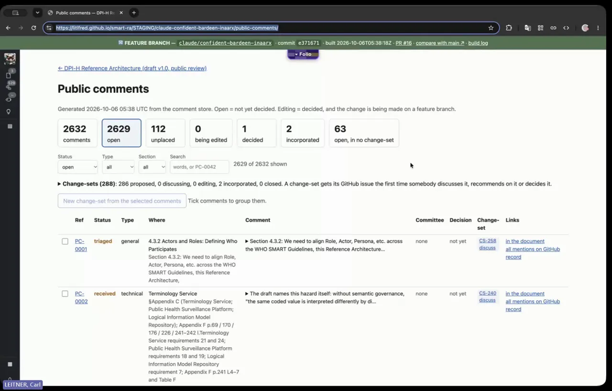
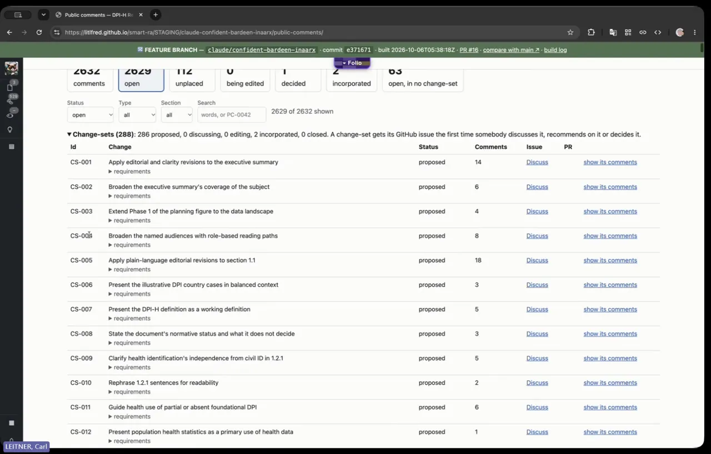
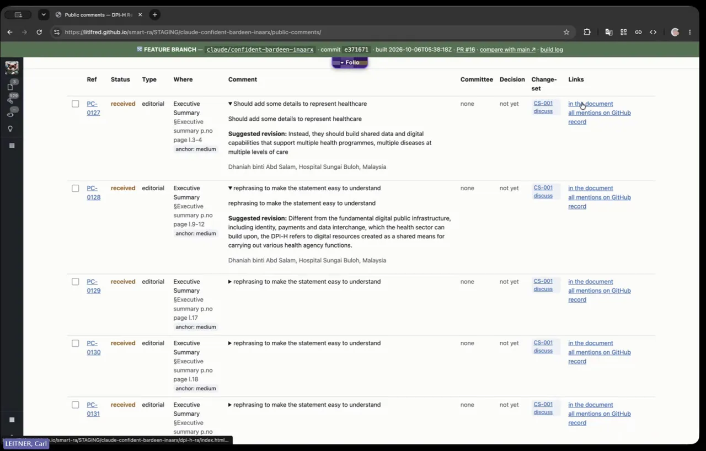
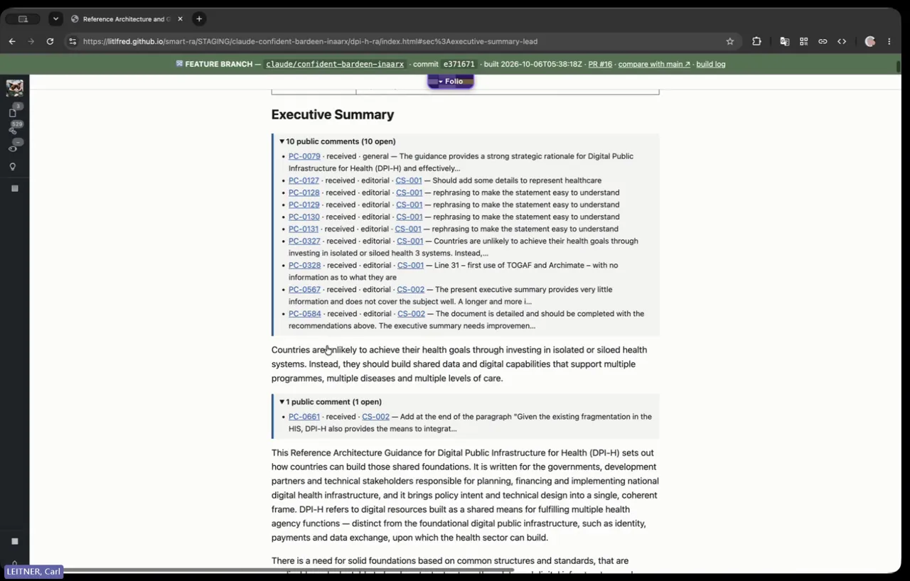
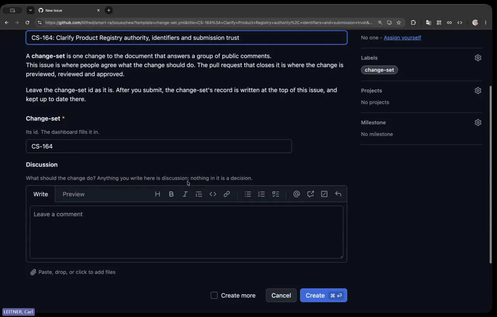
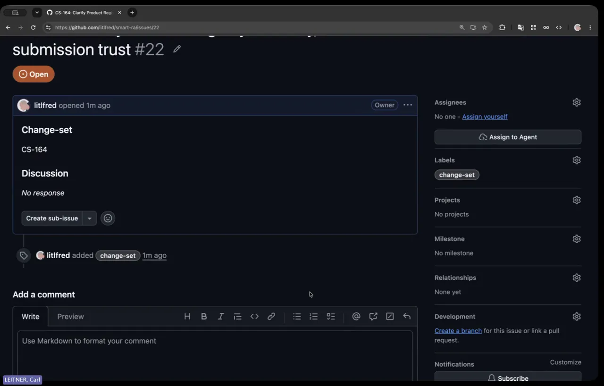
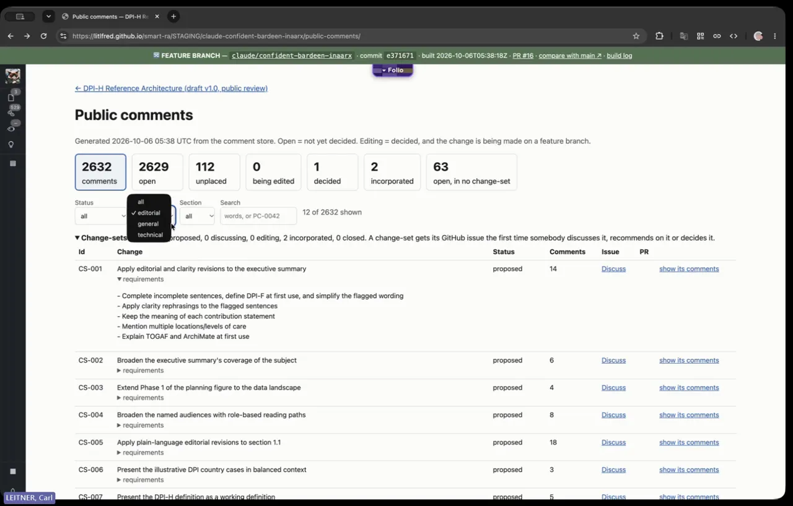
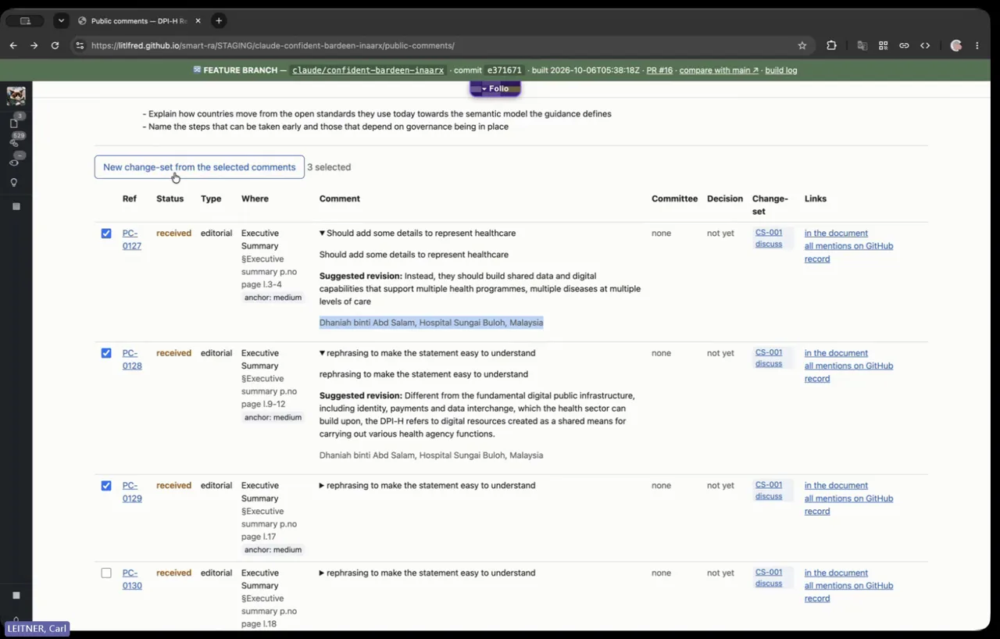
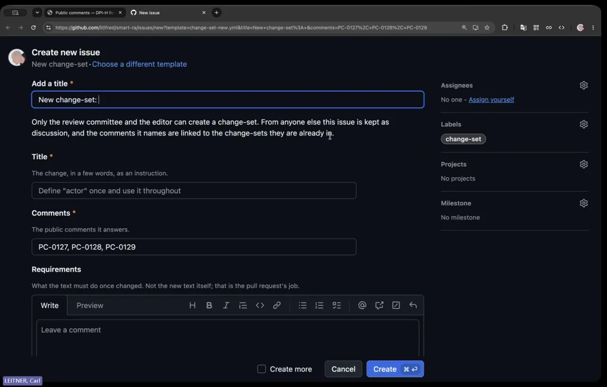

# Public comment, round 2: requirements from the chief-editor walkthrough

**Status: DRAFT, for review before approval.** Nothing here is built, and
nothing will be until each requirement below is approved, amended or rejected.
**Sign-off is the chief editor's** (Chinemerem Eyetan): the owner ruled
2026-10-06 that nothing here merges or is built without it (CRDM Phase 3, [`crdm-requirements-template`](../../skills/sdlc/crdm/crdm-requirements-template.md)).

Issue [#197](https://github.com/litlfred/folio-assistant/issues/197) ·
bean `uphx` (parent `q4jm`; round 1 was `v26p`) · first customer
`litlfred/smart-ra` (DPI-H Reference Architecture, about 2,630 comments).

## Source

A Teams call on 2026-10-06 (10:47, 17 min 8 s), *"Quick touchbase re: Ref arc
feedback and Assured AI WS1"*. Two people:

- **Carl Leitner**: business analyst running CRDM; demonstrates the
  staging dashboard.
- **Chinemerem Chika (Chinni) Eyetan**: chief editor of the reference
  architecture; states the requirements.

Uploaded as [litlfred/smart-ra@9eb6ad3](https://github.com/litlfred/smart-ra/commit/9eb6ad3de3eea24d80c6cd8742ba9030872b3e58):

| file | what it is |
|---|---|
| `uploads/Quick touchbase re_ Ref arc feedback and Assured AI WS1.docx` | Teams transcript export: speaker, `m:ss`, paragraph. 85 of its 86 images are the two speakers' avatar icons, plus one more icon; **no screen content**. |
| `uploads/Quick touchbase re_ Ref arc feedback and Assured AI WS1.vtt` | WebVTT captions: 275 cues, 00:00:05.8 to 00:17:03.7. |

The **video** followed as [litlfred/smart-ra@5a3d655](https://github.com/litlfred/smart-ra/commit/5a3d655c55d037f36671b7c6f1b4afc9deacefef)
(`uploads/output.mp4`: 17 min 9 s, 1920×1080, 16 fps, mono 16 kHz audio).
It gave an independent transcript and the [screenshots](#screenshots).

### The two transcripts are one transcript

The two were compared word by word after normalising case and punctuation:
**2,474 words (.vtt) against 2,469 (.docx), similarity 0.980.** Every
difference is one of two things, and neither changes the meaning:

1. **An interjection in a different place.** The .vtt interleaves the
   listener's "okay", "yeah", "mhm" inside the speaker's sentence at its cue
   time; the .docx moves them to the listener's next paragraph.
2. **Two words joined at a line break** in the .docx export: "andrequests",
   "canalso", "i'mconcerned", "begrouped", "hadasked".

Neither carries a statement the other lacks. Both are the **same Teams speech
recognition**, so they share its errors. Comparing them cannot catch those
errors; an independent transcription of the video can, and the video is the
arbiter wherever the two disagree with it.

### An independent transcript, from the video

The video's audio was transcribed offline with Vosk (small English model) and
compared with the Teams `.vtt`: **2,610 words against 2,474, similarity
0.802.** That is lower than the two Teams exports agree with each other, as a
smaller model should be, and most differences are Vosk's own errors. What
matters is where it **disagrees with Teams on a name or a term**:

| at | Teams | Vosk | reading used here |
|---|---|---|---|
| 0:05 | "Lightner" | "leitner" | Leitner (Vosk right) |
| 14:16 | "philtres" | "the filters" | filters (Vosk right) |
| 2:21, 8:49 | "change sets", "chain sets" | "chain such", "chain says" | change sets |
| 3:45, 14:49 | "Saroop", "Swarupu" | "through for", "so report" | unresolved: **ask** |
| 16:11 | "Nat shared" | "not shed" | unresolved: **ask** |
| 7:53 | "reviewed by the editorial team in terms of WHO" | "reviewed by the it team in terms of the beach" | Teams' reading, **to confirm** (it is REQ-02) |

On the passages that carry requirements (the categories at 5:30–6:50,
deduplication at 10:40–12:20, editor-only change sets at 12:20, the review
threshold at 14:40), Vosk says the same as Teams. No requirement below
changes. Both comparisons are reproducible with
`cat-harness/scripts/meeting-recording.py compare`.

Speech-recognition errors read through in this document:

| transcript says | meant |
|---|---|
| "Carl Lightner" | Carl Leitner |
| "Tini", "Jiun" | Chinni |
| "Saroop", "Swarupu" | a colleague's name, not confirmed: **ask** |
| "chain sets", "compliment" | change sets, comment |
| "philtres" | filters |
| "DPIF" | DPI-F |

Speaker share: Leitner 1,539 words, Eyetan 935.

## What the walkthrough showed (round 1, as demonstrated)

From 1:40 to 4:40, the BA walks through the staging dashboard (screen shared):

- about 2,600 comments, grouped into **change sets** (CS-001: 14 comments,
  with a common set of requirements such as "complete incomplete sentences,
  define DPI-F at first use, simplify the flagged wording");
- a change set's comments, expandable to the commenter, the decision so far,
  and the committee;
- links into the document to every comment on a section;
- **Discuss** on a change set (CS-164 shown): sets up a GitHub issue for a
  working-group call, for notes, attachments and comments from anyone with a
  GitHub account;
- after discussion, assigning an agent (or Copilot) to open the PR that
  implements the approved changes.

The editor (4:40): *"I think it works fine in terms of the workflow."* What
follows are the additions.

## Measured against the data already imported

The imported log in smart-ra already carries the editor's own categories,
kept verbatim as labels from her spreadsheet:

| label (column in her log) | comments | values |
|---|---|---|
| `TWG consideration? AI categorisation` | 764 | Core architects 412, Editorial 98, Metadata registries 98, Clinical 55, No 52, Financial systems 29, WHO 10, Supply chain 10 |
| `Consider by TWG? Human categorisation` | 100 | No 57, Core architects 14, Editorial 7, Clinical 6, Metadata 4, and mixed values such as "Core architects/ WHO" and "HWF team" |
| `type` (the comment matrix's own field) | 662 | technical 305, general 248, editorial 109; **1,970 comments have none** |

**Of the 100 comments she categorised by hand, her AI agreed on 48.** The
largest disagreement is 29 comments the AI sent to *Core architects* that she
marked *No*. That is exactly what she describes at 13:35: comments the AI routed
to a domain group, *"but… not things that we plan to even cover in the
reference architecture"*. (Measured 2026-10-06 over
`review/public-comment/comments/*.json` on smart-ra `main`; the label values
were compared after splitting on "/" and treating "Metadata registries" as
"Metadata".)

So REQ-01 and REQ-11 do not start from nothing: the vocabulary and a labelled
sample are already in the data.

## Requirements

Priority: **M** must-have, **S** should-have, **N** nice-to-have. *Today*
says what round 1 already does. Every *Source* is a transcript timestamp.

### A. Categorisation of change sets

**REQ-01: Two category axes on a change set: type, and committee.** (M)
A change set SHALL carry a **type** (`editorial`, `general` or `technical`)
and, when the type is `technical`, one or more **committees**: `core-architects`,
`metadata-registries`, `supply-chain`, `financial-systems`, `clinical`. Any type
MAY also be routed to `who`. The tags SHALL sit *on top of* the thematic
grouping that change sets already have; they do not replace it.
*Source:* 4:40–5:50 and 7:30–7:55. *Today:* the comment matrix's
`general`/`technical`/`editorial` is a comment field; a change set has no
type and no committee. *Accept:* every change set shows its type; every
technical one has at least one committee; the dashboard filters on both.

**REQ-02: Who reviews each type.** (M)
`editorial` SHALL route to the editorial team, `general` to the WHO editorial
team, and `technical` to the named committees.
*Source:* 7:30–7:55. At 7:53 the independent transcript hears "the it team"
where Teams hears "the editorial team in terms of WHO": **to confirm** with
the chief editor. *Accept:* the routing table is configuration in the folio
(`config.json`), not code, and the dashboard shows each change set's
reviewing group.

**REQ-03: The committee rolls up from comments to the change set.** (M)
A change set's committees SHALL be **derived** from its comments' committees,
as a union; an editor MAY override the result, and the override is recorded.
The dashboard SHALL support the query *"editorial change sets within this
committee"*.
*Source:* 7:55–8:56. *Today:* a comment carries the committee only as a
verbatim label. *Accept:* changing a comment's committee changes its change
sets' committees on the next build; a filter `type=editorial &
committee=clinical` returns exactly those.

**REQ-04: Categorisation is consistent.** (M)
The same comment text SHALL receive the same category every time it is
categorised, and every category assignment SHALL record **who or what**
assigned it (a person, or an agent with its rule version) and when.
*Source:* 4:40–5:20 (*"concerned… that there's consistency in the way it goes
through the categorization"*). *Accept:* re-running the categoriser over an
unchanged log changes no category; every category shows its assigner.

**REQ-05: A reference-architecture component axis.** (N, **deferred**)
A change set MAY be tagged by reference-architecture component (metadata
component, business-domain component, …).
*Source:* 8:56–9:35. Both speakers agreed to **start without it**, trial
REQ-01 to REQ-03 first, and decide after the trial.

### B. Ingesting new comments

**REQ-06: Incremental ingest.** (M)
New comments SHALL be ingestible into the running review without re-importing
from scratch, from either source: a **new version of a log already
ingested**, where only the delta is processed, or a **new document** (for
example comments from the mailbox that were never routed to the review's
sub-mailbox).
*Source:* 9:36–10:36 and 10:36–11:12. *Today:* a re-send of the same log
imports without duplicates (round 1, #2173); a delta report and a new-document
path are not described. *Accept:* ingesting v2 of a log reports N new, M
changed, K unchanged, and creates only the N.

**REQ-07: Duplicates detected on ingest.** (M)
Ingest SHALL detect **potential duplicates** of existing comments, both exact
re-sends and near-duplicates in wording, and SHALL NOT merge them silently:
it proposes, and a person confirms.
*Source:* 11:12 (*"Yes, I would prefer deduplication"*), 12:01. *Accept:* a
near-duplicate fixture is flagged with the comment it resembles and a score,
and stays `received` until confirmed.

**REQ-08: "Looks like a duplicate of PC-nnnn" on the comment.** (M)
A comment's view SHALL show its candidate duplicates, each linked, and offer
confirming one; confirming it uses the existing `duplicate` transition
(`duplicateOf`).
*Source:* 12:01–12:21. *Today:* the `duplicate` transition exists; nothing
proposes candidates. *Accept:* a flagged comment shows the link, and one action
marks it a duplicate.

### C. Commenters and acknowledgement

**REQ-09: Acknowledgements generated from decisions.** (S)
The commenter (name, organisation, consent to be acknowledged) SHALL stay
recorded per comment, and the system SHALL generate an acknowledgements list
from the comments whose change sets were decided.
*Source:* 11:12–11:45, 11:43–12:01. *Today:* the reviewer and their consent
are on every comment (`public.reviewer.acknowledge`); no list is generated.
*Accept:* one command or tool produces the list, and it honours consent.

### D. Building and governing change sets

**REQ-10: An editor proposes, splits or creates a change set from selected comments.** (M)
A person SHALL be able to select comments and propose a new change set from
them, or split an existing one. **Only an editor** SHALL be able to do so.
Delegating it to committees is explicitly *later*.
*Source:* 12:21–12:51. *Today:* **half built**, as the video shows
([screenshot 8](#screenshots), 12:30, and [9](#screenshots), 12:41): ticking
comments opens a prefilled "New change-set" issue whose form says *"Only the
review committee and the editor can create a change-set"*. The requirement is
narrower: **the editor only**, committees later. *Accept:* a non-editor's
proposal is refused and says why; an editor's creates a `proposed` change set
with its history.

**REQ-11: Discuss, then an agent implements.** (M, *confirm round 1*)
**Discuss** on a change set SHALL set up its issue for a working-group call
(notes, attachments, contributions from anyone with a GitHub account). After
the discussion approves the changes, an agent or Copilot MAY be assigned to
open the PR that implements them.
*Source:* 3:16–4:40. *Today:* demonstrated; listed so that approval covers
it, not because it is new.

**REQ-12: An out-of-scope outcome.** (S)
A comment, or a change set, that asks for **something the reference
architecture does not plan to cover** SHALL be decided with the existing
decision code `not-accepted` and a reason saying it is out of scope. There is
**no new state and no new code**. The committee still reviews each one before
the editor decides; out of scope is a decision, not a triage shortcut.
*Source:* 13:35–13:51; the 29 AI "Core architects" / human "No" disagreements
measured above. *Ruled by the owner, 2026-10-06:* "As the existing
'not-accepted' decision with a reason. No new state, but a committee still
reviews each one first." *Accept:* an out-of-scope decision is `not-accepted`
with a reason, and the dashboard can filter on that reason.

**REQ-17: [edit] and [feedback] on every block of the document.** (M, *owner, 2026-10-06*)
Each block of the rendered document SHALL carry two links, as the
smart-immunizations IG pages already do (`fhir-harness/scripts/build-ig-site.ts`:
"Edit this page on GitHub" and a 📣 feedback icon per heading):

- **[edit]** opens the block's source (`folio/<doc>/<chapter>/<block>.md`) in
  GitHub's editor on `main`, so a person with access proposes the change as a
  pull request;
- **[feedback]** opens a new GitHub issue prefilled with the block's label,
  section, page and line in the review version, and a link back to the
  block. Where comments on the block are already in change-sets, it SHALL
  first list those change-sets' issues, so the reader can join an existing
  discussion instead of opening a duplicate.

*Source:* the owner, 2026-10-06, on the staging document page (§2.1.2
"Business services layer", six open comments in five change-sets: *"each
block should also have an [edit] and [feedback] icons (like smart-immiz)
does back to edit source on github or create an issue to change block
contents/link to exist change set issues"*). *Today:* the document page shows
each block's public comments and their change-set ids; it has no edit or
feedback link. *Accept:* every block has both links; [edit] opens the right
file; [feedback] prefills the block and lists the block's existing
change-set issues.
*Scope, owner 2026-10-06:* common **folio-assistant-core** functionality, not
a smart-ra feature: link any block to its markdown source, and create an issue
from an optional, parameterised issue template; registered as a process step,
a skill and a tool. The owner directed it built; it merges with the rest of
this round.

### E. Quality assurance of agent work

**REQ-13: Human and agent categorisation are compared, and disagreements adjudicated.** (S)
The system SHALL compare categories from the editor (human), the editor's
own AI (her spreadsheet), and this system's agents, report agreement per
category, and list disagreements for a person to adjudicate. Options for
improvement come from the disagreements.
*Source:* 12:51–13:35 and 14:20–14:34. *Today:* the data exists (see the
measurement above); no report does.
*Accept:* a report reproduces "48 of 100" from today's data and lists the 52
disagreements.

**REQ-14: Imported columns are accounted for.** (S)
When an ingested template has columns the importer does not recognise, the
system SHALL report each one and where its values went (kept as a verbatim
label, mapped to a field, or dropped), rather than "doing something with it".
*Source:* 13:51–14:20 (the BA could not tell what the agent did with the new
columns). *Today:* unknown columns are kept verbatim as labels (round 1); the
ingest report does not say so. *Accept:* the ingest report lists every
column and its destination.

**REQ-15: A review threshold for agent work.** (S, *needs definition*)
The process SHALL define when an agent's output (categorisation, placement,
change-set grouping, proposed edit) needs human review, for example below a
confidence level or as a sampling rate, and the dashboard SHALL show what is
waiting for that review. The thresholds are to be defined **with the working
group**, not chosen by an agent.
*Source:* 14:38–15:39. *Open:* the editor and a colleague (name to confirm,
see above) are to look at it.

**REQ-16: Editorial-style checks on proposed edits.** (S)
A change set's proposed edit SHALL be checkable against the WHO publication
voice and style rules (the existing one-voice checks, built from three WHO
IRIS documents), as one of the QA checks REQ-15 selects.
*Source:* 15:39–16:39. *Open:* the editor asked whether this is the
handbook a colleague (Nat) shared earlier. The BA is to send the link.

### Process requirements (this round)

- **P-1:** Implement the approved requirements on a **staging site with a
  shareable preview link** (16:39–16:59).
- **P-2:** The editor shows the dashboard to the **core architects group on
  2026-10-07** to trial it as a workflow (9:15–9:35). REQ-01 to REQ-03 are the
  ones that trial exercises.

## The categorisation skill (TWG Coordinator's specification)

**Source:** *Requirements Specification: AI Comment Categorisation and
Ingestion Skill*, v0.1, 6 October 2026, owner **TWG Coordinator**, status
"Draft for review". Posted by the owner on #197 with *"please add to
requirements"*, and committed as
`uploads/DPI-H_comment_categorisation_skill_requirements.docx` in [litlfred/smart-ra@bcd7e92](https://github.com/litlfred/smart-ra/commit/bcd7e92ab5b841eb8cec96d259bd7597f50df3bd)
(SHA-256 `85d076d6…cd83f`, the same bytes as the issue attachment).

It is the written form of what the chief editor asked for in the
walkthrough, and more precise. Its own numbering (REQ-01 to REQ-30)
collides with this document's, so its requirements are cited here as
**CAT-01 to CAT-30**, in its order. Its MoSCoW priorities are kept. The
requirement text is the specification's; the *Here* column says what it
refines in this document and what the platform already does, **measured**
on smart-ra `main` (2,632 comments).

### What it settles

- **The committee names** (this document's open question on REQ-01/02).
  The specification fixes **eight routing categories**: Core architects,
  Metadata registries, Supply chain, Financial systems, Clinical, WHO,
  Editorial and No, each defined by what it owns. "HWF" is not a category; it
  is a **source tab** (CAT-10). Measured: all 764 master-log comments with an
  AI category already use exactly these eight values (Core architects 412,
  i.e. 54%, which matches the specification's "more than half").
- **One primary category per comment** (CAT-04), with any secondary groups
  in the rationale. This refines REQ-01: a **change-set's** committees are
  still the union of its comments' primaries (REQ-03), but a comment has
  one.
- **Consistency is the primary acceptance gate** (§2, §12): two runs on the
  same input agree on at least 95% (suggested), and a re-run never changes
  a decided or human-overridden routing. This is REQ-04 made measurable.
- **Adjudication is out of scope** for the skill (§3): it routes; the
  sub-groups and the editor decide. This agrees with REQ-12 and the
  editor-decides lifecycle.

### Where it conflicts with the platform: one decision

The specification says **the master log (the spreadsheet) is the system of
record**, and the skill writes its routing back into it without disturbing
formulas or validations (CAT-14, §10). On the platform, the spreadsheet is
an **intake**: it is imported into the comment store
(`review/public-comment/`), the store is the record, and the dashboard and
the GitHub workflow read and write the store. Both cannot be the record.
Its own open decision ("runs from the workbook, or as a callable classifier
that a pipeline writes back") is the same question. **For the chief editor
and the owner**; see [§For approval](#for-approval).

### The requirements

**5.1 Taxonomy and decision rules**

| id | pri | requirement | here |
|---|---|---|---|
| CAT-01 | Must | Use the fixed category set (§4), version-controlled; never invent or infer new categories at runtime. | Refines REQ-01. Today the categories are free-text labels copied from the log. |
| CAT-02 | Must | Each category carries a definition naming the components and section areas it owns. | New. The §4 table is that definition. |
| CAT-03 | Must | An explicit precedence order for overlaps (e.g. a terminology point inside a financing section routes to Metadata registries by rule). | New. Refines REQ-04. |
| CAT-04 | Must | Exactly one primary category per comment; secondary groups named in the rationale. | Refines REQ-01/03 (see above). |
| CAT-05 | Should | Three to five worked examples per category as anchors, including the named borderline cases. | New. |
| CAT-06 | Could | The taxonomy extends only through a versioned change with a migration note. | New. |

**5.2 Ingestion of new comments**

| id | pri | requirement | here |
|---|---|---|---|
| CAT-07 | Must | Accept the comment-matrix template, the online form export and off-template returns (Word, PDF, email) without manual reshaping, mapped to one comment schema (contributor, affiliation, country, section, page, line, comment type, comment, suggestion, channel). | Refines REQ-06. **Today:** the importer reads the matrix .xlsx, the form .csv and narrative letters into that schema (round 1). |
| CAT-08 | Must | Preserve comment text verbatim; never rewrite or summarise it. | **Today:** done (`public.text` is verbatim; the summary is a separate field). |
| CAT-09 | Must | De-duplicate on ingest with a content signature; flag, never drop, a same-contributor different-content case. | Same as REQ-07. **Today:** a re-sent file imports without duplicates (round 1, #2173); near-duplicates are not detected. |
| CAT-10 | Should | Route high-volume single-source sets to their own tab, as for the EY, CAT and HWF submissions, with a documented size threshold. | **Today:** the tabs exist and are imported per sheet (EY review 1,693, HWF review 110, CAT (WHO-FIC) 64, master log 764); no threshold is documented. |
| CAT-11 | Must | Stamp each comment with its channel and source. | **Today:** done (`public.source`: channel, batch, sheet, row, sha256). |

**5.3 Classification output**

| id | pri | requirement | here |
|---|---|---|---|
| CAT-12 | Must | Return the primary category and a one-sentence rationale naming the signal. | New. |
| CAT-13 | Must | Fixed rationale format: one sentence of about 25 words; for No or Editorial, why no domain review is needed. | New. |
| CAT-14 | Must | Write to the defined columns without disturbing existing content, formulas or validations; repair dependent formulas in the same pass. | **Conflicts** with the store as record (see above). |
| CAT-15 | Should | A confidence signal (high, medium, low), so low-confidence routings surface for review. | Feeds REQ-15. **Today:** placement already carries a confidence; categorisation does not. |

**6. Consistency and determinism**

| id | pri | requirement | here |
|---|---|---|---|
| CAT-16 | Must | Per-item alignment: each decision provably tied to its comment (e.g. an echo of the comment's opening words), checked before writing. | New. Addresses the drift failure the specification observed. |
| CAT-17 | Must | Idempotent re-runs: a classified comment is not silently reclassified unless flagged; only new and changed rows are default targets. | Refines REQ-04. |
| CAT-18 | Should | Bounded batches of a documented size, identical rules across batches, a self-check at each boundary. | New. |
| CAT-19 | Should | Low-variance generation settings; prompt and taxonomy byte-identical between runs. | New. |
| CAT-20 | Could | Record the taxonomy version against each decision. | New. Refines REQ-04's "who or what assigned it". |

**7. Quality assurance and validation**

| id | pri | requirement | here |
|---|---|---|---|
| CAT-21 | Must | Before any write: full coverage, valid categories only, and the CAT-16 alignment check. | New. |
| CAT-22 | Should | A golden set of about fifty hand-verified comments across all categories; report agreement (percent, or Cohen's kappa) each run. | Refines REQ-13. **Today:** 100 comments carry the editor's hand categorisation, a starting point for the golden set; her AI agreed with her on 48 of them. |
| CAT-23 | Should | A review threshold: low-confidence and cross-cutting comments go to a human queue. | Same as REQ-15; the specification recommends the confidence-gated queue as the default. |
| CAT-24 | Could | Track inter-run agreement over time. | New. |

**8. Governance, audit and safe operation**

| id | pri | requirement | here |
|---|---|---|---|
| CAT-25 | Must | A decision log: input signature, taxonomy version, category, rationale, confidence, timestamp. | New. Refines REQ-04. |
| CAT-26 | Must | Never overwrite a human override; a coordinator's change does not revert on the next run. | New. |
| CAT-27 | Should | Fail safe: on unreadable input or a failed validation, stop and report, never write partial or misaligned results. | New. |

**9. Non-functional**

| id | pri | requirement | here |
|---|---|---|---|
| CAT-28 | Should | A full batch of several hundred comments in one working session; an incremental batch in minutes. | New. |
| CAT-29 | Should | Portable across runs and operators: depends only on the versioned taxonomy, rules and examples, not on a session's memory. | New. On the platform this is a skill plus versioned data, not a prompt. |
| CAT-30 | Could | Degrade gracefully with volume (batches rather than failure). | New. |

**Acceptance (its §12):** coverage (one valid category and a rationale per
comment); alignment (zero rationales on the wrong comment); consistency (two
independent runs agree on at least an agreed threshold, 95% suggested);
accuracy (golden-set agreement meets an agreed threshold); non-regression (a
re-run changes no decided or overridden routing); integrity (the write-back
leaves existing content intact and the counts reconcile).

**Its open decisions (§11)**, carried into [§For approval](#for-approval):
the deployment model; the degree of human-in-the-loop (the specification
recommends the confidence-gated queue); and whether to split Core architects.

## Defects observed in the demo

Each was reproduced in headless Chromium against the published dashboard and
then fixed on this branch (`folio-assistant-core/scripts/public-comment-site.ts`,
`public-comment-changesets.ts`). The fixes were checked in the browser on a
dashboard rebuilt from smart-ra's 2,632 comments, with no page errors, and by a
test. They are **defect fixes, not requirements**, and wait for the same
sign-off before they merge.

| id | what was seen | cause | fix |
|---|---|---|---|
| D-1 (2:08) | *"2629 are open… Why some are closed?"* | The counts were right: 2,632 comments, 2,629 open, and the 3 others are 1 decided and 2 incorporated. "Closed" lumps incorporated, duplicate and withdrawn without saying so. **The real defect** was elsewhere: a merged PR marked its whole change-set `incorporated` and closed its issue while most of its comments were undecided (CS-236 and CS-237 in smart-ra, 13 of 15 comments still `received`). | A merge settles a change-set only when every comment in it is settled; otherwise it stays open, its issue stays open, and the log says how many are undecided (test added). The dashboard says what "closed" means. |
| D-2 (7:21) | The type dropdown *"seemed to be working before, but doesn't work now"* | "Show its comments" set a hidden filter that only the Status box cleared, so every later Type or Section choice was applied inside one change-set (often 0 shown). It arrived with "show its comments" on 2026-10-05, which fits "worked before". | Any Status, Type, Section or tile choice replaces it; "show its comments" clears the other filters, so it always shows all of them. |
| D-2b (owner, 2026-10-06) | *"changing filters does not seem to change displayed contents"* | The filters moved only the comment table, about 17,000 px below an open change-set table that never changed. | The change-set table follows the same filters: a change-set shows when any of its comments match, its count reads "10 of 18", and the summary says "Showing 4 of 284". |
| D-3 (8:42) | *"the back things don't work"* | No filter change made a history entry, so Back left the dashboard. | Every filter change is a history entry with the filters in the query string; Back restores the previous view, and a link to a filtered view can be shared. |
| D-4 (13:51) | The agent's handling of the template's new columns could not be explained. | Not a broken control. | Covered by REQ-14. |

## Screenshots

Cut from the video at the moments the speakers point at the screen, cropped to
the shared screen (no camera tiles), with
`meeting-recording.py frames`. Where they were cut, and why, is in the skill
[`crdm-recorded-walkthrough`](../reference/skill-instructions/crdm-recorded-walkthrough.html).

1. **1:52, the dashboard** (D-1): 2,632 comments, 2,629 open.
   
2. **2:26, change-sets**: CS-001's 14 comments and its requirements.
   
3. **3:12, a change-set's comments**: commenter, decision and committee.
   
4. **3:24, the document**: every comment on the executive summary, beside it.
   
5. **3:59, Discuss on CS-164**: the issue form it opens.
   
6. **4:26, the CS-164 issue** (#22), where an agent can be assigned (REQ-11).
   
7. **7:22, the Type filter** (D-2, D-2b): "12 of 2632 shown", and the
   change-set table above it unchanged.
   
8. **12:30, three comments ticked**, and "New change-set from the selected
   comments" (REQ-10).
   
9. **12:41, the "New change-set" issue form**, prefilled with PC-0127 to
   PC-0129; it allows the committee and the editor (REQ-10 asks for the
   editor only).
   

## For approval

Each requirement is approved, amended or rejected on its own, and **the
chief editor signs off** before anything is merged or built (owner,
2026-10-06).

Ruled:

- **REQ-12** (owner, 2026-10-06): out of scope is the existing `not-accepted`
  decision with a reason, reviewed by a committee first. No new state.

Settled by the TWG Coordinator's specification:

- **The committee names**: eight routing categories, fixed and versioned
  (Core architects, Metadata registries, Supply chain, Financial systems,
  Clinical, WHO, Editorial, No). "HWF" is a source tab, not a category.

Still open, for the chief editor and the owner:

1. **Where the routing is recorded.** The specification makes the master
   log (spreadsheet) the system of record, written back by the skill
   (CAT-14). The platform imports the log into the comment store, and the
   store is the record that the dashboard and the GitHub workflow use. The
   recommendation is **the store is the record, and the spreadsheet is
   regenerated from it** for those who work in Excel, so there is one record
   and the workbook still exists. The alternative writes into the workbook
   and re-imports it, which keeps two copies that can disagree.
2. **Human in the loop**: the confidence-gated review queue (CAT-23, REQ-15)
   as the default, as the specification recommends?
3. **Split Core architects** (54% of routed comments) into, for example, AI
   and Governance sub-categories, or not yet?
4. **REQ-02 wording** (7:53): who reviews `general` comments, which the
   independent transcript heard as "the it team".
