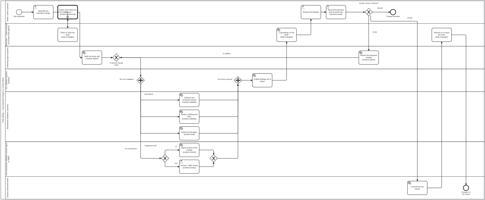
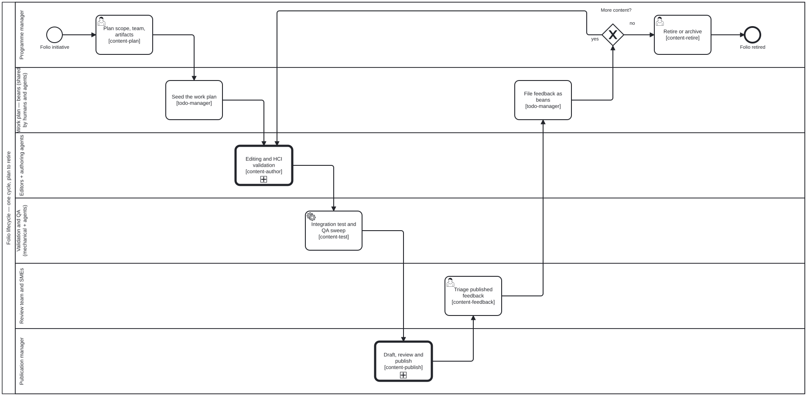

<!-- Generated by scripts/gen-docs-pages.ts from content/docs/publication-workflow/. Do not hand-edit: the next run overwrites it, and `docs:pages:check` fails on the difference. -->

# Publication workflow
{: .no_toc }

<span class="fa-qa-badges fa-page-qa-badges"><span class="fa-qa-badge fa-qa-unswept fa-qa-fam-translation" title="Translation QA: not swept — no block on this page carries a translation verdict" aria-label="Translation QA: not swept — no block on this page carries a translation verdict"><span class="fa-qa-tag">TR</span></span></span>

<details open markdown="block">
  <summary>On this page</summary>
  {: .text-delta }
1. TOC
{:toc}
</details>

_This page is generated from [`content/docs/publication-workflow/`](https://github.com/litlfred/folio-assistant/tree/main/content/docs/publication-workflow) — each section below links to its own source._

[✎ Edit](https://github.com/litlfred/folio-assistant/edit/main/content/docs/publication-workflow/overview.md){: .fa-node-edit title="Edit content/docs/publication-workflow/overview.md" } <span class="fa-qa-badges"><button type="button" class="fa-qa-badge fa-qa-pending fa-qa-fam-block" data-qa-family="block" data-qa-key="overview.block" data-qa-label="Content QA" data-qa-noun="block" data-qa-src="{{ '/assets/qa/publication-workflow/overview.block.json' | relative_url }}" data-qa-index="{{ '/assets/qa/publication-workflow/qa-index.json' | relative_url }}" aria-expanded="false" aria-busy="true" title="Content QA: loading the verdict…" aria-label="Content QA: loading the verdict…"><span class="fa-qa-tag">QA</span><span class="fa-qa-glyph" aria-hidden="true">…</span></button> <span class="fa-qa-badge fa-qa-unswept fa-qa-fam-translation" title="Translation QA: not swept — no sidecar for this block" aria-label="Translation QA: not swept — no sidecar for this block"><span class="fa-qa-tag">TR</span></span></span>

How a change gets from *an editor had an idea* to *the folio is officially
published* — expressed as **BPMN 2.0 swimlane diagrams**, with the roles, the
validation gate, the skills, and the shared work plan all named.

---

## Every workflow in the repo
{: #every-workflow-in-the-repo data-fa-label="sec:publication-workflow-every-workflow-in-the-repo" }

[✎ Edit](https://github.com/litlfred/folio-assistant/edit/main/content/docs/publication-workflow/every-workflow-in-the-repo.md){: .fa-node-edit title="Edit content/docs/publication-workflow/every-workflow-in-the-repo.md" } <span class="fa-qa-badges"><button type="button" class="fa-qa-badge fa-qa-pending fa-qa-fam-block" data-qa-family="block" data-qa-key="every-workflow-in-the-repo.block" data-qa-label="Content QA" data-qa-noun="block" data-qa-src="{{ '/assets/qa/publication-workflow/every-workflow-in-the-repo.block.json' | relative_url }}" data-qa-index="{{ '/assets/qa/publication-workflow/qa-index.json' | relative_url }}" aria-expanded="false" aria-busy="true" title="Content QA: loading the verdict…" aria-label="Content QA: loading the verdict…"><span class="fa-qa-tag">QA</span><span class="fa-qa-glyph" aria-hidden="true">…</span></button> <span class="fa-qa-badge fa-qa-unswept fa-qa-fam-translation" title="Translation QA: not swept — no sidecar for this block" aria-label="Translation QA: not swept — no sidecar for this block"><span class="fa-qa-tag">TR</span></span></span>

**How many BPMN 2.0 files are there? This page no longer says, and that is the
fix rather than an evasion.**

The sentence that used to open here carried a count, and it was wrong five
times in a row — "six", then "nineteen", then "thirty", then "thirty-two, all
under `processes/`", then "thirty-nine" — each for long enough to be
wrong, and each time discovered by somebody who happened to run `ls`. The last
of those was wrong by **sixteen** when it was finally checked: it claimed
thirty-nine against fifty-five.

A count in prose is a claim; a derived index is evidence. So the number lives
in [the derived process index](../cat-harness/docs-auto/index/processes/),
which is generated from the declaration by `bun run docs:auto`, gated in CI,
and cannot drift from the diagrams it counts. **This page's job is the half
that cannot be generated** — what each process is *for*, when you would be in
it, and which neighbouring one you actually want.

That division is the `docs-auto` skill's rule, and this page is the worked
example of it: the index says what exists and what each diagram declares about
itself; everything below says what the index structurally cannot.

**Bootstrap's diagrams are deliberately outside that index**, and their absence
is a fact rather than a gap. `bootstrap/workflows/` is declared by
`bootstrap/bootstrap.json` and *not* by the root, because declaring it there
re-carries bootstrap's process into the root's published graph — which `#432`
removed on purpose and a test still guards. Bean `pve3` holds that choice:
**both halves of bootstrap, or neither.** So the derived index covers what the
root declares, and the three bootstrap diagrams are named in the table below
instead.

Each is a real BPMN 2.0 document with diagram interchange — open it in
[bpmn.io](https://demo.bpmn.io/), Camunda Modeler, or any BPMN tool. The SVGs
throughout the docs are generated from these files by `bun run render:bpmn`;
never hand-edit an SVG.

**Before any of the rest** — the process a person meets first, and the only one
that runs when there is no folio yet.

This table named `bootstrap/workflows/bootstrap.bpmn` until 2026-09-20 — **a
file that does not exist**, renamed to `initialize-harness.bpmn` long before —
while all three real diagrams went unnamed. A dangling reference hiding behind a
directory nothing scanned, which is exactly what the not-indexed check exists to
catch and could not, because it could not see the directory either (bean `7u3g`).

The rows are correct now. **The diagrams are still invisible to the tooling**,
and deliberately so pending a decision: `bootstrap/workflows/` is declared by
`bootstrap/bootstrap.json` but not by the root, and declaring it there re-carries
bootstrap's process into the root's published graph — which `#432` removed on
purpose and a test still guards. Bean `pve3` holds that choice: **both halves of
bootstrap, or neither.**

| Diagram | Answers |
|---------|---------|
| `bootstrap/workflows/bootstrap.bpmn` | An agent has been pointed at a repository and knows nothing. Is this already an instance — load it — or not, in which case what should it become? The only input is an **instance reference**; the harness type, the knowledge graph and the voice are read from *that* instance's declaration. See [`bootstrap/README.md`](https://github.com/litlfred/folio-assistant/blob/main/bootstrap/README.md) and the [proposal](../proposals/bootstrap.html) |
| `bootstrap/workflows/initialize-harness.bpmn` | An agent has been pointed at a repository and knows nothing. **The only process in bootstrap an actor STARTS** — a Bootstrapping Agent that has read `bootstrap/README.md` is at its start event and has nowhere else to begin. Three lanes: Bootstrapping Agent, Requestor, and the Knowledge Graph Data Store. See [`bootstrap/README.md`](https://github.com/litlfred/folio-assistant/blob/main/bootstrap/README.md) and the [proposal](../proposals/bootstrap.html) |
| `bootstrap/workflows/discussion.bpmn` | Two facts have **no answer in any file a Bootstrapping Agent can reach** — which harness this repository should become, and which repositories are read from and written to. They are judgements held by whoever asked for the harness, so no instruction body produces them. Entered from within `initialize-harness` when such a fact is needed, which is why bootstrap holds a second process at all: it is *presupposed* by every task rather than indicated by one |
| `bootstrap/workflows/log-message.bpmn` | **A sub-process, never an entry point** — reached by a call activity, never started, which is why bootstrap's README can still say there is one process you begin. Callable optionally from any task (an actor logging what it is doing needs no permission) or required by a diagram that draws the call explicitly; same sub-process either way, and the difference is whether the caller drew it. It lives in bootstrap rather than the harness because bootstrap may not import the harness, so a logger defined upstream would be unusable by the actor with the most need to say what it is doing |
| `getting-started.bpmn` | Somebody said "create a folio". Which of the five things did they mean, and what has to be true before anything is written? |

Its intent gateway is *computed*, not chosen: `decisions/folio-intent.dmn`
returns the branch, and `ask` is one of the outcomes it can return — which is
what makes the question obligatory rather than a courtesy. See
[Getting started](getting-started.html).

**Content-agnostic** — these three apply to every folio, and the outer ones
reference the inner ones as **call activities**, so each process is described
once and reused:

| Level | Diagram | Answers |
|-------|---------|---------|
| 1 | [Content lifecycle](#content-lifecycle-overview) — `content-lifecycle.bpmn` | One cycle of a folio, plan → retire |
| 2 | [Draft → publication](#from-corpus-to-published-folio) — `draft-to-publication.bpmn` | How the corpus becomes an officially published folio |
| 3 | [Editing & HCI validation](#editing-and-the-hci-validation-gate) — `editing-hci-validation.bpmn` | What happens to **one** proposed change to **one** content block |

**Content-type specific** — how a particular kind of folio is authored. These
sit *inside* level 3's `Draft the block edit`, and live with their guides:

| Diagram | Content type | Where it is shown |
|---------|--------------|-------------------|
| `authoring-a-document.bpmn` | Documents & policy guidance | [Writing a document](guides/writing-a-document.html) |
| `authoring-a-paper.bpmn` | Scientific papers & books | [Writing a paper](guides/writing-a-paper.html#the-end-to-end-workflow) |
| `l2-dak-authoring.bpmn` | WHO SMART Guidelines DAK (L2) | [Authoring a WHO SMART DAK](guides/who-smart-dak.html#the-l2-artifacts) |
| `l3-fhir-pipeline.bpmn` | WHO SMART Implementation Guide (L3) | [Authoring a WHO SMART IG](guides/who-smart-ig.html#the-l3-pipeline) |
| `ig-incremental-build.bpmn` | WHO SMART IG (L3) — the build lane, incremental by dependency cone (proposed) | [Making the build incremental](guides/who-smart-ig.html#making-the-build-incremental) · [the overview](proposals/ig-incremental-build-overview.html) |

**Agent process** — how an agent works, rather than how content is authored.
These run alongside the content processes rather than inside them:

| Diagram | Answers |
|---------|---------|
| `crdm-requirements.bpmn` | A feature request arrived. How is it turned into agreed requirements, and who signs off? The outer process; its six phases are the call activities below. See [CRDM methodology](crdm-methodology.html) |
| `crdm-issue-linking.bpmn` | Scan for a matching issue, then link or ask — an issue is never created without the BA's permission |
| `crdm-needs.bpmn` | Phase 1: identify stakeholders, synthesise the needs statement, loop until it is recognised |
| `crdm-requirements-definition.bpmn` | Phases 2–4: map the current workflow, define requirements and their impact, loop until approved |
| `crdm-data-model.bpmn` | Between requirements and sign-off: entities from the BPA and the requirements, cardinalities stated both ways, looping until the BA recognises the entities AND the stakeholders have answered every cardinality |
| `crdm-signoff.bpmn` | Phase 5: requirements become beans, the BA signs off, the branch is announced on the issue |
| `crdm-deliver.bpmn` | Phase 6: implement, review the increment, share the MVP, take stakeholder findings. One phase, because all three loops route back into implementation |
| `crdm-close.bpmn` | Stakeholder sign-off, BA confirmation, and only then the close — an agent never assumes completion |
| `diig-investment-path.bpmn` | WHO's Digital Implementation Investment Guide as a process: nine chapters from forming the team to the value proposition, with the Guide's OWN progress checks at 4.5 and 8.5 as gateways rather than gates added here. Chapter 3 builds on CRDM, which is why it sits beside the diagrams above. Lives in `smart-base`, because a domain method belongs to the repository that owns the domain |
| `bean-lifecycle.bpmn` | When does an agent create, edit or scrap a bean — and why is one never deleted? See [Beans and todos](beans-and-todos.html) |
| `session-state-machine.bpmn` | An agent **playing** a state machine, keeping a session's context current across a discussion. The shape is strict — the interpreter supports nine element types and throws on the rest — and what varies is **which enabled branch the agent takes**. Both gateways carry `cat-harness.processes:judgement`, the marker added with this diagram so that "no table because this is somebody's call" stops being indistinguishable from "no table yet". The machine **records** that a bean was claimed; it never claims one |
| `activity-log.bpmn` | When does an agent write a log entry, and when is one kept? Persistence is **off by default**, and the gateway reads a three-valued setting — `off`, `on`, `unknown` — rather than assuming. Emptying the log is the one exception to the never-delete rule that governs the rest of `fsh-guts/` |
| `content-change-review.bpmn` | One author's change, from description through staging to review-committee approval |
| `code-change-review.bpmn` | The same loop for a change to the **platform** rather than to content: claim, branch, run the gates, open the PR at the first commit, drive CI green, answer review, merge. Drawn for bean `haya` after an audit found INTEGRATION and VERIFICATION unowned — not for want of vocabulary, but because the diagram above takes a *content* change as its subject. **No deployment lane**: that is the one part whose activities differ per topology |
| `qa-report-signing.bpmn` | Attesting a QA report, by one of **two routes** chosen from declared facts: an API signer where the performing actor can reach out, a human release authority where it cannot. Bean `r0rq`, for the case the owner raised — *"an API wouldnt wokr and a human actor is needed"*. The branch is computed by `decisions/signing-route.dmn`, which reads the actor's **reach** and whether an endpoint is configured; undeclared reach is `unknown` and routes to the person, because a gateway that guessed "connected" would produce an unsigned report that looks signed |
| `actor-role-administration.bpmn` | Changing **who can do what**: add an actor and declare its kind, open or close a role, grant or revoke a permission, retire an actor without deleting it — then audit. Bean `hb2o`: the join is clean (31 of 31 roles bind a lane, no dangling reference), so this was a missing *process*, not a broken one. It **calls** `code-change-review` for the branch, gates and review rather than restating them, and adds the three things specific to editing the substrate every other diagram binds to. The `administrator` role waited for the owner to say administration is a swimlane — a role is never invented to make a diagram drawable |
| `graph-detanglement.bpmn` | Part of a repository wants to leave — size, or a semantic reason. **The four stages are gates rather than advice, and that is the whole reason this is a diagram**: `graph-detanglement.md` says "nothing moves until the stage before it measures zero" in prose, and prose is what an agent under pressure talks itself past. All three gateways are DMN-backed, so completion refuses a hand-supplied outcome and the branch is computed from counts a tool already produced. The sharpest is `Detangled?`, and it is sharp because of its RULE ORDER — `unassignedEdges > 0` returns `unknown` before the cross-edge rule is ever reached, so a zero cross-edge count over an unjudged corpus cannot be read as a pass. Every gate has a third state and none of them renders it as clean: both `unknown` paths are a REFUSAL to advance rather than a warning. `Authorise the extraction` sits in the **Administrator** lane because moving durable artefacts out of a repository is a person's decision — the agent reports what would move and waits, per `deletion-requires-confirmation` |

**Review** — the generic entry and the two specialisms it descends into. They
are separate processes rather than extra skills on the reviewer, because the
subprocess stack is SCOPED: an actor takes on the inner lane's role for that
call path only, where `inherits` would carry both specialisms everywhere.

| Diagram | Answers |
|---------|---------|
| `review-task.bpmn` | What kind of thing changed, and which review does it descend into? |
| `review-narrative.bpmn` | Prose: register and voice, the editorial dependencies a reader needs, translation |
| `review-code.bpmn` | The graph's code nodes: Tool definitions and schema definition nodes — does the node declare what it is, do its references resolve, is the mechanism it advertises the one that runs? |
| `options-analysis.bpmn` | A decision with alternatives: which adopted methodology applies here, what were the options, and why did the rejected ones lose? Called as a subprocess, and its trigger is `opening-brief`'s — **irreversibility and surprise, not size** — so a reversible choice leaves at the first task and an irreversible one cannot skip it. It does not decide: it produces the options and a recommendation, and the authorisation belongs to the calling step. |
| `swot-analysis.bpmn` | Situation analysis before a decision: what is true about a subject's own attributes (strengths, weaknesses) and about its environment (opportunities, threats), crossed into the SO/WO/ST/WT candidate strategies. **No path through it decides anything** — that is the `swot` methodology's own stated refusal, drawn so it cannot be skipped, and every completed run either records a situation or hands the unranked candidates to `options-analysis`. External is scanned before internal, per Weihrich as the ingested source reports him. It does not rank what it finds, because the method has no way to. |
| `voice-review.bpmn` | Which named editorial voices has this folio ACTIVATED, and does each rule's own citation support the finding it raised? Called from `review-narrative.bpmn`, and it leaves immediately when no voice is active — the default, and this instance's case. |
| `adjudication.bpmn` | The review reached no mechanical or consensus agreement, so a **judgement** is needed — and what it must leave behind. Entered only when a criterion's reviewer entries DISAGREE, which `block-qa/v1` makes computable, so the first gateway leaves rather than guessing: one reviewer and no checker is a review, one checker and no reviewer is a gate. Drawn for bean `7pdi` after the shape was found implemented **seven times** — five adjudicate activities across `processes/`, plus `/api/relevance/adjudicate` and `bib-verification.ts`, which share no code with the diagrams and reached the same rule anyway. Advisory, because a judgement cannot be gated; `Write the entry that LEADS` and `Grant a dispensation, with its reason` are **not relaxable**, because a judgement nobody wrote down is indistinguishable from a checker that was never run |
| `narrative-code-review.bpmn` | A change touched **both sides of a declared prose ↔ code pair** — a diagram and the workflow it implements, a skill and the code beside it — so `review-task` sends it here, the only branch that reads the two against each other. The machine has already run (`prose-reviewed-since-code-changed` and `prose-claims-resolve` on the sidecar); the reviewer settles only what those left open, one of three ways: attest with a reason, raise a finding against the wrong side, or — on a disagreement with a checker — call `criterion-adjudication`. Drawn for issue #1042, stage C; the Lean case is `proof-narrative-lean-equivalence`, not this diagram |
| `folio-assistant-core/processes/deep-document-research.bpmn` | Answer a question from a corpus this folio ALREADY holds, iteratively, and stop on a **stated** condition. Renders Doc-Researcher (arXiv:2510.21603v1, Dong et al.) as a process: filter the corpus and choose the granularity, search, refine, then judge sufficiency. **Two ways out and both are load-bearing** — a threshold alone never terminates on a question the corpus cannot answer, a cap alone stops an answerable one early and returns something that looks complete — and which one fired is carried to the report. ONE lane, not the paper's four agents: they are four questions under one accountability, and this repo's role model makes a swimlane an accountability. `Synthesise, cite to a location, and say what was not found` is **not relaxable**, because a search that ended quietly looks exactly like one that succeeded |
| `criterion-adjudication.bpmn` | The **QA-criterion specialisation** of the adjudication: ask the shared judgement, then do the one of three things a criterion disagreement admits — the finding stands, the criterion is scoped so it stops applying here, or it applies and a **dispensation** records why. Split out of `adjudication.bpmn` for bean `bvuk` (#1073), because six diagrams called that process and only two asked a question these three answer: `refresh-materialized` asks which side wins a conflict and `ingest-l1-completeness-gate` asks whether a drift is real, and a `callActivity` ran the outcome half for both. Handing each caller its own codes could not fix it — the codes selected three different TASKS — so the branches moved rather than the enum. `Write the entry that LEADS` and `Grant a dispensation, with its reason` are **not relaxable** and live here now, with the caller that records |
| `wireframe-design-review.bpmn` | What should this user interface look like, and which candidate wins? The `wiregen` methodology made executable (#1023): a written design intent, at least two mid-fidelity candidates each with a **web and a mobile** layout, mechanical checks at both viewports (`wireframe-check`), a blind per-criterion review, then `adjudication.bpmn` where reviewers disagree and `options-analysis.bpmn` for the choice. The same checks back the as-is wireframe every declared visualiser owes (`check:wireframes`) |
| `related-work.bpmn` | Before new work takes shape, what does it touch? Search beans, issues and open PRs; categorize and summarize every hit; ask the user whether and how to coordinate. Judgement sorts the hits and the user decides (#1023). Called from `crdm-issue-linking.bpmn` when a requirement is initiated or updated in chat, and from `methodology-from-source.bpmn` |
| `methodology-from-source.bpmn` | Somebody shared a paper or standard and wants its method used: origin and licence, ingestion (`document-ingestion.bpmn`), related work (`related-work.bpmn`), the method rendered with its adopted and refused parts, placement by ownership, integration by calling existing processes, a Tool for every tool it uses, and the owner's review. Written while adopting WireGen (#1023) |

**Boards** — a board is a **diagram of** a folio, in the OMG sense: the folio
carries what is true, `board-positions.json` carries where it was drawn, and
the arrow runs one way. All three exist because the discipline is a property a
future edit breaks silently — two mechanisms that look like one, a control that
looks like a delete, and two writes that look like one.

| Diagram | Answers |
|---------|---------|
| `board-open-close.bpmn` | A reader opens a card and closes it again. **Two mechanisms the diagram exists to keep apart**: semantic zoom is automatic and driven by SIZE, while open and close are a person's, so an open window survives a zoom-out and only `[x]` closes it. `Leave a reachable way back` is a task rather than a courtesy — bean `l4zi`, an action whose inverse is not reachable is not a toggle. Advisory: refusing a step here would refuse a click |
| `board-relocate.bpmn` | The fishbone. It **looks** like a delete and is not one: the content MOVES into `fsh-guts/`, keeping its identity, so every reference still resolves and the reader who hit the wrong control lost a location rather than a node. **Strict**, unlike the two above, because it edits the folio — the reader is asked first, and the question names what will move and where it lands, per `deletion-requires-confirmation` |
| `board-place-note.bpmn` | Creating a sticky and placing one are **two writes to two graphs**, and the common bug is to make them one. The note goes into the folio carrying no coordinate; the coordinate goes into the layout layer, keyed by board and then by note — which is why one note may sit on several boards without arbitrating between them. The gateway exists because a dragged existing card takes only the second path |

**Acquisition** — how a resource reaches the queue at all. `document-ingestion`
begins at *"a file lands in `uploads/`"* and calls that its only entry point,
which is true of ingestion and silent on everything before it:

| Diagram | Answers |
|---------|---------|
| `content-acquisition.bpmn` | Something is offered unprompted, or is needed and has to be asked for — and through which channel: `uploads/` is one, the conversation is another, and the set is open |

**Ingestion** — turning an uploaded source document into corpus. The first is
the outer process; the rest are its call activities — except
`ingest-theme.bpmn`, which is conditional and not yet wired in, for the reason
given under the table:

| Diagram | Answers |
|---------|---------|
| `document-ingestion.bpmn` | The whole path from `uploads/` to a citeable L1 knowledge graph |
| `ingest-extract-structure.bpmn` | Text layer, OCR, sections, structure, claim candidates |
| `ingest-derive-content.bpmn` | Archive, technical metadata, images, audio, tabular data, provenance |
| `ingest-build-l1-kg.bpmn` | Dublin Core, manifest, assets, binding, linking |
| `ingest-l1-completeness-gate.bpmn` | Is the derived content complete enough to promote, and who says so? |
| `ingest-theme.bpmn` | Does this artefact carry a theme, and what are its palette roles and layouts? |

`ingest-theme.bpmn` is **not** a call activity of `document-ingestion.bpmn`
today, and that is a stated gap rather than an oversight (bean `j66n`, whose
"Done when" asks for the link). Most ingested documents carry no theme. Making
theme ingestion an unconditional step in the chain would assert that every one
does, and a step that no-ops for almost every document is a step a reader stops
believing. The honest wiring is a gateway — *is this artefact a theme source?* —
and which artefacts answer yes is a judgement nobody has made yet: a captured
site obviously qualifies, a style guide qualifies because it **states** rules,
and whether an arbitrary branded PDF does is exactly the open question.

**Remote content** — landing something that lives somewhere else, and keeping it
current. Named on 2026-09-20 after this repository had been running the process
twice without a word for it: `who-iris` taking three items out of a 361.55 GB
catalogue, and `bootstrap` fetching a harness and landing it locally, with
`upstream-pins.json` as half of that second one's refresh.

| Diagram | Answers |
|---------|---------|
| `materialize-remote.bpmn` | May we hold a local copy, what does holding it cost, and for what purpose — `working` or `archival`? Five gates, three states, and a refusal leaves the node `referenced` rather than failing |
| `refresh-materialized.bpmn` | What changed upstream, what changed locally, and what to do when both. An **archival** copy is never refreshed — re-fetching discards the state it exists to keep — so it gets a fixity check instead |
| `copy-out-materialized.bpmn` | Somebody wants to change content this repository holds a copy of. Materialized content is read-only, so the answer is a copy into their own `folio/` that records, in `provenance.local`, which original it came out of — the edge nothing downstream can reconstruct once it is missing |
| `sample-import.bpmn` | Try a sample of a remote source before committing to it: scope it (which items, which store, **permanent or trial?**), let `materialize-remote` gate it — called, never copied — land it in the library or, for a trial, the kept unpublished trashcan, then import it and test the import. A check that could not run is a failure. Its second entry calls `refresh-materialized` for permanent samples only |

**Post-MVP review** — what the delivered thing actually looks like, once
stakeholders have accepted it and there is a render to judge:

| Diagram | Answers |
|---------|---------|
| `theme-ui-review.bpmn` | Does what shipped read legibly, consistently and in every declared language? Accessibility measured rather than asserted, branding against the instance's own declaration, languages extracted and laid out. Called from `crdm-deliver.bpmn` on the single edge out of stakeholder acceptance — there is no role-to-theme mapping, so nothing could have been checked earlier |

**Upstream dependencies** — what happens when somebody else's release changes
what we ship. The first is the watcher and the second is the reusable
subprocess it calls; any pinned dependency enters the second the same way, so a
new tenant is a row in `upstream-pins.json` rather than a third diagram:

| Diagram | Answers |
|---------|---------|
| `upstream-pin-watch.bpmn` | Has a pinned dependency fallen behind a release, and what happens when the check cannot tell? Mechanical throughout, and it maintains ONE tracking issue rather than sending mail nobody reads |
| `upstream-version-adoption.bpmn` | A candidate version exists. What of ours binds it, what does the MVP build prove, and who is allowed to say yes? The accept is a `userTask` in a person-only lane, and no package may relax it |

**The CI workflows themselves** — `.github/workflows/*.yml` are processes
too, with triggers, gateways and compensation paths, and until 2026-09-20 none
was drawn. `bun run check:workflow-coverage` measures how many are, in three
states; a diagram declares its subject with
`<cat-harness.processes:implements workflow="…"/>` rather than being matched on its filename,
because a mention is not coverage.

**Coverage alone would not have been worth having.** Bean `7yvd`: *"a diagram
that is drawn once and then drifts is worse than none, because it is
consulted."* So the node standing for a job declares it —
`<cat-harness.processes:job name="stage"/>` — and the same check compares the two sets in
**both** directions: a job with no node is a diagram that has gone stale, a
node naming a job the workflow does not have is one that was stale already.
Both exit 1, in the same tier as a dangling `<cat-harness.processes:implements>`, because
both mislead a reader who follows them.

Declaring is opt-in per diagram, and a covered workflow whose diagram names
no job is reported as **undeclared** rather than as fully drifted: "nobody has
said yet" and "said, and wrong" are different answers, and only the second is
a finding. What is never allowed is a diagram declaring *some* of a
workflow's jobs and reading as complete.

| Diagram | Answers |
|---------|---------|
| `feature-staging.bpmn` | The lifecycle of a review preview: staged on a push, taken down on a close, or removed by an explicit dispatch. **Both gateways are three-state** — a merge confirms a removal on its own while a close without one still needs the label (bean `1feu`), and the dispatch preflight refuses on a live signal AND on could-not-tell. Every path that changes `STAGING/` writes to the render log, and the two removal paths write the record in the SAME commit as the removal |
| `upstream-pin-watch.bpmn` | Also `upstream-pins.yml` — see **Upstream dependencies** below. The declaration was added when the coverage check was written; the diagram already documented that workflow step for step |
| `docs-site-publish.bpmn` | Publishing `gh-pages` is a **full replace**, so anything on that branch this build did not produce is gone unless something puts it back — bean `plj1`, every open PR's preview deleted by an unrelated merge, silently, for months. The restore and the after-the-fact verification are a **pair**: a restore nobody checks is one that can quietly stop working, which is how the original defect lasted. Both gateways refuse rather than warn, and the second is three-state — and, since bean `vigi`, the export is **verified before the deploy** and every failing step after the publish button goes through one alert to the publication manager |
| `publish-verification.bpmn` | Is what the build produced fit to deploy? The **verifier set** over the built tree, run between the export and the deploy and blocking it: pass, fail, or could-not-tell, and the caller deploys only on a pass. A set, so a verifier is one entry; the first expands every JSON-LD document of ours under a real processor, which found two documents silently dropping a property on its first run. Bean `vigi`, owner 2026-09-23 |
| `publish-alert.bpmn` | Something after the publish button failed — **one alert, the same for every step**: an incomplete export, a verification failure, a failed deploy, a lost preview. A tracking issue labelled for the **publication manager**, commented on for each new failure and closed by the next clean publish; the publication manager triages it. Bean `vigi`, owner 2026-09-23 |
| `code-quality-gates.bpmn` | **Five independent jobs, and nothing in the YAML says so in one place.** No job declares `needs:`, so the workflow's wall-clock cost is the slowest job rather than the sum — the single most useful thing to know before adding a gate. Four are hard and one (`rust-wildcard`) is warn-only, so the gateway after the join asks specifically about the HARD ones; drawing five equal boxes would be a lie a reader would act on |
| `ci-health-watch.bpmn` | Is CI actually working on `main`? **Only `unknown` fails the job** — a red `main` records the issue and this workflow stays green, which is invisible from the run list. `Could we tell?` is not simply the exit code: `bun` exits 1 on a crash too, so the REPORT FILE separates "found something red" from "crashed" |
| `repository-health-watch.bpmn` | The same shape one level out — the repository rather than the workflows. **It reports and never acts**: there is no removal task on the diagram, and its absence is `deletion-requires-confirmation` being followed rather than an omission |
| `jsonld-drift-check.bpmn` | Are the `.jsonld` siblings still in sync with their `.ts` manifests? **Deliberately small, and says so**: one job, no branch, nothing the YAML does not already show. It earns a diagram for drift detection — without one it carries no `<cat-harness.processes:job>`, so a job added here would tell nobody — not for exposition |
| `atomic-mass-drift-check.bpmn` | Is `AtomicMass.lean` still in sync with its data table? The smallest workflow here and the one whose output a proof depends on: part company, and a Lean file that compiles is carrying numbers nothing produced. Same minimal-by-design note as above |
| `pr-checks-present.bpmn` | Which open pull requests have **no CI run on their head** — bean `3pqn`. Measured 2026-09-20: two of six had none. The **15-minute age gate** is the difference between useful and ignored, since a head pushed moments ago legitimately has no run and reporting those is how a sweep gets muted. Only `unknown` fails the job; a finding records itself and the workflow stays green. Two channels: the issue **edited in place**, the PR comment **once per (PR, head sha)** |

**Out to a public portal** — the stage after publishing, and the one this
repository had built twice without naming. A portal that is not this
repository — a Moodle site, a ministry intranet, a department page — needs the
graph's contents, and the path there is six stages rather than a deploy:

| Diagram | Answers |
|---------|---------|
| `kg-to-portal.bpmn` | How a knowledge graph reaches readers the repository never hears about: select → serialize → package → sign → distribute → verify. **`GW_Transport` has no default branch on purpose** — the owner stated the ingestion method as undetermined, so the diagram reaches a decision and stops; drawing one branch as the obvious one would record a decision nobody made. **A CDN is not a lane**: it is what `A_Distribute` may put in front of the origin, because modelling a cache as a participant makes its URL look like the published one, and a published URL is a promise (bean `xies`, *"EXTREME care in URL handling"*). Two gateways refuse rather than warn — over budget is an end event, not a warning, and a failed verification serves the **previous** version rather than nothing, since a portal that goes blank has turned an integrity problem into an outage |

The verify stage is the one that gets dropped, and the reason is structural:
every other stage produces something visible and this one produces nothing when
it passes. A package that is signed and never verified is a package whose
signature is decoration. Where the portal cannot verify, `unknown` is the
answer — a portal nobody asked is not a portal that checked.

**The publish branch** — what is on `gh-pages`, and what happened to it. The
branch has six publishers and one of them is a full replace, so "the preview
is gone" has never had an answer a reader could look up:

| Diagram | Answers |
|---------|---------|
| `staging-render-log.bpmn` | A preview was published, removed, carried across a full-replace deploy, or **considered for removal and kept** — which of those happened, and why? Append-only: a `removed` entry never erases the `rendered` one before it, and `retained` exists so a preview still standing because a liveness signal fired leaves a trace. Bean `plj1` is the case it answers — every open PR's preview deleted by an unrelated merge, silently, for months |

**Translation and evidence**:

| Diagram | Answers |
|---------|---------|
| `translation-workflow.bpmn` | POT extraction → translation → PO injection → round-trip QA → sign-off → staleness watch |
| `human-translation-workflow.bpmn` | The same cycle when a human translator and an SME reviewer are in it |
| `evidence-retrieval.bpmn` | Framing a question, searching trusted sources, appraising what comes back |

> **This list is checked, not maintained by hand.** `bun run check:workflow-refs`
> fails when a `.bpmn` under `processes/` is absent from this page. It was
> added because the page opened by counting nineteen files and then listed
> eight — the eleven above were present in the repository and invisible here,
> which is the same defect as a table of contents that stops halfway.

### They also run
{: #they-also-run data-fa-label="sec:publication-workflow-they-also-run" }

[✎ Edit](https://github.com/litlfred/folio-assistant/edit/main/content/docs/publication-workflow/they-also-run.md){: .fa-node-edit title="Edit content/docs/publication-workflow/they-also-run.md" } <span class="fa-qa-badges"><button type="button" class="fa-qa-badge fa-qa-pending fa-qa-fam-block" data-qa-family="block" data-qa-key="they-also-run.block" data-qa-label="Content QA" data-qa-noun="block" data-qa-src="{{ '/assets/qa/publication-workflow/they-also-run.block.json' | relative_url }}" data-qa-index="{{ '/assets/qa/publication-workflow/qa-index.json' | relative_url }}" aria-expanded="false" aria-busy="true" title="Content QA: loading the verdict…" aria-label="Content QA: loading the verdict…"><span class="fa-qa-tag">QA</span><span class="fa-qa-glyph" aria-hidden="true">…</span></button> <span class="fa-qa-badge fa-qa-unswept fa-qa-fam-translation" title="Translation QA: not swept — no sidecar for this block" aria-label="Translation QA: not swept — no sidecar for this block"><span class="fa-qa-tag">TR</span></span></span>

Since bean `fq0b` these files are not only pictures. The MCP server interprets
them: `workflow_start` opens an instance for a subject, `workflow_next` reports
what is enabled *now* — with the lane that performs it and the skill that
implements it — and `workflow_complete` refuses a step the process has not
reached. `Commit into the corpus` cannot be reported done before the editor's
decision is recorded, because there is no token on it until then.

That is ordering, not enforcement: nothing yet stops an agent calling a
capability tool directly. The case for making it binding — and the argument
that the commit boundary is the right place — is in
[Proposal: workflow orchestration](proposals/workflow-orchestration.html).

### Some decisions are computed, not judged
{: #some-decisions-are-computed-not-judged data-fa-label="sec:publication-workflow-some-decisions-are-computed-not-judged" }

[✎ Edit](https://github.com/litlfred/folio-assistant/edit/main/content/docs/publication-workflow/some-decisions-are-computed-not-judged.md){: .fa-node-edit title="Edit content/docs/publication-workflow/some-decisions-are-computed-not-judged.md" } <span class="fa-qa-badges"><button type="button" class="fa-qa-badge fa-qa-pending fa-qa-fam-block" data-qa-family="block" data-qa-key="some-decisions-are-computed-not-judged.block" data-qa-label="Content QA" data-qa-noun="block" data-qa-src="{{ '/assets/qa/publication-workflow/some-decisions-are-computed-not-judged.block.json' | relative_url }}" data-qa-index="{{ '/assets/qa/publication-workflow/qa-index.json' | relative_url }}" aria-expanded="false" aria-busy="true" title="Content QA: loading the verdict…" aria-label="Content QA: loading the verdict…"><span class="fa-qa-tag">QA</span><span class="fa-qa-glyph" aria-hidden="true">…</span></button> <span class="fa-qa-badge fa-qa-unswept fa-qa-fam-translation" title="Translation QA: not swept — no sidecar for this block" aria-label="Translation QA: not swept — no sidecar for this block"><span class="fa-qa-tag">TR</span></span></span>

Ten exclusive gateways sit across the six diagrams, and they are not all the
same kind of question. `Accept, revise or discard?` is the editor's call.
`Build green, no sorries?` is arithmetic over `lean_build` and `proof_status`.

A gateway carrying `<cat-harness.processes:decision ref="decisions/x.dmn#Decision_Id"/>` has its
outcome computed from a **DMN decision table** under
[`processes/decisions/`](https://github.com/litlfred/folio-assistant/tree/main/processes/decisions).
The agent supplies facts — `{ failCritical: 0, failMajor: 2 }` — and the table
returns the branch; `workflow_complete` refuses a hand-supplied outcome there,
and records which rule fired.

| Gateway | Table | Reads |
|---|---|---|
| `Build green, no sorries?` | `lean-build-gate.dmn` | `buildOk`, `deferredSorries` |
| `Draft QA green?` | `draft-qa-gate.dmn` | `failCritical`, `failMajor` |

`QC clean?` and `FHIR valid?` are equally mechanical and equally deserve
tables — they wait on a WHO/FHIR adapter, because a table keyed to facts no
tool emits looks authoritative and is not.

### The base processes are strict
{: #the-base-processes-are-strict data-fa-label="sec:publication-workflow-the-base-processes-are-strict" }

[✎ Edit](https://github.com/litlfred/folio-assistant/edit/main/content/docs/publication-workflow/the-base-processes-are-strict.md){: .fa-node-edit title="Edit content/docs/publication-workflow/the-base-processes-are-strict.md" } <span class="fa-qa-badges"><button type="button" class="fa-qa-badge fa-qa-pending fa-qa-fam-block" data-qa-family="block" data-qa-key="the-base-processes-are-strict.block" data-qa-label="Content QA" data-qa-noun="block" data-qa-src="{{ '/assets/qa/publication-workflow/the-base-processes-are-strict.block.json' | relative_url }}" data-qa-index="{{ '/assets/qa/publication-workflow/qa-index.json' | relative_url }}" aria-expanded="false" aria-busy="true" title="Content QA: loading the verdict…" aria-label="Content QA: loading the verdict…"><span class="fa-qa-tag">QA</span><span class="fa-qa-glyph" aria-hidden="true">…</span></button> <span class="fa-qa-badge fa-qa-unswept fa-qa-fam-translation" title="Translation QA: not swept — no sidecar for this block" aria-label="Translation QA: not swept — no sidecar for this block"><span class="fa-qa-tag">TR</span></span></span>

The three content-agnostic diagrams — editing, draft-to-publication, lifecycle —
carry `<cat-harness.processes:policy enforcement="strict"/>`. `workflow_gate` refuses a step
they have not reached. The three per-content-type diagrams are `advisory`,
because what counts as adequate review of a Lean proof and of a FHIR profile are
different questions, and the package that knows the domain should answer them.

A content package may relax a base step by declaring it in
`skills/<package>/workflow-policy.json` **with a reason** — an unexplained
relaxation does not load, so the file is the record of what was waived and why.
Five steps refuse to be relaxed at all: `Task_ReviewFindings`,
`Gateway_EditorDecision` and `Task_Commit` (the editor seeing the findings, the
decision, the write), plus `Task_AuthorizeRelease` and `Task_PublishRelease`
(the `publish-authorized` SHALL). If those were negotiable the base would not be
strict, it would be a suggestion.

`bun run check:workflow-policy` lists the policy and validates every relaxation;
it runs in CI, so one that has stopped applying is a build failure rather than a
discovery on the day it is needed.

**The commit boundary is where this is enforced rather than merely answerable.**
`scripts/check-corpus-gate.ts`, run in the folio repo from a pre-commit hook or
CI, refuses a changed content block that no instance records the editor having
authorised. `workflow_gate` answers an agent that asks; the hook does not depend
on anyone asking.

```sh
bun run <platform>/scripts/check-corpus-gate.ts --staged --platform <platform>
bun run <platform>/scripts/check-corpus-gate.ts --staged --warn   # adopt gradually
```

### How to read them
{: #how-to-read-them data-fa-label="sec:publication-workflow-how-to-read-them" }

[✎ Edit](https://github.com/litlfred/folio-assistant/edit/main/content/docs/publication-workflow/how-to-read-them.md){: .fa-node-edit title="Edit content/docs/publication-workflow/how-to-read-them.md" } <span class="fa-qa-badges"><button type="button" class="fa-qa-badge fa-qa-pending fa-qa-fam-block" data-qa-family="block" data-qa-key="how-to-read-them.block" data-qa-label="Content QA" data-qa-noun="block" data-qa-src="{{ '/assets/qa/publication-workflow/how-to-read-them.block.json' | relative_url }}" data-qa-index="{{ '/assets/qa/publication-workflow/qa-index.json' | relative_url }}" aria-expanded="false" aria-busy="true" title="Content QA: loading the verdict…" aria-label="Content QA: loading the verdict…"><span class="fa-qa-tag">QA</span><span class="fa-qa-glyph" aria-hidden="true">…</span></button> <span class="fa-qa-badge fa-qa-unswept fa-qa-fam-translation" title="Translation QA: not swept — no sidecar for this block" aria-label="Translation QA: not swept — no sidecar for this block"><span class="fa-qa-tag">TR</span></span></span>

- **A lane is a role.** Every lane maps to an actor in
  [`.claude/skills/actors/`](https://github.com/litlfred/folio-assistant/tree/main/.claude/skills/actors) —
  see [Who is who](#who-is-who).
- **`[skill-name]` under an activity** is the folio-assistant skill that
  implements it. The same reference is carried machine-readably as a
  `<bootstrap.processes:skill ref="…"/>` extension element on the BPMN activity.
- **The "Work plan — beans" lane** is the shared to-do store. Steps in that
  lane read and write `beans/`, and are marked `<cat-harness.processes:bean store="beans/"/>`
  in the source.
- **A thick-bordered box is a call activity** — it expands into another diagram
  on this page.

---

## Editing and the HCI validation gate
{: #editing-and-the-hci-validation-gate }

[✎ Edit](https://github.com/litlfred/folio-assistant/edit/main/processes/editing-hci-validation.bpmn){: .fa-node-edit title="Edit processes/editing-hci-validation.bpmn" } <span class="fa-qa-badges"><button type="button" class="fa-qa-badge fa-qa-pending fa-qa-fam-kg" data-qa-family="kg" data-qa-key="editing-and-the-hci-validation-gate.kg" data-qa-label="Knowledge-graph QA" data-qa-noun="diagram" data-qa-src="{{ '/assets/qa/publication-workflow/editing-and-the-hci-validation-gate.kg.json' | relative_url }}" data-qa-index="{{ '/assets/qa/publication-workflow/qa-index.json' | relative_url }}" aria-expanded="false" aria-busy="true" title="Knowledge-graph QA: loading the verdict…" aria-label="Knowledge-graph QA: loading the verdict…"><span class="fa-qa-tag">KG</span><span class="fa-qa-glyph" aria-hidden="true">…</span></button></span>

This is the diagram that matters most day to day: **one proposed change to one
content block**.

<div class="bpmn-figure" id="figure-editing-and-the-hci-validation-gate">
  
</div>

[Open the BPMN source](https://github.com/litlfred/folio-assistant/blob/main/processes/editing-hci-validation.bpmn){: .btn .btn-outline }

### The one rule this diagram exists to state
{: #the-one-rule-this-diagram-exists-to-state data-fa-label="sec:publication-workflow-the-one-rule-this-diagram-exists-to-state" }

[✎ Edit](https://github.com/litlfred/folio-assistant/edit/main/content/docs/publication-workflow/the-one-rule-this-diagram-exists-to-state.md){: .fa-node-edit title="Edit content/docs/publication-workflow/the-one-rule-this-diagram-exists-to-state.md" } <span class="fa-qa-badges"><button type="button" class="fa-qa-badge fa-qa-pending fa-qa-fam-block" data-qa-family="block" data-qa-key="the-one-rule-this-diagram-exists-to-state.block" data-qa-label="Content QA" data-qa-noun="block" data-qa-src="{{ '/assets/qa/publication-workflow/the-one-rule-this-diagram-exists-to-state.block.json' | relative_url }}" data-qa-index="{{ '/assets/qa/publication-workflow/qa-index.json' | relative_url }}" aria-expanded="false" aria-busy="true" title="Content QA: loading the verdict…" aria-label="Content QA: loading the verdict…"><span class="fa-qa-tag">QA</span><span class="fa-qa-glyph" aria-hidden="true">…</span></button> <span class="fa-qa-badge fa-qa-unswept fa-qa-fam-translation" title="Translation QA: not swept — no sidecar for this block" aria-label="Translation QA: not swept — no sidecar for this block"><span class="fa-qa-tag">TR</span></span></span>

**Nothing reaches the corpus before the editor has seen the findings.** The
authoring agent produces a *proposed* change, not a commit. That proposal fans
out through the HCI validation pipeline, the results are collated into one
report, and the editor decides — accept, revise, or discard. The `Commit into
the corpus` activity sits *after* that decision, in its own lane, and is the
only step that writes content.

### Mechanical vs non-mechanical validation
{: #mechanical-vs-non-mechanical-validation data-fa-label="sec:publication-workflow-mechanical-vs-non-mechanical-validation" }

[✎ Edit](https://github.com/litlfred/folio-assistant/edit/main/content/docs/publication-workflow/mechanical-vs-non-mechanical-validation.md){: .fa-node-edit title="Edit content/docs/publication-workflow/mechanical-vs-non-mechanical-validation.md" } <span class="fa-qa-badges"><button type="button" class="fa-qa-badge fa-qa-pending fa-qa-fam-block" data-qa-family="block" data-qa-key="mechanical-vs-non-mechanical-validation.block" data-qa-label="Content QA" data-qa-noun="block" data-qa-src="{{ '/assets/qa/publication-workflow/mechanical-vs-non-mechanical-validation.block.json' | relative_url }}" data-qa-index="{{ '/assets/qa/publication-workflow/qa-index.json' | relative_url }}" aria-expanded="false" aria-busy="true" title="Content QA: loading the verdict…" aria-label="Content QA: loading the verdict…"><span class="fa-qa-tag">QA</span><span class="fa-qa-glyph" aria-hidden="true">…</span></button> <span class="fa-qa-badge fa-qa-unswept fa-qa-fam-translation" title="Translation QA: not swept — no sidecar for this block" aria-label="Translation QA: not swept — no sidecar for this block"><span class="fa-qa-tag">TR</span></span></span>

The parallel gateway splits the pipeline in two, and the split is the point:

- **Mechanical validation** — anything a machine can settle on its own, with a
  reproducible verdict: block schema and constraint rules, label prefixes,
  syntax, spelling, cross-references and citation resolution, Lean build and
  proof status, LaTeX compilation, FHIR/SUSHI validation, QA axes. No
  judgement, no negotiation; it passes or it does not.
- **Non-mechanical validation** — everything that needs judgement: is the claim
  accurate, does the prose keep the folio's voice, does the change actually say
  what the editor meant. A **review agent** handles the routine cases; anything
  turning on clinical or scientific judgement escalates to a **human reviewer or
  SME**. Both branches are the *same* stage of the pipeline — the reviewer being
  a person or an agent changes who answers, not where the answer goes.

Both branches must report before the join. A green mechanical run does not
excuse a missing review, and a clean review does not excuse a red build.

### Activities and the skills that implement them
{: #activities-and-the-skills-that-implement-them data-fa-label="sec:publication-workflow-activities-and-the-skills-that-implement-them" }

[✎ Edit](https://github.com/litlfred/folio-assistant/edit/main/content/docs/publication-workflow/activities-and-the-skills-that-implement-them.md){: .fa-node-edit title="Edit content/docs/publication-workflow/activities-and-the-skills-that-implement-them.md" } <span class="fa-qa-badges"><button type="button" class="fa-qa-badge fa-qa-pending fa-qa-fam-block" data-qa-family="block" data-qa-key="activities-and-the-skills-that-implement-them.block" data-qa-label="Content QA" data-qa-noun="block" data-qa-src="{{ '/assets/qa/publication-workflow/activities-and-the-skills-that-implement-them.block.json' | relative_url }}" data-qa-index="{{ '/assets/qa/publication-workflow/qa-index.json' | relative_url }}" aria-expanded="false" aria-busy="true" title="Content QA: loading the verdict…" aria-label="Content QA: loading the verdict…"><span class="fa-qa-tag">QA</span><span class="fa-qa-glyph" aria-hidden="true">…</span></button> <span class="fa-qa-badge fa-qa-unswept fa-qa-fam-translation" title="Translation QA: not swept — no sidecar for this block" aria-label="Translation QA: not swept — no sidecar for this block"><span class="fa-qa-tag">TR</span></span></span>

| Activity | Lane | Skill |
|----------|------|-------|
| Describe the intended change | Editor / author | — (human) |
| Claim or open the bean | Work plan | [`todo-manager`](reference/skill-instructions/todo-manager.html) |
| Draft the block edit | Authoring agent | [`content-author`](reference/skills/content-author.html) |
| Schema and constraint checks | Mechanical validation | [`content-validate`](reference/skills/content-validate.html) |
| Syntax, spelling and links | Mechanical validation | [`content-validate`](reference/skills/content-validate.html) |
| Build and QA gates | Mechanical validation | [`content-test`](reference/skills/content-test.html) |
| Agent review of the change | Non-mechanical validation | [`content-review`](reference/skills/content-review.html) |
| Human / SME review | Non-mechanical validation | [`content-review`](reference/skills/content-review.html) |
| Collate findings into a report | HCI validation pipeline | — (pipeline) |
| Log findings on the bean | Work plan | [`todo-manager`](reference/skill-instructions/todo-manager.html) |
| Review the findings | Editor / author | — (human — this is the gate) |
| Revise the proposed change | Authoring agent | [`content-author`](reference/skills/content-author.html) |
| Commit into the corpus | Corpus | — (subject to the `commit-hygiene` requirement) |
| Resolve or re-open the bean | Work plan | [`todo-manager`](reference/skill-instructions/todo-manager.html) |

The domain-specific checks hang off `content-validate` / `content-test` by
content type:
[`lean-formalization`](reference/skills/lean-formalization.html) and
[`proof-verification`](reference/skills/proof-verification.html) for papers,
[`fhir-validation`](reference/skills/fhir-validation.html) and
[`quality-control`](reference/skills/quality-control.html) for IGs,
[`latex-authoring`](reference/skills/latex-authoring.html) for rendering.

---

## From corpus to published folio
{: #from-corpus-to-published-folio data-fa-label="sec:publication-workflow-from-corpus-to-published-folio" }

[✎ Edit](https://github.com/litlfred/folio-assistant/edit/main/processes/draft-to-publication.bpmn){: .fa-node-edit title="Edit processes/draft-to-publication.bpmn" } <span class="fa-qa-badges"><button type="button" class="fa-qa-badge fa-qa-pending fa-qa-fam-block" data-qa-family="block" data-qa-key="from-corpus-to-published-folio.block" data-qa-label="Content QA" data-qa-noun="block" data-qa-src="{{ '/assets/qa/publication-workflow/from-corpus-to-published-folio.block.json' | relative_url }}" data-qa-index="{{ '/assets/qa/publication-workflow/qa-index.json' | relative_url }}" aria-expanded="false" aria-busy="true" title="Content QA: loading the verdict…" aria-label="Content QA: loading the verdict…"><span class="fa-qa-tag">QA</span><span class="fa-qa-glyph" aria-hidden="true">…</span></button> <span class="fa-qa-badge fa-qa-unswept fa-qa-fam-translation" title="Translation QA: not swept — no sidecar for this block" aria-label="Translation QA: not swept — no sidecar for this block"><span class="fa-qa-tag">TR</span></span> <button type="button" class="fa-qa-badge fa-qa-pending fa-qa-fam-kg" data-qa-family="kg" data-qa-key="from-corpus-to-published-folio.kg" data-qa-label="Knowledge-graph QA" data-qa-noun="diagram" data-qa-src="{{ '/assets/qa/publication-workflow/from-corpus-to-published-folio.kg.json' | relative_url }}" data-qa-index="{{ '/assets/qa/publication-workflow/qa-index.json' | relative_url }}" aria-expanded="false" aria-busy="true" title="Knowledge-graph QA: loading the verdict…" aria-label="Knowledge-graph QA: loading the verdict…"><span class="fa-qa-tag">KG</span><span class="fa-qa-glyph" aria-hidden="true">…</span></button></span>

The corpus is not the publication. A **draft** is built from it, reviewed as a
whole by the review team, and only then released.

<div class="bpmn-figure" id="figure-from-corpus-to-published-folio">
  
</div>

[Open the BPMN source](https://github.com/litlfred/folio-assistant/blob/main/processes/draft-to-publication.bpmn){: .btn .btn-outline }

Three things to note:

1. **A red draft is fixed in the editing process, not in the artifact.** The
   `no` branch off `Draft QA green?` goes back through the editing call
   activity — which means back through the HCI validation gate. Nobody patches
   a built PDF or a generated IG.
2. **Review is parallel, and both halves must land.** The review team (content
   reviewer, QC reviewer, technical officer) reviews the draft as a publication;
   the clinical or scientific SMEs sign off on the domain content. The join
   waits for both.
3. **Change requests become beans.** A `changes requested` outcome does not
   evaporate into a review thread — each request is opened as a bean, so
   whoever picks the work up next (human or agent) sees exactly what review
   asked for.

| Activity | Lane | Skill |
|----------|------|-------|
| Open or claim the release bean | Work plan | [`todo-manager`](reference/skill-instructions/todo-manager.html) |
| Build the draft publication | Corpus + build pipeline | [`content-publish`](reference/skills/content-publish.html) |
| Run publication QA gates | Corpus + build pipeline | [`content-test`](reference/skills/content-test.html) · [`quality-control`](reference/skills/quality-control.html) |
| Editing and HCI validation | Editors + authoring agents | call activity → [diagram 3](#editing-and-the-hci-validation-gate) |
| Circulate the draft | Publication manager | [`content-review`](reference/skills/content-review.html) |
| Review the draft publication | Review team | [`content-review`](reference/skills/content-review.html) |
| Clinical / scientific sign-off | SMEs | [`content-review`](reference/skills/content-review.html) |
| Open beans for the change requests | Work plan | [`todo-manager`](reference/skill-instructions/todo-manager.html) · [`content-feedback`](reference/skills/content-feedback.html) |
| Authorise the release | Programme manager | [`content-publish`](reference/skills/content-publish.html) |
| Version, tag and publish | Publication manager | [`content-publish`](reference/skills/content-publish.html) · [`ig-publication`](reference/skills/ig-publication.html) |
| Close the release beans | Work plan | [`todo-manager`](reference/skill-instructions/todo-manager.html) |

This diagram implements the `req:content-lifecycle` phase gates —
`validate-before-review`, `review-before-test`, `test-before-publish`,
`publish-authorized` — see
[`skills/requirements/content-lifecycle.json`](https://github.com/litlfred/folio-assistant/blob/main/skills/requirements/content-lifecycle.json).

---

## Content lifecycle overview
{: #content-lifecycle-overview data-fa-label="sec:publication-workflow-content-lifecycle-overview" }

[✎ Edit](https://github.com/litlfred/folio-assistant/edit/main/processes/content-lifecycle.bpmn){: .fa-node-edit title="Edit processes/content-lifecycle.bpmn" } <span class="fa-qa-badges"><button type="button" class="fa-qa-badge fa-qa-pending fa-qa-fam-block" data-qa-family="block" data-qa-key="content-lifecycle-overview.block" data-qa-label="Content QA" data-qa-noun="block" data-qa-src="{{ '/assets/qa/publication-workflow/content-lifecycle-overview.block.json' | relative_url }}" data-qa-index="{{ '/assets/qa/publication-workflow/qa-index.json' | relative_url }}" aria-expanded="false" aria-busy="true" title="Content QA: loading the verdict…" aria-label="Content QA: loading the verdict…"><span class="fa-qa-tag">QA</span><span class="fa-qa-glyph" aria-hidden="true">…</span></button> <span class="fa-qa-badge fa-qa-unswept fa-qa-fam-translation" title="Translation QA: not swept — no sidecar for this block" aria-label="Translation QA: not swept — no sidecar for this block"><span class="fa-qa-tag">TR</span></span> <button type="button" class="fa-qa-badge fa-qa-pending fa-qa-fam-kg" data-qa-family="kg" data-qa-key="content-lifecycle-overview.kg" data-qa-label="Knowledge-graph QA" data-qa-noun="diagram" data-qa-src="{{ '/assets/qa/publication-workflow/content-lifecycle-overview.kg.json' | relative_url }}" data-qa-index="{{ '/assets/qa/publication-workflow/qa-index.json' | relative_url }}" aria-expanded="false" aria-busy="true" title="Knowledge-graph QA: loading the verdict…" aria-label="Knowledge-graph QA: loading the verdict…"><span class="fa-qa-tag">KG</span><span class="fa-qa-glyph" aria-hidden="true">…</span></button></span>

One cycle of a folio, plan to retire. Both diagrams above appear here as call
activities.

<div class="bpmn-figure" id="figure-content-lifecycle-overview">
  
</div>

[Open the BPMN source](https://github.com/litlfred/folio-assistant/blob/main/processes/content-lifecycle.bpmn){: .btn .btn-outline }

This is the same lifecycle as the linear
[plan → author → validate → review → test → publish → feedback → retire](content-types.html#the-content-lifecycle)
strip, with the actors and the loops made explicit. Note that
`Editing and HCI validation` runs **once per proposed change**, not once per
cycle — the linear strip flattens that.

---

## The work plan — tasks as beans
{: #the-work-plan-tasks-as-beans data-fa-label="sec:publication-workflow-the-work-plan-tasks-as-beans" }

[✎ Edit](https://github.com/litlfred/folio-assistant/edit/main/content/docs/publication-workflow/the-work-plan-tasks-as-beans.md){: .fa-node-edit title="Edit content/docs/publication-workflow/the-work-plan-tasks-as-beans.md" } <span class="fa-qa-badges"><button type="button" class="fa-qa-badge fa-qa-pending fa-qa-fam-block" data-qa-family="block" data-qa-key="the-work-plan-tasks-as-beans.block" data-qa-label="Content QA" data-qa-noun="block" data-qa-src="{{ '/assets/qa/publication-workflow/the-work-plan-tasks-as-beans.block.json' | relative_url }}" data-qa-index="{{ '/assets/qa/publication-workflow/qa-index.json' | relative_url }}" aria-expanded="false" aria-busy="true" title="Content QA: loading the verdict…" aria-label="Content QA: loading the verdict…"><span class="fa-qa-tag">QA</span><span class="fa-qa-glyph" aria-hidden="true">…</span></button> <span class="fa-qa-badge fa-qa-unswept fa-qa-fam-translation" title="Translation QA: not swept — no sidecar for this block" aria-label="Translation QA: not swept — no sidecar for this block"><span class="fa-qa-tag">TR</span></span></span>

Every diagram has a **Work plan** lane, and it is not decoration. Editing work
is tracked as **beans** ([hmans/beans](https://github.com/hmans/beans)) in a
committed `beans/` directory, which makes it the one place where a human and
an agent see the same answer to *what is done, and what is next*.

| Where in the workflow | What happens to the work plan |
|-----------------------|-------------------------------|
| Plan is agreed | The plan is seeded as beans |
| An edit starts | The bean is **claimed** (`--status in-progress`) before any drafting |
| Validation reports | Findings are appended to the bean |
| The change is committed | The bean is resolved — or left open with what is still outstanding |
| Review requests changes | Each request is opened as its own bean |
| A release ships | Shipped work is closed; what slipped stays open into the next cycle |

Why it is modelled as a lane rather than a note:

- **It is shared state, not session state.** `beans/` is committed, so the plan
  survives a resumed session and is visible to sibling agents working other
  branches. An agent's ephemeral in-memory to-do list is not.
- **Claiming is how two workers avoid the same item.** Claim before you work,
  and never resolve someone else's bean.
- **`beans create` is not idempotent.** Check for an existing bean by exact
  title before creating one — the guard, and the incident that motivates it,
  are in
  [`todo-manager`](reference/skill-instructions/todo-manager.html).
- **Beans are not sidecars.** Machine-generated queues (QA `*.qa.json`, witness
  files, watcher queues) stay bulk JSON; they never become beans.

---

## Who is who
{: #who-is-who data-fa-label="sec:publication-workflow-who-is-who" }

[✎ Edit](https://github.com/litlfred/folio-assistant/edit/main/content/docs/publication-workflow/who-is-who.md){: .fa-node-edit title="Edit content/docs/publication-workflow/who-is-who.md" } <span class="fa-qa-badges"><button type="button" class="fa-qa-badge fa-qa-pending fa-qa-fam-block" data-qa-family="block" data-qa-key="who-is-who.block" data-qa-label="Content QA" data-qa-noun="block" data-qa-src="{{ '/assets/qa/publication-workflow/who-is-who.block.json' | relative_url }}" data-qa-index="{{ '/assets/qa/publication-workflow/qa-index.json' | relative_url }}" aria-expanded="false" aria-busy="true" title="Content QA: loading the verdict…" aria-label="Content QA: loading the verdict…"><span class="fa-qa-tag">QA</span><span class="fa-qa-glyph" aria-hidden="true">…</span></button> <span class="fa-qa-badge fa-qa-unswept fa-qa-fam-translation" title="Translation QA: not swept — no sidecar for this block" aria-label="Translation QA: not swept — no sidecar for this block"><span class="fa-qa-tag">TR</span></span></span>

The roles in the lanes, and the actor definition each one maps to. Roles
**inherit** (`viewer` → `reviewer` → `author` → `admin`). What an actor may
**do** is not a property of its role: it is an ODRL rule in `policies/`, and
before every task the BPMN executor checks that the actor is authenticated,
eligible for the lane's role, permitted by policy and allowed to touch the
content ([`task-authorization`](../../../skills/folio-core/task-authorization.md),
issue #1207).

### People
{: #people data-fa-label="sec:publication-workflow-people" }

[✎ Edit](https://github.com/litlfred/folio-assistant/edit/main/content/docs/publication-workflow/people.md){: .fa-node-edit title="Edit content/docs/publication-workflow/people.md" } <span class="fa-qa-badges"><button type="button" class="fa-qa-badge fa-qa-pending fa-qa-fam-block" data-qa-family="block" data-qa-key="people.block" data-qa-label="Content QA" data-qa-noun="block" data-qa-src="{{ '/assets/qa/publication-workflow/people.block.json' | relative_url }}" data-qa-index="{{ '/assets/qa/publication-workflow/qa-index.json' | relative_url }}" aria-expanded="false" aria-busy="true" title="Content QA: loading the verdict…" aria-label="Content QA: loading the verdict…"><span class="fa-qa-tag">QA</span><span class="fa-qa-glyph" aria-hidden="true">…</span></button> <span class="fa-qa-badge fa-qa-unswept fa-qa-fam-translation" title="Translation QA: not swept — no sidecar for this block" aria-label="Translation QA: not swept — no sidecar for this block"><span class="fa-qa-tag">TR</span></span></span>

| In the diagrams | Actor | Authority |
|-----------------|-------|-----------|
| **Editor / author** | `author` | Creates and modifies content. Decides accept / revise / discard at the HCI gate. Inherits `reviewer`. |
| **Reviewer** | `reviewer` | Views content and leaves review comments. **Cannot make direct changes.** |
| **Human / SME reviewer** (editing) | `clinical-sme` | Domain ground truth. Answers the judgement calls a review agent escalates. |
| **Review team** (draft) | `content-reviewer` | Formal approval and phase-gate sign-off — the approval authority on a draft. |
| | `qc-reviewer` | Publication-readiness QA across layers; runs the QA reports. |
| | `technical-officer` | Programme-area coordination and first-pass review. |
| **Publication manager** | `publication-manager` | Builds, versions, tags, deploys. Does not authorise the release. |
| **Programme manager** | `programme-manager` | Scope, team, timeline, governance — and **release authorisation**. |
| **Admin** | `admin` | Full administrative access: roles, settings, all content. |

Domain-authoring roles that appear inside `content-author` rather than as their
own lane: `business-analyst` (L2 DAK), `fhir-modeller` (L3 FHIR),
`terminologist` (code systems and value sets), `translator` (localisation).

### Agents and system actors
{: #agents-and-system-actors data-fa-label="sec:publication-workflow-agents-and-system-actors" }

[✎ Edit](https://github.com/litlfred/folio-assistant/edit/main/content/docs/publication-workflow/agents-and-system-actors.md){: .fa-node-edit title="Edit content/docs/publication-workflow/agents-and-system-actors.md" } <span class="fa-qa-badges"><button type="button" class="fa-qa-badge fa-qa-pending fa-qa-fam-block" data-qa-family="block" data-qa-key="agents-and-system-actors.block" data-qa-label="Content QA" data-qa-noun="block" data-qa-src="{{ '/assets/qa/publication-workflow/agents-and-system-actors.block.json' | relative_url }}" data-qa-index="{{ '/assets/qa/publication-workflow/qa-index.json' | relative_url }}" aria-expanded="false" aria-busy="true" title="Content QA: loading the verdict…" aria-label="Content QA: loading the verdict…"><span class="fa-qa-tag">QA</span><span class="fa-qa-glyph" aria-hidden="true">…</span></button> <span class="fa-qa-badge fa-qa-unswept fa-qa-fam-translation" title="Translation QA: not swept — no sidecar for this block" aria-label="Translation QA: not swept — no sidecar for this block"><span class="fa-qa-tag">TR</span></span></span>

| In the diagrams | Actor | What it does — and what it cannot do |
|-----------------|-------|--------------------------------------|
| **Authoring agent** | `authoring-agent` | Drafts and revises a **proposed** change. Has `content-authoring`; **does not commit** — its output goes to the editor through the validation gate. |
| **Review agent** | `review-agent` | Non-mechanical validation: accuracy, voice, exposition. Has `review-comments` only — it reports findings, it does not approve. |
| **Mechanical validation** | `lean-mcp` | Lean 4 proof checking and diagnostics over MCP. |
| | `ig-publisher-service` | FHIR IG Publisher build and QA reporting. |

The distinction the diagrams enforce: **an agent can propose and can report, but
approval and commit are a person's.** A review agent's finding and an SME's
finding arrive at the same place in the pipeline — but neither of them decides;
the editor does, and the release is authorised by the programme manager.

For the full role list, their capabilities, and how a user is mapped to a role,
see [Skills & roles](skills.html#roles-actors).

---

## Changing these diagrams
{: #changing-these-diagrams data-fa-label="sec:publication-workflow-changing-these-diagrams" }

[✎ Edit](https://github.com/litlfred/folio-assistant/edit/main/content/docs/publication-workflow/changing-these-diagrams.md){: .fa-node-edit title="Edit content/docs/publication-workflow/changing-these-diagrams.md" } <span class="fa-qa-badges"><button type="button" class="fa-qa-badge fa-qa-pending fa-qa-fam-block" data-qa-family="block" data-qa-key="changing-these-diagrams.block" data-qa-label="Content QA" data-qa-noun="block" data-qa-src="{{ '/assets/qa/publication-workflow/changing-these-diagrams.block.json' | relative_url }}" data-qa-index="{{ '/assets/qa/publication-workflow/qa-index.json' | relative_url }}" aria-expanded="false" aria-busy="true" title="Content QA: loading the verdict…" aria-label="Content QA: loading the verdict…"><span class="fa-qa-tag">QA</span><span class="fa-qa-glyph" aria-hidden="true">…</span></button> <span class="fa-qa-badge fa-qa-unswept fa-qa-fam-translation" title="Translation QA: not swept — no sidecar for this block" aria-label="Translation QA: not swept — no sidecar for this block"><span class="fa-qa-tag">TR</span></span></span>

The `.bpmn` files are the source of truth.

```sh
# 1. edit processes/<diagram>.bpmn — in a modeler, or by hand
# 2. regenerate the SVGs
bun run render:bpmn
# 3. or, in CI, just check they are not stale
bun run render:bpmn:check
```

`render:bpmn` renders each `.bpmn` with [bpmn-js](https://bpmn.io/toolkit/bpmn-js/)
in headless Chromium and writes `docs/assets/img/workflows/<diagram>.svg`. If
the sandbox ships a Chromium that does not match the pinned Playwright build,
point at it with `CHROMIUM_PATH=/path/to/chrome`.

When you add an activity, add its `<bootstrap.processes:skill ref="…"/>` extension (and
`<cat-harness.processes:bean store="beans/"/>` if it touches the work plan) and the matching
row in the tables above — the diagram and the skill list drifting apart is the
failure this page exists to prevent.

### Which diagrams are BPMN, and which are not
{: #which-diagrams-are-bpmn-and-which-are-not data-fa-label="sec:publication-workflow-which-diagrams-are-bpmn-and-which-are-not" }

[✎ Edit](https://github.com/litlfred/folio-assistant/edit/main/content/docs/publication-workflow/which-diagrams-are-bpmn-and-which-are-not.md){: .fa-node-edit title="Edit content/docs/publication-workflow/which-diagrams-are-bpmn-and-which-are-not.md" } <span class="fa-qa-badges"><button type="button" class="fa-qa-badge fa-qa-pending fa-qa-fam-block" data-qa-family="block" data-qa-key="which-diagrams-are-bpmn-and-which-are-not.block" data-qa-label="Content QA" data-qa-noun="block" data-qa-src="{{ '/assets/qa/publication-workflow/which-diagrams-are-bpmn-and-which-are-not.block.json' | relative_url }}" data-qa-index="{{ '/assets/qa/publication-workflow/qa-index.json' | relative_url }}" aria-expanded="false" aria-busy="true" title="Content QA: loading the verdict…" aria-label="Content QA: loading the verdict…"><span class="fa-qa-tag">QA</span><span class="fa-qa-glyph" aria-hidden="true">…</span></button> <span class="fa-qa-badge fa-qa-unswept fa-qa-fam-translation" title="Translation QA: not swept — no sidecar for this block" aria-label="Translation QA: not swept — no sidecar for this block"><span class="fa-qa-tag">TR</span></span></span>

Every **process** in the docs is BPMN. The diagrams that remain Mermaid are not
processes, and BPMN would be the wrong notation for them — a pool with lanes
implies actors performing activities over time, which none of these have:

| Diagram | Notation | Why |
|---------|----------|-----|
| `README.md`, [home](index.html) — "What it does" | Mermaid | Component / data-flow map of the platform, not a sequence of activities |
| [Architecture](architecture.html) — server and adapters | Mermaid | Deployment and module structure |
| [Skills & roles](skills.html) — how the five concepts compose | Mermaid | Conceptual composition, no time axis |
| [Skills & roles](skills.html) — `viewer → reviewer → author → admin` | Mermaid | An inheritance lattice, not a flow |
| [Home](index.html) — documentation map | Mermaid | Navigation graph |
| [Adding a content type](guides/new-content-type.html) — "What you provide" | Mermaid | What you hand over, not what you do |
| [Writing a paper](guides/writing-a-paper.html) — the Lean session | Mermaid `sequenceDiagram` | An interaction transcript between you, the assistant and the MCP server. BPMN's equivalent — a collaboration with message flows — would add ceremony without adding meaning |

If you add a diagram that *does* have actors, activities and a control flow,
it belongs in `processes/` as BPMN, not in a Mermaid fence.

---

## See also
{: #see-also data-fa-label="sec:publication-workflow-see-also" }

[✎ Edit](https://github.com/litlfred/folio-assistant/edit/main/content/docs/publication-workflow/see-also.md){: .fa-node-edit title="Edit content/docs/publication-workflow/see-also.md" } <span class="fa-qa-badges"><button type="button" class="fa-qa-badge fa-qa-pending fa-qa-fam-block" data-qa-family="block" data-qa-key="see-also.block" data-qa-label="Content QA" data-qa-noun="block" data-qa-src="{{ '/assets/qa/publication-workflow/see-also.block.json' | relative_url }}" data-qa-index="{{ '/assets/qa/publication-workflow/qa-index.json' | relative_url }}" aria-expanded="false" aria-busy="true" title="Content QA: loading the verdict…" aria-label="Content QA: loading the verdict…"><span class="fa-qa-tag">QA</span><span class="fa-qa-glyph" aria-hidden="true">…</span></button> <span class="fa-qa-badge fa-qa-unswept fa-qa-fam-translation" title="Translation QA: not swept — no sidecar for this block" aria-label="Translation QA: not swept — no sidecar for this block"><span class="fa-qa-tag">TR</span></span></span>

- [Content types](content-types.html) — the linear lifecycle and what each type produces
- [Skills & roles](skills.html) — every skill and role, and how they compose with the LLM
- [Skill schema reference](reference/skills/) — typed input/output per skill
- [Agent onboarding](guides/agent-onboarding.html) — orientation for an agent dropped into a folio
