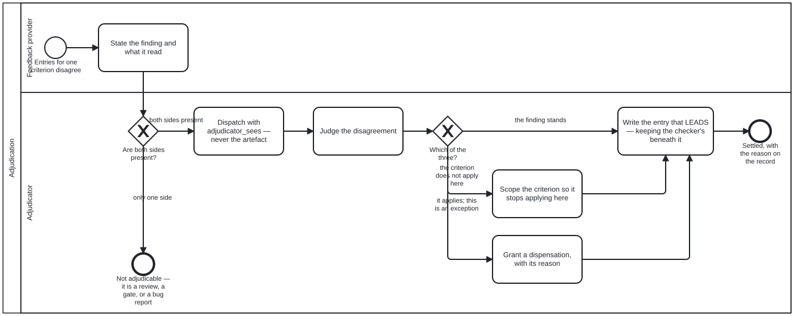

{: .note }
> Generated from [`cat-harness/skills/folio-core/adjudication.md`](https://github.com/litlfred/folio-assistant/blob/main/cat-harness/skills/folio-core/adjudication.md) — do not edit here.
>
> [✎ Edit this page's source](https://github.com/litlfred/folio-assistant/edit/main/cat-harness/skills/folio-core/adjudication.md){: .fa-edit-source }


# Adjudication — judgement, when the mechanism ran out of facts

> Skill id: `adjudication` · Capability: `review` · Package: `folio-core`

## Why this exists

Owner, 2026-09-21: *"during review process a concensus/mechanical agreemenet
was not reached, in this case Judgment is needed and Adjudication process
being … it is Judgment of >= 1 Feedback Provider's feedback. still have same
dispensation process (reason for choice as per contextual requirements)."*

**The shape was already implemented seven times and generalised none.**
Measured 2026-09-22 over `processes/*.bpmn` and `src/`:

| where | the decision, in its own words |
|---|---|
| `translation-workflow` · `Task_Adjudicate` | *"The round trip establishes that two readings differ. Which one is right is a human call."* |
| `ingest-l1-completeness-gate` · `Task_FlagDrift` | *"A machine can detect that two readings differ. Which one is right is a human call."* |
| `refresh-materialized` · `Task_Adjudicate` | *"A human or agentic decision, never a merge rule. Which side wins depends on why the local edit was made, and a process that picked automatically would be choosing without the one fact that decides it."* |
| `review-narrative` · `Task_AdjudicateVoice` | *"Three outcomes, all legitimate: the register is wrong for this genre; the criterion does not belong in this genre; or the block is a stated exception and a reviewer entry records why."* |
| `voice-review` · `Task_Adjudicate` | *"The same three outcomes … fix the prose; scope it on the voice; or the rule applies and this block is an exception."* |
| `src/routes/relevance.ts` | *"writing `human_adjudicated` alongside — never overwriting — the agent's `assessed_by`. Both survive."* |
| `schemas/bib-verification.ts` | a discriminated `Verifier` union, agent-only vs human-adjudicated, *"and *also* carry `human_adjudicated` if a human has subsequently"* ruled |

The first two are the same sentence twice, written by different hands about
different subjects. The last two are an HTTP route and a schema that share no
code with the diagrams and arrived at the diagrams' rule anyway.

**"Named nowhere" would be the easy summary and it is wrong.** It is named
once — `translation-workflow.bpmn`'s `Lane_Reviewer` documentation states the
entry condition, the accountability and the dispensation rule together:

> *"a reviewer reports, an adjudicator settles. The word is used here because
> the passage reaching this lane is one where a checker and a translator
> disagree, and somebody has to choose between them WITH a reason. That reason
> is the record, not the choice."*

Which is the whole skill, in one lane's documentation, in one diagram, reachable
only by somebody already reading that diagram. **The gap was never vocabulary.
It was that nothing generalised the one statement of it**, so each new subject
restated it and the eighth would have restated it again.

## One judgement, six questions — and the split that followed

**Measured 2026-09-23** (bean `bvuk`, [#1073](https://github.com/litlfred/folio-assistant/issues/1073)), and it changes how you call this process.

`adjudication.bpmn` used to hold two things: the judgement, and three outcomes
done about it — the finding stands, the criterion is scoped, a dispensation is
granted. Six diagrams called it. **Only two asked a question those three
answer**: the `review-narrative` and `voice-review` rows above. The other four
ask whether a drift is real, whether a passage is acceptable, whether two
entries agree, and *which side wins a conflict*. None of those has a criterion
to scope or a dispensation to grant — and a `callActivity` runs the whole
subprocess, so all four ran the outcome half anyway.

**Two things worth carrying, because both were established by checking rather
than reasoning:**

- **No caller branched on the outcome, and none could.** Every one of the six
  call activities has exactly one outgoing flow, and the process had one
  settled end event: all three branches reconverged on `A_RecordEntry`. So the
  mismatch was invisible in the callers' shape — a diagram asking "which side
  wins" and one asking "does this finding stand" looked identical.
- **Passing each caller its own codes could not fix it.** That was the first
  proposal. The codes selected three different TASKS, so a caller handed
  `local-wins` would have had it pointing at `A_ScopeCriterion`. **The branches
  had to move, not the enum.**

So the split is **at the judgement**:

| what | where it lives | why there |
|---|---|---|
| entry condition, untainted dispatch, person-or-agent restriction | `adjudication.bpmn` | it must not vary, and restating it per caller is how it drifts |
| the three QA-criterion outcomes, `A_RecordEntry`, the dispensation | `criterion-adjudication.bpmn` | it depends on what was asked |

### What that means when you call it

`A_Adjudicate` declares `<cat-harness.processes:adjudication defers="caller"/>` — it IS an
adjudication and the permitted answers are yours. Declared rather than left as
a missing `codes`, so a marker lost by accident and a deferral on purpose do
not parse the same.

- **Asking the QA-criterion question?** Call `Process_CriterionAdjudication`
  and declare `<cat-harness.processes:adjudication accepts="stands scope dispensation"/>`. The
  engine compares your list with what that process actually offers.
- **Asking something else?** Call `Process_Adjudication` and declare
  `<cat-harness.processes:adjudication codes="…"/>` on your own call activity, with your own
  gateway coding the same set. The engine refuses a mismatch between the two,
  and refuses a partly-coded gateway, which reads as complete.
- **Declaring nothing** is legal and **reported** by `check:workflow-refs` —
  the four callers above are in that state on purpose. What each should ask is
  open, and guessing would make an undecided thing look checked.

Whatever you ask, `A_RecordEntry`'s rule follows the outcome: **a judgement
nobody wrote down is indistinguishable from a checker that was never run.** It
is `relaxable="false"` wherever it lands, which is now with the caller that
records, because the entry written depends on what was adjudicated.

## Two senses of the word, and only one is this

The corpus also uses *adjudicated* as an adjective meaning **settled**:
`evidence-retrieval` calls published DAKs *"already-adjudicated guidance"*, and
`ingest-extract-structure` says extracted candidates are *"never adjudicated
verdicts"*. Both are correct English and neither is this process. Grepping for
the word finds them; only the activity list above is the process.

## What makes a disagreement ADJUDICABLE

Not "somebody is unhappy". `schemas/block-qa.ts` already declares the three
reviewer kinds — `script`, `agent`, `human` — and allows **multiple entries per
criterion**, which makes the entry condition computable rather than declared:

| state | what it is |
|---|---|
| **mechanical agreement** | the `script` entry passes |
| **consensus** | entries of different kinds agree on one criterion |
| **adjudicable** | entries for ONE criterion **disagree** |

So you are in adjudication when the sidecar holds two entries for the same
criterion that do not agree. Anything else is a review, a complaint, or a bug
report, and each of those has somewhere else to go.

**A missing entry is not a disagreement.** One reviewer and no checker is a
review; one checker and no reviewer is a gate. Adjudication needs both sides
present, which is why it cannot be entered by an actor simply declaring it —
and why `adjudication.bpmn`'s first gateway leaves the process rather than
guessing.

## The adjudicator is dispatched, not briefed

**This skill does not restate the parties — [`untainted-verification`](untainted-verification.md)
owns them**, and the split matters more here than anywhere else, because the
adjudicator is the party best placed to ruin the measurement:

> **adjudicator** | is given `adjudicator_sees` and the checker's output —
> **never the artefact itself** | produces `pass` / `warn` / `fail`, each drift
> named

An adjudicator shown the artefact can talk itself into any reading of the
finding, and that failure raises no error: it produces a verdict that measured
nothing. `UntaintedDispatch` declares the context per criterion and
`untaintedPartitionDefects` reports `overlap` when both parties can read the
same file. Read that skill before you dispatch one.

## The adjudication LEADS; the checker's entry is KEPT

`voice-review.bpmn`, and this is the rule the whole skill turns on:

> *"The adjudication LEADS the criterion and the script entry is kept beneath
> it: **a disagreement between a checker and a reviewer is information**."*

Do not resolve the disagreement away. Both entries stay in the sidecar, the
human's on top under the sweep's *"most-recent matching-hash entry wins"* rule.
A sidecar showing only the winning answer has lost the fact that a checker read
it differently — which is exactly what somebody re-running the check next month
needs to know.

**Two subsystems reached this independently**, which is the strongest evidence
here that it is the right rule rather than a local convention:
`/api/relevance/adjudicate` writes `human_adjudicated` *alongside* `assessed_by`
so the dashboard can distinguish *"an agent thinks this is core"* from *"the
author agrees"*, and `bib-verification.ts` carries the same pair on a
discriminated union. Neither imports anything from the diagrams.

This is also the answer to *"adjudication if code and narrative disagree"*:
record the disagreement, lead with the judgement, keep the other entry.

## The dispensation is a VERSION, never a precedent

The outcome carries its reason. That mechanism already exists and is
schema-backed — `block-qa/v1`'s multi-reviewer primitive, documented at length
in [`q-usage-watcher`](../folio-paper-adapter/q-usage-watcher.md):

- a `kind: "human"` entry with `result: "pass"` overrides the script's `fail`
  for the same criterion;
- **only while its `field_hash` matches the current source files**;
- `notes` carries the reason — *"reason for choice as per contextual
  requirements"*.

**That hash gate is the design, not a limitation.** A dispensation is scoped to
the version it was granted against: change the block and it lapses, and must be
re-granted. So a dispensation never becomes precedent, and there is nothing to
overturn later — the source moving overturns it.

A dispensation with no `notes` is not a dispensation. It is an override
somebody applied to get to green, and nobody can review it afterwards. So
`A_Dispensation` is marked `relaxable="false"` — in
**`criterion-adjudication.bpmn`**, with `A_RecordEntry`, since the 2026-09-23
split; this paragraph said `adjudication.bpmn` until 2026-09-24, four sections
after §"One judgement, six questions" had already recorded the move. **The
judgement is free and the record is not**, because a judgement nobody wrote
down is indistinguishable from a checker that was never run.

## Who adjudicates — a skill that spreads, an entitlement that does not

| object | what it is |
|---|---|
| `feedback-provider` (role) | offers a finding — a checker, a review agent, a reader, an SME. **Plural by design**: the owner's *"Judgment of >= 1 Feedback Provider's feedback"*. |
| `adjudicator` (role) | settles it, with a reason. Inherits `reviewer`. |
| `adjudication` (**permission**) | may WRITE the settling entry. |

**Knowing the discipline and being entitled to apply it are different, and the
repository already separates them.** `permissions.json`: *"a permission
CROSS-CUTS roles"* — which is exactly what the measurement above shows.
Adjudication happens in four lanes bound to four different roles
(`narrative-reviewer`, `translation-adjudicator`, `reviewer`, `user`), so:

- the **skill** is carried by every role whose lane holds an adjudicate
  activity, because each of them has to be able to tell an adjudicable
  disagreement from a complaint;
- the **permission** `adjudication` is held by the actor, alongside
  `review-comments` (*record a finding*) and `approval-authority` (*accept a
  change*). It is neither: settling a disagreement between two findings is not
  reporting one and not accepting the change.

**A reviewer reports; an adjudicator settles.** That is why `review-task.bpmn`
keeps accept-or-send-back in one lane: a process where every reviewer could
settle has no way to say who decided.

`translation-adjudicator` is the first specialisation and was the only
adjudicator role before this skill existed.

## Where it sits against its neighbours

| store | holds | skill |
|---|---|---|
| `todos/feedback/` | a person's feedback ON content — the **intake** | [`todo-review`](todo-review.md) |
| `test/results/block-qa/` | reviewer entries per criterion — the **record** | the `qa-*` family |
| `beans/` | the work plan | [`todo-manager`](todo-manager.md) |

Adjudication **consumes an intake and writes a record**. It is not a rival to
either, and `todo-review`'s own disambiguation block — which separates itself
from `todo-manager` and is silent about verdicts — is the seam it fits into.

## What this does NOT cover

**The narrative-asserts-code axis.** Whether prose asserts what an artefact
actually does is a different question, currently answered only for Lean
(`proof-narrative-lean-equiv`, beans `nrv8` and `qusg`).
[`code-node-review`](code-node-review.md) asks whether a NODE is correct — that
it declares what it is, that its references resolve — not whether the prose
matches. Generalising that is a separate and larger decision, and this skill
deliberately stops short of it.

## Related

- [`untainted-verification`](untainted-verification.md) — the parties and what
  each is given. Adjudication is what happens when they disagree.
- [`q-usage-watcher`](../folio-paper-adapter/q-usage-watcher.md) — the
  dispensation mechanism, documented where it was first applied.
- [`code-node-review`](code-node-review.md), [`voice-editorial-review`](voice-editorial-review.md),
  [`voice-overlay-review`](voice-overlay-review.md) — the reviews that produce
  the findings this settles.
- `schemas/block-qa.ts` — the reviewer kinds, and why a model's own claim is
  not the same kind of evidence as a person's.


## Processes that run this skill

This skill has its own process: **[Adjudication](../../processes/adjudication.html)**.

| process | step(s) that name it |
|---|---|
| [Adjudication](../../processes/adjudication.html) | Adjudicate the disagreement |
| [Content Change and Review](../../processes/content-change-review.html) | Adjudicate the disagreement (calls a sub-process) |
| [Criterion adjudication](../../processes/criterion-adjudication.html) | Adjudicate the criterion disagreement (calls a sub-process); Scope the criterion so it stops applying here; Grant a dispensation, with its reason; Write the entry that LEADS — keeping the checker's beneath it |
| [Ingestion subprocess — the L1 completeness gate](../../processes/ingest-l1-completeness-gate.html) | Adjudicate the flagged passage (calls a sub-process) |
| [Refresh materialized remote content](../../processes/refresh-materialized.html) | Adjudicate the conflict (calls a sub-process) |
| [Narrative review](../../processes/review-narrative.html) | Adjudicate the voice findings (calls a sub-process) |
| [Translation Workflow](../../processes/translation-workflow.html) | Adjudicate flagged passage (human reviewer) (calls a sub-process) |
| [Voice overlay review](../../processes/voice-review.html) | Adjudicate: prose, scope, or exception (calls a sub-process) |

