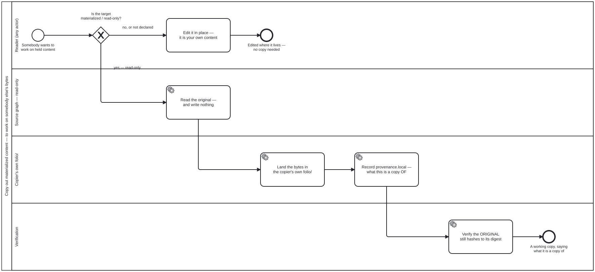

{: .note }
> Generated from [`large-datasets/skills/copy-out-materialized.md`](https://github.com/litlfred/folio-assistant/blob/main/large-datasets/skills/copy-out-materialized.md) — do not edit here.
>
> [✎ Edit this page's source](https://github.com/litlfred/folio-assistant/edit/main/large-datasets/skills/copy-out-materialized.md){: .fa-edit-source }


# Working on materialized content — copy it out

**Materialized content is a copy of somebody else's bytes, and this repository
does not edit it in place.** The owner, 2026-09-21:

> *"if we have a materialized `<stub>/<sub-graph>`, the contents of it should be
> immutable … you would need to copy/materialize it to your own `folio/` in
> order to mess around with it."*

And 2026-09-22, choosing between advising and enforcing: **enforce from the
start.**

Diagram: [`copy-out-materialized.bpmn`](../../processes/copy-out-materialized.html).
Schema: `folio-assistant-core/schemas/materialization.ts`. Where they disagree,
the schema wins and this file is wrong.

## What the rule protects, and what it does not

It protects the CLAIM. A materialized record asserts *"these bytes are what
upstream published"*. Editing them in place leaves that assertion standing over
bytes it no longer describes — and `check:materialized-fixity` is what catches
one that happened, by hashing the bytes against the digest the record carries.

It does **not** protect against the copy being wrong, stale or badly chosen.
Those are the five gates' job, at materialisation time
([`materialize-remote`](materialize-remote.md)), and a copy-out re-opens none
of them: you are copying something this repository already decided it may hold.

## Who may copy out

**Any reader** — the owner's ruling, 2026-09-22. This is deliberately not a
permission: refusing a copy would not protect the original, because the
original is protected by being read-only. A gate here would only stop people
working.

What copying out does NOT confer is the right to publish. The copy inherits its
source's `restrictions` and `copyright` verdicts, and it is a new artefact in
**your** folio whose publication is your folio's decision, judged the way any
other authored content is.

## Where the copy goes

**Into the copier's own `folio/`, with provenance** — owner's ruling,
2026-09-22, chosen over a scratch area. The reason a scratch area lost is that
it makes the copy publishable by accident: a directory nobody declared is a
directory nobody gates.

## The copy records what it is a copy of

This is the part that is easy to leave out and impossible to reconstruct later.

`materialization.provenance` is a **pair**:

| field | points at |
|---|---|
| `upstream` | the remote thing — a URI, upstream |
| `local` | the original **in this repository** it was taken from |

A copy-out writes **`local`**. It does not overwrite `upstream`, and it does not
reuse `upstream` for the local original — that was one field until 2026-09-22,
and by then 5 of the 9 who-iris item records were using it for a local value in
violation of its own documentation.

Without `local`, one rename later a copy is indistinguishable from original
work. That is the whole failure this step exists to prevent, and nothing
downstream can repair it: the information was never written down.

## The copy is NOT read-only

A materialized node is frozen because it is a claim about somebody else's
bytes. A copy in your own `folio/` is **yours**, makes no such claim, and is
ordinary authored content — so it is writable, and its directory's `readOnly`
is `false`.

If it were frozen too, the copy-out would achieve nothing, and the next person
would need a copy of the copy.

## The exception is "say what you did", not a list of who may skip

The owner's exception is *"expect for publication worfklow purposes or so"*.
Written as an allowlist it would be a list that goes stale the first time
somebody adds a sixth writer, and it would need every writer to announce itself
— passing silently for anyone who forgot.

Written as a rule it is checkable and cannot go stale:

> **A step that rewrites a materialized artefact records the new fixity in the
> same change.**

Then `check:materialized-fixity` passes and the record describes what is
actually there. A step that rewrites without updating fixity fails, correctly,
because it has forked upstream without saying so — which is exactly what the
rule exists to prevent. The check asks a question about BYTES and never about
who wrote them, so it needs no attribution of a commit to a process step.

### Where this bites, measured

**`refresh-materialized.bpmn`'s `Task_Apply`** — the one step in the declared
corpus that rewrites bytes a materialization record describes. Until 2026-09-22
it named no fixity write at all, so a **correct** run of that process would have
failed the gate as a mismatch: *"somebody edited held content without saying
so"*, said about the one process whose job is to replace it.

### And where it does NOT bite, also measured

**No publication process in this repository writes to materialized content.**
`kg-to-portal.bpmn`'s `S_Sign` signs a subgraph cut from the KG — derived
content, not held upstream bytes — and nothing else comes close. So the
publication case is a rule with no instance yet, which is why it is stated here
as a rule rather than drawn as a step in a diagram that does not do it. A
declared-but-absent step is the `dh4f` defect: a consumer scans it and reports a
clean run over nothing.

## What to check afterwards

- `bun run check:materialized-fixity` — the original still hashes to its
  recorded digest. If it does not, the copy-out was an edit in place.
- `bun run check:read-only-graphs` — your folio's directory is not accidentally
  declared read-only, and the source's still is.


## Processes that run this skill

This skill has its own process: **[Copy out materialized content — to work on somebody else's bytes](../../processes/copy-out-materialized.html)**.

| process | step(s) that name it |
|---|---|
| [Copy out materialized content — to work on somebody else's bytes](../../processes/copy-out-materialized.html) | Edit it in place — it is your own content; Read the original — and write nothing; Land the bytes in the copier's own folio/; Record provenance.local — what this is a copy OF; Verify the ORIGINAL still hashes to its digest |

