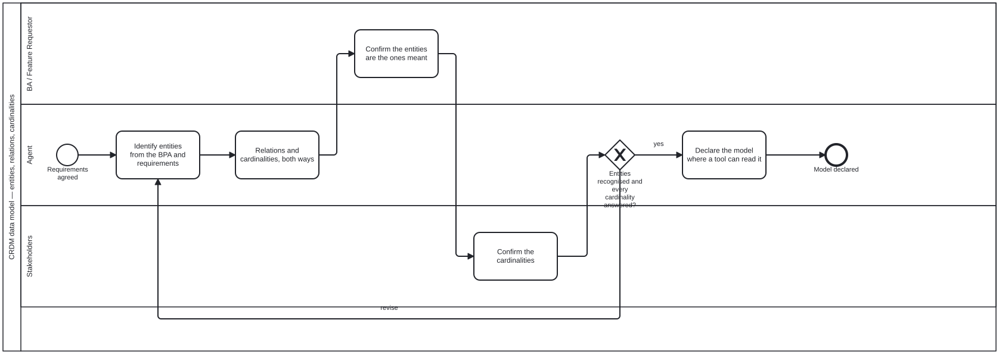

{: .note }
> Generated from [`cat-harness/skills/crdm/crdm-data-model.md`](https://github.com/litlfred/folio-assistant/blob/main/cat-harness/skills/crdm/crdm-data-model.md) — do not edit here.
>
> [✎ Edit this page's source](https://github.com/litlfred/folio-assistant/edit/main/cat-harness/skills/crdm/crdm-data-model.md){: .fa-edit-source }


# CRDM — the data-modelling phase

**This skill says WHEN and WITH WHOM. It does not say how to model.** That is
[`data-modelling`](data-modelling.md), and it is deliberately free of CRDM so
a folio modelling data outside a requirements process can read it without
inheriting a methodology it is not running.

Where the two disagree, **the technique wins and this page is wrong** — the
same rule `AGENTS.md` states for a skill and its pointer.

## Where it sits, and why there

Between **requirements** (phases 2–4) and **sign-off** (phase 5).

The reason is the direction of dependency. Requirements are statements about
things; the model says what the things ARE. Draft the model too early and it
is invented from nothing — the entities come from the business-process
analysis, which is phase 2. Draft it too late and phase 5 signs off
requirements whose nouns were never pinned, which is how two stakeholders
approve the same sentence meaning different things.

`Call_DataModel` in `crdm-requirements.bpmn` is the fifth `callActivity`,
after `Call_Requirements` and before `Call_Signoff`.

## What it consumes

| from | what |
|---|---|
| phase 1, needs | the domain vocabulary the BA actually used |
| phase 2, BPA | the activities — every verb whose object is a candidate entity |
| phases 3–4, requirements | each requirement's nouns, which the model must be able to express |

**A requirement the model cannot express is a finding, not a modelling
failure.** It means the requirement is about something nobody has named, and
the remedy is to name it — that is this phase's most valuable output and the
reason it sits after requirements rather than before.

## The sign-off, and who gives it

The agent drafts; the **BA confirms the entities are the ones they meant**;
the **stakeholders confirm the cardinalities**. Those are two different
questions and are asked of two different lanes on purpose:

- *Are these the things?* — a naming question, and the BA owns the domain
  vocabulary.
- *Is it really one per?* — an operational question, and the people who run
  the process know where the exceptions are.

The agent asks both and decides neither. CRDM's own rule for phase 1 —
*"the BA knows the domain, the agent does not guess"* — applies here with
more force, because a wrong cardinality is invisible until the data arrives.

## What it hands on

A declared model, readable by a tool, per step 6 of the technique. Phase 5
signs off requirements **against** it, which is the whole point of ordering
them this way: sign-off can now ask whether each requirement is expressible,
not only whether it is wanted.

## The loop, and when to leave it

Like every other CRDM phase this one loops until confirmed, and the gateway
is the phase. **Leave when the BA recognises the entities and the
stakeholders have answered every cardinality** — not when the model looks
complete. A model with one unanswered cardinality is not 95 % done; it is a
model with a hole exactly where the exceptions live.

## Not decided by this skill

Whether the model is expressed as Zod, JSON Schema, a class diagram or prose
is `placement`'s question and the folio's choice. This phase requires only
that the artefact is **declared**, so the next phase can read it rather than
be told about it.


## Processes that run this skill

This skill has its own process: **[CRDM data model](../../processes/crdm-data-model.html)**.

| process | step(s) that name it |
|---|---|
| [CRDM data model](../../processes/crdm-data-model.html) | Identify entities from the BPA and requirements; Relations and cardinalities, both ways; Confirm the entities are the ones meant; Confirm the cardinalities; Declare the model where a tool can read it |

