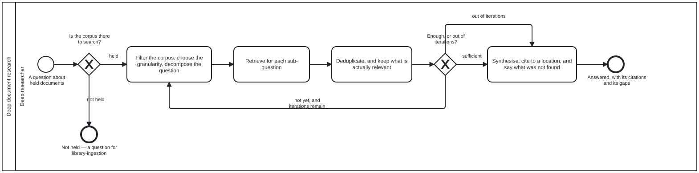

{: .note }
> Generated from [`folio-assistant-core/skills/deep-document-research.md`](https://github.com/litlfred/folio-assistant/blob/main/folio-assistant-core/skills/deep-document-research.md) — do not edit here.
>
> [✎ Edit this page's source](https://github.com/litlfred/folio-assistant/edit/main/folio-assistant-core/skills/deep-document-research.md){: .fa-edit-source }


# Deep document research

Renders `methodologies/doc-researcher.md` — Dong et al., arXiv:2510.21603v1 —
as something an agent here can run. Read the methodology node for what the
paper claims and what it measured; this is the part you act on.

**It assumes a corpus, and does not build one.** `library-ingestion` acquires
and files; `ingest-*` derives structure; the L1 completeness gate says whether
an entry is fit to use. This begins after all three.

## The loop, and the only two ways out

```
plan → [ search → refine → evaluate ] → report
              ↑                 |
              └── σ < τ and t < T_max
```

**Stop when `σ ≥ τ`, or when `t = T_max`.** Both, always.

- Threshold alone **never terminates** on a question the corpus cannot answer,
  and a corpus that cannot answer a question is the normal case rather than
  the exception.
- Cap alone **stops an answerable question early**, and the answer it returns
  looks exactly like a complete one.

A loop carrying one of them is a different method with a failure mode the
paper's does not have. If you implement only one, you have not implemented
this.

**Say which one you stopped on.** An answer that hit `T_max` is an answer with
known gaps; one that reached `σ ≥ τ` is not. A report that does not
distinguish them hands the reader a confidence nobody established — the same
shape as a QA sweep reporting clean because it could not look.

## The four roles are four QUESTIONS, not four programs

| | asks |
|---|---|
| **plan** | which documents could possibly bear on this, at what granularity, and what are the sub-questions? |
| **search** | what does the corpus return for this sub-question at that granularity? |
| **refine** | of what came back, what is actually relevant and not a duplicate? |
| **report** | what does the accumulated evidence say, and where can a reader check each claim? |

One actor may perform all four. The `deep-researcher` role is one swimlane
because the accountability is one: somebody stands behind the synthesis. Do
not read the paper's four agents as four roles — this repository's role model
is explicit that a role is an accountability, not a step.

## Choose the granularity per question, and say you chose

The method's substance is that a corpus parsed at several granularities lets a
LATER step pick. A broad question is answered from summaries; a specific one
from chunks. **Picking once, in the pipeline, answers every future question the
same way** — which is the condition this method exists to escape.

**This checkout is not there yet.** `l1-blocks.ts` produces blocks and sections
exist; there is no `summary` level and no per-query choice. Until there is, say
which granularity you searched rather than implying the corpus offered one.
That is the honest form of a capability that is missing.

## Three things NOT to adopt with it

1. **Machine descriptions as fact.** The paper converts figures to text with a
   VLM and uses the output. Here an agent's description is a `draft` and only a
   person confirms it (`apply-image-verdicts.ts`, `schemas/narrative.ts`): *"an
   uncited narrative is indistinguishable from a transcription of the source."*
   Search over drafts if you must — and never report a draft as what the figure
   shows.
2. **A sufficiency function you invented.** The paper gives σ a symbol and a
   threshold and never says how it is computed. If you need one, propose it and
   have it adjudicated; do not bury a judgement in a number.
3. **The paper's numbers.** 50.6% and "3.4× baselines" were measured on the
   authors' own benchmark over their own 304 documents. They say nothing about
   this corpus, and quoting them here would be evidence for a claim nobody
   tested.

## Say what you did not find

The one failure this method makes easy: an iterative search that ends quietly
looks identical to one that succeeded. Report the sub-questions that returned
nothing, and whether that means *not in the corpus* or *not found by this
search*. Those are different, and only the first is a fact about the folio.

## See also

- [`doc-researcher`](../methodologies/doc-researcher.md) — the method, what it
  measured, and where this rendering stops.
- `library-ingestion`, `document-intake` — how the corpus this reads gets
  there.
- [`literature-search`](../../cat-harness/skills/folio-core/literature-search.md)
  — searching for sources not yet held, which is the other direction.


## Processes that run this skill

This skill has its own process: **[Deep document research](../../processes/deep-document-research.html)**.



| process | step(s) that name it |
|---|---|
| [Deep document research](../../processes/deep-document-research.html) | Filter the corpus, choose the granularity, decompose the question; Retrieve for each sub-question; Deduplicate, and keep what is actually relevant; Synthesise, cite to a location, and say what was not found |

