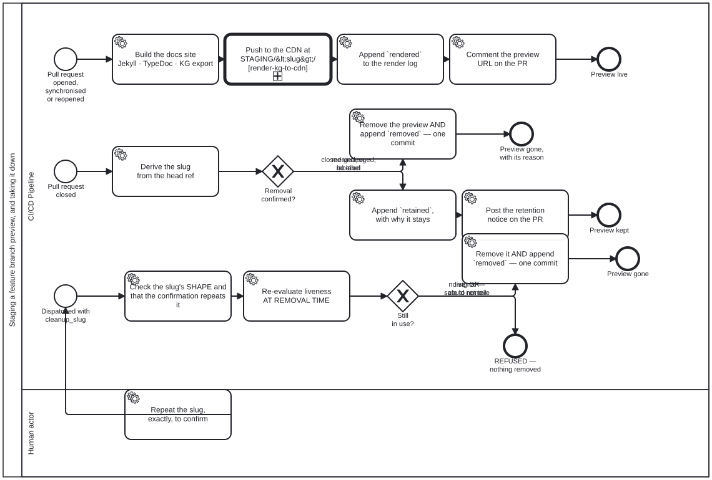

{: .note }
> Generated from [`cat-harness/skills/sdlc/sdlc-core/feature-staging.md`](https://github.com/litlfred/folio-assistant/blob/main/cat-harness/skills/sdlc/sdlc-core/feature-staging.md) — do not edit here.
>
> [✎ Edit this page's source](https://github.com/litlfred/folio-assistant/edit/main/cat-harness/skills/sdlc/sdlc-core/feature-staging.md){: .fa-edit-source data-fa-link="edit" data-src="cat-harness/skills/sdlc/sdlc-core/feature-staging.md" data-repo="litlfred/folio-assistant" }


# Feature-branch staging

## When to use this skill

When a content change is being reviewed and the reviewer (or the author) needs
to **see the rendered result** before merging. The staging deployment puts the
feature branch's rendered site at:

```
https://<owner>.github.io/<repo>/STAGING/<branch-slug>/
```

**A preview is the general publication step with a different root.** The push
itself is [`render-kg-to-cdn`](render-kg-to-cdn.md) with
`STAGING/<branch-slug>/` as the publication root URL and the `gh-pages` Tool as
the target — the same step a release takes with the site root. What this skill
owns is everything around that call: the slug, the banner and `staging.json`,
the render log, the PR comment, and taking the preview down.

## How it works

### 1. Feature branch → staging deployment

When an agent pushes to a feature branch, `feature-staging.yml` automatically:

1. Builds the docs site (Jekyll + TypeDoc + BPMN diagrams)
2. Writes the build's facts — commit SHA, timestamp, branch, PR, issue, build
   log — **once**, to `staging.json` at the preview root
3. Injects a **constant** staging banner at the top of every HTML page, which
   reads those facts in the browser
4. Comments on the PR that the preview is **staged and queued**, with the
   earliest push time and when it should be live
5. Waits for the rate-limit window (§7), then deploys to
   `gh-pages/STAGING/<branch-slug>/`
6. Rewrites the same comment: **pushed** at a time, live by about five
   minutes later

### 2. The staging banner

Every staged page carries a muted-sage banner:

> 🔀 **FEATURE BRANCH** — `claude/update-schedule` · commit `a1b2c3d` · built 2026-09-18T00:30:00Z · PR #42 · issue #215 · compare with main ↗ · build log

This makes it impossible to mistake staged content for the published site.

**Do not describe it as yellow.** It was `#d946ef`, which measured **3.46:1**
against its own white text and so FAILED the 4.5:1 WCAG AA threshold — the
banner was not merely glaring, it was the least readable element on every
staged page. `#4F6F52` measures 5.63:1. Any replacement gets checked the same
way; the pale decorator sages (`#9CAF88`, `#87A96B`) all land near 2.5:1.

#### The facts are fetched, not baked — and that is a storage decision

`cat-harness/scripts/staging-banner.ts` injects a fragment that is
**byte-identical on every page and across every rebuild**, and the browser
derives its preview root from `location.pathname`, fetches `staging.json` and
fills the banner in.

The banner used to be a bash string in `feature-staging.yml` with the SHA and
a `date -u` timestamp interpolated into all ~530 pages. Because the timestamp
changes every run, **every page was unique even across two builds of one
branch**: each re-push added ~27.5 MB of permanently new objects to
`gh-pages`, and the history grew even when the preview count did not. Measured
2026-09-19 (bean `g196`): 9 previews, **346.1 MB**, and **zero HTML blobs
shared between any two previews**.

Three consequences for anyone editing this:

- **Nothing per-build may go back into the fragment.**
  `staging-banner-constant.test.ts` runs two builds with different facts and
  compares the emitted bytes, so any leak fails regardless of how it is
  spelled. Add the fact to `staging.json` instead.
- **A failed fetch must still say PREVIEW.** The static markup carries
  "FEATURE BRANCH" before any fetch happens, and the fetch only ever ADDS
  detail. *"Could not determine" is never rendered as "this is the real
  site"* — the same third-state rule the rest of the repository runs on, and
  here the failure mode is a reviewer approving the wrong artefact.
- **Every value from the JSON goes in as `textContent`, never as markup.**
  Git ref names may contain `<`, `>` and `"` — they are not in git's forbidden
  set, which stops at space, `~`, `^`, `:`, `?`, `*`, `[`, `\` and the control
  characters. The bash version interpolated the branch name into a string;
  the client builds nodes. `staging-banner.e2e.ts` pins this with a branch
  name carrying an `onerror` payload.

Pages still differ **between** previews, because Jekyll's `relative_url`
prepends the `baseurl` to ~235 hrefs per page and the `fa-translation-index`
island publishes `site.baseurl` to JavaScript. Those are coupled to the
language switcher and are `g196`'s remaining half — not fixed here.

### 3. Commit SHA stamping — and the four fields staging must NOT write

Both builds write `docs/_data/build.yml`, and **they do not write the same
fields.** The difference is not an oversight to tidy up; it is the second half
of the deduplication above, and restoring it undoes that work silently.

| | `docs-site.yml` (main) | `feature-staging.yml` (a preview) |
|---|---|---|
| `sha`, `short_sha`, `built_at`, `run_url` | **written** | **DELIBERATELY ABSENT** |
| `branch`, `staging`, `staging_slug`, `pr_number`, `search_index` | — | written |

**Why staging omits them.** `docs/_includes/footer_custom.html` renders
`short_sha`, `built_at` and `run_url` into the footer of **every** page. A
fresh `date -u` per run therefore changed every page on every deploy — the
same defect as the old bash banner, one include along, and it **survived the
banner fix** because it lives in a Jekyll include rather than in the
workflow's injection step. Measured on two deploys of one branch three
minutes apart, both already shipping the constant banner: 613 files,
1466 insertions, 1465 deletions, **one insertion and one deletion on every
HTML page**.

The client fills those three in from the **same `staging.json`** the banner
already fetches — one request, two consumers — and a failed fetch leaves
Jekyll's `| default: 'dev'` in place rather than blanking the footer, which is
the same third state §"The facts are fetched, not baked" requires of the
banner. On main there is one copy and nothing to deduplicate, so the include's
own reason stands: *"a stale browser cache and a deploy that has not run look
identical."*

**Adding a per-build field back to the staging stamp will not fail a test.**
`staging-banner-constant.test.ts` compares the banner **fragment**, which is
genuinely constant; the footer is not in it. This is the paragraph that guards
the gap, and bean `g196` records the session that shipped the banner fix, said
the pages no longer differed across rebuilds, and was proved wrong by reading
the deploy commits on `gh-pages` rather than the code.

A Jekyll layout can read `site.data.build.sha` to display the deployed
version — on main. Under a preview, read it from `staging.json`.

### 4. Before/after comparison

The reviewer opens both URLs side by side:

| Surface | URL | What it shows |
|---|---|---|
| **Main** (current) | `<pages-url>/` | The published state on `main` |
| **Staging** (proposed) | `<pages-url>/STAGING/<slug>/` | The feature branch's changes |

The commit SHA on each page confirms exactly what is being compared.

### 5. Cleanup

When the PR is merged or closed, the `cleanup` job in `feature-staging.yml`
removes `STAGING/<slug>/` from `gh-pages` so stale previews don't accumulate.
The full retention rules — merged vs closed-unmerged, the label, the dispatch —
are in [`staging-review`](staging-review.md) §"Staging retention".

### 6. The cap — 3 GB of previews in total, the oldest rotated off

**Owner ruling, 2026-10-02 (issue #1868):** *"cap the maximum number of
previews (<= 10) and rotate old ones off."* **Amended 2026-10-04: by size, not
count, with a budget of 3 GB** — previews had grown to 200–780 MB each, so ten
of them rotated off within an hour or two. Per-PR cleanup bounds nothing in
total, every preview is a full copy of the site, and `gh-pages` passed GitHub's
10 GB Pages limit — freezing the live site on 2026-10-01.

So every `stage` run, inside its push loop, runs
`cat-harness/scripts/staging-rotate.ts`: it stamps the preview it is staging
(`STAGING/<slug>/.staged-at`), keeps that one plus the most recently updated
others while the total fits `MAX_PREVIEW_BYTES` (3 GB, 3 x 1024^3 bytes, defined
there and nowhere else), and removes the rest, oldest first — each with a `removed` render-log entry, its record retired into
`STAGING/_retired/`, and a line (slug, age, size) in the commit message and
job log. `_retired/` and non-preview entries are never touched.

Two things to know when editing it:

- **The push loop re-reads `gh-pages` on every attempt; it does not rebase.**
  The commit carries removals decided against one read of the branch, and a
  replayed removal is a stale one — it could delete a preview another run has
  just refreshed. Same shape as `publish-gh-pages.sh`.
- **A rotated-off preview is regenerated by the next push to its PR branch.**
  It can reach an OPEN PR's preview; that is the ruling, and why the cost is a
  404 until the author pushes rather than lost work. Detail and the reviewer's
  remedy: [`staging-review`](staging-review.md) §"The cap".

### 7. The cone — a preview rebuilds only what a changed file can reach

**Owner ruling, 2026-10-04 (bean `4j86`):** *"staging rebuild only what is
dependency cone of changes (general rule)"*, at FILE level, with each derived
directory's generator declared as `writer`. A general rule across rendered
kinds, not a fact about IGs.

A rendered directory is **in the cone** when a changed file is

1. under its own path (its pages, or its source data), or
2. in the import closure of a `writer` it declares, or under a writer
   directory (a path ending in `/`: what a generator reads, such as its
   templates, rather than imports), or
3. in a directory it is `derivedFrom`, transitively (`check:derived-from
   --downstream <instance/id>` prints that half on its own).

`cat-harness/scripts/staging-cone.ts` computes it; `compose-docs.ts`
`carriedInstances` applies it to the composed instances. Three rules hold it
honest:

- **Any doubt carries.** No file list, a writer that does not exist, or an
  import that does not resolve carries the directory, with the reason in the
  build log. A preview missing the pages under review misleads a reviewer; an
  oversized one costs bytes. Those are not symmetric.
- **A computed `import()` is bounded, not ignored.** It can load only a
  module, so it carries on a changed module file and never on a page. The two
  such sites a generator reaches today (`harness-config.ts`'s `contributes`
  loader and `block-module.ts`'s block loader) have DECLARED targets and are
  walked exactly; `DECLARED_COMPUTED_IMPORTS` lists them.
- **The old instance-prefix match is a floor.** The cone can only add to it.
  Narrowing below it is a separate decision, made once the cone has been
  measured in previews.

Measured on 2026-10-04: a skill-only change carries no IG; a change to
`gen-ig-pages.ts` or to `smart-base/themes/chrome.json` carries all three.
Before the cone, those last two changes dropped every IG from the preview that
existed to review them. `staging-cone.test.ts` holds all three as tests.

**Built sites follow the same rule.** An IG's own Jekyll site and its AST
site are BUILT in the preview from an upstream repository pinned in the
instance's own files, not composed from the checkout. `stage-ig-sites.ts` and
`stage-ast-sites.ts` take `--changed-files` and stage only the instances
`siteInCone` reaches. Its reasons, in order: no file list; a change to the
build environment (`SITE_ENVIRONMENT`: the docs Gemfile and this workflow); a
change under the instance; the cone reaching any of the instance's
directories (a theme change arrives this way); or a change in the stager's
closure. Each decision is printed with its reason.

**When you add a generated directory, declare its `writer` and
`derivedFrom`.** Without them the cone cannot reach it through code or data,
and the prefix floor is all it gets.

### 8. The rate limit — a preview never cancels the main site's Pages build

**Owner ruling, 2026-10-03 (issues #1868, #1956, bean `j27s`), option 1:**
push staging previews to `gh-pages` less often. GitHub's `pages build and
deployment` keeps only the NEWEST run, so every push cancels the build in
flight. A build takes about three minutes (2m20s–3m40s, measured 2026-10-03),
and in busy stretches previews were pushed every one to two minutes — ten
builds cancelled in a row between 07:50Z and 08:00Z that day, the main site's
among them.

So before each push attempt the `stage` job re-reads `gh-pages` and runs
`cat-harness/scripts/staging-push-gate.ts gate`, which holds the push until the
branch tip is old enough:

| tip of `gh-pages` | wait until it is |
|---|---|
| a staging commit (`staging(...)`) | `STAGING_WINDOW_MS` — 5 min |
| anything else: the main-site publish, `publish.yml`, any other publisher | `MAIN_WINDOW_MS` — 10 min |

The numbers live once, in that script. Exit `75` means it slept until the
window should open (plus up to a minute of jitter) and the loop must re-read
and ask again; exit `1` means the job has waited `MAX_WAIT_MS` (two hours) and
fails rather than pushing; exit `2` is an unreadable tip, never read as open.

Three things to know when editing it:

- **git's fast-forward rule is the lock.** Two jobs that both find the window
  open both build on the same tip; one push is rejected, re-reads, finds a tip
  younger than the window, and waits. So at most one staging push lands per
  window with no shared state. A rejection whose tip MOVED is therefore a lost
  race, sent back to the gate without spending one of the three attempts; only
  a rejection with the tip unmoved counts as a failure.
- **No concurrency group, and none should be added.** Every waiting preview
  would pend in one group and each arrival would cancel the last — the
  2026-09-19 measurement on the `stage` job. The per-branch group at the
  workflow level stays: a newer push to the same PR cancels a preview still
  waiting at the gate, so a superseded preview is never pushed at all.
- **A staging push BEFORE a main-site push is harmless; only one AFTER it
  cancels the build that matters.** The main push then cancels the staging
  build, and the build that runs carries both. That is why the gate looks at
  the tip, and why it does not wait for `docs-site` runs that have not pushed
  yet.

**Why a rate limit rather than a batching "flush" job.** A flush job — previews
uploaded as artifacts, one scheduled job pushing every pending one in one
commit — batches harder, but costs a second workflow, an artifact round trip of
200–500 MB per preview, a record of which artifact is already deployed, a
schedule GitHub runs best-effort, and a write token over content built from a
pull request. The gate is one script and one loop, and its correctness rests on
git rather than on bookkeeping. The cost is latency under load: with K
previews waiting, the last one pushes about 5 × K minutes later, and the PR
comment says so with its own estimate.

The `cleanup` and `cleanup-dispatch` jobs do NOT pass through the gate yet.
They push once per closed PR rather than once per push, so they are far rarer;
gating them is the next step if cancellations by cleanup are ever measured.

## Agent workflow

When an author requests a content change:

1. **Detect scope** — use `content-graph` and `integration-watcher` to
   identify affected blocks and downstream implications
2. **Create feature branch** — branch from `main`, open PR immediately
3. **Make changes** — edit content blocks, deterministic logic, translations
4. **Push** — the staging deployment happens automatically
5. **Report staging URL** — tell the author the preview is at
   `<pages-url>/STAGING/<slug>/`
6. **Iterate** — each push updates the staging deployment with a new SHA

The BPMN for this workflow is `folio-assistant-core/processes/content/content-change-review.bpmn`.

## Staleness detection

The SHA stamp means staleness is always detectable:

- **Staging matches PR head** → the staging preview is current
- **Staging SHA ≠ PR head** → the staging preview is stale (push again)
- **Main site SHA = merge commit** → the publication is current
- **Main site SHA ≠ latest main** → docs-site.yml needs to run

## SMART Guidelines example (from issue #215)

An author needs to change the immunization schedule:

1. Agent detects the change affects:
   - Narrative content in the immunization chapter
   - Decision logic (CQL) for scheduling the next visit
   - Indicators that count doses administered
   - Referral logic for follow-up visits
2. Agent creates `feature/update-immunization-schedule`
3. Agent edits all affected blocks, assesses downstream impact
4. Push → staging deployment → author reviews
5. Author submits to the guidance review committee
6. Committee compares `main` vs `STAGING/feature-update-immunization-schedule/`
7. Committee approves → merge → staging cleaned up → main site updated

## Before you hand a staging URL to a person

**Check the ref, then say how long and come back.** A preview push is not a
served page, and the bot's *"Staging preview"* comment reports at most the
first, not the second — and while it says **queued**, not even that. List
`STAGING/<slug>/` on `refs/heads/gh-pages` before relaying the URL; quote the
comment's own push and live-by times (the rate limit in §7 can hold a push for
several windows), or say the `stage` job takes ~2 minutes plus the wait and
Pages adds a few on top; schedule the re-check rather than promising it.

The reason it is a rule: an agent relayed one preview URL to the owner **five
times in a session** without checking anything, each time straight off the
bot's comment. Whether the site served it was never established in either
direction.

The three states, and why the third is not yours to assert, are in
[`staging-review`](staging-review.md) §"Before you hand a staging URL to a
person (STRICT)". It is the same rule and it is written once, there.

## Before you report a staging URL as broken

**Look at the publish ref, not the site.** A staging URL is LOOKED UP in
`gh-pages` under `STAGING/<branch-slug>/`, never composed from the source
path — `docs/<stub>/proposals/x.md` publishes to `/proposals/x.html`, and
composing it from the source path yields a 404 for a page that is there. From
an agent container a `curl` against a Pages URL fails on the proxy regardless,
so a failed fetch is not evidence either way.

Full rule and the measured failure:
[`github-state-inspection`](github-state-inspection.md).


## Processes that run this skill

This skill has its own process: **[Staging a feature branch preview, and taking it down](../../processes/feature-staging.html)**.



| process | step(s) that name it |
|---|---|
| [CRDM Phase 6 — implement, MVP, acceptance](../../processes/crdm-deliver.html) | Deploy the MVP to staging |
| [Publishing the docs site, and keeping the previews alive](../../processes/docs-site-publish.html) | Restore the OPEN PRs' staging previews |
| [Staging a feature branch preview, and taking it down](../../processes/feature-staging.html) | Build the docs site Jekyll · TypeDoc · KG export; Derive the slug from the head ref |
| [Adopting an upstream version bump](../../processes/upstream-version-adoption.html) | MVP: build the candidate on a staging branch |
| [Content Change and Review](../../processes/content-change-review.html) | Create feature branch; Build staging site; Deploy to STAGING/<slug>/; Comment staging URL on PR; Remove STAGING/<slug>/ |

