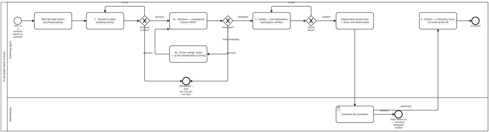

{: .note }
> Generated from [`skills/graph-management/graph-detanglement.md`](https://github.com/litlfred/folio-assistant/blob/main/skills/graph-management/graph-detanglement.md) — do not edit here.
>
> [✎ Edit this page's source](https://github.com/litlfred/folio-assistant/edit/main/skills/graph-management/graph-detanglement.md){: .fa-edit-source }


# Graph detanglement — the practice, not the migration

> Skill id: `graph-detanglement` · Capability: `architecture` · Package: `graph-management`

A repository grows until part of it wants to leave. Sometimes the reason is
size, sometimes it is semantic — *"split only where consumers or cadences
differ"* (`docs/architecture/migration-plan.md`). Either way the move is the
same and the mistake is the same: treating the split as a **migration** to be
executed rather than a **practice** to be run.

This skill is the practice. Its subject is any graph with directed edges whose
nodes are being partitioned: TypeScript modules into repositories, blocks into
chapters, skills into packages.

## THE ONE RULE, and it is already written twice in this repository

Two files state it. Neither mentions the other.

**At block scale** — `content/pipeline/qa-criteria-registry.ts`, the
`detangler-no-dependency-cycle` criterion:

> "a cycle is reorder-invariant — when two blocks each `uses:` the other, or a
> longer loop closes, **NO chapter ordering removes the forward edge**. A cycle
> signals a genuine structural tangle: **prune one dependency edge, merge the
> mutually-defining blocks, or factor the shared content into a third block
> both depend on**."

**At repository scale** — `scripts/repo-partition.ts`, the gate's own failure
message:

> "A repo may not import one that depends on it. Either the CLASSIFICATION is
> wrong — **check the target's layer before the importer's** — or the import
> is."

Same rule, two scales, two vocabularies. **Prune, merge, or factor into a
third** are the only three moves, and "the classification is wrong" is the
fourth possibility the block-scale version does not have because a block's
chapter is not in doubt the way a module's layer is.

Everything below is machinery for finding out which of the four you are looking
at.

## The four stages, and each is a gate

Nothing moves until the stage before it measures zero. The stages are not
advice about sequencing; each is a state the graph is in.

### 1. Declare in place

The sub-graph is declared **where it already sits**. Still inside the
repository, still connected, nothing moved. The declaration gains a directory
entry with its `graphs[]` kinds; a sub-graph that owns its own layout gains a
nested declaration (`beans/beans.json`, `todos/todos.json`) whose paths resolve
against its own directory, **so the whole graph relocates by moving one
folder**.

The worked example is in the tree and belongs to a repository that does not
exist yet: `smart-kg/methodologies/grade.md`, declared at repository scope in
`cat-harness/cat-harness.json`, whose own entry says *"separated so the extraction
is literal — `smart-kg/` lifts out whole"*.

**Declaring is cheap and extracting is expensive, which is the point.** The
`methodology` graph kind is defined by exactly this property: *"extractable
(somebody else's work, adopted, so it lifts out with its declaration when the
field moves on)"*.

### 2. Detangle

Drive cross-edges toward zero. This is the long stage and the rest of this
skill is about it.

### 3. Isolate

The sub-graph carries its own declaration, its own namespace, its own published
artefact. `bootstrap/` is the demonstrated case: its own declaration, its
own `bootstrap:` namespace — the prefix IS the stub, see
[`kg-export`](../folio-core/kg-export.md) §"A prefix is the stub" — its own
graph document.

### 4. Extract

Only once edges are zero and the declaration stands alone. A directory move
rather than a file-by-file sift. The five-point gate is in
`docs/architecture/migration-plan.md` Phase II and is not restated here.

## The seventeen moves

Every one of these was measured. Where a number appears, it was observed rather
than predicted.

### Measurement

**1. Read the unassigned column before the edge count.** A low edge count over
an unclassified corpus is the same false comfort as a green check over an empty
one. The tool says so itself and the phrasing is worth keeping: *"these are not
cross-edges — they are edges this tool declined to judge. Do not read them as
clean."*

> The same false comfort at a different join, and it has its own skill —
> `covered-is-not-reachable`: *"A skill showing as covered is not evidence that
> its code is reachable."* Coverage is a relation between a Tool and a **skill**,
> never between a Tool and a command, so `check:tools` answers green over
> mechanisms nothing can reach. Found three times in one session, and measured
> by hand at **229 of 868 code files reachable from no node, collapsing to 13
> groups** — which is a partition measurement in everything but name. Read that
> skill before concluding a corpus is covered; it is not restated here.

**2. The count rises when the measurement improves, and that is correct.**
Wrong-direction edges went **43 → 49** when thirteen previously-unjudged edges
were folded in. The commit that did it is titled *"judge the last six modules —
and the count goes UP, correctly"*. **A detangling count that only ever falls
is a count that is not being measured honestly.**

**3. Quote both numbers, not only the one that improved.** One pass reported
*"core→sci rose 12 → 16, honestly: `server.ts` is core now and still reaches
for `render-latex`, so the edge moved rather than vanished."*

**4. An assignment is verified by re-running, never by being locally
reasonable.** Stated after a pass where the obvious move — the one *the tool's
own message asks for* — took the count from 5 to 15.

### Ordering

**5. Move the shared target first, then the importers.** The most-repeated rule
in the corpus, confirmed independently four times. Classifying a batch of
leaves alone took edges **5 → 12**; moving the shared schema targets first and
the leaves after gave **5**. Same shape at 5 → 15 in an earlier pass.

**6. A schema moves with its script, or you mint the edge you meant to
retire.** *"Classifying the script alone minted exactly the two edges that
comment warns about — taking the wrong-direction count from 1 to 3."*

**7. Declaration and readers first, files second.** Update the declaration and
every consumer **while the files are still where they are**, verify green, and
only then `git mv`. *"The reverse order makes every gate red at once with no
way to tell which failure is which."* Measured afterwards as *"one declaration
edit, nothing else"*.

**8. Some fixes are two steps and only work in one order.** Reclassifying three
content handlers alone gave **11** edges, not 6, because the composition root
then crossed the line to mount them. Resolving the routes by variable specifier
first was **edge-neutral by itself** — and made the reclassification a net win,
10 → 6.

### Judgement

**9. Read what a module is FOR, never what directory it sits in.** Restated
elsewhere as *"layer is not by directory"*.

**10. The triage question, in either of two equivalent forms.** *"Does it act
on the PLATFORM or on CONTENT?"* and *"does it need a folio to have anything to
do?"* Four independent sessions converged on these two phrasings. The owner's
sharper cut: *"needed to RUN a process is tooling; DESCRIBES one is core."*
And the one-line test for the renderable side: *"if it renders, it is not the
harness's."*

**11. Check the TARGET's layer before the importer's.** Now baked into the
gate's failure text, because it is *"the mistake this session made twice"*.

**12. A keyword classifier gives false signals on filenames, and will keep
reclaiming.** Twice, on two different words: `fsh` in `fsh-guts.ts` — the
trashcan — matched the FHIR-Shorthand keyword; `content` in `content-type.ts`
sent marker machinery to core. So *"every keyword assignment is provisional
against a read of the module"*, and removing a misclassification needs an
`exact` entry rather than deleting the old one, because **a rule that
classifies by name will keep reclaiming it**.

**13. Inverting a dependency does not remove the edge if the new holder sits in
the same layer.** Measured: still 6.

**14. The fix is not an exemption, it is the right owner.** An exemption is
what you write when ownership is genuinely ambiguous, and then it carries its
reason inline — one entry records *"omitting it cost 3 wrong-direction edges
the day #468 merged"*.

### Enforcement

**15. A check is an error only once its count is zero, and enforce per axis.**
Repo precedent is the ruff comment in `code-quality-gates.yml`. *"Turning a red
gate on just teaches the next agent to append `|| true`."* The partition's two
axes were enforced separately, each as it reached zero.

**16. Watch the new gate FAIL before trusting it.** Every enforcement step in
this corpus records a deliberate re-introduction producing exit 1. A gate that
cannot fail is indistinguishable from one that passed — bean `xom7`.

**17. Merge main before trusting a local green; CI builds the merge ref.** And
its corollary, from a session that hit it: *"a gate that passes locally and
fails in CI is not always flakiness. It can be a NEWER, STRICTER gate on the
merge commit, and a local sweep that predates it is stale rather than wrong."*

## Declare a falsifier, and mean it

The practice's own discipline, from the bean that drove the last leg to zero:

> "If classifying the 19 RAISES the cross-edge count, the classification is
> wrong rather than the tool. Both numbers get quoted here too, not only the
> one that improves."

**It fired.** Classifying nineteen scripts alone took edges 5 → 12, the seven
new edges were read rather than argued away, and the order of operations
changed because of it. A falsifier that never fires is decoration; this one
rewrote the plan.

## The failure this practice exists to prevent, and it is mine

Recorded because a procedure with no named failure teaches nothing:

> "I reported in PR #469 that classifying `src/types.ts` as core *'was tried
> and measured, and the edge is unchanged'*. The experiment was
> **INCONCLUSIVE**: the harness `exact` list is consulted first, so the core
> entry never applied. **I noticed at the time, said so, and then reported the
> conclusion as measured anyway.** The conclusion stands; the evidence I gave
> for it was not the evidence I had."

Three passes then deferred that edge as an owner decision. When someone finally
read the file, it was two symbols — one used once, one used seven times.

Two lessons, and the second is the one that generalises: **a measurement you
know to be inconclusive is not a measurement**, and **an edge that three passes
called intractable is an edge nobody read**.

Its sibling failure, same class, two files apart: *"my earlier '`skills/` has 0
imports' was a measurement artefact — the grep pattern `from "\.\./*skills/`
cannot match `../../skills/`."* And: *"`FeedbackItem` has no consumers" was one
too low — an `export {}` block the grep pattern missed, which `tsc` caught."*

**A grep that under-reports reads exactly like a clean result.**

And the same failure once more, from a sibling session two days later, stated
in its most compact form yet: *"describing a mechanism from its name and its
position in a diagram, then reasoning about what it needs. `--payload
<file.json>` settled in one line what three proposals had guessed at. A name
says what something is for; an argument list says what it does."*

That is move 9 and move 12 with the cost attached. Three proposals were made
about a mechanism nobody had opened; **one of the three was accepted and two
were wasted**, and reading the argument list first would have produced the
accepted one directly. Which is also why the enumeration was still worth doing:
*"as a choice that is one proposal accepted and two wasted, while as an audit it
is three lines and one action."* **Enumerating dispatch points is how you find
the ones already built** — the audit framing survives a bad hit rate, the
choice framing does not.

## What the metric will not tell you

From the editorial side, measured on a real corpus:

> "an unconstrained search cleared 66 of 236 forward references — and a
> narrative review of its 53 moves found **18 of them made the paper worse**.
> Reducing the metric and improving the reading are different objectives, and
> they diverge often enough that the difference is not a rounding error."
>
> "Expect the reviewed yield to be roughly a third of what the raw metric
> promises, and prefer it."

So: **a guard is not an objective.** Pinned nodes, atomic families and
container boundaries constrain the search, and `split` and `merge` are never
auto-dischargeable — they rename things and ripple through every reference.

## Related

- `placement.md` — the sibling SOP, for where a NEW node goes. Same shape:
  numbered steps, a stop, a closing checklist.
- `covered-is-not-reachable` — the reachability half, and the rule that
  "reachability is PLURAL": the question is not which caller a mechanism should
  have but what should be able to START it. Pointed at rather than absorbed,
  per `AGENTS.md`'s warning against minting something to take over what an
  existing object already owns.
- `docs/architecture/migration-plan.md` — the phased plan for this
  repository's own five-repo cut, including the Phase II per-repo gate.
- `scripts/repo-partition.ts` — the instrument. Its comment prose is where much
  of the above was recorded first.


## Processes that run this skill

This skill has its own process: **[A sub-graph wants to leave](../../processes/graph-detanglement.html)**.

| process | step(s) that name it |
|---|---|
| [A sub-graph wants to leave](../../processes/graph-detanglement.html) | 1 &#183; Declare in place&#10;(nothing moves); 2a &#183; Measure &#8212; unassigned&#10;column FIRST; 2b &#183; Prune, merge, factor&#10;&#8212; or the classification is wrong; 3 &#183; Isolate &#8212; own declaration,&#10;namespace, artefact; 4 &#183; Extract &#8212; a directory move,&#10;not a file-by-file sift |

