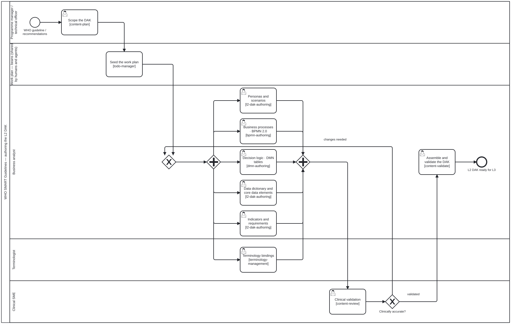

{: .note }
> Generated from [`cat-harness/skills/authoring-who-smart-guidelines/l2-dak-authoring.md`](https://github.com/litlfred/folio-assistant/blob/main/cat-harness/skills/authoring-who-smart-guidelines/l2-dak-authoring.md) — do not edit here. Typed contract: [schema reference](../skills/l2-dak-authoring.html).
>
> [✎ Edit this page's source](https://github.com/litlfred/folio-assistant/edit/main/cat-harness/skills/authoring-who-smart-guidelines/l2-dak-authoring.md){: .fa-edit-source }


# l2-dak-authoring

> Skill id: `l2-dak-authoring` · Package: `authoring-who-smart-guidelines` ·
> Named by `l2-dak-authoring.bpmn` steps **Personas and scenarios**,
> **Data dictionary and core data elements**, **Indicators and requirements**,
> all in the `Business analyst` lane.

Author the **L2** layer of a WHO SMART Guideline: the human-readable,
machine-*processable* Digital Adaptation Kit that sits between a narrative
guideline (L1) and FHIR artefacts (L3).

> **Sourcing.** The DAK component set and the L1–L4 knowledge layers are WHO's,
> defined in the SMART Guidelines documentation and realised in
> `WorldHealthOrganization/smart-base`. This skill states how to work them
> **in this harness** — which lane, which inputs, which tooling — and defers to
> WHO for what a DAK component must contain. Where the two disagree, WHO is
> right and this file is stale.

## Inputs and outputs

`schemas/skills/l2-dak-authoring/` is the contract:

- **in** — `dakComponent` (required), `sourceGuideline` (required),
  `existingContent`, `sprintNumber`
- **out** — `artifacts`, `status`, `validationIssues`

`dakComponent` is the unit of work. Author one component per pass; a DAK is
completed component by component, and a sprint that touches five half-way is
harder to review than one that finishes two.

## What L2 is for, and the mistake to avoid

L2 is **structured but not yet FHIR**. Its job is to be reviewable by a
clinical SME who does not read FHIR, while being regular enough that L3 can be
derived from it rather than written twice.

So the failure mode is authoring L2 *as if* it were L3 — reaching for profiles,
slicing and invariants at a stage whose reviewer is a clinician. If a decision
can only be expressed in FHIR, it belongs in `l3-fhir-authoring`; if it can be
stated as a data element, a decision rule or an indicator, it belongs here.

## The three activities the process names

| step | produces | note |
|---|---|---|
| Personas and scenarios | the actors and the user journeys they appear in | These are the DAK's own personas, and they are **not** this harness's `scenarios/roles.json` — do not conflate the two vocabularies. |
| Data dictionary and core data elements | the data dictionary | `data-dictionary-authoring` is a facet of this skill, not a separate one; the input schema already carries `data-dictionary` as a component. |
| Indicators and requirements | indicators, functional and non-functional requirements | Requirements here are the DAK's, distinct from `skills/requirements/*.json`, which are this harness's own conformance obligations. |

Business processes and decision logic are the sibling skills `bpmn-authoring`
and `dmn-authoring`; terminology binding is `terminology-management`.

## Tooling

`smart-base` carries the extractors that read authored L2 artefacts —
`dd_extractor`, `dt_extractor`, `req_extractor`, `extractpr`. Load a checkout
rather than vendoring it; `smart-base-tools` states why and how, and what
happens when `SMART_BASE_HOME` is unset (the skill degrades to `skip`, it does
**not** report a clean run over a toolchain it never had).

## Where this sits

`l2-dak-authoring.bpmn` carries `<folio:policy enforcement="advisory"/>`: it is
a per-content-type process, and this package owns what "adequate" means in its
domain. That is licence to adapt the sequence, not to skip the gate — the base
processes it feeds (`editing-hci-validation`, `content-lifecycle`) stay strict.


## Processes that run this skill

This skill has its own process: **[L2 DAK authoring](../../processes/l2-dak-authoring.html)**.

| process | step(s) that name it |
|---|---|
| [L2 DAK authoring](../../processes/l2-dak-authoring.html) | Personas and scenarios; Data dictionary and core data elements; Indicators and requirements |

