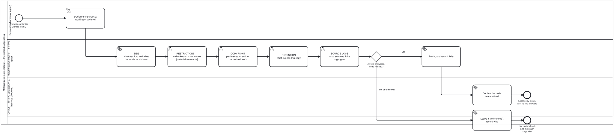

{: .note }
> Generated from [`../large-datasets/skills/materialize-remote.md`](https://github.com/litlfred/folio-assistant/blob/main/../large-datasets/skills/materialize-remote.md) — do not edit here.
>
> [✎ Edit this page's source](https://github.com/litlfred/folio-assistant/edit/main/../large-datasets/skills/materialize-remote.md){: .fa-edit-source }


# Materializing remote content

**One process, and this repository already ran it twice before naming it.**

| caller | remote source | held locally | refresh today |
|---|---|---|---|
| `who-iris` | IRIS — 1,057,223 files, 361.55 GB | three items | nothing |
| `bootstrap` | a harness | the `cat-harness` checkout | `upstream-pins.json` |

`bootstrap/workflows/initialize-harness.bpmn` fetches a harness that **is**
remote content and lands it locally; `upstream-pins.json` exists because that
copy goes stale. A materialisation and its refresh, in production, named
neither.

Diagrams: [`materialize-remote.bpmn`](../../cat-harness/processes/materialize-remote.bpmn)
and [`refresh-materialized.bpmn`](../../cat-harness/processes/refresh-materialized.bpmn).
Schema: `folio-assistant-core/schemas/materialization.ts`. Nothing here restates
either — where they disagree, the schema wins and this file is wrong.

## Ask the purpose FIRST

`working` or `archival`, before any gate, because three of the five mean
different things under each.

| | `working` | `archival` |
|---|---|---|
| what is kept | derived content — sections, OCR | the **original bytes** |
| retention | expires; re-fetchable | **no expiry, by design** |
| `sourceLoss` | unanswered | **discharged** |
| fixity | not needed | **required** |

A process that gated first and asked afterwards would be judging a copy whose
obligations it did not yet know.

## The five gates

Each is a decision a **person** makes; none is answerable from a file. A gate
that only warns is a gate nobody fails — the `xom7` shape, where a workflow
failed all thirty times it ran with nothing in the repository saying so.

1. **Size** — what fraction, and what the whole would cost. **Refuse when you
   cannot tell**: "three items" with no denominator is not a size answer.
2. **Restrictions** — *"no restrictions known in context"* is a **state**, not a
   green light. `unknown` is never rendered as `permitted`.
3. **Copyright** — per bitstream, and separately for the derived work.
   `LICENSE-CONTENT.md` exists here and the ingestion pipeline does not read it.
4. **Retention** — what expires this copy. A copy with no expiry cannot be told
   from an abandoned one.
5. **Source loss** — what survives if the origin goes. **Only an archival copy
   discharges this.** Not hypothetical: the one IRIS record here carries a
   handle on `iris.wpro.who.int`, a regional instance merged away.

## Three states, and no default

`referenced` (it exists, we know where, we hold no bytes) · `materialized` ·
`unknown`. A node that has not declared one is **invalid**, not `unknown` — "the
author did not say" and "the author said they could not tell" are different
facts, and only the second is actionable.

A refusal is the process **working**. The node stays `referenced`, the graph
still knows it exists, and the refusing gate's basis is recorded so the next
agent does not re-litigate it.

## Refresh is not re-import

Three answers, not one: what changed upstream, what changed **locally**, and
what to do when both. `upstream-pins.json` answers the first for one caller;
nothing answers the second anywhere, and a materialized copy edited in place is
not a copy — overwriting it destroys work whose existence was never established.

**An archival copy is never refreshed.** Re-fetching it discards the state it
exists to keep. It gets a **fixity check** instead — has *our* copy rotted —
which is a different question with a different remedy: restore from backup,
never re-download.

## Before you enumerate anything

`large-datasets/schemas/source-descriptor.ts` answers the question that comes
*before* the gates: how to enumerate a corpus and ask it for a subset. Check
`subsetIsSelfContained` first — when it is `false` (mathlib), close the request
over its dependencies **before** gating, because the size being gated is the
closure's, not the request's.


## Processes that run this skill

This skill has its own process: **[Materialize remote content — the shared subprocess](../../processes/materialize-remote.html)**.

| process | step(s) that name it |
|---|---|
| [Materialize remote content — the shared subprocess](../../processes/materialize-remote.html) | Declare the purpose: working or archival; SIZE what fraction, and what the whole would cost; RESTRICTIONS unknown is an answer, not a green light; COPYRIGHT per bitstream, and for the derived work; RETENTION what expires this copy; SOURCE LOSS what survives if the origin goes; Fetch, and record fixity; Declare the node `materialized`; Leave it `referenced`, record why |
| [Refresh materialized remote content](../../processes/refresh-materialized.html) | ARCHIVAL verify fixity — never re-fetch; WORKING what changed upstream; What changed LOCALLY since; Adjudicate the conflict (calls a sub-process); Reconcile the two by hand; Re-materialize, re-asking the five gates — and record the new fixity; Keep the local edit, and re-pin so it stops being asked; Record the conflict, decide nothing, and do NOT re-pin |

