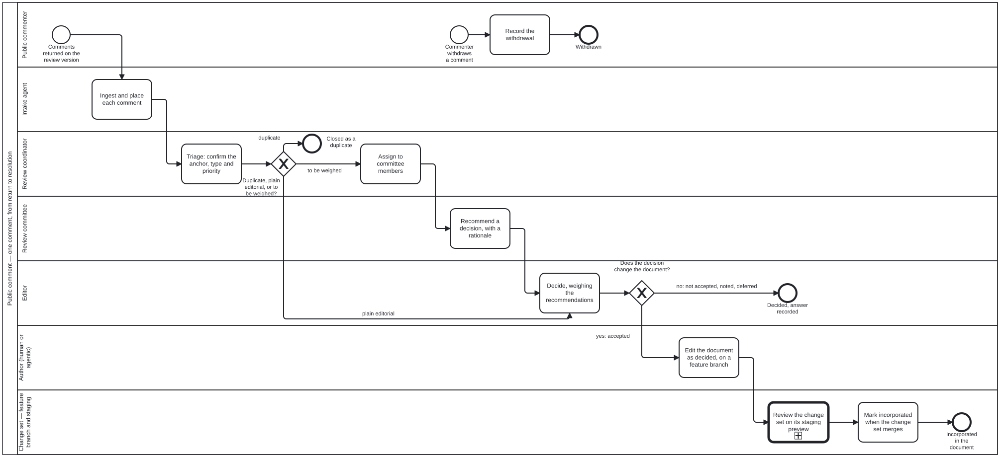

{: .note }
> Generated from [`folio-assistant-core/skills/content/folio-document-adapter/public-comment.md`](https://github.com/litlfred/folio-assistant/blob/main/folio-assistant-core/skills/content/folio-document-adapter/public-comment.md) — do not edit here.
>
> [✎ Edit this page's source](https://github.com/litlfred/folio-assistant/edit/main/folio-assistant-core/skills/content/folio-document-adapter/public-comment.md){: .fa-edit-source }


# public-comment

> Skill id: `public-comment` · Package: `folio-document-adapter` · Process:
> `folio-assistant-core/processes/content/public-comment.bpmn`
> (`Process_PublicComment`) · Tool: `folio-assistant-core/scripts/public-comment.ts`
> · Schema: `folio-assistant-core/schemas/public-comment.ts` · Bean `v26p`,
> issue #197.

Run a **public review** of a document folio. A frozen, line-numbered draft goes
out. Comments come back as spreadsheets, form exports, letters and GitHub
comments. Each comment is placed on the block it is about, triaged, weighed by
a review committee and decided by an editor. Where a decision changes the
document, the change lands on a feature branch whose staging preview shows the
text before and after.

## The one fact everything rests on: a comment cites the REVIEW VERSION

A reviewer writes "§3.4.5, p.22, l.618–624". Those numbers exist only in the
PDF the reviewer read. Word computes pages and lines at layout time and stores
neither. Once an editor changes the folio, the numbers no longer describe the
current text.

So the review version is frozen in the library, and the folio is extracted from
it in two halves:

1. `docx-structure.py` reads the **structure** from the .docx: headings, lists,
   tables, figures, footnotes, call-out boxes.
2. `pdf-line-map.py` reads the **page and line** of every item from the
   line-numbered PDF, by matching letters only. A miss is reported, never
   guessed.
3. `docx-to-folio.ts` writes the editable folio. Every block's `meta.source`
   records its page, printed page and lines. `review-anchors.json` is the same
   index in one file, which is what the importer reads.

**Never regenerate the folio over editors' work.** `docx-to-folio.ts` refuses
a non-empty folio without `--force`. The anchors keep resolving after edits,
because they point at the frozen version, not at the current text.

Read the alignment stats (`pdf-line-map.json` → `stats`) before trusting a
comment's anchor. On the DPI-H draft, 97% of text items aligned to exact lines.
The `unaligned` rest are listed by method, not hidden.

## Intake: one store, four routes, nothing dropped

| route | command | anchor comes from |
|---|---|---|
| comment matrix (.xlsx) | `import <file>` | section, page, line or Table/Figure columns |
| online-form export (.csv) | `import <file> --channel online-form` | the same columns, per row |
| narrative letter or email | `import-narrative <file> --reviewer …` | section, page/line, table or quotation in each paragraph |
| committee or editor on GitHub | the `github` job, from an issue or PR comment | the `pc:` reference |

Rules that are not negotiable:

- **A row that resolves to nothing is `unplaced`, not dropped.** Triage places
  it (`triage <ref> --to <label>`) or leaves it as a general comment.
- **A narrative is split only where it cites something.** Paragraphs that cite
  nothing stay together as ONE general comment. Inventing an anchor for them
  would put a reviewer's words on a paragraph they never mentioned.
- **Re-importing a file is a no-op.** Batches are keyed by sha256.
- **Privacy.** The reviewer's email is never written. Their name is written
  only when they answered the acknowledgement question "Yes". Keep the
  original spreadsheets OUT of the folio's repository, because they hold
  emails. Record the batch, and keep the file in the review owner's private
  store.

## Placing a comment: how much to trust the anchor

`anchor.method` says how the place was found, and `confidence` says how far to
trust it:

- `caption` (high): "Table 3.1" named a captioned block.
- `page-line` (high, when the cited section agrees): the page is read as the
  **printed** page first, then as the PDF page index. Printed numbering restarts
  in the front matter, so the cited section breaks ties. "Section does NOT
  agree" in `anchor.note` is a triage signal. Check the comment.
- `quote` (medium or low): a quotation found in the text. Low means it occurs
  more than once. The other places are in `candidates`.
- `section` (medium): only the section number resolved. The anchor is the
  section label.
- `manual`: a person placed it with `reassign`.

## The lifecycle, and who moves it

`received → triaged → assigned → recommended → decided → editing → incorporated`, plus
`duplicate` and `withdrawn`. Every move is a task in `public-comment.bpmn`.
`transition()` refuses any other move. Do not edit a comment's `status` by
hand: the dashboard counts statuses, and a hand-closed comment reads as
adjudicated when no one decided it.

| who (role) | does | how |
|---|---|---|
| review coordinator (`review-coordinator`) | triage, place, mark duplicates, assign | `triage`, `reassign`, `duplicate`, `assign` |
| committee member (`reviewer`) | recommend a decision, with a rationale | a GitHub comment `pc: PC-0042` / `recommend: accepted-modified`, or `recommend` |
| editor (`editor`) | decide, with a reason unless accepted | `decide: …` on GitHub (editors only) or `decide` |
| author (`author`), human or agentic | once a comment is dispensed with a changing decision, make the edit on a feature branch | `edit <ref> --branch … [--to <login>]` |
| pipeline (`build-pipeline`) | build the change set's staging preview, mark it incorporated on merge | staging workflow, `incorporate` |

Who can move a comment from GitHub. Both roles are read from the repository
itself by default (owner, 2026-10-05), so nobody maintains a list:

- **Editor: the repository's owner.** Only the editor decides.
- **Committee: the repository's collaborators** (owner, member or
  collaborator). Adding someone as a collaborator on GitHub is the whole
  on-boarding.

GitHub marks every comment with the commenter's relationship to the
repository, and that mark is what is checked. An `editors` or `committee` list
in `config.json` replaces that role's default with exactly those logins.
Anyone may *discuss* a comment there, but the record is not open to everyone.

The five decision codes (owner, 2026-10-04): `accepted`, `accepted-modified`,
`not-accepted`, `noted`, `deferred`. Every code but `accepted` needs a reason,
because the commenter is owed one.

## Change sets: group comments, show the change

One editorial change often answers several comments, and one comment
sometimes needs several changes. Neither is a problem, because the change set
is the **branch**, not the comment:

1. Branch from `main`. Name it for the change, not for one comment.
2. Record the author's step on each comment: `edit <ref> --branch <b>`.
   The dashboard then shows the comment as *editing*, with its branch. The
   author may be a person or an agent in the `author` role. An agent edits only
   what the decision says, and the decision's reason is its brief.
3. Edit the folio's blocks. Open the PR at the first commit
   ([`continual-progress`](continual-progress.md)).
4. List the comments the PR answers in its body, one `PC-0042` per line.
   `decide <ref> --branch … --pr …` records the link on each comment.
5. The staging preview is published to `STAGING/<branch>/`. The dashboard links
   each comment's anchor on `main` (before) and on the preview (after). See
   [`staging-review`](staging-review.md).
6. On merge, `incorporate` each comment.

This is the same review loop as any content change
(`content-change-review.bpmn`), with a different intake. Reuse it rather than
building a parallel review.

## What not to do

- Do not answer a comment by editing the review version in `library/`. It is
  frozen, and every anchor depends on it.
- Do not re-anchor by renaming a block. Labels are the anchors. A block that
  is split or merged records its old label in `renamedFrom`.
- Do not put a decision in a commit message only. The comment record is the
  record. A commit is evidence.


## Processes that run this skill

This skill has its own process: **[Public comment on a review draft](../../processes/public-comment.html)**.

| process | step(s) that name it |
|---|---|
| [Draft, review and publish](../../processes/draft-to-publication.html) | Public comment on the review version (calls a sub-process) |
| [Public comment on a review draft](../../processes/public-comment.html) | Ingest and place each comment; Triage: confirm the anchor, type and priority; Assign to committee members; Recommend a decision, with a rationale; Decide, weighing the recommendations; Edit the document as decided, on a feature branch; Mark incorporated when the change set merges; Record the withdrawal |

