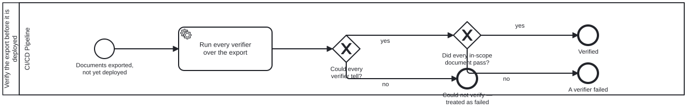

{: .note }
> Generated from [`cat-harness/skills/sdlc/sdlc-core/publish-verification.md`](https://github.com/litlfred/folio-assistant/blob/main/cat-harness/skills/sdlc/sdlc-core/publish-verification.md) — do not edit here.
>
> [✎ Edit this page's source](https://github.com/litlfred/folio-assistant/edit/main/cat-harness/skills/sdlc/sdlc-core/publish-verification.md){: .fa-edit-source data-fa-link="edit" data-src="cat-harness/skills/sdlc/sdlc-core/publish-verification.md" data-repo="litlfred/folio-assistant" }


# Publish verification, and the one alert

Bean `vigi`. Owner, 2026-09-23: *"a set of post processing tools for
verification that a failure triggers an alert to the publisher manager …
new sub-process"*, run **before deployment**; and *"every step post 'push
the publish button' should be same"*.

## The two processes

- **`publish-verification.bpmn`** — the verifier set over the built tree,
  between the export and the deploy. Pass, fail, or could-not-tell; the
  caller deploys only on a pass.
- **`publish-alert.bpmn`** — ONE alert, called from every failure edge in
  `docs-site-publish.bpmn`: an incomplete export, a verification failure, a
  failed deploy, a lost preview. It reaches the role that already owns the
  release: the **publication manager**.

## The verifier set

`bun run publish:verify -- --dir <built site> [--report out.md]` —
`scripts/publish-verify.ts`. Exit 0 pass · 1 a finding · 2 could not tell.
The caller treats 1 and 2 alike: an unverified release is not a verified one.

Each verifier is one entry in `VERIFIERS`: an id, the question it asks, and a
function from the directory to findings. **Adding a verifier is adding an
entry**; the report, the exit code and the alert need no change. Give it a
test that builds a document to break it, as `publish-verify.test.ts` does.

**`jsonld-expand`** is the first: every JSON-LD document of ours is expanded
by a real processor (`jsonld.js`, network refused). A key the `@context` does
not declare is DROPPED by a processor, silently — the first run found the
vocabulary losing `layer` on all 159 terms and the fsh-guts export losing
`skipped`.

## A verifier the preview cannot ask is a release failure waiting (STRICT)

The staging preview runs the same verifier set, so a preview is never greener
than the release it previews. **That promise breaks wherever the preview
answers a different question.** It serves the PUBLISHED search index
(`--search-index borrowed`), so `search-index` there asks only "present and
parsing", never "does it cover the pages". #2194 was green in its preview, and
its production publish was refused (#2233): *"indexes 1003 page(s) while 4189
offer a search box"*. Nothing was deployed.

So the preview asks the coverage question of the index **it built**, before
swapping in the published one:
`publish-verify.ts --dir ./_site --only search-index`. The rule, for any
verifier added later: **if the preview substitutes an input, the verifier runs
on the preview's own input before the substitution.** A check only the
release asks fails after merge, on main, where everyone pays for it.

**Deliberate exclusion is marked in what is built.** `search_exclude: true`
is front matter, and front matter is gone after Jekyll. `head_custom.html`
writes `<meta name="fa-search-exclude">` for it, and `search-index` leaves
those pages out of the coverage denominator and COUNTS them in its finding.
An exclusion the built page does not carry cannot be told from a truncated
index, and the release check will refuse it, correctly.

## What is in scope

A document is ours when its `@context` names our content context or binds a
namespace in the `own-namespaces` code list. Everything else in the tree —
a WHO IG's ingested artefact index — is counted as out of scope, reported,
and never able to block the release. The same scoping as bean `2j09`.

## Triage, for the publication manager

The alert is a tracking issue labelled `publication-manager`: opened on the
first failure, **commented on** for each later one (a comment notifies; an
edit does not), closed by the next clean publish. The issue says which step
failed and whether the site deployed:

- **Nothing was deployed** (the export, or verification) — the live site is
  the previous publish. Hold, or fix forward.
- **The site deployed** and something after it failed (a lost preview) — it
  is live. Say so in the issue before fixing.

The label names the role, not a person: no actor declares a GitHub account
for `publication-manager`. Watching the label is how a person takes the role.


## Processes that run this skill

This skill has its own process: **[Verify the export before it is deployed](../../processes/publish-verification.html)**.

| process | step(s) that name it |
|---|---|
| [A knowledge graph leaves for its own repositories](../../processes/kg-separation.html) | Every identifier dereferences (calls a sub-process) |
| [Publishing the docs site, and keeping the previews alive](../../processes/docs-site-publish.html) | Verify the export (calls a sub-process); Alert the publication manager (calls a sub-process) |
| [Alert the publication manager](../../processes/publish-alert.html) | Triage the failure: hold or fix forward |
| [Verify the export before it is deployed](../../processes/publish-verification.html) | Run every verifier over the export |

