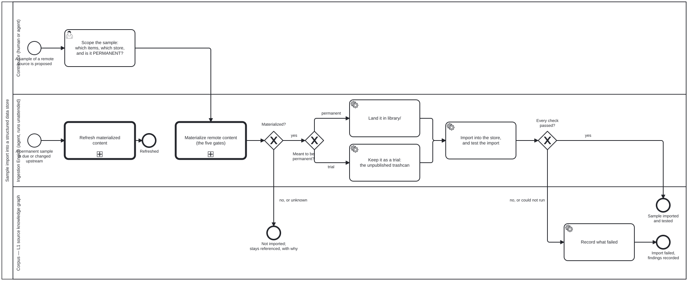

{: .note }
> Generated from [`cat-harness/skills/content-lifecycle/sample-import.md`](https://github.com/litlfred/folio-assistant/blob/main/cat-harness/skills/content-lifecycle/sample-import.md) — do not edit here.
>
> [✎ Edit this page's source](https://github.com/litlfred/folio-assistant/edit/main/cat-harness/skills/content-lifecycle/sample-import.md){: .fa-edit-source }


# Sample import

The SDLC for trying out a remote source before committing to it: take a
sample, land it, import it into the store you care about, and find out what
breaks. The process is `processes/sample-import.bpmn`. IRIS is the worked
instance (`who-iris/`); nothing here is WHO-specific.

## The gates are not here

Size, restrictions, copyright, retention and source loss are asked **once**,
by [`materialize-remote`](../../../large-datasets/skills/materialize-remote.md),
and this process only reads the outcome. Bean `hpax`: *"neither has its own
copy of the four gates."* A second copy would be a second answer free to
disagree with the first.

What each gate refuses on is in that skill. What this skill adds is what
happens **around** it.

## 1. Scope — three answers before anything is fetched

| question | why it is asked first |
|---|---|
| **Which items?** By the source's identifiers, or a subset strategy its descriptor (`large-datasets/sources/`) supports. | the size gate needs a request to measure |
| **Which store?** The graph or database the import is tested against. | the test in step 4 is against *this* store's schema |
| **Permanent or trial?** | it decides where the copy lands, and moving a landed copy later means moving it under the wrong obligations |

There is no default for the third. An unscoped sample goes back to the
person who proposed it.

## 2. Materialize — call, and branch on the outcome

Call `Process_MaterializeRemote`. `referenced` (any gate refused or unknown)
ends the sample: nothing is imported, and the refusing gate's reason is
recorded so the next attempt does not re-litigate it.

## 3. Land it where its permanence says

Owner, 2026-09-23: *"if sample-import is not intended to be permanent,
materialise to fsh-guts"*.

| | permanent | trial |
|---|---|---|
| destination | `library/` | `fsh-guts/` |
| published | yes, with the library | **no** — kept, addressable, exported, never rendered |
| refreshed | yes, by `refresh-materialized` | **no** — it records what the source looked like when tried |
| provenance | the materialization record | `$schema: folio-fsh-guts/v1`, plus the bean or issue it was written under. Never a `movedFrom`: it was not moved from anywhere, and inventing one is false provenance. |

**Promoting a trial** means running the process again with *permanent*. The
gates are asked afresh; a trial's answers were given for a trial.

## 4. Import and test

Load the landed sample into the store and check:

- **completeness** — every requested item arrived (count against the request);
- **identifiers** — the descriptor's *authoritative* identifiers survived;
- **structure** — each node validates against the store's schema;
- **provenance** — source, revision and fixity are attached to each node.

**A check that could not run is a failure, not a pass.** That is the whole
reason the gateway is labelled *"no, or could not run"*.

## 5. Record the outcome — every path

- passed → where it landed and what was checked;
- failed → which check, on which items, with the evidence. **The landed copy
  stays**: a failed import is information about the source or the store, and
  removing the copy destroys it (`deletion-requires-confirmation`).

## Why bootstrap does not call this

Bean `hpax` asked that bootstrap's initialisation call the shared
subprocesses, *"or a bean records exactly why it cannot yet."* It cannot:
`bootstrap` is the floor (`needs: []`) and these processes live in
cat-harness, which needs bootstrap. A call from bootstrap up to cat-harness
is an edge `layer-direction.ts` reports as **wrong-direction**. The reason is
now a checkable fact, not an argument.


## Processes that run this skill

This skill has its own process: **[Sample import into a structured data store](../../processes/sample-import.html)**.

| process | step(s) that name it |
|---|---|
| [Sample import into a structured data store](../../processes/sample-import.html) | Scope the sample: which items, which store, and is it PERMANENT?; Materialize remote content (the five gates) (calls a sub-process); Land it in library/; Keep it as a trial: the unpublished trashcan; Import into the store, and test the import; Record what failed; Refresh materialized content (calls a sub-process) |

