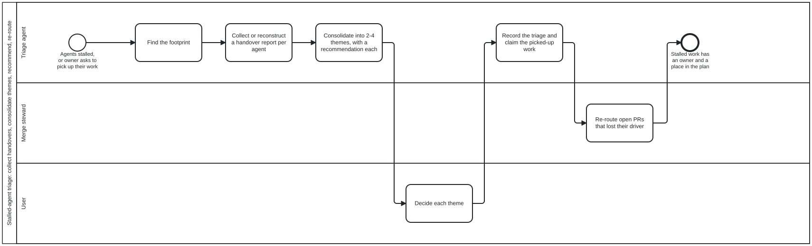

{: .note }
> Generated from [`cat-harness/skills/sdlc/sdlc-core/stalled-agent-triage.md`](https://github.com/litlfred/folio-assistant/blob/main/cat-harness/skills/sdlc/sdlc-core/stalled-agent-triage.md) — do not edit here.
>
> [✎ Edit this page's source](https://github.com/litlfred/folio-assistant/edit/main/cat-harness/skills/sdlc/sdlc-core/stalled-agent-triage.md){: .fa-edit-source data-fa-link="edit" data-src="cat-harness/skills/sdlc/sdlc-core/stalled-agent-triage.md" data-repo="litlfred/folio-assistant" }


# Stalled-agent triage

A stall is not an event anyone records. The agent simply stops, and what it
was holding is spread across a dozen PRs, branches and beans, half of them
mid-merge. This skill turns that scatter into a short list of themes, a
recommendation, and a coordinated restart.

It **reads and recommends**. It does not finish anyone's work, close their PRs
or delete their branches. Picking up a theme is a separate, claimed piece of
work ([`bean-coordination`](bean-coordination.md)).

## Inputs

One of:

- **Named:** session URLs, agent ids, branch names, PR numbers or bean ids.
- **A time window:** for example "everything touched in the last 6 hours", or
  "since the 14:00 safety check".

## Procedure

### 1. Find the footprint

Gather in one batched pass, using REST (`gh api …`; GraphQL `gh pr list`
returns 403 in agent sessions):

| source | how | what it gives |
|---|---|---|
| handover reports | `beans/notes/*` whose title starts `handover:`, on `main` and on every open PR branch | the agent's own account; **read these first** |
| open PRs | `repos/…/pulls?state=open`, filtered by author session (`Claude-Session:` in bodies and commits) or by `updated_at` in the window | PR, branch, head, CI, mergeability |
| branches | `git ls-remote --heads origin` and commit dates | work with no PR yet |
| beans | `beans list` with `in-progress`, plus holder notes ([`bean-coordination`](bean-coordination.md)) | claims, blocks, `## Done when` |
| workflow instances | `beans/workflows/*.json` updated in the window | where in which process each one stopped |
| discussions | the last comments on each PR and issue | owner rulings and open questions |

### 2. Collect or reconstruct a report per agent

- **If a handover report exists, use it.** Check its claims against the live
  state: a "CI running" in a report is a guess by now. Note every place the
  report and reality disagree.
- **If none exists, reconstruct one** with the
  [`handover-report`](handover-report.md) template. Fill it from the
  footprint, and mark it *reconstructed* with the source for each fact.
  Leave "Unpushed or at-risk state" as **unknown**, never as empty: what a
  stalled agent had not pushed cannot be seen from here.
- **If the agent is still reachable, ask it** (`SendMessage` or
  `send_message`) for its report. That is cheaper and truer than
  reconstructing.

### 3. Consolidate into 2–4 themes

Group the workstreams by **what they deliver**, not by which agent held them.
For each theme:

- **Goal and epic:** the bean it serves; a theme with no epic is a finding.
- **Members:** PRs, branches and beans, each with its state, using the
  `merge:overlap` columns once that tool exists.
- **Dependencies:** what waits on what, and which member unblocks the most.
- **Risk:** a red head, a conflict, unpushed work, or a decision only the
  owner can make.

More than 4 themes means the grouping is too fine. One theme means the
stalls were one piece of work, which is fine; say so.

### 4. Recommend

For each theme, say one of:

- **Continue as is:** re-dispatch to one agent from its handover, under its
  existing bean.
- **Fold into the current work plan:** name the epic and the position.
- **New epic or bean:** with a title, a `## Done when`, and the members it
  takes over.
- **Park:** status `todo` with a block that has an expiry
  ([`bean-blocking`](bean-blocking.md)).
- **Scrap:** only with the owner's say. Never delete a bean, a branch or a PR
  ([`deletion-requires-confirmation`](deletion-requires-confirmation.md)).

Present this to the owner as **one decision in full**, with a count of the
rest ([`interaction-modality`](interaction-modality.md)
§4.1). Recommend first and state the default.

### 5. Coordinate

- **Open PRs go to the merge steward.** Tell it which PRs have lost their
  driver, which are green and ready, and which are mid-merge. A mid-merge
  branch is one with local conflict resolution that was never pushed; it is
  lost, and it is better re-done from the PR head than guessed at.
- **Notify the owning sessions** that are still alive before anyone touches
  their branches ([`coordinate`](coordinate.md)).
- **Record the triage** as a bean note on each theme's epic, titled
  `triage: <date>`, so the next triage starts from this one.

## Anti-patterns

- **Re-doing a stalled agent's work from memory** of what it was doing. Read
  the branch: the commit is the truth.
- **Treating "no report" as "nothing in flight".** It means the opposite.
- **Restarting every stalled agent at once.** That is a swarm, and it needs
  the owner's yes ([`swarm-management`](swarm-management.md)), plus disk and
  CPU headroom: four agents regenerating at once filled a 9 GB allowance on
  2026-10-02.


## Processes that run this skill

This skill has its own process: **[Stalled-agent triage: collect handovers, consolidate themes, recommend, re-route](../../processes/stalled-agent-triage.html)**.

| process | step(s) that name it |
|---|---|
| [Stalled-agent triage: collect handovers, consolidate themes, recommend, re-route](../../processes/stalled-agent-triage.html) | Find the footprint; Consolidate into 2-4 themes, with a recommendation each |

