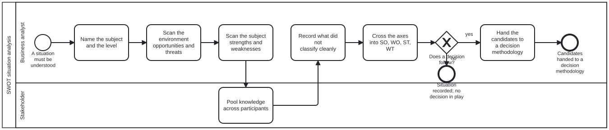

{: .note }
> Generated from [`skills/folio-core/swot-analysis.md`](https://github.com/litlfred/folio-assistant/blob/main/skills/folio-core/swot-analysis.md) — do not edit here.
>
> [✎ Edit this page's source](https://github.com/litlfred/folio-assistant/edit/main/skills/folio-core/swot-analysis.md){: .fa-edit-source }


# Running a SWOT scan

**The method is not in this file.** It is the `swot` node in the `methodology`
graph, rendered from an ingested source, and this skill is the instruction for
performing it. That split is `methodology-adoption`'s: a skill names the
methodology it follows, and the method's own text lives once, so two skills
quoting it cannot drift apart.

Read [`methodologies/swot.md`](../../methodologies/swot.md) first — in
particular §"What this platform adopts, and what it refuses". Ask the
`methodology` graph for it rather than assuming the path.

## The one refusal, before anything else

**A SWOT never decides.** It produces the raw material a decision is made from.
If you find yourself choosing between options inside a SWOT, you have left the
methodology: stop, and go to `options-analysis`, which selects a decision
methodology by context.

The diagram enforces this — `swot-analysis.bpmn` has no path that decides. If a
scan you are running seems to need one, that is a signal you are in the wrong
process, not a gap in this one.

## What each step must produce

| step | produces | the trap |
|---|---|---|
| **Name the subject and the level** | one sentence: what, and at which level (individual, organisational, national) | skipping it — quadrant criteria depend on the level, and a country is not a company |
| **Scan the environment** | opportunities and threats, worked through the source's six categories of change | free-associating instead of working the checklist |
| **Scan the subject** | strengths and weaknesses, worked through the source's seven business functions | recording a strength as a fact; it is a claim, and where evidence exists, cite it |
| **Pool knowledge** | the lists reviewed by more than their author | treating this as optional politeness rather than the method's own bias control |
| **Record what did not classify** | the factors sitting in two quadrants or none | forcing every factor into one quadrant, which reports a cleanliness the method does not have |
| **Cross the axes** | SO, WO, ST, WT candidate strategies | stopping at four lists, which is the source's own central criticism of SWOT |

**External is scanned before internal.** That is Weihrich's argument as the
source reports it — opportunities and threats are outside the subject and
largely beyond its control, and must be managed using its strengths and
weaknesses — not a house preference.

## Two things you will want to do, and must not

**Do not rank or score the factors.** SWOT has no priority mechanism; the source
is explicit that "quantity does not mean quality". A scored list asserts a
ranking the technique did not produce. When ranking is genuinely needed, use a
methodology adopted for ranking — not a weighting invented here.

**Do not blend in another method to patch the gap.** The source surveys a long
line of quantitative extensions (AHP, ANP, fuzzy variants, SMART, SMAA-O, MADM,
TRIZ). None is adopted. Reaching for one produces the composite
`methodology-adoption` forbids: a house method that cites nobody while claiming
everybody's authority.

## When SWOT is the wrong tool entirely

Ask `methodology-adoption`'s selection question. SWOT is **situation analysis**,
and it is the answer to none of those four questions — it is what you do *before*
them. If the task is choosing among options, grading evidence, recording a
decision, or computing a recurring branch, you want a different methodology and
a SWOT would be ceremony in front of it.

## Related

- [`methodologies/swot.md`](../../methodologies/swot.md) — the method, its
  contested origin, and its stated limitations
- [`methodology-adoption`](methodology-adoption.md) — the selection question, and
  why methodologies are parallel rather than composable
- `processes/swot-analysis.bpmn` — the executable process
- `processes/options-analysis.bpmn` — where the candidates go next


## Processes that run this skill

This skill has its own process: **[SWOT situation analysis](../../processes/swot-analysis.html)**.

| process | step(s) that name it |
|---|---|
| [SWOT situation analysis](../../processes/swot-analysis.html) | Name the subject and the level; Scan the environment opportunities and threats; Scan the subject strengths and weaknesses; Pool knowledge across participants; Record what did not classify cleanly; Cross the axes into SO, WO, ST, WT |

