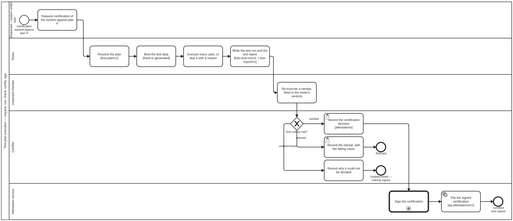

{: .note }
> Generated from [`cat-harness/skills/sdlc/sdlc-core/test-plan-execution.md`](https://github.com/litlfred/folio-assistant/blob/main/cat-harness/skills/sdlc/sdlc-core/test-plan-execution.md) — do not edit here.
>
> [✎ Edit this page's source](https://github.com/litlfred/folio-assistant/edit/main/cat-harness/skills/sdlc/sdlc-core/test-plan-execution.md){: .fa-edit-source }


# Running a test plan — from a request to a signed certification

> Skill id: `test-plan-execution` · Package: `sdlc-core` · Process:
> [`test-plan-execution.bpmn`](../../processes/test-plan-execution.html) ·
> Decision: [`test-certification.dmn`](https://github.com/litlfred/folio-assistant/blob/main/cat-harness/processes/sdlc/decisions/test-certification.dmn)

**A system is tested against a plan, by somebody who is not the system, and
certified by somebody who did not run the test.** Everything below is that
sentence made operational. It is arc `3fva` (bean `3o5b`), proposal
`docs/proposals/qa-reports-branch-and-test-process-2026-10-01.md` §3.

This skill is the PROCESS. How to write a test is
[`test-engineer`](test-engineer.md); how a folio's content is tested is
[`content-test`](content-test.md); why the
checker sees only a controlled context is
[`untainted-verification`](untainted-verification.md); how a signature is
routed by reach is [`qa-report-signing`](qa-report-signing.md). Read those for
their halves — this one does not restate them.

## The nodes, and who points at whom

| node | schema | where it lives |
|---|---|---|
| the plan | `test-plan/v1` — `schemas/test-plan.ts` | authored content (`test-plan` kind) |
| the system under test | the `systemUnderTest` facet on an actor — `schemas/skill-package.ts` | `scenarios/actors/*.json` |
| the run | `folio-test-run/v1` with `plan` + `sut` — `schemas/test-run.ts` | the declared `qa` directory |
| the report | `test-report/v1` — `schemas/test-report.ts` | the `qa-reports` branch, `tests/<plan>/<sut>/<run>/` |
| the certification | a judgement, `qa-attestations/v1` | the declared `attestations` graph, on main (D2 (a), D5 default) |

**The run points at the plan; the plan names no run.** A plan is reused across
runs and systems, so a back-pointer would turn authored content into live
state. Same direction for the report → run and the certification → report.

**The platform model is FHIR-free.** FHIR R5 TestPlan *informed* `test-plan/v1`
and is a DOWNSTREAM export target (bean `18p1`, in fhir-harness). Never read a
FHIR TestPlan as the source of a plan here.

## The system under test is a facet, not a role

Being tested is not a lane anybody takes on. An actor that can be executed —
`agent` or `system`, never a `person` or an `external` — declares:

```jsonc
// an illustration, not a declared actor
{ "id": "example-mcp-tool", "kind": "system", "reach": "internet",
  "systemUnderTest": { "kind": "tool", "version": "0.1.0" } }
```

`kind` is the closed list `SUT_KINDS` (`skill`, `agent`, `tool`, `machine`,
`ig`, `process`; owner ruling) — the same vocabulary as a plan's
`scope.kind`, so the two are compared, not translated. **Reach is the actor's
own `reach`**, read by `sutRefFor`; absent is `unknown`, never `internet`.

## The five lanes

| lane | role | does |
|---|---|---|
| Requester / SUT | `test-requester` | asks for certification of system S against plan P, naming P's id and version |
| Tester | `tester` | resolves P, binds its data, executes every case, writes the run and the report |
| Untainted checker | `untainted-checker` | re-executes a SAMPLE of cases, blind to the tester's verdicts |
| Certifier | `certifier` | applies the plan's `exitCriteria` table, then records the decision |
| Attestation service | `attestation-service` | signs, via `qa-report-signing.bpmn`, and files the certification |

**The tester is untainted from the system under test.** The SUT may request; it
may never be the tester, the checker or the certifier, and it never writes a
verdict about itself — `test-report/v1` refuses a reviewer whose `id` or
`actor` is the SUT's actor, and `test-sut-not-self-judged` audits it.

### Tester

1. **Resolve the plan.** P parses as `test-plan/v1`, names at least one `req:`
   requirement (owner ruling), its `exitCriteria.decision` resolves to a
   decision in a `.dmn` that exists, and its `scope.kind` matches the SUT
   actor's facet kind. A plan that does not resolve is not run.
2. **Bind the test data** (bean `vm6m`). A *fixed* set is a committed path and
   is evidence only once reviewed (`isEvidence`). A *generated* set is a
   template + params + **seed** and is never materialised into the repository.
   Both feed the run's `data` hash; runner, configuration and scenario bank feed
   its `process` hash, and the two bases must be disjoint (`buildTestRun`
   refuses otherwise).
3. **Execute.** Every case is executed, or recorded `skipped` **with a
   reason**. A case with no verdict at the end of a terminal run is a finding,
   not an omission (`checkAgainstPlan`).
4. **Write the run and the report.** The run records `plan {id, version}` and
   `sut {actor, version, reach}`; the report rolls up per plan, never across
   plans (`py74`), and `testReportPath` says where it goes.

### Untainted checker

Re-executes a sample of the cases from the plan and the data alone — never the
tester's verdicts — and reports `agree`, `disagree` or `unknown`. It RULES ON
NOTHING (`untainted-verification` rule 3): the comparison is a fact the
certification table reads, not a verdict the checker writes.

### Certifier

The gateway is **computed**. Pass the facts; never assert the branch — the
engine refuses a hand-supplied outcome on a DMN gateway.

| fact | from |
|---|---|
| `reportStatus` | the report's `status` |
| `dataHashKnown` | the run's `data.hash` is not `unknown` |
| `unexecutedCases` | `checkAgainstPlan(...).filter(kind === "unexecuted-case").length` |
| `checker` | the untainted checker's `agree` / `disagree` / `unknown` |
| `failedCases` | `rollup.fail` |
| `passedCases` | `rollup.pass` |

The table returns `certified`, `refused` or `undetermined`. **`undetermined` is
the third state** — a running or aborted report, an unknown data hash, an
unexecuted case, a checker that disagreed or could not run, or a report in
which nothing passed. It is never rendered as certified, and it is not a
refusal either: it says the evidence does not decide, so nothing is signed.

**The certification decision is a judgement** (owner ruling). The table says
whether the exit criteria are met; the certifier — a person, a specialisation
of `stakeholder` — records the decision, and it lives with the other
judgements under the declared `attestations` graph, never on the `qa-reports`
branch with derived results.

### Attestation service

`Call_Sign` runs `qa-report-signing.bpmn` unchanged; its route (API or a human
release authority) is chosen there by the signer's reach. Then the signed
certification is filed under `attestations`.

## The four kg-audit criteria

Registered in `KG_CRITERIA` (`schemas/kg-qa.ts`), implemented in
`scripts/test-plan-audit.ts`, recorded on the graph roll-up:

| criterion | fails when | severity |
|---|---|---|
| `test-plan-resolves` | a plan does not parse, its exit DMN does not resolve, or a run/report names a plan, version or SUT that does not resolve (or a SUT whose facet kind is not the plan's scope) | critical |
| `test-case-executed-or-skipped` | a terminal report leaves a plan case with no verdict, or names a case the plan lacks | major |
| `test-data-hash-present` | a plan-run's data hash is `unknown`, or a report's run carries none | major |
| `test-sut-not-self-judged` | any verdict's reviewer is the system under test | critical |

Each records `n/a` when there is nothing of its kind to judge — no plan, no
plan-run, no report — and never a pass over nothing.


## Processes that run this skill

This skill has its own process: **[Test-plan execution](../../processes/test-plan-execution.html)**.



| process | step(s) that name it |
|---|---|
| [Test-plan execution](../../processes/test-plan-execution.html) | Request certification of the system against plan P; Resolve the plan [test-plan/v1]; Bind the test data [fixed or generated]; Execute every case, or skip it with a reason; Write the test run and the test report [folio-test-run/v1 + test-report/v1]; Re-execute a sample, blind to the tester's verdicts; Record the certification decision; Record the refusal, with the failing cases; Record why it could not be decided; File the signed certification [qa-attestations/v1] |

