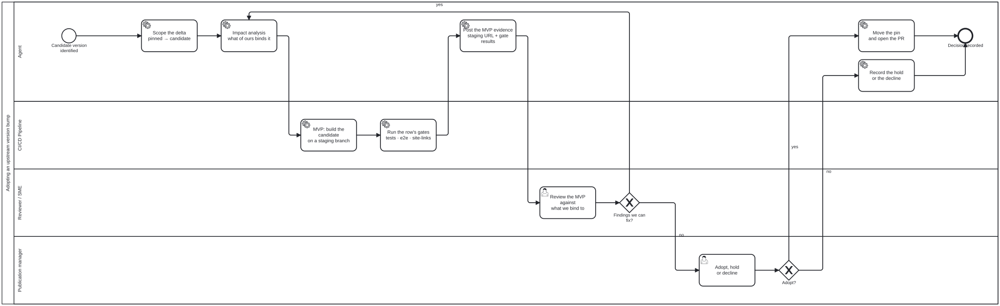

{: .note }
> Generated from [`cat-harness/skills/folio-core/upstream-version-adoption.md`](https://github.com/litlfred/folio-assistant/blob/main/cat-harness/skills/folio-core/upstream-version-adoption.md) — do not edit here.
>
> [✎ Edit this page's source](https://github.com/litlfred/folio-assistant/edit/main/cat-harness/skills/folio-core/upstream-version-adoption.md){: .fa-edit-source }


# Adopting an upstream version bump

An unpinned dependency is an unreviewed commit from a stranger, merged on every
build. A pinned one is a commitment that somebody has to revisit. This skill is
the second half: what happens between *upstream cut a release* and *we are
running it*.

It implements two diagrams, and the diagram is the source of truth for
ordering:

| Diagram | What it is |
|---|---|
| [`upstream-pin-watch.bpmn`](../../processes/upstream-pin-watch.html) | The **watcher**. Scheduled, mechanical, ends at either "every pin is current" or "one tracking issue says which is not". |
| [`upstream-version-adoption.bpmn`](../../processes/upstream-version-adoption.html) | The **reusable subprocess**, entered once per stale pin. Scope → impact → MVP → review → decide. |

The second is called, not copied: `calledElement="Process_UpstreamAdoption"`.
Any pinned upstream dependency enters it the same way, and a new tenant is a
registry row plus a call activity — never a second diagram that says the same
thing in different words.

## The registry is the tenant list, and it does not hold the version

`upstream-pins.json` at the repository root declares each pinned dependency:
the upstream repo, **the file the pin literal actually lives in**, the pattern
that reads it, what of ours binds to it, and the commands that constitute its
MVP.

**It deliberately does not store the pinned version.** The version lives in
exactly one place — `docs/_config.yml` for the theme — and the registry says
how to read it from there. A registry that carried its own copy would be a
second answer to "what are we running", free to disagree with the build, and
this repository has paid for that shape before. `bun run check:upstream-pins`
reads the literal out of the declared file; a pattern that matches nothing is
reported as an error, not as "no pin".

`binds` and `mvp` are the reason the registry exists at all rather than the
check simply grepping for version strings. They are what turn *impact analysis*
and *MVP* from words in a box into a list somebody can work through.

## 1 — Watch

`bun run check:upstream-pins`, weekly from `.github/workflows/upstream-pins.yml`
and on demand. For each row: read the pinned ref out of its declared file, list
the upstream tags that match `tagPattern`, and compare.

Exit codes, and the middle one is the point:

| Exit | Meaning | What the workflow does |
|---|---|---|
| 0 | every pin is at the newest matching release | closes the tracking issue if one is open |
| 1 | at least one pin is behind | opens **one** issue labelled `upstream-pin`, or **edits** the existing one |
| 2 | could not determine — upstream unreachable, pattern did not match | leaves the issue untouched and **fails the job** |

Three rules it inherits from `check-ci-health.ts`, and they are not optional:

- **"Could not check" is never rendered as current.** An unreachable upstream
  is exit 2, not exit 0. A watchdog that goes blind must not read as good news.
- **One issue, edited in place.** GitHub's own notifications are the channel
  that was already ignored thirty times; an edit does not notify, so a pin that
  stays stale for two months stays one unread item rather than nine.
- **The job fails on exit 2**, which makes this workflow itself red on the
  default branch, which `check:ci-health` reports. The watchdog is watched.

## 2 — Impact analysis

**Scope the delta first, and scope it to what reaches our output.** The upstream
changelog is the claim; the diff is the evidence. For a Jekyll theme that means
`_sass`, `_includes`, `_layouts` and `assets` — a change to upstream's own docs,
CI or tests cannot reach us:

```sh
git -C <upstream-clone> diff --stat <pinned>..<candidate> -- _sass _includes _layouts assets
```

**Then ask what of ours binds to it**, from the row's `binds` list. This is the
half that a changelog cannot tell you, because upstream does not know what you
reached into. For the theme it is concrete and small: `docs/assets/js/docs-ui.js`
*moves* the theme's own search markup into the action launcher, binding `.search`,
`#search-input` and `.search-label`; `docs/assets/css/docs-ui.css` overrides
`.side-bar`, `.site-header` and `.main-header`; and three e2e specs assert the
structure the theme emits. An upstream rename of any of those is not a build
failure — it is a shipped feature that quietly stops working, which is the
failure mode a pin exists to convert into a decision.

Write the analysis down as the bean's note before building anything. A candidate
that touches nothing we bind to is a different conversation from one that
renames a selector we depend on, and the reviewer needs to know which they are
looking at before they look.

## 3 — MVP

**An MVP is a deployed build, not a description of one.** Move the pin on a
branch, let `feature-staging.yml` publish it under `STAGING/<branch-slug>/`, and
run the row's `mvp` commands. For the theme:

```sh
rm -rf _kg _site
bun test                              # unit tests
CI=1 bunx playwright test             # a11y, action tiles, sidebar panels, qa panel
bun run scripts/site-links.ts --site ./_site   # every navbar tile resolves in the BUILT site
```

`site-links.ts` is the one that earns its place here: it checks the tiles
against the real `_site` rather than against the attribute, which is the
distinction that let a 404 ship unnoticed once already.

**A red gate is evidence, not an exit.** It does not end the process and it
does not loop on its own — it goes to the reviewer with everything else,
because "this version breaks us" is a finding the decider needs, not a reason
to stop before they see it.

## 4 — Review

Post the staging URL, the gate results and the impact analysis on the PR, then
hand it over. The reviewer's question is narrower than "is the new version
good": it is **does anything in `binds` still hold**, checked against the
deployed page rather than against a screenshot.

Findings the agent can fix — our overlay adapting to a renamed class, a test
fixture updated to the markup the theme now emits — loop back into impact
analysis on the same branch. Findings that are upstream's behaviour rather than
ours go to the decision as they are.

## 5 — Decide

**A person decides, and the diagram says so.** `PM_Decide` is a `bpmn:userTask`
in the publication manager's lane, and that role admits `person` only, so
`activity-fulfilment-kind` fails the moment somebody tries to make an agent the
accepting party. It also carries `<cat-harness.processes:policy relaxable="false"/>`: no
package may relax it.

The lane is the publication manager's rather than the editor's because the pin
is not a change to the corpus — it is a change to what the published artefact
is built from, and that role is the one "accountable for what is live".

The gateway is **not** DMN-backed, and that is deliberate. Every other computed
gateway in this repository reduces to arithmetic over tool output; this one
weighs a rendering nobody can score against the cost of staying behind. A table
here would look authoritative and would not be.

Three outcomes:

- **Adopt** — move the pin, open the PR, and say in the body what the version
  range changed in rendered output. Record the evidence you used, not just the
  verdict.
- **Hold** — record it as a **block with an expiry and a revisit trigger**
  ([`bean-blocking.md`](bean-blocking.md)). A hold with no expiry cannot be told
  from abandoned work, and the next watcher run will re-raise the same pin with
  no memory of why it was left.
- **Decline** — record the reasons on the bean and scrap it. A scrapped bean is
  what stops the next agent re-entering the same dead end; a deleted one leaves
  them unable to tell a decision from an accident.

In every case the decision is written down before the process ends. The bean is
`resolve`d from the terminal step, so a run that stops at "we looked and said
no" is as finished as one that moved the pin.

## Adding a tenant

1. Pin the literal wherever the tool reads it, with a comment saying which
   process governs moving it.
2. Add a row to `upstream-pins.json`: `repo`, `pinnedIn`, `pattern`,
   `tagPattern`, `binds`, `mvp`.
3. Run `bun run check:upstream-pins` and confirm it reads your pin back. A
   pattern that does not match is exit 2 — "could not determine" — and the row
   is not watched until it does.

No diagram changes. That is what reusable means here.

## How to pick the pinned version when you first pin something

**Pin what is running, not what is newest.** Those are different changes, and
doing both at once means neither is reviewable — a regression cannot be
attributed to the pin or to the bump.

Establish what is running by **fingerprint, not by assumption**. For the theme
that meant finding a declaration in the deployed CSS on `gh-pages`
(`text-wrap: balance`, in `_sass/navigation.scss`) that entered upstream after
the newest release, which proved the live site was tracking the default branch
rather than any tag. The newest release at or below that point is the pin, and
the PR states the residual delta — one CSS declaration — rather than claiming
there is none.

If no fingerprint discriminates, say so and pin the newest release anyway; an
unverified pin is still strictly better than an unpinned dependency, and
"could not determine" written down is worth more than a confident guess.


## Processes that run this skill

This skill has its own process: **[Adopting an upstream version bump](../../processes/upstream-version-adoption.html)**.



| process | step(s) that name it |
|---|---|
| [Watching a pinned upstream dependency](../../processes/upstream-pin-watch.html) | Read the pin registry upstream-pins.json; List upstream releases and compare to the pin; Close the tracking issue; Open or EDIT the one tracking issue; Pick up the stale pin claim a bean; Adopt the version bump (calls a sub-process) |
| [Adopting an upstream version bump](../../processes/upstream-version-adoption.html) | Scope the delta pinned → candidate; Impact analysis what of ours binds it; Record the hold or the decline |

