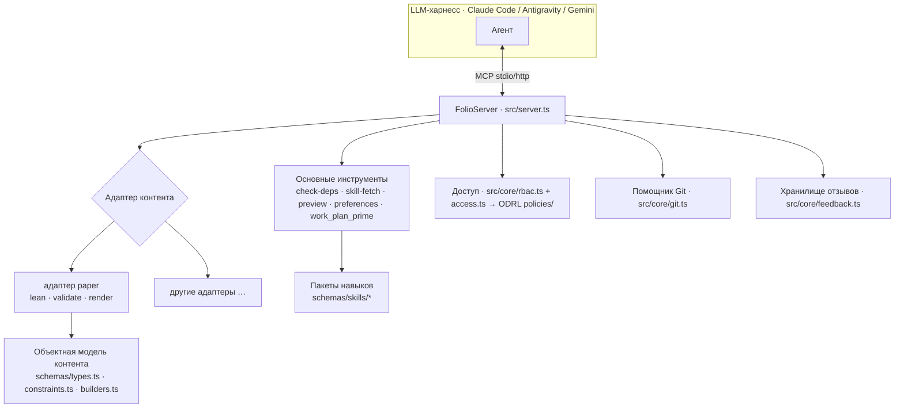

# Архитектура
{: .no_toc }

1. TOC
{:toc}

---

## Обзор

> **Правила, стоящие за этой страницей.** Архитектура описывает форму; Навыки
> определяют решения. Адаптеры относительно профилей —
> [`content-profiles`](reference/skill-instructions/content-profiles.html).
> Куда относится новый узел до его создания —
> [`placement`](reference/skill-instructions/placement.html). Структура
> репозитория и каждый вид графа —
> [`directory-conventions`](reference/skill-instructions/directory-conventions.html).
> Формирование и верификация поверхности MCP —
> [`mcp-assembly`](reference/skill-instructions/mcp-assembly.html) и
> [`mcp-contract`](reference/skill-instructions/mcp-contract.html).
> При разногласиях между этой страницей и Навыком приоритет имеет Навык.

folio-assistant — это **MCP-сервер** с подключаемым уровнем **адаптеров контента**,
системой **навыков**, типизированной **объектной моделью контента**, **RBAC** и
стратегией развертывания. Контент, с которым он работает, находится в *отдельном*
репозитории — платформа не зависит от контента.

## Разделение ответственности — текущее и будущее состояние

Сегодня этот репозиторий представляет собой **репозиторий инструментов (Tool repo) и репозиторий контента (Content repo) в одном рабочем каталоге**. Задача
[#223](https://github.com/litlfred/folio-assistant/issues/223) планирует разделение
на пять компонуемых инстансов folio-assistant. Дочерние страницы раскрывают эту тему:

| страница | на какой вопрос отвечает |
|---|---|
| [Таксономия репозиториев](architecture/repo-taxonomy.html) | Какие виды репозиториев существуют — Tool, Test, Content, Consumer — и что может содержать каждый из них |
| [Текущее состояние](architecture/current-state.html) | Что фактически находится в этом репозитории сегодня (в измеренном виде) и где происходит смешение |
| [Будущее состояние](architecture/future-state.html) | Пять целевых репозиториев и то, какой каталог в какой из них попадает |
| [План миграции](architecture/migration-plan.html) | Фазы 0/I/II/III, контрольные точки (gates) и то, что пока остается нерешенным |
| [Минимальный `cat-harness`](architecture/cat-harness-minimum.html) | Что сохраняется в харнессе, если применить тест на «несамодокументируемость» |
| [Инстансы харнесса](architecture/harness-instances.html) | Чем ЯВЛЯЕТСЯ инстанс — схемы, визуализации, инструменты; четыре каталога; рендеринг по умолчанию |

Может показаться, что два последних пункта противоречат друг другу: минимальный вариант
говорит, что харнесс не создает ничего, на что смотрел бы человек, а страница об инстансах
утверждает, что инстанс выполняет рендеринг по умолчанию. На самом деле противоречия нет:
требование представляет собой **повышающуюся планку**, где `bootstrap` освобожден от
визуализатора и взамен обязан предоставлять собственные `.json`/`.jsonld`, а `cat-harness`
является тем уровнем, на котором начинает применяться все остальное. См.
[С чего начинается требование](architecture/harness-instances.html#where-the-requirement-starts--bootstrap-is-the-exception).

В остальной части этой страницы описывается архитектура **в ее текущем виде**.

## Структура репозитория

| Путь | Что здесь находится |
|------|---------------------|
| `src/` | Сервер MCP (`server.ts`), точка входа (`index.ts`), ядро (`git`, `rbac`, `cache`, `feedback`, `logging`) и основные инструменты (`tools/`) |
| `adapters/` | Адаптеры контента — `paper/` (Lean + LaTeX) и отдельный `mcp-server/` |
| `schemas/` | Объектная модель контента (`types.ts`, `constraints.ts`, `builders.ts`) и схемы JSON для каждого навыка (`schemas/skills/*`) |
| `skills/` | **Пакеты** навыков (`content-lifecycle`, `authoring-math`, `authoring-who-smart-guidelines`) с их Docker-манифестами |
| `content/` | Инструменты **пайплайна** контента (валидаторы, QA, вспомогательные скрипты рендеринга) — но не сам контент |
| `ui/`, `viewer/`, `home_page/` | Веб-интерфейс, интерактивный просмотрщик и пример сайта Pages |
| `deploy/` | Развертывание (Caddy, docker-compose, провижининг, OAuth) |
| `docs/` | Этот сайт документации |
| `.github/` | CI-воркфлоу и скрипты (сборка, публикация, QA, документация) |
| `.claude/skills/` | Локальные навыки агента + хуки возможностей |

## Сервер MCP

`FolioServer` (`src/server.ts`) регистрирует основные инструменты, затем запрашивает у активного
**адаптера контента** регистрацию его собственных инструментов. Он поддерживает два типа транспорта — `--stdio`
(то, что запускают харнессы) и `--http` (общий долгоживущий инстанс). Вызовы инструментов
логируются с замером времени выполнения.

## Адаптеры контента

Адаптер контента инкапсулирует все, что специфично для конкретного типа: какие артефакты существуют,
как их валидировать, как их собирать/рендерить и какие дополнительные инструменты MCP
регистрировать. Адаптер `document` (`adapters/document/`) служит основой для текстовых (прозаических)
фолио; адаптер `paper` (`adapters/paper/`) расширяет его и предоставляет инструменты жизненного цикла Lean
(`lean_setup`/`build`/`check`/`status`), валидацию и рендеринг
(`paper_render_pdf`/`html`, `formula_render`). Для новых типов контента добавляется новый
адаптер — см. [Добавление типа контента](guides/new-content-type.html).

## Навыки и пакеты навыков

**Навык** — это задокументированная, ограниченная схемой единица работы (например,
`lean-formalization`). Навыки группируются в **пакеты**, которые объявляют свои
зависимости Docker/среды выполнения через `package-manifest.json`. LLM обнаруживает
навыки с помощью `skill_list` и загружает инструкции с помощью `skill_fetch`. Полный
список навыков и ролей — а также то, как они компонуются с LLM (RBAC, возможности,
требования), — находится на странице [Навыки и роли](skills.html); контракт
входных/выходных данных каждого навыка опубликован в
[Справочнике схем навыков](reference/skills/).

## Объектная модель контента

Для статей контент представляет собой дерево типизированных **блоков**, валидируемых во время выполнения с помощью Zod:

- `schemas/types.ts` — `Block`, `Section`, `Chapter`, `Paper` и виды блоков
- `schemas/constraints.ts` — схемы Zod и правила ограничений
- `schemas/builders.ts` — валидируемые конструкторы (`definition()`, `theorem()`, …)

Они задокументированы в сгенерированном [Справочнике по TypeScript API](api/).

## Управление доступом — ODRL, проверка перед каждой задачей

Существует единая система разрешений, и это W3C ODRL 2.2 (issue #1180): действия
в `skills/permissions/permissions.json`, права в `policies/*.jsonld`,
оцениваемые с помощью `permits()` / `decide()` в `schemas/odrl.ts`. К ней обращаются два вызывающих компонента:

- **Исполнитель BPMN** перед каждой задачей и решением
  (`src/workflow/authorize.ts`): аутентифицирован ли субъект, подходит ли он
  для роли данной дорожки, разрешено ли ему выполнять здесь `perform-task` и
  имеет ли он право работать с контентом? На сегодняшний день носит рекомендательный характер:
  `deny` или несоответствие роли приводят к отказу, а `unknown`
  фиксируется в журнале.
- **HTTP-маршруты** через `src/core/rbac.ts`: каждый маршрут указывает действие,
  которое он выполняет (`content-authoring`, `review-comments`, `adjudication`), а
  сессии шлюза аутентификации (auth-gateway) объявляются субъектами, чьи права заданы в
  `policies/http-gateway.jsonld`. Здесь `unknown` приводит к отказу.

Вплоть до issue #1207 (2026-09-23) файл `rbac.ts` представлял собой отдельную
иерархическую лестницу viewer < collaborator < owner, а исполнитель ничего не проверял. Данный
регламент закреплен в навыке
[`task-authorization`](reference/skill-instructions/task-authorization.html).

## Прайминг плана работы (между харнессами)

План работы хранится в `beans` и предоставляется тремя способами, благодаря чему любой
харнесс получает идентичный прайминг:

1. **`AGENTS.md`** — статический регламент, нативно считываемый каждым агентом.
2. **Хук `SessionStart`** — каждый харнесс запускает общий скрипт прайминга
   `scripts/session-start-coord-sweep.sh`.
3. **MCP-инструмент `work_plan_prime`** — динамический прайминг в реальном времени для любого агента, подключенного к MCP.

Полное описание кросс-агентной архитектуры см. в `docs/folio-assistant-migration.md`.

## Развертывание

`deploy/` содержит шаблон обратного прокси Caddy, `docker-compose.yml`,
скрипт провижининга, настройку Google OAuth и скрипт самообновления для запуска
общего HTTP-инстанса. Docker-манифесты пакетов навыков объединяют зависимости apt/pip/npm
в единый образ для каждого активного набора пакетов.
