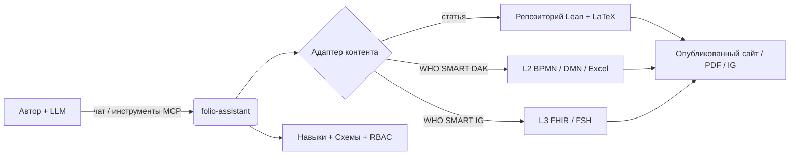
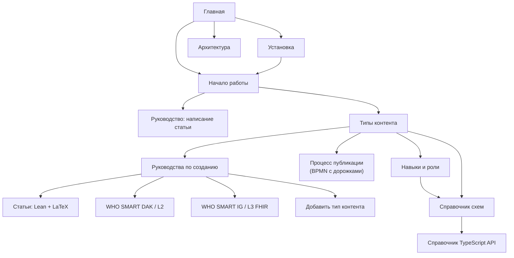

# folio-assistant
{: .fs-9 }


Не зависящий от контента фреймворк навыков агента для создания строгого контента
с помощью большой языковой модели — научных статей и книг, руководств ВОЗ SMART
Guidelines и руководств по реализации FHIR — на базе MCP-сервера, управления
доступом на основе ролей и типизированной объектной модели контента.
{: .fs-6 .fw-300 }

[Начать работу](../getting-started.html){: .btn .btn-primary .fs-5 .mb-4 .mb-md-0 .mr-2 }
[Установить](../installation.html){: .btn .fs-5 .mb-4 .mb-md-0 .mr-2 }
[Посмотреть на GitHub](https://github.com/litlfred/folio-assistant){: .btn .fs-5 .mb-4 .mb-md-0 }

---

## Четыре вещи, по порядку

**1. План работы — это место, где вы говорите, что делаете.**
Не сообщение в чате и не комментарий, а [beans]({{ '/beans-and-todos.html' | relative_url }}) — хранилище под контролем версий, которое может прочитать любая сессия или агент. Займите задачу до начала работы, чтобы соседняя сессия не взяла её же; ненужный bean помечается `scrapped` с указанием причин и никогда не удаляется.

```sh
cat-harness/scripts/install-beans.sh && export PATH="$HOME/.local/bin:$PATH"
beans list                          # что открыто
beans create "<title>"              # …проверив, что такого заголовка ещё нет
beans <id> --status in-progress     # занять задачу, у всех на виду
```

**2. Создайте свой первый folio.** Этот репозиторий — *платформа*; ваш контент живёт в собственном репозитории. Одна команда создаёт его каркас — манифесты, декларацию, файлы агента и ссылку обратно сюда:

```sh
bun run init-folio --help
```

Затем раздел [Начало работы]({{ '/getting-started.html' | relative_url }}) проводит первый блок через проверку, рендеринг и рецензирование.

**3. Знайте, что именно вы пишете.** *Документ* — это структурированная проза; *статья* (paper) — это то же самое плюс типы блоков, утверждение которых является формальным утверждением, подкреплённым Lean и свёрстанным через LaTeX. Выбор определяет, какие блоки допустимы и какие проверки запускаются: [Типы контента]({{ '/content-types.html' | relative_url }}).

**4. Документация, которую вы никогда не прочтёте.**
[Вся она]({{ '/guides/index.html' | relative_url }}) — руководства по написанию, архитектура, процесс публикации, сгенерированный справочник по схемам и навыкам. Она здесь, она подробная, и честно говоря, вы придёте к ней из поисковика ровно в тот момент, когда что-то сломается. Это нормальный способ ею пользоваться. Три шага выше — те, что стоит прочитать сейчас.

Когда вас озадачивает не написание, а *механизм* — кто что делает, в каком процессе, с каким навыком, — начните с раздела [Платформа]({{ '/platform.html' | relative_url }}). Одно предложение там содержит всю модель, и каждое слово в нём — отдельно объявленный объект.

---

## Что такое folio-assistant?

**folio-assistant** — это *платформа*, она не содержит самого контента. Она
предоставляет навыки, схемы, инструменты и сервер MCP (Model Context Protocol),
которые агент на базе LLM использует для планирования, создания, валидации,
рецензирования, тестирования и публикации **фолио** контента, находящегося в
отдельном репозитории.

> **Разделение ответственности.** В этой документации описан *формализм
> фреймворка* и *способы использования folio-assistant* — намеренно **отделенные
> от какого-либо конкретного контента**. Если контент встречается на этих страницах,
> он носит чисто иллюстративный характер (*пример*) и никогда не является каноническим артефактом.



## Поддерживаемые типы контента

folio-assistant **расширяем** — каждый тип контента обрабатывается адаптером
контента и соответствующим пакетом навыков. В настоящее время поддерживаются
следующие типы:

| Тип контента | Артефакты | Пакет навыков |
|--------------|-----------|---------------|
| **Научные статьи и книги** | Формализация Lean 4 + LaTeX/Markdown | [`authoring-math`](../content-types.html#scientific-papers--books) |
| **Комплекты цифровой адаптации (DAK) руководств ВОЗ SMART Guidelines** | Артефакты L2 — BPMN, DMN, словари данных Excel, персоны | [`authoring-who-smart-guidelines`](../content-types.html#who-smart-guidelines-daks-l2) |
| **Руководства по реализации ВОЗ SMART Guidelines** | Ресурсы FHIR L3, FSH, выходные данные IG Publisher | [`authoring-who-smart-guidelines`](../content-types.html#who-smart-implementation-guides-l3) |
| **Другие** | Расширяемость — добавьте новый адаптер + пакет навыков | [Добавление типа контента](../guides/new-content-type.html) |

Сквозной жизненный цикл [`content-lifecycle`](../content-types.html#the-content-lifecycle)
(планирование → написание → валидация → рецензирование → тестирование → публикация → обратная связь → вывод из эксплуатации)
применим ко всем типам контента.
[Процесс публикации](../publication-workflow.html) моделирует его должным образом —
в виде дорожек BPMN (swimlanes), с ролями, этапом валидации HCI и общим
планом работ.

## Куда перейти дальше

- **[Установка](../installation.html)** — предварительные требования, клонирование, `bun install`, проверка возможностей.
- **[Начало работы](../getting-started.html)** — подключите MCP-сервер к вашей LLM и запустите свой первый навык.
- **[Руководство: Написание статьи с помощью folio-assistant](../guides/writing-a-paper.html)** — пошаговое руководство под управлением LLM с имитацией сессии чата.
- **[Типы контента](../content-types.html)** — формализм каждого предметного домена создания контента.
- **[Процесс публикации](../publication-workflow.html)** — диаграммы дорожек BPMN процессов редактирования и публикации.
- **[Онбординг агента](../guides/agent-onboarding.html)** — вводный инструктаж для LLM-агента, подключенного к фолио: первые шаги, поиск навыков, объектная модель контента, вспомогательные QA-файлы.
- **[Навыки и роли](../skills.html)** — описание каждого навыка и роли и их совместная работа с LLM.
- **[Справочник схем навыков](../reference/skills/)** — сгенерированные контракты входных и выходных данных для каждого навыка.
- **[Справочник по TypeScript API](../api/)** — объектная модель контента (`Block`, `Chapter`, `Paper`, строители, ограничения Zod).
- **[Архитектура](../architecture.html)** — адаптеры, MCP-сервер, RBAC, блочная модель.

## Карта документации



> Узлы карты кликабельны на сайте документации.
