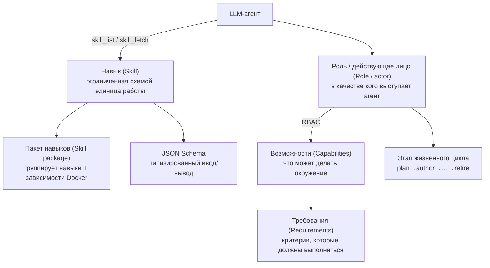

# Навыки и роли
{: .no_toc }

Эта страница представляет собой полный перечень всех **навыков** и **ролей** в folio-assistant
и объясняет, как они взаимодействуют с LLM. С типизированным контрактом ввода/вывода
для каждого навыка можно ознакомиться в [Справочнике схем навыков](reference/skills/).

1. TOC
{:toc}

---

## Как это работает вместе с LLM

folio-assistant предоставляет LLM-агенту структурированный способ выполнения реальной работы по созданию контента.
Взаимодействие строится на пяти концепциях:

1. **Навык (Skill)** — документированная, ограниченная схемой единица работы (например,
   `lean-formalization`). Агент обнаруживает навыки с помощью MCP-инструмента
   `skill_list` и загружает инструкции навыка через `skill_fetch`. Каждый навык имеет
   типизированный [контракт ввода/вывода](reference/skills/).
2. **Пакет навыков (Skill package)** — группа связанных навыков, которая также объявляет свои
   зависимости от среды выполнения и Docker (`package-manifest.json`).
3. **Роль (действующее лицо / actor)** — *в качестве кого* выступает агент. **Действующее лицо (actor)** принимает
   **роль (role)** в соответствии с дорожкой BPMN, в которой оно действует. То, что действующему лицу
   разрешено **делать**, определяется политикой W3C ODRL в `policies/`, а не свойством роли. Перед каждой
   задачей исполнитель проверяет аутентификацию, назначение роли, политику и доступ к контенту
   ([`task-authorization`](reference/skill-instructions/task-authorization.html));
   HTTP-маршруты запрашивают те же политики через `src/core/rbac.ts`.
4. **Возможность (Capability)** — конкретная способность окружения (например, `latex-compiler`,
   `lean-toolchain`). Навыки требуют наличия возможностей; инструмент `check_dependencies` проверяет
   их доступность.
5. **Требование (Requirement)** — контрольный рубеж (gate), который должен соблюдаться (например, `commit-hygiene`,
   `lean-verification`) до начала или во время выполнения этапа.

Рабочий цикл на практике: агент инициализирует план работы (`work_plan_prime`),
проверяет наличие необходимых возможностей (`check_dependencies`), находит и загружает
подходящий навык (`skill_list` → `skill_fetch`), выполняет работу в рамках роли пользователя
(с учетом RBAC) и выполняет валидацию, сборку и публикацию с помощью инструментов адаптера контента.

---

## Навыки

### Где располагаются навыки (и их статус)

Навык определяется на нескольких уровнях — это не один отдельный файл. Для любого навыка:

| Уровень | Расположение | Статус |
|---------|--------------|--------|
| **Определение** (роли, требуемые возможности, требования, шаблоны маршрутизации, этапы жизненного цикла, ссылка на схему) | `.claude/skills/local/<skill>.json` | ✅ все 22 навыка создания контента — валидированы в CI с помощью `scripts/validate-skills.ts` |
| **Типизированный контракт** (JSON Schema ввода/вывода) | `schemas/skills/<skill>/` | ✅ все 22 — см. [справочник](reference/skills/) |
| **Тело инструкций** (текстовое руководство, загружаемое LLM) — ознакомьтесь с ними в справочнике [Инструкции к навыкам](reference/skill-instructions/) | `skills/content-lifecycle/*.md`, `skills/folio-*-adapter/*.md`, `src/skills/*.md` | ✅ навыки жизненного цикла, агента, платформенного набора и **folio-document-adapter**; ⏳ **тексты инструкций для authoring-math / authoring-who-smart-guidelines находятся в разработке (TBD)** (эти пакеты поставляют манифест + определения JSON) |
| **Пакет** (зависимости среды выполнения/Docker) | `skills/<package>/package-manifest.json` | ✅ все четыре пакета |

Таким образом, *да, навыки существуют* — в виде структурированных определений и типизированных схем,
а для навыков жизненного цикла и агента уже подготовлены текстовые инструкции. MCP-инструмент
`skill_fetch` в настоящее время предоставляет файлы инструкций из `src/skills/*.md`;
текстовые инструкции для навыков создания контента — следующая задача для реализации (определения
и контракты, к которым они привязываются, уже готовы).

### Сквозной пакет: `content-lifecycle`

Этапы жизненного цикла, применимые к **каждому** типу контента:

| Навык | Этап | Назначение |
|-------|------|------------|
| [`content-plan`](reference/skills/content-plan.html) | plan | Определение границ, команда, график, управление (governance) |
| [`content-author`](reference/skills/content-author.html) | author | Создание структурированных артефактов |
| [`content-validate`](reference/skills/content-validate.html) | validate | Проверка схемы и ограничений |
| [`content-review`](reference/skills/content-review.html) | review | Официальное рецензирование и утверждение |
| [`content-test`](reference/skills/content-test.html) | test | Сквозной контроль качества (E2E QA) / успешная сборка («зеленый» билд) |
| [`content-publish`](reference/skills/content-publish.html) | publish | Рендеринг и развертывание |
| [`content-feedback`](reference/skills/content-feedback.html) | feedback | Сбор и триаж обратной связи |
| `content-retire` | retire | Вывод из эксплуатации / архивация |

### Документы и нормативные руководства: `folio-document-adapter`

| Навык | Назначение |
|-------|------------|
| [`document-authoring`](reference/skills/document-authoring.html) | Создание и редактирование блоков в текстовом фолио (prose folio) |
| [`document-structure`](reference/skills/document-structure.html) | Главы и разделы — добавление, удаление, изменение порядка |
| [`normative-statements`](reference/skills/normative-statements.html) | Формулирование рекомендаций, требований или правил |
| [`document-publishing`](reference/skills/document-publishing.html) | Markdown → HTML / PDF, без TeX |

### Статьи и книги: `authoring-math`

| Навык | Назначение |
|-------|------------|
| [`lean-formalization`](reference/skills/lean-formalization.html) | Формализация утверждений и доказательств в Lean 4 |
| [`latex-authoring`](reference/skills/latex-authoring.html) | Создание документов LaTeX |
| [`proof-verification`](reference/skills/proof-verification.html) | Верификация доказательств, аудит `sorry` и аксиом |
| `scientific-visualization` | Рисунки и диаграммы |
| `hypothesis-generation` | Формулирование гипотез и направлений исследований |
| `scientific-critical-thinking` | Критическое (состязательное) рецензирование аргументов |

### Руководства ВОЗ SMART Guidelines: `authoring-who-smart-guidelines`

| Навык | Назначение |
|-------|------------|
| [`l2-dak-authoring`](reference/skills/l2-dak-authoring.html) | Артефакты L2 DAK (словарь данных и др.) |
| [`l3-fhir-authoring`](reference/skills/l3-fhir-authoring.html) | Ресурсы L3 FHIR через FSH |
| [`bpmn-authoring`](reference/skills/bpmn-authoring.html) | Бизнес-процессы BPMN 2.0 |
| [`dmn-authoring`](reference/skills/dmn-authoring.html) | Таблицы решений DMN |
| [`terminology-management`](reference/skills/terminology-management.html) | Системы кодирования / наборы значений |
| [`fhir-validation`](reference/skills/fhir-validation.html) | Валидация на соответствие профилям FHIR |
| [`ig-publication`](reference/skills/ig-publication.html) | Сборка и публикация IG |
| [`quality-control`](reference/skills/quality-control.html) | Рубежи контроля качества (QA gates) |

### Навыки агента и платформы (`src/skills`)

Навыки, которые LLM использует для эффективной работы в репозитории (загружаются через `skill_fetch`,
пакет `folio-assistant`):

| Навык | Назначение |
|-------|------------|
| `corpus-grep` | Поиск по корпусу контента |

> Навыки `editor`, `readability-editing`, `todo-review`, `symbiotic-interaction` и
> `deployment-auth` теперь находятся (в обобщенном виде) в наборе **`folio-core`**,
> описанном ниже — загружайте их с параметром `package_name="folio-core"`.

Фолио научной статьи также нуждается в навыках `folio-document-adapter`: статья *является*
документом плюс блоки с кодом на Lean, поэтому `document-structure` и
`document-publishing` применимы к обоим. Эти два пакета представляют собой две половины
единой модели контента, а не взаимоисключающие альтернативы.

### Локальные навыки координации (`.claude/skills/local`)

| Навык | Назначение |
|-------|------------|
| `prepare-merge` | Приведение ветки к чистому/«зеленому»/готовому к слиянию состоянию (см. также `/watch`) |
| `bean-coordination` | Дисциплина распределения задач и координации между несколькими агентами |
| `todo-manager` | Дисциплина управления задачами beans-as-todos |

### Платформенные наборы навыков (`skills/folio-core`, `skills/folio-document-adapter`, `skills/folio-paper-adapter`)

Более крупные **платформенные наборы**, два из которых были перенесены из репозитория контента qou (см.
[отчет о миграции](migrations/2026-06-29-platform-skills-migration.html) и
issue [#27](https://github.com/litlfred/folio-assistant/issues/27)). Они не зависят
от типа контента и предназначены для синхронизации в любое фолио:

| Набор | Навыки | Область применения |
|-------|-------:|-------------------|
| **`folio-core`** | 43 | Координация агентов, фреймворк наблюдателей (watcher), конвейер QA / рендеринга / библиографии / глоссария, документация, развертывание — применимо к *любому* типу контента. |
| **`folio-document-adapter`** | 4 | Текстовые фолио: создание блоков, структура глав/разделов, нормативные утверждения и путь публикации без использования TeX. Применимо также к научным статьям. |
| **`folio-paper-adapter`** | 40 | Адаптер статей по формальной математике (любые статьи на Lean 4 + LaTeX): рабочий процесс Lean, инструментарий доказательств, валидация объектов контента, LaTeX, структура статьи, импорт, симуляторы. |

Несводимые навыки физики QOU были пропущены; специфичные для QOU примеры в остальных
навыках были обобщены. Каждый набор поставляется с файлом `package-manifest.json`.

> **Схемы** навыков (типизированный ввод/вывод для навыков создания контента) генерируются
> в [Справочнике схем навыков](reference/skills/) — они никогда не расходятся с тем,
> что проверяет фреймворк.

---

## Роли (действующие лица / actors)

Роли определяют, *в качестве кого выступает агент*. Текущий пользователь сопоставляется с ролью
с помощью `role-assignments.json`, а возможности роли ограничивают действия, которые агент
может выполнять (RBAC). Роли **наследуются** (например, `author` наследует `reviewer`).

> Чтобы увидеть эти роли *в виде дорожек процесса* — кто редактирует, кто рецензирует, кто утверждает
> и какие шаги агент может предпринимать самостоятельно, — прочтите раздел
> [Процесс публикации → Кто есть кто](publication-workflow.html#who-is-who).

### Люди

| Роль | Что они могут делать |
|------|----------------------|
| `viewer` | Базовый доступ только для чтения. Просмотр контента, без внесения изменений. |
| `reviewer` | Просмотр + комментарии рецензента; без прямых изменений. |
| `author` | Создание/модификация контента (наследует права `reviewer`). |
| `admin` | Полный административный доступ — роли, настройки, весь контент. |
| `programme-manager` | Определение границ проекта, формирование команды, график, взаимодействие с заинтересованными сторонами. |
| `technical-officer` | Координатор направления программы + первичный рецензент. |
| `business-analyst` | Автор L2 DAK (BPMN, словари данных, логика решений, индикаторы). |
| `clinical-sme` | Клинический валидатор / источник эталонных медицинских данных (ground-truth). |
| `terminologist` | Управление терминологией (МКБ-11 / ICD-11, SNOMED CT, LOINC). |
| `fhir-modeller` | Артефакты L3 FHIR (FSH, SUSHI, CQL, IG Publisher). |
| `content-reviewer` | Официальное утверждение / согласование перехода между фазами. |
| `qc-reviewer` | Контроль качества (QA) готовности к публикации на всех уровнях. |
| `publication-manager` | Релизы, конфигурация IG, сборка, версионирование, публикация. |
| `translator` | Локализация на языки, поддерживаемые ООН. |

### Системные действующие лица

| Действующее лицо | Что обеспечивает | Что не может делать |
|------------------|------------------|---------------------|
| `authoring-agent` | Составляет черновики и дорабатывает **предлагаемое** изменение в блоке контента | Фиксировать коммит — результаты его работы передаются редактору через контрольный рубеж валидации |
| `review-agent` | Немеханическая валидация: точность, тональность, стиль изложения | Утверждать — только сообщает об обнаруженных замечаниях |
| `lean-mcp` | Проверка доказательств Lean 4 и диагностика через MCP | — |
| `ig-publisher-service` | Сборка FHIR IG Publisher и отчетность по контролю качества (QA) | — |

Место каждого из них в процессе — а также то, какие решения агент имеет и не имеет права
принимать, — смоделировано на BPMN-диаграммах
[процесса публикации](publication-workflow.html).

### Назначение ролей

`role-assignments.json` сопоставляет идентификатор пользователя (из git config / auth) с ролью
на основе приоритета. Поставляемые значения по умолчанию:

| Шаблон | Источник | Роль | Приоритет |
|--------|----------|------|-----------|
| `litlfred@gmail.com` | git-config | `admin` | 100 |
| `*@who.int` | git-config | `author` | 50 |
| `*` | default | `viewer` | 0 |

---

## Возможности и требования

**Возможности (Capabilities)** — это конкретные способности окружения, которые могут требоваться навыку;
MCP-инструмент `check_dependencies` проверяет их наличие:

`bun-runtime` · `node-runtime` · `python3` · `git-push` · `docker` ·
`latex-compiler` · `lean-toolchain` · `lean-mcp` · `ig-publisher` ·
`sushi-compiler` · `java-runtime` · `jekyll` · `plantuml` · `graphviz`

**Требования (Requirements)** — это контрольные рубежи, которые должны соблюдаться во время работы:

`commit-hygiene` · `lean-verification` · `fhir-validation` ·
`content-lifecycle` · `session-start`

---

## См. также

- [Процесс публикации](publication-workflow.html) — дорожки BPMN: какой навык выполняется на каждом шаге и кто принимает решения
- [Инструкции к навыкам](reference/skill-instructions/) — текстовые руководства, загружаемые LLM
- [Справочник схем навыков](reference/skills/) — типизированный ввод/вывод для каждого навыка
- [Типы контента](content-types.html) — какие навыки использует каждый тип контента
- [Архитектура](architecture.html) — RBAC, адаптеры и MCP-сервер
- [Начало работы](getting-started.html) — запуск вашего первого навыка
