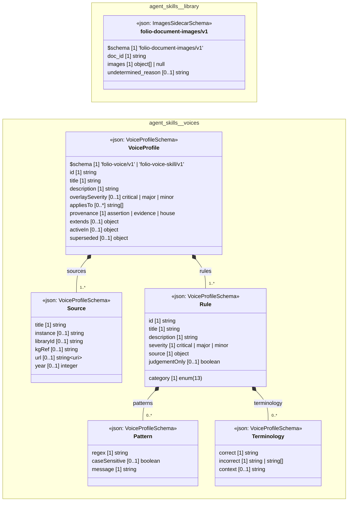

# UML — agent-skills

Generated by `cat-harness/scripts/gen-uml-overview.ts` — do not edit. Every named sub-graph the `agent-skills` harness declares, one box each, with the node schema kinds found in it.

**Sources (same model):** [PlantUML](https://github.com/litlfred/folio-assistant/blob/main/cat-harness/uml/overview/agent-skills.puml) · [Mermaid](https://github.com/litlfred/folio-assistant/blob/main/cat-harness/uml/overview/agent-skills.mmd)

<figure class="bpmn-figure">
  
</figure>

| sub-graph | directory | graph kinds | node schema |
|---|---|---|---|
| `agent-skills/library` | `agent-skills/library` | library | `ImagesSidecarSchema` |
| `agent-skills/voices` | `agent-skills/skills/voices` | voices | `VoiceProfileSchema` |

## Sub-graphs

- [agent-skills/library](agent-skills/library.html)
- [agent-skills/voices](agent-skills/voices.html)

## The same model, drawn by Mermaid

Kept so the page renders even where the PlantUML image is missing, and because Mermaid nodes carry the CSS class that colours them from `uml.css`.

