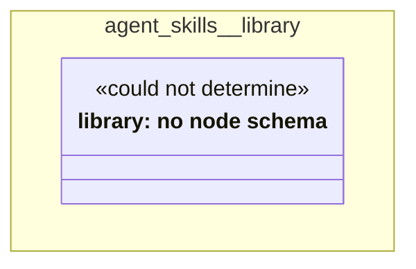

# UML — agent-skills/library

Generated by `cat-harness/scripts/gen-uml-overview.ts` — do not edit. The `library` sub-graph of `agent-skills` (`agent-skills/library`), with every attribute read from its node schema.

**Sources (same model):** [PlantUML](https://github.com/litlfred/folio-assistant/blob/main/cat-harness/uml/overview/agent-skills/library.puml) · [Mermaid](https://github.com/litlfred/folio-assistant/blob/main/cat-harness/uml/overview/agent-skills/library.mmd)

| sub-graph | directory | graph kinds | node schema |
|---|---|---|---|
| `agent-skills/library` | `agent-skills/library` | library | library: *could not determine* |

## Sub-graphs

- [← all of agent-skills](../agent-skills.html)
