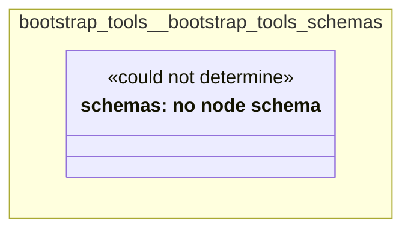

# UML — bootstrap-tools

Generated by `cat-harness/scripts/gen-uml-overview.ts` — do not edit. Every named sub-graph the `bootstrap-tools` harness declares, one box each, with the node schema kinds found in it.

**Sources (same model):** [PlantUML](https://github.com/litlfred/folio-assistant/blob/main/cat-harness/uml/overview/bootstrap-tools.puml) · [Mermaid](https://github.com/litlfred/folio-assistant/blob/main/cat-harness/uml/overview/bootstrap-tools.mmd)

| sub-graph | directory | graph kinds | node schema |
|---|---|---|---|
| `bootstrap-tools/bootstrap-tools-schemas` | `bootstrap-tools/schemas` | schemas | schemas: *could not determine* |

## Sub-graphs

- [bootstrap-tools/bootstrap-tools-schemas](bootstrap-tools/bootstrap-tools-schemas.html)
