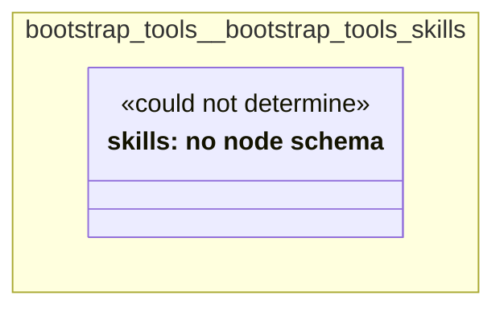

# UML — bootstrap-tools/bootstrap-tools-skills

Generated by `cat-harness/scripts/gen-uml-overview.ts` — do not edit. The `bootstrap-tools-skills` sub-graph of `bootstrap-tools` (`bootstrap-tools/skills`), with every attribute read from its node schema.

**Sources (same model):** [PlantUML](https://github.com/litlfred/folio-assistant/blob/main/cat-harness/uml/overview/bootstrap-tools/bootstrap-tools-skills.puml) · [Mermaid](https://github.com/litlfred/folio-assistant/blob/main/cat-harness/uml/overview/bootstrap-tools/bootstrap-tools-skills.mmd)

  <fieldset class="fa-uml-view-pick">
    <legend>Layout</legend>
    <input type="radio" name="fa-uml-overview_bootstrap_tools_bootstrap_tools_skills" id="fa-uml-overview_bootstrap_tools_bootstrap_tools_skills-portrait" class="fa-uml-pick-portrait" checked><label for="fa-uml-overview_bootstrap_tools_bootstrap_tools_skills-portrait">Portrait</label>
    <input type="radio" name="fa-uml-overview_bootstrap_tools_bootstrap_tools_skills" id="fa-uml-overview_bootstrap_tools_bootstrap_tools_skills-landscape" class="fa-uml-pick-landscape"><label for="fa-uml-overview_bootstrap_tools_bootstrap_tools_skills-landscape">Landscape</label>
  </fieldset>
  <figure class="bpmn-figure fa-uml-portrait">
    
  </figure>
  <figure class="bpmn-figure fa-uml-landscape">
    
  </figure>

| sub-graph | directory | graph typologies | node schema | nodes | cohesion | in | out |
|---|---|---|---|---|---|---|---|
| `bootstrap-tools/bootstrap-tools-skills` | `bootstrap-tools/skills` | skills | skills: *could not determine* | 3 | 1.00 | 0 | 0 |

*Nodes, cohesion, in and out* are the detangler's pinned measurements for the same directory (`bun run kg:detangle`; skill [`graph-detanglement`](https://github.com/litlfred/folio-assistant/blob/main/cat-harness/skills/kg/graph-management/graph-detanglement.md)). *Not measured* means the detangler does not scan that directory, not that it has no edges.

## Sub-graphs

- [← all of bootstrap-tools](../bootstrap-tools.html)

## The same model, drawn by Mermaid

Kept so the page renders even where the PlantUML image is missing, and because Mermaid nodes carry the CSS class that colours them from `uml.css`.

